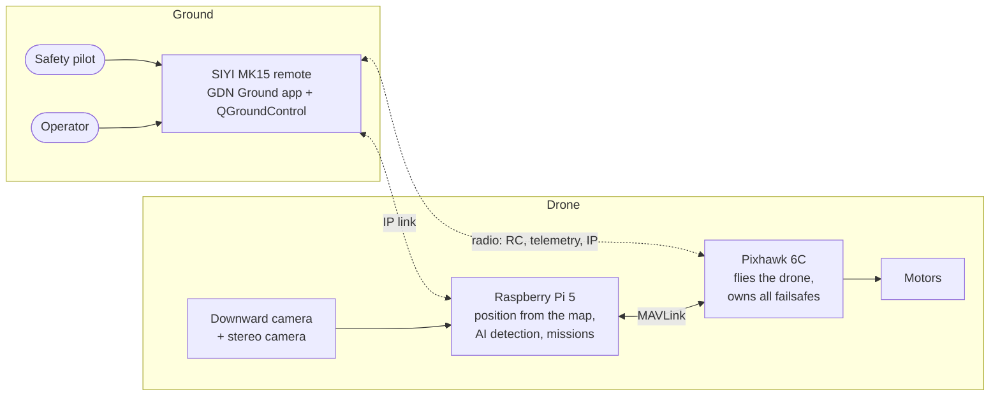

# AI-Integrated GPS-Denied Autonomous Drone

A quadcopter that keeps flying its mission when GPS is lost. It finds its own position by matching a photo of the ground against a satellite image stored on board, and it uses on-board AI to detect people and vehicles. An Android app on the remote controller runs grid searches and follows a selected object.

> **Status: design complete, build not started.** The repository currently holds the full engineering design. No flight software has been written and nothing has been measured. Every performance figure in this repository is a design target or an estimate until a test replaces it.

| | |
|---|---|
| Type | College engineering project |
| Design baseline | DB-3.0 |
| Current stage | Step 1 of the [development checklist](documentation/16-development-roadmap/development-checklist.md) |
| Planned duration | About 42 weeks |

## Contents

- [Problem statement](#problem-statement)
- [What we are building](#what-we-are-building)
- [How it works](#how-it-works)
- [How we are building it](#how-we-are-building-it)
- [Hardware](#hardware)
- [Software and tools](#software-and-tools)
- [Repository layout](#repository-layout)
- [Where to start reading](#where-to-start-reading)
- [Contributing](#contributing)
- [Safety](#safety)
- [Limits of the project](#limits-of-the-project)
- [Licence](#licence)

## Problem statement

Most small drones depend on GPS to know where they are. GPS can be lost or become unreliable: near tall buildings and under tree cover, through interference or jamming, and in disaster areas where conditions are poor. When that happens a typical drone either drifts, lands, or has to be flown home by hand, and the mission ends.

Systems that solve this exist, but they usually rely on expensive sensors or closed commercial products, which puts them out of reach of a student team.

**The problem this project addresses:** build a low-cost drone, from widely available parts, that can

1. notice by itself that GPS can no longer be trusted,
2. keep an estimate of its position without GPS, accurate enough to continue a mission, and
3. still do useful work in that state, such as searching an area and reporting what it finds.

## What we are building

| Part | What it does |
|---|---|
| **The drone** | A quadcopter with a Pixhawk 6C flight controller and a Raspberry Pi 5 companion computer |
| **Position without GPS** | A downward camera photographs the ground. The Raspberry Pi matches that photo against a satellite image loaded before the flight and works out where the drone is |
| **AI vision** | A small object detector (YOLO26n) finds people and vehicles, both ahead of the drone near the ground and below it during a search |
| **Android app** | "GDN Ground", running on the SIYI MK15 remote. It shows live video and the map, starts a grid search, lists findings with coordinates, and lets the operator tap an object to track or follow |
| **Safety layer** | The flight controller owns flight and every failsafe. The safety pilot can take control at any moment |

Planned demonstrations, in order of priority:

1. Hold position and fly a short route with GPS switched off.
2. Use the app as a live monitor during flight.
3. Search an area in a grid pattern and pin what is found on the map.
4. Track a selected object.
5. Follow it from above.

## How it works



1. **Before the flight**, a satellite image of the area is prepared on a laptop and copied to the drone as a "map pack".
2. **While GPS is good**, the drone flies normally. Map matching runs in the background and is compared with GPS, which tells us how accurate it is.
3. **When GPS degrades**, the Raspberry Pi detects it within about 3 seconds and asks the flight controller to use the camera-based position instead.
4. **Without GPS**, the drone matches a ground photo against the map about once a second and tracks its motion between matches. The mission continues at reduced speed.
5. **If the camera position is lost too**, the drone holds position, then falls back to a small optical flow sensor near the ground, and finally hands control to the pilot or lands.
6. **When GPS returns** and has been stable for 10 seconds, the drone slows down and switches back.

The Raspberry Pi only advises. It never arms the drone, never selects the flight mode and never drives the motors. If it fails, the drone is still flyable.

For a click-through version of the architecture, see the [interactive system diagram](documentation/19-system-architecture-diagrams/interactive/system-explorer.html).

## How we are building it

The approach is **simulation first, recordings second, flight last**. Each claim is proven at the cheapest level possible before the drone leaves the ground.

| Order | Stage | What is proven |
|---|---|---|
| 1 | Design | Requirements, architecture and decisions (done) |
| 2 | Simulation | Switching logic, failsafes and missions, with no hardware |
| 3 | Recorded data | Map matching accuracy on real aerial photos of the test site |
| 4 | Bench | Real hardware on a table, propellers off |
| 5 | Flight, observing only | The software watches while the pilot flies on GPS |
| 6 | Flight without GPS | Hover first, then a route, then search and follow |

Work stops at numbered **gates** until a measured result says it is safe or sensible to continue. The full list is in the [development checklist](documentation/16-development-roadmap/development-checklist.md).

Three delivery levels protect the project against delays:

| Level | Delivered |
|---|---|
| Bronze | Map matching proven on recordings; complete system, including search and follow, in simulation; app running against simulation |
| Silver | Bronze, plus holding position without GPS in flight, the app used in flight, and a grid search flown on GPS |
| Gold | Silver, plus grid search with GPS disabled and follow from above |

## Hardware

| Item | Selection | State |
|---|---|---|
| Companion computer | Raspberry Pi 5, 8 GB, with active cooler | Owned |
| Flight controller | Holybro Pixhawk 6C with PM02 power module and M10 GPS | To buy |
| Radio and ground station | SIYI MK15 (Android remote and air unit) | Owned |
| Stereo camera | Waveshare IMX219-83 with ICM-20948 IMU | Owned |
| Downward camera | USB 2.0, 1080p, wide lens | To buy, model open |
| Optical flow and range | MicoAir MTF-01 | To buy |
| Airframe, motors, ESCs, battery | 4S quadcopter, about 450 mm class | To decide |

Details, wiring and budgets: [documentation/03-hardware](documentation/03-hardware/README.md). Parts list with approximate Indian prices: [bill-of-materials.md](documentation/15-bom/bill-of-materials.md).

## Software and tools

| Area | Choice |
|---|---|
| Companion OS | Ubuntu Server 24.04 (arm64) |
| Robotics framework | ROS 2 Jazzy |
| Flight firmware | ArduPilot Copter 4.7 |
| Pi to flight controller | MAVROS over MAVLink 2 |
| Map matching | OpenCV, SIFT features with RANSAC; XFeat compared |
| AI detector | YOLO26n, run with NCNN |
| Android app | Kotlin, Jetpack Compose, osmdroid, Room |
| Simulation | ArduPilot SITL and Gazebo Harmonic |
| Languages | C++ and Python on the drone, Kotlin in the app, Lua on the flight controller |

Reasons for each choice are recorded as decision records in [documentation/17-decisions](documentation/17-decisions/README.md).

## Repository layout

Folders marked *planned* do not exist yet. They are created as the checklist reaches them.

```text
.
├── README.md                  this file
├── CONTRIBUTING.md            how to take part
├── documentation/             complete engineering design (start here)
├── presentation-assets/       animations used in the project slides
├── ros2_ws/src/gdn/           planned: 22 ROS 2 packages for the Raspberry Pi
├── android/gdn-ground/        planned: the Android app and a mock gateway
├── fc_config/                 planned: ArduPilot parameter files and the Lua watchdog
├── system/                    planned: Raspberry Pi set-up scripts and service files
└── deps.repos                 planned: pinned third-party sources
```

## Where to start reading

| If you want to | Read |
|---|---|
| Understand the project in ten minutes | [project-overview.md](documentation/00-project-overview/project-overview.md) |
| See the whole system in pictures | [system architecture diagrams](documentation/19-system-architecture-diagrams/README.md) |
| Know what to build next | [development-checklist.md](documentation/16-development-roadmap/development-checklist.md) |
| Know what the system must do | [system-requirements.md](documentation/01-requirements/system-requirements.md) |
| Understand position without GPS | [visual-geolocalization.md](documentation/09-navigation/visual-geolocalization.md) |
| Understand the mode switching | [gps-denied-state-machine.md](documentation/02-system-architecture/gps-denied-state-machine.md) |
| Work on the app | [ground-app.md](documentation/10-communication/ground-app.md) |
| Work on search, track or follow | [search-track-follow.md](documentation/09-navigation/search-track-follow.md) |
| See what is still undecided | [project-status.md](documentation/project-status.md) |
| Browse everything | [documentation/README.md](documentation/README.md) |

## Contributing

Contributions are welcome from team members and from outside: code, documentation fixes, test data, reviews and questions.

1. Read [CONTRIBUTING.md](CONTRIBUTING.md).
2. Pick an unchecked item from the [development checklist](documentation/16-development-roadmap/development-checklist.md), or open an issue describing what you would like to do.
3. Work on a branch and open a pull request.

Good first contributions that need no hardware: simulation scenarios, unit tests for the switching logic, the mock gateway for the app, and corrections to the documentation.

## Safety

This project involves a flying machine with spinning propellers and lithium batteries.

- All bench work is done with propellers removed.
- Every flight has a safety pilot with a working manual override.
- No software in this repository may arm the drone, change its flight mode, or bypass a failsafe.
- Fly only where it is legal to do so and follow the local rules for drones, which in India are set by the DGCA.
- Read [safety-architecture.md](documentation/12-safety/safety-architecture.md) before any flight test.

## Limits of the project

- It is a student research prototype, not a product, and it is not certified for any use.
- Disaster rescue is the motivation for the search feature. The system is not a rescue tool, and a completed search means "area covered", never "area clear".
- Position from map matching needs open ground with visible features, a height of roughly 25 to 60 m, daylight, and a satellite image that may legally be stored offline.
- The project makes no claim to be the first of its kind or to outperform existing systems. Comparisons are in [existing-systems-comparison.md](documentation/00-project-overview/existing-systems-comparison.md).

## Licence

No licence has been chosen yet. Until one is added, the default applies: the authors keep all rights, and others may view the repository but not reuse its contents. The team intends to choose an open-source licence before the first code is merged. Third-party software used by the project keeps its own licence; see [references.md](documentation/references.md).
