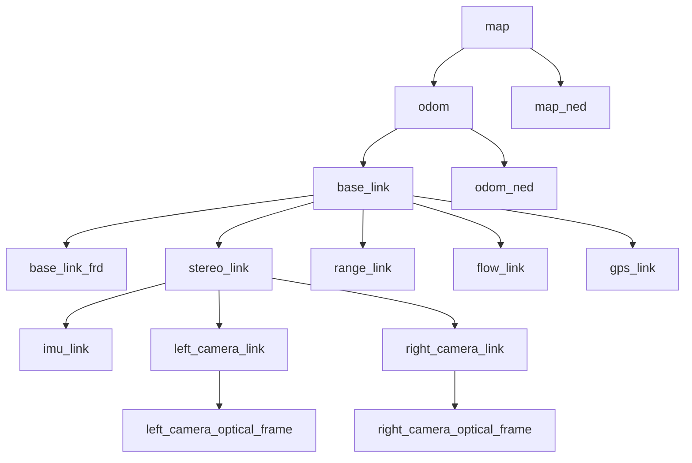

# Coordinate Frame Design

| Field | Value |
|---|---|
| Document ID | GDN-ARC-003 |
| Version | 1.0 |
| Date | 2026-10-05 |
| Status | Baseline |
| Standards | ROS REP-103 (units, axes), REP-105 (mobile-platform frames), MAVLink frame definitions |

## 1. Why this document matters

Most failed vision-to-autopilot integrations are frame errors: a swapped axis, a missing ENU→NED conversion, or a camera optical frame treated as a body frame. Every transform in the system is defined here once. Code must not contain ad-hoc rotations.

## 2. Conventions

| Convention | Rule |
|---|---|
| Units | SI: metres, seconds, radians, kilograms |
| Handedness | All frames right-handed |
| ROS world frames | **ENU**: x East, y North, z Up |
| ROS body frame | **FLU**: x Forward, y Left, z Up |
| MAVLink / ArduPilot world frame | **NED**: x North, y East, z Down |
| MAVLink / ArduPilot body frame | **FRD**: x Forward, y Right, z Down |
| Camera optical frame | x Right, y Down, z Forward (along the optical axis) |
| Quaternion order in ROS messages | (x, y, z, w) |
| Quaternion order in MAVLink | (w, x, y, z) |
| Transform notation | `T_A_B` maps a point expressed in frame B into frame A. In TF terms: parent A, child B. |
| Rotation positive direction | Right-hand rule about the axis |

**Rule:** all ROS 2 nodes work in ENU/FLU. Conversion to NED/FRD happens in exactly one place, MAVROS.

## 3. Frame definitions

| Frame ID | Type | Origin | Axes | Published by | Notes |
|---|---|---|---|---|---|
| `map` | World, fixed | ArduPilot EKF origin | ENU | — (root) | Position is continuous except at EKF source changes. Equals the FC local frame converted to ENU. |
| `odom` | World, drifting | VIO start pose | Gravity-aligned, z Up; yaw arbitrary at VIO start | `localization_manager` (`map → odom`) | Smooth and continuous; drifts slowly; jumps only on VIO reset |
| `base_link` | Body | FC IMU centre (approximately vehicle centre of gravity) | FLU | `vio_monitor` (`odom → base_link`) | The vehicle reference point for everything |
| `base_link_frd` | Body | Same as `base_link` | FRD | Static | 180° about x from `base_link`. For MAVLink quantities. |
| `imu_link` | Sensor | ICM-20948 on the camera board | As printed on the IMU; fixed by calibration | Static (URDF, from calibration) | The frame OpenVINS estimates |
| `stereo_link` | Sensor mount | Midpoint of the stereo baseline | FLU-like: x forward along optical axis | Static (URDF) | Mechanical reference for the camera board |
| `left_camera_link` | Sensor | Left lens centre | x forward, y left, z up | Static | |
| `left_camera_optical_frame` | Optical | Left lens centre | x right, y down, z forward | Static | `frame_id` of left images, depth and detections |
| `right_camera_link` | Sensor | Right lens centre | x forward, y left, z up | Static | 60 mm from left along −y |
| `right_camera_optical_frame` | Optical | Right lens centre | x right, y down, z forward | Static | `frame_id` of right images |
| `range_link` | Sensor | Downward range sensor aperture | x along beam (down) | Static | |
| `flow_link` | Sensor | Optical-flow sensor | As in ArduPilot `FLOW_POS_*` | Static | Used by the FC; kept in URDF for documentation |
| `gps_link` | Sensor | GNSS antenna phase centre | FLU | Static | Matches ArduPilot `GPS1_POS_*` |
| `map_ned` | World | Same as `map` | NED | Static (MAVROS) | |
| `odom_ned` | World | Same as `odom` | NED | Static (MAVROS) | |

## 4. TF tree



| Transform | Kind | Source | Rate |
|---|---|---|---|
| `map → odom` | Dynamic, 4-DoF (x, y, z, yaw) | `localization_manager` | 20 Hz |
| `odom → base_link` | Dynamic, 6-DoF | `vio_monitor` (from OpenVINS, or FC local position if VIO is not available) | 20–30 Hz |
| `base_link → *` | Static | `robot_state_publisher` from URDF in `gdn_description` | Latched |
| `*_link → *_optical_frame` | Static | URDF | Latched |
| `map → map_ned`, `odom → odom_ned`, `base_link → base_link_frd` | Static | MAVROS | Latched |

Rules:

- Exactly one publisher per transform. Each frame has exactly one parent.
- OpenVINS's own TF broadcasting is **disabled**; `vio_monitor` republishes its output in the project's frame names. This prevents two publishers of `odom → base_link`.
- MAVROS is configured **not** to publish `map → base_link` or `odom → base_link` (`local_position.tf.send: false`).

## 5. Standard rotations

### 5.1 ENU ↔ NED (world)

```
        | 0  1  0 |
R_ned_enu = | 1  0  0 |        p_ned = R_ned_enu · p_enu
        | 0  0 -1 |
```

x_ned = y_enu, y_ned = x_enu, z_ned = −z_enu. The matrix is its own inverse.

### 5.2 FLU ↔ FRD (body)

```
        | 1  0  0 |
R_frd_flu = | 0 -1  0 |        180° about x
        | 0  0 -1 |
```

### 5.3 Orientation conversion

An orientation is the rotation from body to world. Converting a ROS orientation `R_enu_flu` to MAVLink:

```
R_ned_frd = R_ned_enu · R_enu_flu · R_flu_frd
```

Yaw convention changes as a result: ROS yaw is measured counter-clockwise from East; MAVLink yaw is clockwise from North. `yaw_ned = π/2 − yaw_enu`.

MAVROS performs 5.1–5.3. Project code never does.

### 5.4 Camera link ↔ optical frame

```
            | 0  0  1 |
R_link_optical = | -1 0  0 |      x_link = z_opt, y_link = −x_opt, z_link = −y_opt
            | 0 -1  0 |
```

Equivalent to roll = −90°, pitch = 0, yaw = −90° (fixed-axis RPY) in the URDF.

## 6. Mounting transforms (static)

Values are measured on the built vehicle and refined by calibration. Placeholders are marked `[MEASURE]`.

| Transform | Translation (m) | Rotation | Source of truth |
|---|---|---|---|
| `base_link → stereo_link` | x ≈ +0.10 `[MEASURE]`, y = 0, z ≈ −0.02 `[MEASURE]` | Pitch 0° baseline design (forward-looking). A downward tilt of up to 15° is allowed; record it here. | Ruler/CAD, then verified by hover data |
| `stereo_link → left_camera_link` | y = +0.030 | Identity | Vendor baseline 60 mm; refined by stereo calibration |
| `stereo_link → right_camera_link` | y = −0.030 | Identity | Same |
| `left_camera_optical_frame → imu_link` | From Kalibr | From Kalibr | Camera–IMU calibration |
| `base_link → range_link` | `[MEASURE]` | Pitch +90° (beam down) | Ruler |
| `base_link → gps_link` | `[MEASURE]` | Identity | Ruler; also entered in `GPS1_POS_X/Y/Z` (FRD!) |

The lever arm from the FC IMU to the camera is also entered in ArduPilot as `VISO_POS_X/Y/Z` in **FRD metres**. Because the companion transforms the VIO pose to `base_link` before sending it, `VISO_POS_*` is set to **zero** and the companion owns the lever arm. Doing both would apply it twice.

## 7. Pose chain used for external navigation

OpenVINS estimates the pose of `imu_link` in its own global frame `G` (gravity-aligned, z up, arbitrary yaw). `G` is identified with `odom`.

```
T_odom_base  = T_G_imu · T_imu_base                      (vio_monitor)
T_map_base   = T_map_odom · T_odom_base                  (localization_manager)
ODOMETRY msg = convert_to_NED_FRD( T_map_base, v_base )  (MAVROS)
```

where `T_imu_base = (T_base_stereo · T_stereo_imu)⁻¹` is static.

Velocity: OpenVINS reports velocity of the IMU origin. `vio_monitor` transfers it to the `base_link` origin with `v_base = v_imu + ω × r_imu→base`, expressed in the child frame as required by `nav_msgs/Odometry`.

## 8. Frame alignment (`map → odom`)

**Problem.** VIO starts with arbitrary position and yaw. ArduPilot's generic MAVLink external-nav input (`VISO_TYPE = 1`) expects pose in its own local NED frame. Something must relate the two.

**Solution.** While the EKF is trusted (GNSS GOOD) and VIO is healthy, the localisation manager estimates

```
T_map_odom(t) = T_map_base^EKF(t) · ( T_odom_base^VIO(t) )⁻¹
```

constrained to 4 DoF (x, y, z, yaw). Roll and pitch are not estimated because both frames are gravity-aligned. The estimate is smoothed over a sliding window (default 5 s; robust mean on translation, circular mean on yaw) and stored in a ring buffer.

| Phase | Behaviour of `map → odom` |
|---|---|
| GPS_NAV | Continuously refined |
| GPS_DEGRADED | Frozen at the value from 5 s before degradation |
| VISION_NAV / VISION_DEGRADED, low regime | Frozen. The EKF now follows VIO, so the two agree by construction. |
| VISION_NAV / VISION_DEGRADED, cruise regime (DB-2.0) | **Updated by accepted satellite-map fixes** through a slew-limited offset filter (§11). This is what bounds the drift. |
| FLOW_FALLBACK with VIO restarted | Re-estimated against the flow-based EKF for ≥ 10 s before reuse |
| GPS_RECOVERY → GPS_NAV | Re-estimated; the change is logged as accumulated VIO drift |
| Indoor start with no GNSS | Identity translation; yaw from compass at start-up if the compass is trusted, else identity. EKF origin set with `SET_GPS_GLOBAL_ORIGIN`. |

`aligned` is true when the window holds ≥ 3 s of data, the translation residual RMS is < 0.3 m and yaw residual RMS is < 3°.

## 9. Message `frame_id` contract

| Topic | `header.frame_id` | `child_frame_id` |
|---|---|---|
| `/stereo/left/image_raw`, `/stereo/left/camera_info` | `left_camera_optical_frame` | — |
| `/stereo/right/image_raw`, `/stereo/right/camera_info` | `right_camera_optical_frame` | — |
| `/stereo/depth/image` | `left_camera_optical_frame` | — |
| `/imu/data_raw` | `imu_link` | — |
| `/vio/odometry` | `odom` | `base_link` |
| `/localization/odometry` | `map` | `base_link` |
| `/mavros/odometry/out` | `map` | `base_link` |
| `/mavros/local_position/pose` | `map` | — |
| `/perception/detections` | `left_camera_optical_frame` | — |
| `/perception/objects` | `map` | — |
| `/obstacle/sectors` | `base_link` | — |
| Setpoints to MAVROS | `map` (position) or `base_link` (body velocity) as selected | — |

## 10. Verification checklist (bench, before any flight)

| # | Check | Expected |
|---|---|---|
| CF-1 | Move the vehicle forward 1 m by hand | `odom → base_link` x increases (if yaw ≈ 0); FC `LOCAL_POSITION_NED` and `VISION` log move the same way |
| CF-2 | Move left 1 m | ROS y increases; FC east/north change consistent with heading |
| CF-3 | Lift 1 m | ROS z increases; FC NED z **decreases** |
| CF-4 | Yaw 90° counter-clockwise seen from above | ROS yaw +90°; FC yaw −90° (heading decreases) |
| CF-5 | Pitch nose down | ROS pitch positive about y (FLU); FC pitch negative |
| CF-6 | Point camera at an object 2 m ahead | Object appears at +2 m x in `base_link`, +2 m z in the optical frame |
| CF-7 | `view_frames` | Tree matches §4 exactly, no duplicate publishers |
| CF-8 | Compare FC EKF attitude with VIO attitude while rotating by hand | Agreement within 3° roll/pitch |

These eight checks are a hard gate for L7 → L8 in the testing strategy.

## 11. DB-2.0 additions: downward camera and geodetic coordinates

### 11.1 New frames

| Frame ID | Type | Origin | Axes | Published by |
|---|---|---|---|---|
| `down_camera_link` | Sensor | Downward camera lens centre | x forward, y left, z up (body-aligned) | Static (URDF) |
| `down_camera_optical_frame` | Optical | Same | z along the optical axis (down), x to the image right, y to the image bottom. Mounted so that the image top points to the vehicle nose: image right = body right, image down = body rear | Static (URDF) |

TF: `base_link → down_camera_link → down_camera_optical_frame`. Image topics `/down/image_raw` and `/down/camera_info` use `down_camera_optical_frame`.

The mounting rotation (boresight) is refined by calibration and stored in the URDF. A 0.5° boresight error is 0.44 m on the ground at 50 m.

### 11.2 Relating `map` to latitude and longitude

| Item | Definition |
|---|---|
| Geodetic datum | WGS-84 |
| `map` origin | The ArduPilot EKF origin (latitude φ₀, longitude λ₀, altitude h₀), read from `GPS_GLOBAL_ORIGIN` |
| `map` axes | ENU local tangent plane at the origin |
| Map pack grid | UTM zone of the site (metres east/north), stored in `meta.yaml` |
| Conversion | Fix (UTM east, north) → WGS-84 (φ, λ) → local ENU about (φ₀, λ₀) → `map` (x, y). Over a 1 km site the difference between the UTM grid and the local tangent plane is centimetres, except for grid convergence (a small rotation), which is computed and applied |
| Site registration | A constant (Δe, Δn) correction of the map pack against GNSS, stored in `meta.yaml` |
| Cold start without GNSS | The EKF origin is set (`SET_GPS_GLOBAL_ORIGIN`) to the operator-confirmed start position expressed in WGS-84 |

One library function performs these conversions; no node implements its own.

### 11.3 Orthorectification transform

For an image taken at time t with body attitude `R_map_base(t)` (from the FC), camera mounting `R_base_cam` and height above ground h:

```
ray_map   = R_map_base(t) · R_base_cam · K⁻¹ · [u, v, 1]ᵀ
ground pt = camera position + ray_map · ( h / −ray_map.z )
```

Each pixel is projected onto the horizontal ground plane, then resampled on a north-up grid at the map's ground sample distance. The fix is reported for the ground point directly below the camera and then moved to `base_link` using the camera's lever arm.

### 11.4 `GeoFix` frame contract

| Field | Frame |
|---|---|
| `position_map` | `map` (ENU, metres) of `base_link` at the image time |
| `latitude`, `longitude` | WGS-84 |
| `header.stamp` | Image acquisition time |
| `covariance` | East/north, in `map` |

### 11.5 Additional bench checks

| # | Check | Expected |
|---|---|---|
| CF-9 | Hold the vehicle level over a marked point; view the downward image | The mark is at the principal point within the boresight tolerance |
| CF-10 | Move the vehicle forward | Image content moves towards the image bottom; `ground_vo` reports +x in `base_link` |
| CF-11 | Orthorectified image with the vehicle yawed to several headings | North stays up; a known ground line keeps its true bearing |
| CF-12 | Convert a surveyed GNSS point to `map` and back | Round-trip error < 1 cm; agreement with the FC's `LOCAL_POSITION_NED` within GNSS noise |
