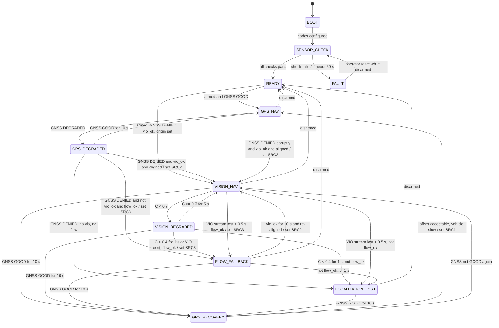

# GPS-Denied Navigation State Machine

| Field | Value |
|---|---|
| Document ID | GDN-ARC-002 |
| Version | 2.0 (DB-2.0: states `VIO_NAV`/`VIO_DEGRADED` renamed `VISION_NAV`/`VISION_DEGRADED`; map matching added in §8a) |
| Date | 2026-10-05 |
| Status | Baseline |
| Implemented by | `nav_mode_manager` node (package `gdn_nav_mode`) |
| Requirements | FR-002 – FR-008, FR-026, FR-079, FR-080 |

## 1. Purpose

One node owns the question "which position source should the flight controller be using right now, and how much should the companion trust it?". This document defines its states, inputs, guards and actions precisely enough to implement and unit-test.

All thresholds are parameters. Defaults below are **TARGET** starting values to be tuned in SITL and on the bench.

## 2. Inputs

| Symbol | Meaning | Source |
|---|---|---|
| `fix` | GNSS fix type (0–6) | `GPS_RAW_INT.fix_type` |
| `sats` | Satellites used | `GPS_RAW_INT.satellites_visible` |
| `hdop` | Horizontal dilution of precision | `GPS_RAW_INT.eph / 100` |
| `hacc` | Reported horizontal accuracy (m) | `GPS_RAW_INT.h_acc / 1000` |
| `ekf_pos_var` | EKF horizontal position variance ratio | `EKF_STATUS_REPORT.pos_horiz_variance` |
| `ekf_flags` | EKF status flags | `EKF_STATUS_REPORT.flags` |
| `dv` | Magnitude of (GNSS velocity − aligned VIO velocity), m/s | Localisation manager |
| `C` | Localisation confidence, 0–1 | Localisation manager |
| `vio_ok` | VIO healthy (C ≥ 0.4, rate OK, no reset in last 3 s) | Localisation manager |
| `aligned` | VIO-to-FC frame alignment valid | Localisation manager |
| `flow_ok` | Optical flow quality and range valid | `OPTICAL_FLOW`, `DISTANCE_SENSOR` |
| `mode` | FC flight mode | `HEARTBEAT` |
| `armed` | Armed flag | `HEARTBEAT` |
| `src` | Active EKF source set reported by FC | Tracked from command ACK and status text |
| `cc_ok` | All flight-critical companion nodes active | Safety supervisor |

## 3. GNSS health classification

Evaluated at 5 Hz. A condition must hold for its dwell time before the class changes (hysteresis).

| Class | Condition | Dwell to enter |
|---|---|---|
| **GOOD** | `fix ≥ 3` and `sats ≥ 8` and `hdop ≤ 1.5` and `hacc ≤ 2.0` and `ekf_pos_var < 0.5` | 10 s (recovery validation) |
| **DEGRADED** | not GOOD and not DENIED; or `dv > 1.0 m/s` | 1 s |
| **DENIED** | `fix < 3` or `sats < 6` or `hdop > 3.0` or `hacc > 8.0` or `ekf_pos_var ≥ 0.8` or `dv > 2.0 m/s` | 2 s |

`dv` checks are active only when `vio_ok` and `aligned` are true.

## 4. States

| State | EKF source | Meaning | Companion speed limit |
|---|---|---|---|
| `BOOT` | — | Nodes starting | — |
| `SENSOR_CHECK` | — | Verifying camera, IMU, calibration, FC link, time sync, storage | — |
| `READY` | SRC1 | Disarmed or pilot-flown; all checks passed | — |
| `GPS_NAV` | SRC1 | GNSS GOOD; VIO running in shadow; alignment being refined | 2.0 m/s |
| `GPS_DEGRADED` | SRC1 | GNSS DEGRADED; alignment frozen; ready to switch | 1.0 m/s |
| `VISION_NAV` | SRC2 | GNSS DENIED; FC fusing external navigation. Cruise regime: satellite map matching + ground visual odometry. Low regime: stereo VIO. See §8a | Low: 1.5 m/s × f(C). Cruise: 3 m/s × f(C) |
| `VISION_DEGRADED` | SRC2 | Confidence MEDIUM/LOW, or no map fix for too long; hold position, no new waypoints | 0 (hold) |
| `FLOW_FALLBACK` | SRC3 | Vision lost; FC holding on optical flow. **Available only below 8 m AGL** | 0 (hold), then land |
| `GPS_RECOVERY` | SRC2 | GNSS GOOD again; validating before switching back | 0.5 m/s |
| `LOCALIZATION_LOST` | any | No usable horizontal source | 0; request ALT_HOLD → LAND |
| `FAULT` | unchanged | Companion-internal fault; autonomy disabled | Companion silent |

`MANUAL_OVERRIDE` is not a state. It is a flag that is true whenever `mode ≠ GUIDED`. While true, the state machine keeps estimating and may still switch EKF sources (so the pilot gets the best available position hold), but the navigator sends no setpoints.

## 5. State diagram

Any state transitions to `FAULT` when `cc_ok` becomes false. That edge is omitted from the diagram for readability.

## 6. Transition table

| # | From | To | Guard | Actions |
|---|---|---|---|---|
| T1 | BOOT | SENSOR_CHECK | Lifecycle nodes reached `inactive` | Start checks |
| T2 | SENSOR_CHECK | READY | Camera rate OK, L/R skew OK, IMU rate OK, calibration loaded, FC heartbeat, time-sync converged, storage free > 2 GB, SoC temp < 70 °C | Activate nodes; status "CC READY" |
| T3 | READY | GPS_NAV | `armed` and GNSS GOOD | Start bag; begin alignment |
| T4 | READY | VISION_NAV | `armed`, GNSS DENIED, `vio_ok`, EKF origin set manually | Indoor start. Requires SRC2 selected before arming |
| T5 | GPS_NAV | GPS_DEGRADED | GNSS DEGRADED | Freeze alignment at the value from 5 s earlier; warn pilot; cap speed 1.0 m/s |
| T6 | GPS_DEGRADED | GPS_NAV | GNSS GOOD ≥ 10 s | Resume alignment refinement |
| T7 | GPS_DEGRADED / GPS_NAV | VISION_NAV | GNSS DENIED and `vio_ok` and `aligned` | Send `SET_EKF_SOURCE_SET(2)`; wait ACK ≤ 1 s, retry ×3; status "NAV: VIO" |
| T8 | GPS_DEGRADED | FLOW_FALLBACK | GNSS DENIED, not `vio_ok`, `flow_ok` | `SET_EKF_SOURCE_SET(3)`; navigator → hold; status "NAV: FLOW" |
| T9 | VISION_NAV | VISION_DEGRADED | `C < 0.7` | Navigator → hold; no new goals |
| T10 | VISION_DEGRADED | VISION_NAV | `C ≥ 0.7` for 5 s | Resume |
| T11 | VISION_NAV / VISION_DEGRADED | FLOW_FALLBACK | VIO stream gap > 0.5 s, or `C < 0.4` for 1 s, or VIO reset; and `flow_ok` | `SET_EKF_SOURCE_SET(3)`; stop sending external nav; request LOITER; after 20 s without recovery request LAND |
| T12 | any armed | LOCALIZATION_LOST | No source valid | Stop setpoints; request ALT_HOLD; alert pilot "TAKE CONTROL"; if no pilot mode change in 5 s request LAND |
| T13 | VISION_NAV / VISION_DEGRADED / FLOW_FALLBACK / LOCALIZATION_LOST | GPS_RECOVERY | GNSS GOOD ≥ 10 s | Navigator → slow/hold; compute offset between GNSS position and current EKF position |
| T14 | GPS_RECOVERY | GPS_NAV | Ground speed < 0.5 m/s and offset logged | `SET_EKF_SOURCE_SET(1)`; report step size; restart alignment |
| T15 | GPS_RECOVERY | VISION_NAV | GNSS leaves GOOD | Stay on SRC2 |
| T16 | FLOW_FALLBACK | VISION_NAV | `vio_ok` ≥ 10 s and alignment re-established against the EKF | `SET_EKF_SOURCE_SET(2)` |
| T17 | any | READY | Disarmed | Close bag; reset VIO if requested |
| T18 | any | FAULT | `cc_ok` false | Stop setpoints; stop external nav; the FC watchdog handles the vehicle |

## 7. Notes on specific transitions

### 7.1 Why the alignment is frozen 5 s in the past (T5)

When GNSS starts to degrade, the EKF position is already being pulled by bad GNSS data. If the alignment were frozen at the instant of detection, the error would be baked in. The localisation manager keeps a ring buffer of alignment estimates and, on T5, uses the estimate from before the degradation began.

### 7.2 Switching to vision (T7)

Because aligned external-nav data has been streaming to the FC the whole time, the EKF already has consistent data when the source set changes. The expected position step is small (NFR-012: ≤ 1 m). The first flights perform this switch in a stationary hover only.

### 7.3 Returning to GNSS (T14)

Vision drift accumulated during denial appears as a step when GNSS is re-fused. ArduPilot documents this jump. The state machine therefore switches back only when the vehicle is nearly stationary, reports the offset, and never switches back automatically during a waypoint leg. Automatic return can be disabled by parameter so that the pilot performs it with the RC switch.

### 7.4 VIO re-initialisation (T16)

A VIO restart produces a new, arbitrary origin and yaw. It may be re-used only after its frame has been re-aligned against whatever the EKF is using (flow or GNSS) for at least 10 s. Until then the reset counter in the outgoing ODOMETRY message is incremented and the stream to the FC is withheld.

### 7.5 Pilot override of source selection

`RCx_OPTION = 90` (EKF source set) is mapped to a 3-position switch. ArduPilot applies a switch position when it changes. The state machine detects a source set that differs from the one it last commanded, treats it as a pilot decision, and stops automatic source selection until the pilot re-enables it (parameter `auto_source_select` toggled via a second RC channel or GCS). The companion never fights the pilot.

## 8. Localisation confidence levels

| Level | C | Behaviour |
|---|---|---|
| HIGH | ≥ 0.7 | Normal autonomous motion within speed limit |
| MEDIUM | 0.4 – 0.7 | Hold position; no new waypoints |
| LOW | < 0.4 | Leave VIO tier |
| LOST | stream absent | Leave VIO tier immediately |

The computation of `C` is defined in [state-estimation.md](../09-navigation/state-estimation.md) §8.

## 8a. DB-2.0 amendment: map matching inside `VISION_NAV`

Satellite image matching ([visual-geolocalization.md](../09-navigation/visual-geolocalization.md)) does not add a new EKF source set. It changes what feeds source set 2 and adds conditions inside the vision states.

### Additional inputs

| Symbol | Meaning | Source |
|---|---|---|
| `agl` | Height above ground | FC relative altitude; rangefinder when < 8 m |
| `geo_state` | `INACTIVE`, `SEARCHING`, `TRACKING`, `COASTING`, `LOST`, `OUT_OF_COVERAGE` | `/geoloc/status` |
| `fix_age` | Seconds since last accepted map fix | `/geoloc/status` |
| `pos_sigma` | Estimated horizontal position uncertainty (m) | `/localization/status` |
| `in_coverage` | Predicted position inside the map pack by ≥ 60 m | `/geoloc/status` |

### Regime selection (hysteresis ± 2 m)

| Regime | Condition | Odometry source | Map matching | Stereo VIO / depth nodes |
|---|---|---|---|---|
| LOW | `agl` < 12 m | Stereo VIO | Inactive | Active |
| UPPER | `agl` ≥ 12 m | Ground VO | Active when `agl` ≥ `match_min_height` (default 35 m) | Deactivated (lifecycle) |

`nav_mode_manager` commands the lifecycle changes. The object detector stays active in both regimes.

### Position sub-mode in `VISION_NAV`

| Sub-mode | Condition | Meaning |
|---|---|---|
| `GEO` | `geo_state = TRACKING` | Absolute fixes current; error bounded |
| `ODOM` | Otherwise | Position carried by odometry; uncertainty growing |

### Additional transitions

| # | From | To | Guard | Actions |
|---|---|---|---|---|
| T19 | GPS_DEGRADED / GPS_NAV | VISION_NAV | GNSS DENIED and (`geo_state = TRACKING`, or odometry healthy and `aligned`) | As T7. In the cruise regime no prior alignment is required once a fix has been accepted: fixes are already in map coordinates |
| T20 | VISION_NAV (cruise) | VISION_DEGRADED | `fix_age` > 20 s, or `pos_sigma` > 10 m, or `geo_state = OUT_OF_COVERAGE` | Hold; announce "NO MAP FIX"; optionally climb 10 m inside the altitude limit; turn back if at the map edge |
| T21 | VISION_DEGRADED (cruise) | VISION_NAV | `geo_state = TRACKING` for 5 s and `pos_sigma` < 6 m | Resume |
| T22 | VISION_DEGRADED (cruise) | LOCALIZATION_LOST | `fix_age` > 60 s, or `pos_sigma` > 25 m, or ground VO lost | Stop setpoints; ALT_HOLD; "LOC LOST - TAKE CONTROL"; if no pilot action in 5 s, controlled descent and LAND. `FLOW_FALLBACK` becomes available on the way down below 8 m |
| T23 | READY | VISION_NAV | Armed, GNSS DENIED, start point inside coverage, operator-confirmed start position | Cold start without GNSS: first fix searched in a window around the confirmed start position after climbing to matching height on odometry |

While GNSS is GOOD, map matching runs in **shadow mode** whenever the vehicle is in the cruise regime: fixes are computed, compared with GNSS and logged, but not used. The comparison statistics are the evidence for enabling T19.

### Returning to GNSS

Unchanged (T13, T14), but the expected step is now the map-matching error (metres), not accumulated drift.

## 9. Emergency behaviour summary

| Situation | Action | Who acts |
|---|---|---|
| Pilot changes mode | Companion stops sending setpoints immediately | FC obeys RC; companion yields |
| Companion crash / link loss in GUIDED | BRAKE → LOITER (if position valid) else ALT_HOLD/LAND | FC Lua watchdog + `GUID_TIMEOUT` |
| EKF variance high | `FS_EKF_ACTION` (Land / AltHold) | FC |
| RC loss | `FS_THR_ENABLE` action | FC |
| Battery low / critical | `BATT_FS_LOW_ACT` / `BATT_FS_CRT_ACT` | FC |
| Geofence breach | `FENCE_ACTION` | FC |
| Motor stop | RC switch (`RCx_OPTION = 31`, Motor Emergency Stop) | Pilot / FC |

## 10. Verification

| Test | Level | Method |
|---|---|---|
| Classification truth table and dwell times | L1 | Unit tests with synthetic message sequences |
| Every transition in §6 | L1 / L3 | Table-driven tests; one test per row |
| T7, T11, T13, T14 with real EKF | L5 | SITL with `SIM_GPS1_ENABLE = 0`, GNSS noise/glitch injection, killed VIO node |
| Pilot override | L5 / L7 | Mode changes and source switch during each state |
| T7 in flight | L8 | Hover; GNSS disabled through RC auxiliary function |

## 11. Open points

| # | Item |
|---|---|
| SM-1 | Confirm how to read the active source set back from ArduPilot 4.7 (status text vs. message field). If unavailable, track by command ACK only. |
| SM-2 | Tune thresholds against recorded GNSS logs from the actual test site. |
| SM-3 | Decide whether automatic return to GNSS (T14) is enabled for the final demonstration or left to the pilot. |
