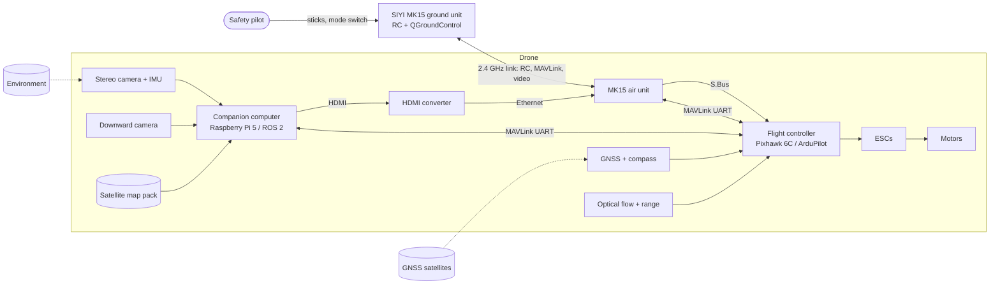
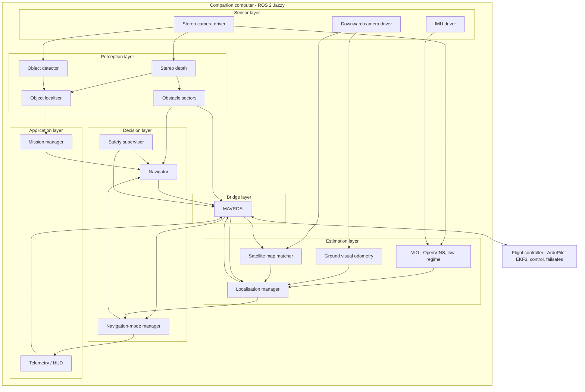

# System Architecture

| Field | Value |
|---|---|
| Document ID | GDN-ARC-001 |
| Version | 1.0 |
| Date | 2026-10-05 |
| Status | Baseline |

## 1. Architectural principles

1. **The flight controller flies; the companion advises.** Stabilisation, sensor fusion for control, failsafes, geofence and motor output stay in ArduPilot. The Pi supplies measurements (pose, obstacles) and slow setpoints. The vehicle must be flyable with the Pi unplugged.
2. **Loosely coupled, two-stage estimation.** VIO on the Pi produces a pose; ArduPilot's EKF3 fuses that pose with its own IMU, barometer and compass. No third fusion filter on the Pi.
3. **Degrade in tiers.** GNSS → vision → optical flow → altitude-hold/land. Each tier needs fewer sensors than the one above.
4. **Topic-level contracts.** Camera, VIO and detector can each be swapped without touching downstream nodes.
5. **Simulation parity.** The same graph runs against Gazebo + ArduPilot SITL and against hardware.
6. **AI is advisory.** The neural network adds semantic information. It is never needed to stay airborne or localised.
7. **Absolute fixes bound the drift (DB-2.0).** When GPS is denied, a downward camera image is matched against a satellite image stored on board to obtain an absolute position about once a second; visual odometry carries the position between fixes. See [visual-geolocalization.md](../09-navigation/visual-geolocalization.md).

> **DB-2.0 change.** The primary GPS-denied position source is now satellite image matching, flown at 40–60 m. Stereo VIO, stereo depth, obstacle stop and AI detection are unchanged and serve the low regime (1–10 m). New elements: a downward USB camera, an onboard map pack, nodes `ground_vo` and `map_matcher`. The flight-controller interface is unchanged.

## 2. Context

## 3. Functional decomposition

## 4. Subsystems

| # | Subsystem | Runs on | Responsibility | Detail |
|---|---|---|---|---|
| S1 | Sensing | Pi | Capture synchronised stereo images and IMU data with accurate timestamps | [stereo-camera](../03-hardware/stereo-camera.md), [stereo-vision-pipeline](../06-computer-vision/stereo-vision-pipeline.md) |
| S2 | Stereo depth | Pi | Rectify, compute disparity and depth | [stereo-vision-pipeline](../06-computer-vision/stereo-vision-pipeline.md) |
| S3 | VIO | Pi | 6-DoF pose and velocity from stereo + IMU | [vio-design](../07-vio-slam/vio-design.md) |
| S4 | Localisation | Pi | Frame alignment, confidence, external-nav output | [state-estimation](../09-navigation/state-estimation.md) |
| S5 | Navigation-mode management | Pi | GNSS health, state machine, EKF source selection | [gps-denied-state-machine](gps-denied-state-machine.md) |
| S6 | AI perception | Pi | Object detection and ranging | [ai-architecture](../08-ai/ai-architecture.md) |
| S7 | Obstacle handling | Pi + FC | Sector distances, stop-and-hold, FC avoidance | [autonomous-navigation](../09-navigation/autonomous-navigation.md) |
| S8 | Navigation and mission | Pi | Waypoint following by setpoints in GUIDED mode | same |
| S9 | Flight control | FC | Estimation (EKF3), control, failsafes, logging | [flight-controller](../03-hardware/flight-controller.md) |
| S10 | Communication | FC + MK15 + Pi | MAVLink, RC, telemetry, video | [mavlink-integration](../10-communication/mavlink-integration.md) |
| S11 | Safety | FC (primary) + Pi (supervisor) | Override, failsafes, watchdogs | [safety-architecture](../12-safety/safety-architecture.md) |
| S12 | Power | Hardware | Battery distribution and regulation | [power-architecture](../03-hardware/power-architecture.md) |
| S13 | Logging and diagnostics | Pi + FC | rosbag2, dataflash, diagnostics | [ros2-architecture](../05-ros2/ros2-architecture.md) |
| S14 | Visual geo-localisation (DB-2.0) | Pi | Absolute position from matching downward images to an onboard satellite map; ground visual odometry | [visual-geolocalization](../09-navigation/visual-geolocalization.md) |

## 5. Authority split

| Function | Flight controller | Companion computer | Pilot |
|---|---|---|---|
| Attitude and rate control | **Owns** | Never | Through sticks |
| Position control | **Owns** | Supplies setpoints (GUIDED only) | Through sticks / modes |
| State estimate used for control | **Owns** (EKF3) | Supplies external-nav measurements | — |
| Choice of position source | Executes | **Requests** (source set 1/2/3) | Can override by RC switch |
| Arming | Checks and executes | **Never** | **Owns** |
| Flight mode | Executes | May request GUIDED-exit modes only (BRAKE, LOITER, LAND, RTL) | **Owns**; always wins |
| RC / battery / EKF / geofence failsafes | **Owns** | Never | — |
| Obstacle stop | Executes simple avoidance | Supplies distances; also stops its own setpoints | — |
| Mission logic | — | **Owns** | Can abort |

## 6. Primary data flows

| # | Flow | Path | Rate |
|---|---|---|---|
| D1 | Images | Camera → Pi (CSI-2) → driver → VIO, depth, detector | 20 Hz |
| D2 | Inertial (VIO) | ICM-20948 → Pi (I²C) → VIO | 200 Hz |
| D3 | Vision pose | VIO → localisation manager → MAVROS → FC (ODOMETRY) | 20–30 Hz |
| D4 | FC state | FC → MAVROS → Pi (local position, GPS, EKF status, mode, battery) | 5–30 Hz |
| D5 | Source selection | Nav-mode manager → MAVROS → FC (MAV_CMD_SET_EKF_SOURCE_SET) | Event |
| D6 | Obstacles | Depth → sectors → MAVROS → FC (OBSTACLE_DISTANCE) | 10 Hz |
| D7 | Setpoints | Navigator → MAVROS → FC (SET_POSITION_TARGET_LOCAL_NED) | 20 Hz |
| D8 | RC | Pilot → MK15 → S.Bus → FC | ~70 Hz |
| D9 | Telemetry | FC → MK15 UART datalink → QGroundControl | 57.6 kbaud stream |
| D10 | Video | Pi HDMI → converter → MK15 Ethernet → ground unit | 1080p30 H.265 |

## 7. Navigation tiers

| Tier | EKF3 source set | Horizontal source | Depends on | Typical use |
|---|---|---|---|---|
| 1 | SRC1 | GNSS | Sky view | Open outdoor flight |
| 2 | SRC2 | External navigation. **Cruise (40–60 m): satellite map matching + ground visual odometry.** Low (1–10 m): stereo VIO | Pi, downward camera, map of the area, light, distinct ground features | GNSS-denied flight |
| 3 | SRC3 | Optical flow + range | Downward texture, < 8 m AGL (low regime only) | Pi or vision failure while GNSS-denied at low height |
| 4 | — | None (ALT_HOLD / LAND) | Barometer, IMU | Everything else failed |

## 8. Deployment view

| Element | Hardware | Software |
|---|---|---|
| Flight controller | Pixhawk 6C | ArduPilot Copter 4.7.x, Lua companion watchdog |
| Companion | Raspberry Pi 5 8 GB | Ubuntu Server 24.04, ROS 2 Jazzy, project workspace, systemd service |
| Ground | MK15 ground unit (Android 9) | QGroundControl / SIYI FPV |
| Development | x86-64 PC, Ubuntu 24.04 | ROS 2 Jazzy desktop, Gazebo Harmonic, ArduPilot SITL, RViz2, calibration tools |

## 9. Constraints that drive the design

| Constraint | Effect on design |
|---|---|
| Pi 5 has four A76 cores, no usable GPU compute for NN, no hardware video encoder | CPU budget per node; small detector at low rate; video via external HDMI encoder |
| Stereo camera is rolling-shutter and not hardware-synchronised | Software sync, skew measurement, speed and yaw-rate limits, gate G2 |
| 60 mm baseline, 73° HFOV | Usable depth 0.5–6 m; low speed limit |
| MK15 datalink is a serial MAVLink stream at modest baud | Companion status goes to GCS as small MAVLink messages routed by the FC; no ROS traffic over the radio |
| One Ethernet port on the MK15 air unit | Either HDMI converter or direct Pi Ethernet, not both without a switch |
| College budget and schedule | Reuse owned hardware; simulation first; no custom PCB |
