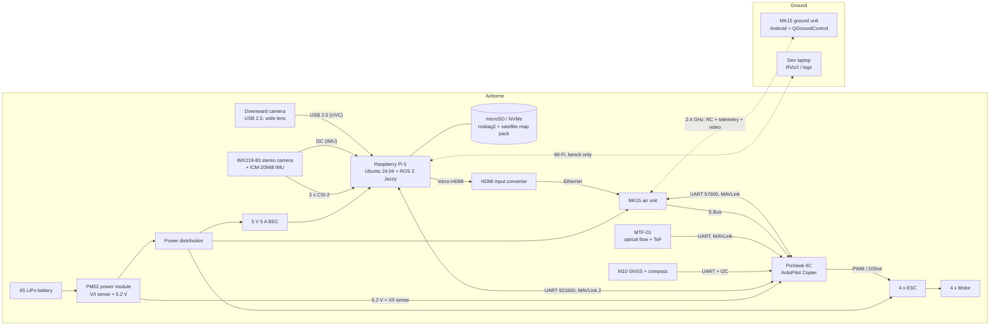
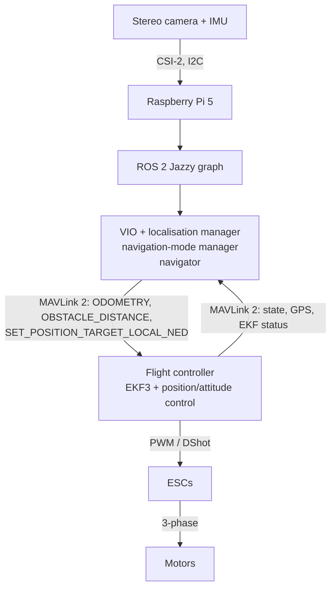
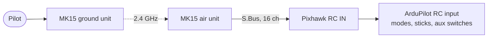
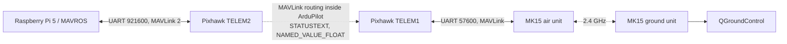
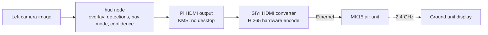
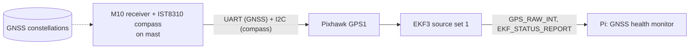
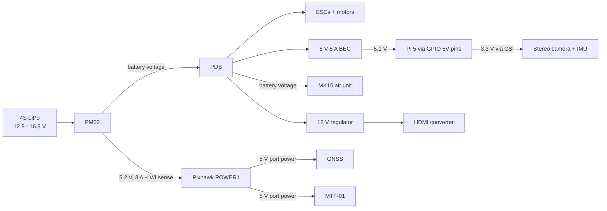

# High-Level Hardware Architecture

| Field | Value |
|---|---|
| Document ID | GDN-HW-001 |
| Version | 1.0 |
| Date | 2026-10-05 |
| Status | Baseline |

## 1. Full hardware block diagram

## 2. Perception-to-actuation chain

The Pi never drives ESCs. There is no electrical path from the Pi to the motors.

## 3. RC path

- The RC path does not pass through the Pi. Pilot authority is independent of all companion hardware and software.
- Loss of this path triggers the FC throttle/RC failsafe.

Planned channel map (`[ASSUMPTION]`, to be fixed at FC bring-up):

| Channel | Function | ArduPilot parameter |
|---|---|---|
| 1–4 | Roll, pitch, throttle, yaw | `RCMAP_*` |
| 5 | Flight mode (6 positions) | `FLTMODE_CH = 5` |
| 6 | EKF source set (3-position) | `RC6_OPTION = 90` |
| 7 | Motor emergency stop | `RC7_OPTION = 31` |
| 8 | GPS disable (test aid) | `RC8_OPTION = 65` |
| 9 | Companion autonomy enable (read by companion via `RC_CHANNELS`) | `RC9_OPTION = 0` (scripting/none) |

Flight modes on channel 5: STABILIZE, ALT_HOLD, LOITER, GUIDED, LAND, RTL.

## 4. Telemetry path

- The GCS talks to the FC directly. It works with the Pi off.
- Companion status reaches the GCS by MAVLink routing through the FC. High-rate companion-to-FC traffic is kept off the radio with `SERIAL2_OPTIONS` bit 10 ("don't forward") where needed; see [mavlink-integration](../10-communication/mavlink-integration.md).

> **DB-3.0 change to the diagrams in this document.** The HDMI converter and its link are removed. The Raspberry Pi's Ethernet port connects directly to the MK15 air unit's Ethernet port, and an Android app on the ground unit talks to the Pi over that IP link (video, detections, map, commands). RC and the serial telemetry datalink to QGroundControl are unchanged. See [ground-app.md](../10-communication/ground-app.md) §2 for the current link diagram.

## 5. Video path

Rationale: the Pi 5 has no hardware H.264/H.265 encoder. Encoding in software would cost about one CPU core. The MK15 HDMI combo already includes a hardware encoder, so the Pi only has to render frames to its HDMI output.

## 6. GNSS path

GNSS goes only to the FC. The Pi observes GNSS quality through MAVLink; it has no receiver of its own.

## 7. Sensor allocation

| Sensor | Connected to | Used for |
|---|---|---|
| FC IMUs (ICM-42688-P, BMI088) | FC internal | Attitude, EKF3 prediction |
| FC barometer (MS5611) | FC internal | Altitude |
| GNSS + compass (M10 / IST8310) | FC GPS1 | Tier-1 position, heading |
| Optical flow + ToF (MTF-01) | FC serial | Height above ground; tier-3 velocity |
| Stereo camera (2 × IMX219) | Pi CSI-2 ×2 | Low-regime VIO, depth, AI |
| Downward camera (DB-2.0) | Pi USB 2.0 | Satellite map matching, ground visual odometry |
| ICM-20948 (on camera board) | Pi I²C | VIO inertial input |

## 8. Power path

Details and protection: [power-architecture.md](power-architecture.md).

## 9. Data logging

| Log | Where | Content | Retrieval |
|---|---|---|---|
| ArduPilot dataflash (`.bin`) | FC microSD | IMU, EKF, GNSS, `VISP`/`VISV` external-nav inputs, source changes, RC, battery | MAVFTP or card removal |
| rosbag2 (MCAP) | Pi storage | Images (optionally compressed/decimated), IMU, VIO, alignment, state machine, detections, diagnostics | scp over Wi-Fi after landing |
| GCS telemetry log (`.tlog`) | MK15 ground unit | MAVLink stream as seen on the ground | USB / SD |
| System journal | Pi | Service start/stop, kernel, throttling | `journalctl` export |

## 10. Physical layout guidance

| Item | Placement | Reason |
|---|---|---|
| Flight controller | Vehicle centre, on its damping, arrow forward | IMU at centre of rotation |
| Stereo camera | Front, rigid bar, clear of props in the image, on a separate soft-mounted plate with the Pi **or** rigidly on a damped sub-frame | Rigid stereo geometry; isolation from motor vibration |
| Raspberry Pi | Close to the camera | CSI ribbon length ≤ 200 mm |
| GNSS/compass | Mast, ≥ 10 cm above everything | Away from the Pi, CSI ribbons, power leads and the MK15 antennas |
| MK15 air unit | Rear, antennas pointing down, apart from each other and from GNSS | RF separation |
| MTF-01 | Underside, clear view down, ≥ 5 cm from landing-gear legs in view | Flow and ToF need unobstructed view |
| Downward camera | Underside near the centre, image top towards the nose, landing gear outside its field of view, on the damped plate | Nadir view for map matching; known boresight |
| Battery | Centred, adjusts centre of gravity | Balance |
| BEC and power leads | Away from compass and CSI ribbons; twisted pairs | Magnetic and conducted noise |
