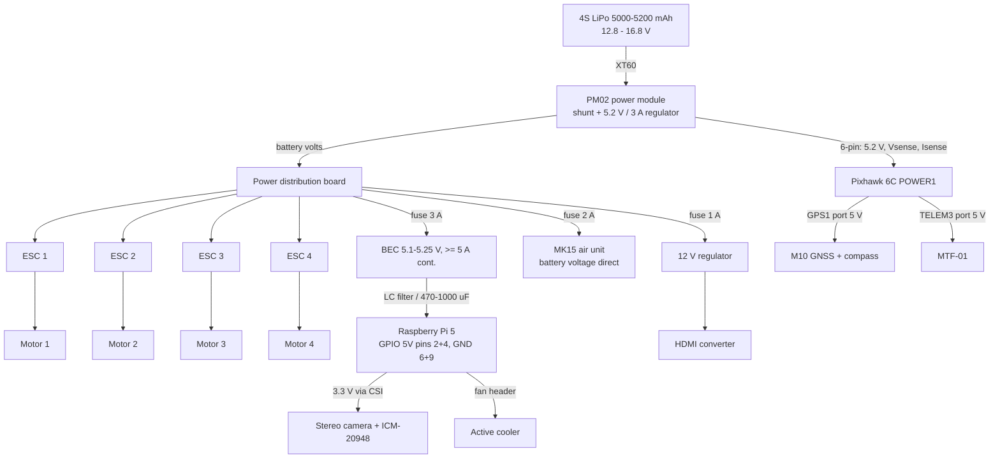

# Power Architecture

| Field | Value |
|---|---|
| Document ID | GDN-HW-008 |
| Version | 1.0 |
| Date | 2026-10-05 |
| Assumption | 4S LiPo, 450–500 mm quadrotor `[ASSUMPTION]`; airframe not yet selected |

## 1. Design goals

1. A brown-out or fault on the companion supply must not disturb the flight controller.
2. The Pi receives a clean 5.1 V capable of 5 A.
3. Battery voltage and current are measured by the FC so that battery failsafes work without the Pi.
4. One battery; no separate avionics battery (mass).

## 2. Distribution diagram

## 3. Rails

| Rail | Regulator | Nominal | Load | Continuous | Peak | Regulator rating required |
|---|---|---|---|---|---|---|
| V5_FC | PM02 | 5.2 V | Pixhawk + GNSS + MTF-01 | ≈ 0.5 A | ≈ 0.8 A | 3 A (as supplied) |
| V5_PI | Dedicated BEC | 5.1–5.25 V | Pi 5 + cooler + camera | ≈ 1.6 A | ≈ 3.5 A (design to 5 A) | ≥ 5 A continuous, ≥ 6 A peak |
| V12 | Small buck | 12 V | HDMI converter | ≈ 0.25 A | ≈ 0.4 A | ≥ 0.5 A |
| VBAT | — | 14.8 V | MK15 air unit | ≈ 0.2 A | ≈ 0.8 A | — |
| VBAT | — | 14.8 V | Propulsion | ≈ 18–22 A hover `[ESTIMATE]` | 60 A+ | PM02 and PDB rated accordingly |

On a 4S pack a 12 V buck regulator drops out when the battery falls below about 13 V. Use a buck-boost type, or a converter with ≤ 0.5 V dropout, or confirm that the HDMI converter tolerates 10–12 V `[VERIFY]`.

## 4. Pi supply requirements

| Requirement | Value | Reason |
|---|---|---|
| Output voltage at the Pi pins | 5.1 V nominal, never < 4.9 V under a 0 → 4 A step, never > 5.25 V | Pi under-voltage threshold; no over-voltage protection on the GPIO feed |
| Current | ≥ 5 A continuous | Pi 5 rating; margin for load steps |
| Ripple | < 50 mV p-p at the Pi | Camera analogue supply and I²C integrity |
| Input | 3S–6S (≥ 26 V tolerant) | Battery range plus regenerative spikes |
| Wiring | ≥ 20 AWG, ≤ 150 mm, two 5 V pins and two GND pins in parallel | Header pin current rating; voltage drop |
| Bulk capacitance | 470–1000 µF low-ESR at the Pi end | Step response |
| Protection | Inline fuse on the BEC input | Wiring fault protection |

Bench acceptance test: electronic load or the Pi under `stress-ng` plus full stack for 20 min; oscilloscope on the 5 V pins; no under-voltage flag in the firmware log.

## 5. Battery monitoring

- PM02 feeds analog voltage and current to the FC (`BATT_MONITOR = 4`). Calibrate `BATT_VOLT_MULT` and `BATT_AMP_PERVLT` against a multimeter and a known load.
- Failsafe thresholds (4S starting values): low 14.0 V → RTL or LAND depending on position source; critical 13.2 V → LAND. With capacity counting: low at 25 % remaining, critical at 15 %.
- The Pi reads `BATTERY_STATUS` for display and logging only.

## 6. Sequencing and shutdown

| Event | Behaviour |
|---|---|
| Battery connected | FC, MK15 and Pi power up together. FC is ready in ≈ 10–20 s; Pi stack in ≈ 40–60 s `[ESTIMATE]`. The pre-flight check waits for "CC READY". |
| Pi shutdown | After disarm, the operator sends a shutdown request (GCS action or button on a GPIO) so that the bag closes and the filesystem unmounts cleanly, then unplugs the battery. |
| Unplanned power loss | Bag in MCAP format is recoverable up to the last flushed chunk. Root filesystem is mounted with journaling; logs go to a separate partition (NFR-024). |
| Pi brown-out in flight | FC unaffected (separate regulator). FC watchdog sees loss of companion heartbeat and acts (see safety architecture). |

## 7. Protection summary

| Hazard | Protection |
|---|---|
| Reverse battery | Keyed XT60 connectors |
| Short on an avionics branch | Individual inline fuses (3 A, 2 A, 1 A) |
| BEC failure high (output → battery voltage) | Rare but destructive to the Pi and camera. Optional 5.6 V TVS / crowbar at the Pi input. Accepted risk at prototype stage; note in FMEA. |
| ESC regenerative spikes | Low-ESR capacitor at the PDB (as recommended by the ESC vendor) |
| Over-discharge | FC battery failsafe; LiPo alarm as an independent audible backup |
| Connector shake-out | Locking connectors; header clamp on the Pi feed |

## 8. Open items

| # | Item |
|---|---|
| PW-1 | Airframe and propulsion selection fixes hover current and therefore battery size and flight time |
| PW-2 | MK15 air unit minimum voltage (see siyi-mk15 MK-1) |
| PW-3 | HDMI converter supply range and connector |
| PW-4 | Choice of BEC part; must pass the §4 bench test before the Pi is connected |
