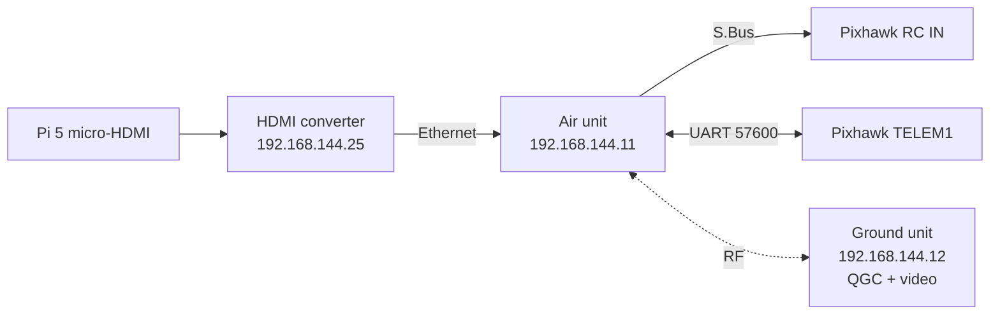
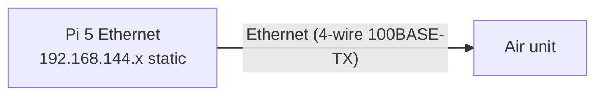

# SIYI MK15 HDMI Combo — Analysis

| Field | Value |
|---|---|
| Document ID | GDN-HW-006 |
| Version | 1.0 |
| Date | 2026-10-05 |
| Verdict | **Suitable** for RC, GCS telemetry and video. It is **not** a general-purpose data link for the companion computer. Three items must be checked on the actual unit before wiring (§7). |

## 1. Specification

Sources: SIYI MK15 specification page, SIYI air-unit listing, SIYI HDMI converter manual, reseller listing. Where sources disagree, both figures are shown.

### Ground unit

| Parameter | Value |
|---|---|
| Display | 5.5-inch high-brightness touchscreen |
| System | Android 9.0, 2 GB RAM, 16 GB storage |
| Battery | 10 200 mAh, 7.4 V 2S Li-ion (75.48 Wh); 13–15 h endurance quoted |
| Charging | USB-C PD, 30 W |
| Mass | 850 g |
| Ports | USB-A, HDMI output, TF card, SIM |
| Channels | 16 communication channels, 13 physical |
| Apps | SIYI FPV, QGroundControl; Mission Planner over a network connection from a laptop |
| Range | Up to 15 km quoted, unobstructed and interference-free (irrelevant at this project's distances) |

### Air unit

| Parameter | Value |
|---|---|
| RC output | 16-channel S.Bus (GH1.25 3-pin); 5 PWM channels (GH1.25 6-pin) |
| Datalink to FC | UART (GH1.25 4-pin); baud configurable |
| Video / network | Ethernet (GH1.25 8-pin) |
| Supply voltage | **Sources differ:** 4S–18S / 16.8–75.6 V on current SIYI pages, with the note that lots manufactured before 2024 may support **6S–14S only**; a reseller lists 14.8–58.8 V |
| Power | 2.8–3.2 W average; 12 W peak |
| Mass | 74–116 g depending on configuration and source (antennas excluded) |
| Dimensions | ≈ 70 × 55 × 16 mm (fan included) |
| Temperature | −10 to 50 °C |
| Video | 1080p at 30 fps (720p options) |
| Network addresses | Air unit 192.168.144.11, ground unit 192.168.144.12, Android system 192.168.144.20 (reserved; do not reuse) |

### HDMI input converter

| Parameter | Value |
|---|---|
| Input | HDMI (stated as micro-HDMI by SIYI's specification page and mini-HDMI in a manual summary — `[VERIFY]` on the unit) |
| Output | Ethernet to the air unit |
| Encoding | H.265, ≈ 12 Mbit/s |
| Supply | 12 V, ≈ 3 W |
| Default address | 192.168.144.25; RTSP `rtsp://192.168.144.25:8554/main.264` |
| Recording | microSD (Class 10, ≤ 32 GB) |

## 2. What the MK15 provides in this architecture

| Function | Provided? | How |
|---|---|---|
| RC control with mode and auxiliary switches | Yes | S.Bus → Pixhawk RC IN |
| RC failsafe signalling | Yes | S.Bus failsafe flag / no-signal; FC `FS_THR_ENABLE` (behaviour on link loss to be configured and tested) |
| GCS telemetry (MAVLink) | Yes | Air-unit UART ↔ Pixhawk TELEM1; QGroundControl on the ground unit |
| Parameter editing, mission upload, mode commands from GCS | Yes | Same link |
| Live video to the pilot | Yes | Pi HDMI → converter → air unit Ethernet |
| Companion status on the GCS | Indirectly | Companion sends `STATUSTEXT` / `NAMED_VALUE_FLOAT` to the FC; ArduPilot routes them to TELEM1 |
| Forwarding telemetry to a laptop | Yes | Ground unit can forward MAVLink over UDP/USB/Bluetooth `[VERIFY method on our firmware]` |

## 3. What it does not provide

| Not provided | Consequence | Design response |
|---|---|---|
| A ROS 2 / DDS link to the ground | RViz2 cannot be used in flight over the MK15 serial datalink | In-flight insight comes from the HUD video and MAVLink status values; detailed analysis is post-flight from rosbag. Bench work uses Wi-Fi. |
| SSH to the Pi (in the HDMI-converter configuration) | The single Ethernet port is occupied by the converter | Wi-Fi on the bench; or the alternative topology in §6 |
| High telemetry bandwidth | UART datalink, 57 600 baud by default | Keep GCS stream rates modest; never forward the high-rate companion traffic to TELEM1 |
| A second, independent RC link | Single point of failure for manual control | FC RC failsafe configured and tested; flights stay close |
| Any navigation or obstacle function | None of the autonomy depends on the MK15 | — |
| Low latency guarantee for video | Latency not specified by the vendor | Video is for monitoring only. The pilot flies line-of-sight, not by video. |

## 4. Compatibility

| Item | Status |
|---|---|
| ArduPilot | Supported (SIYI lists ArduPilot and PX4 compatibility; S.Bus + MAVLink are standard) |
| QGroundControl on Android 9 | Works; use the SIYI-provided build or a version known to run on Android 9 `[VERIFY]` |
| Pixhawk 6C | S.Bus to RC IN; UART to TELEM1; standard |
| Raspberry Pi 5 HDMI | Pi provides micro-HDMI outputs; needs the matching cable for the converter |
| 4S battery | **Depends on manufacturing lot** — see §7 |

## 5. Recommended configuration (baseline topology A)

- Video on the ground unit: RTSP stream from the converter, shown in QGroundControl or SIYI FPV.
- The Pi renders a 720p HUD at ≈ 15 Hz directly to HDMI (KMS, no desktop). Zero encoding cost on the Pi.

## 6. Alternative topology B (no HDMI converter)

| | Topology A (HDMI) | Topology B (Ethernet) |
|---|---|---|
| Pi CPU cost for video | Rendering only | Software H.264 encode ≈ 0.5–1 core at 720p |
| SSH / UDP to the Pi from the ground | No | Yes, within the SIYI subnet |
| MAVLink over UDP from MAVROS to a laptop | No | Possible |
| Extra hardware | Converter + 12 V regulator (≈ 3 W) | Custom 8-pin GH ↔ RJ45 cable |
| Risk | Low | Higher: IP configuration, bandwidth sharing, CPU load |

**Decision:** topology A for flight (CPU is the scarcest resource). Topology B is kept as a bench and debugging option; a small Ethernet switch could provide both but adds mass and is not planned.

### DB-3.0 decision: topology B is now the baseline

The Android ground app ([ADR-017](../17-decisions/ADR-017-ground-app.md)) needs an IP path from the MK15 to the Raspberry Pi. The decision above is therefore reversed:

| | DB-1.0 / DB-2.0 | DB-3.0 |
|---|---|---|
| Video and data path | Pi HDMI → converter → air unit Ethernet | **Pi Ethernet → air unit Ethernet** (static address 192.168.144.50) |
| Video encoding | Hardware H.265 in the converter | JPEG frames encoded on the Pi (640×480, 10 fps) |
| Overlay | Drawn on the Pi (`hud_node`) | Drawn in the app from detection data |
| HDMI converter and its 12 V regulator | Fitted | **Removed** (kept as a spare) |
| What the operator uses | QGroundControl video panel | The GDN Ground app; QGroundControl still runs on the serial datalink |

How the three MK15 paths are now used:

| Path | Use |
|---|---|
| RC link → S.Bus | Pilot control (unchanged) |
| Serial datalink (MAVLink) | QGroundControl (unchanged). Research note: the datalink can be exposed to Android as UART, USB COM, Bluetooth or UDP; QGroundControl's forwarding to another app is one-way, so the app does not rely on it |
| Ethernet / IP bridge | The app ↔ Raspberry Pi: control, status, video, findings, map tiles |

Additional checks on the owned unit:

| # | Item |
|---|---|
| MK-9 | An Android app on the ground unit can reach a third-party device on the air unit's Ethernet over TCP and UDP; measure throughput and latency |
| MK-10 | Pin-out and cable for the air unit's 8-pin Ethernet connector to RJ45 |
| MK-11 | Installing a custom APK; split-screen with QGroundControl; keeping the screen awake |

## 7. Limitations and checks before use

| # | Item | Why it matters | Action |
|---|---|---|---|
| MK-1 | Air-unit supply range on **our** unit | A pre-2024 lot may need ≥ 6S; a 4S pack (12.8–16.8 V) could be below its minimum | Read the label / test on a bench supply. If 4S is unsupported: use a 6S vehicle, or a boost converter (≥ 1 A at 24 V) for the air unit. |
| MK-2 | Air-unit mass (74–116 g + antennas) | Significant on a sub-2 kg vehicle | Weigh it; included in the weight budget at 116 g |
| MK-3 | Operating band | Believed 2.4 GHz ISM `[VERIFY]`; the Pi's 2.4 GHz Wi-Fi and Bluetooth would interfere | Disable Pi Bluetooth; Wi-Fi off or 5 GHz in flight |
| MK-4 | Failsafe behaviour of S.Bus output on link loss | The FC must see a detectable failsafe | Configure "no output" or failsafe flag; verify with props off (test in L7) |
| MK-5 | Datalink baud and MAVLink version | Must match `SERIAL1_BAUD`, `SERIAL1_PROTOCOL` | Set in the SIYI app; verify parameter download speed |
| MK-6 | HDMI converter connector and supply | Cable and regulator selection | Inspect the unit |
| MK-7 | Video latency | Unknown | Measure; informational only |
| MK-8 | Regulatory | Transmit power and band must be permitted for use in India | Confirm with the supplier's documentation |

## 8. Channel plan

See [high-level-architecture.md](high-level-architecture.md) §3.
