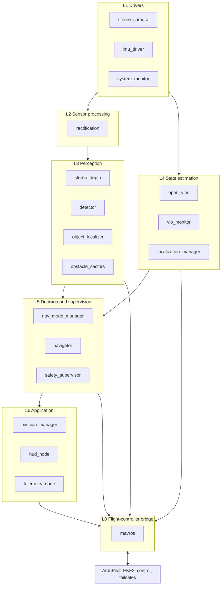
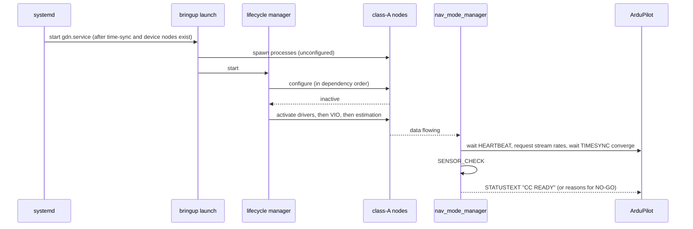

# Software Architecture

| Field | Value |
|---|---|
| Document ID | GDN-SW-001 |
| Version | 1.0 |
| Date | 2026-10-05 |
| Status | Baseline |

## 1. Platform

| Layer | Choice | Record |
|---|---|---|
| Companion OS | Ubuntu Server 24.04 LTS, arm64, headless | [ADR-001](../17-decisions/ADR-001-ros2-distribution.md) |
| Middleware | ROS 2 Jazzy Jalisco (LTS, supported to May 2029) | ADR-001 |
| DDS | Fast DDS (Jazzy default), discovery limited to localhost in flight | ADR-001 |
| Autopilot | ArduPilot Copter 4.7.x | [ADR-002](../17-decisions/ADR-002-autopilot-firmware.md) |
| FC bridge | MAVROS 2.x (Jazzy binary) | [ADR-008](../17-decisions/ADR-008-mavlink-architecture.md) |
| Languages | C++17 for drivers, image processing and estimation glue; Python 3.12 for state machines, mission logic and tooling | §6 |
| Build | colcon / ament_cmake / ament_python | — |

## 2. Layered architecture

Dependency rule: a layer may depend on layers below it and on `gdn_interfaces`. No upward dependencies. L0 (MAVROS) is accessed only through topics and services, never linked.

## 3. Layer responsibilities

| Layer | Responsibility | Fails how | Effect of failure |
|---|---|---|---|
| L0 Bridge | MAVLink serial, frame conversion ENU/NED, time sync, plugin set | Process crash, serial error | No companion influence; FC continues; FC watchdog acts if in GUIDED |
| L1 Drivers | Images, IMU samples, system health, all with correct stamps | Device error, timeout | VIO and perception stop; state machine leaves the VIO tier |
| L2 Sensor processing | Rectified images | — | Depth stops; VIO unaffected (it uses raw images with its own model) |
| L3 Perception | Depth, detections, object positions, obstacle sectors | Overload, crash | Autonomy slows or holds; localisation unaffected |
| L4 State estimation | Odometry, alignment, confidence, external-nav output | Divergence, reset | State machine falls to flow tier or lower |
| L5 Decision | Navigation mode, setpoints, supervision | Logic fault | Supervisor silences setpoints; FC watchdog |
| L6 Application | Mission, operator feedback | Crash | Mission aborts to hold; no safety effect |

## 4. Process and threading model

| Process (container) | Nodes | Executor | Reason for grouping |
|---|---|---|---|
| `sensor_container` | `stereo_camera`, `rectify_left`, `rectify_right`, `stereo_depth`, `obstacle_sectors` | Multi-threaded, component container, intra-process communication | Zero-copy image passing between capture, rectification and depth |
| `imu_driver` | `imu_driver` | Single-threaded, elevated priority (`SCHED_FIFO` low level, if permitted) | Timing jitter isolation |
| `open_vins` | `ov_msckf` subscriber node | Its own | Third-party; isolated so a crash is contained and restartable |
| `estimation` | `vio_monitor`, `localization_manager` | Multi-threaded | Tight coupling; small messages |
| `perception_ai` | `detector`, `object_localizer` | Multi-threaded; NCNN limited to 2 threads; `nice` +5 | Must not starve VIO |
| `decision` | `nav_mode_manager`, `navigator`, `mission_manager` | Multi-threaded (Python) | Low-rate logic |
| `safety_supervisor` | `safety_supervisor` | Single-threaded, separate process | Must survive other crashes |
| `mavros` | `mavros_node` | Its own | Third-party |
| `support` | `telemetry_node`, `hud_node`, `system_monitor`, `diagnostic_aggregator` | Multi-threaded | Non-critical |
| `rosbag2` | recorder | — | Non-critical |

Images are passed between processes only where unavoidable: `sensor_container` → `open_vins` and → `perception_ai`. At 640×480 mono (307 kB) × 2 × 20 Hz the copy cost is acceptable. If profiling shows otherwise, loaned messages / shared-memory transport is the next step.

## 5. Criticality classes

| Class | Meaning | Nodes | Policy |
|---|---|---|---|
| A — flight-critical on the companion | Loss removes the VIO tier | `stereo_camera`, `imu_driver`, `open_vins`, `vio_monitor`, `localization_manager`, `nav_mode_manager`, `mavros`, `safety_supervisor` | Lifecycle-managed, heartbeat-monitored, auto-restart, never shed |
| B — autonomy | Loss stops autonomous motion | `navigator`, `mission_manager`, `stereo_depth`, `obstacle_sectors` | Monitored; on loss → hold |
| C — advisory | Loss is cosmetic or reduces information | `detector`, `object_localizer`, `telemetry_node`, `hud_node`, `system_monitor`, recorder | Shed first under thermal or CPU pressure |

Nothing on the companion is flight-critical for the *vehicle*: with every class-A node dead, the FC still flies under pilot control.

## 6. Language policy

| Use C++ when | Use Python when |
|---|---|
| The node handles images or > 50 Hz data | The node is a state machine or sequencer at ≤ 20 Hz |
| It must be a composable component for zero-copy | Rapid iteration matters more than CPU |
| It wraps a C/C++ library (libcamera, NCNN, OpenCV) | It is test tooling, calibration scripting or analysis |

| Node | Language |
|---|---|
| `stereo_camera`, `imu_driver`, `stereo_depth`, `obstacle_sectors`, `vio_monitor`, `localization_manager`, `detector`, `object_localizer`, `hud_node` | C++ |
| `nav_mode_manager`, `navigator`, `mission_manager`, `safety_supervisor`, `telemetry_node`, `system_monitor` | Python |

`safety_supervisor` and `navigator` are Python in the baseline for speed of development. If measured jitter of the 20 Hz setpoint stream exceeds ±10 ms, `navigator` moves to C++.

## 7. Configuration management

| Kind | Location | Format |
|---|---|---|
| Node parameters | `gdn_bringup/config/<profile>/*.yaml` | ROS 2 parameter YAML; profiles `sim`, `bench`, `flight` |
| Calibration | `gdn_description/calibration/<camera_serial>/` | Kalibr YAML + OpenVINS YAML + `camera_info` YAML, with a `calibration_id` |
| Robot geometry | `gdn_description/urdf/` | URDF/xacro |
| FC parameters | `fc_config/*.param` (repository root) | ArduPilot parameter files, one per test configuration, under version control |
| FC Lua scripts | `fc_config/scripts/` | Lua |
| Model files | `gdn_perception/models/` | NCNN `.param` / `.bin`, with a model card |
| System | `system/` | systemd units, udev rules, `config.txt` fragment, build scripts |

Every flight records the git commit and a parameter dump into the bag metadata (FR-063).

## 8. Start-up

Order: `mavros` → `imu_driver` → `stereo_camera` → `open_vins` → `vio_monitor` → `localization_manager` → `nav_mode_manager` → class B → class C. Shutdown is the reverse.

## 9. Error-handling policy

| Situation | Policy |
|---|---|
| Driver read error | Retry with back-off (3 attempts), then lifecycle `error` → supervisor restarts the node |
| Message too old (stamp age > limit) | Drop and count; diagnostics WARN at > 1 %, ERROR at > 5 % |
| Estimator divergence | `vio_monitor` flags it; state machine leaves VIO tier; VIO restarted only when safe (state machine T16) |
| Unhandled exception | Process exits non-zero; launch `respawn` with 2 s delay; supervisor counts restarts (≥ 3 in 60 s → FAULT) |
| Parameter out of range at start-up | Refuse to configure; NO-GO with reason |
| Any uncertainty in a decision node | Choose the action that needs less trust in the companion (hold, then hand to FC) |

## 10. Technology selection

See [technology-selection.md](technology-selection.md) for each technology named in the project brief: adopted, rejected or deferred, with reasons.
