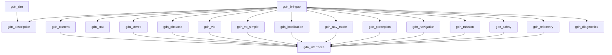

# ROS 2 Package Structure

| Field | Value |
|---|---|
| Document ID | GDN-ROS-002 |
| Version | 1.0 |
| Date | 2026-10-05 |
| Status | Baseline — **design only. No package has been created.** |

## 1. Naming

All project packages use the prefix `gdn_` (GPS-Denied Navigation). Node names are unprefixed nouns.

## 2. Package list

| Package | Build type | Contains | Depends on (project) |
|---|---|---|---|
| `gdn_interfaces` | ament_cmake (rosidl) | Messages, services, actions | — |
| `gdn_description` | ament_cmake | URDF/xacro, static transforms, calibration files | — |
| `gdn_bringup` | ament_python | Launch files, parameter profiles, lifecycle manager node, bag profiles | all |
| `gdn_camera` | ament_cmake | `stereo_camera` component (libcamera, dual CSI, software sync) | `gdn_interfaces` |
| `gdn_imu` | ament_cmake | `imu_driver` node (ICM-20948 over I²C) | — |
| `gdn_stereo` | ament_cmake | `stereo_depth` component; launch composition with `image_proc` rectification | `gdn_interfaces` |
| `gdn_obstacle` | ament_cmake | `obstacle_sectors` component | `gdn_interfaces` |
| `gdn_vio` | ament_cmake | `vio_monitor` node; OpenVINS configuration and launch; RTAB-Map backup launch and configuration | `gdn_interfaces` |
| `gdn_vo_simple` | ament_cmake | `stereo_vo` node: simplified OpenCV stereo visual odometry | `gdn_interfaces` |
| `gdn_geoloc` (DB-2.0) | ament_cmake | `ground_vo` and `map_matcher` nodes; downward-camera driver configuration; map-pack reader library; geodetic conversion library | `gdn_interfaces` |
| `gdn_localization` | ament_cmake | `localization_manager` node: alignment, fusion of map fixes with odometry, confidence, external-nav output | `gdn_interfaces` |
| `gdn_nav_mode` | ament_python | `nav_mode_manager` node: GNSS health, state machine, EKF source selection | `gdn_interfaces` |
| `gdn_perception` | ament_cmake | `detector` (NCNN) and `object_localizer` components; model files and model cards | `gdn_interfaces` |
| `gdn_navigation` | ament_python | `navigator` node: GoTo action server, setpoint generation, speed limiting, obstacle stop | `gdn_interfaces` |
| `gdn_mission` | ament_python | `mission_manager` node: ExecuteMission action server, mission file parser | `gdn_interfaces` |
| `gdn_safety` | ament_python | `safety_supervisor` node; pre-flight check | `gdn_interfaces` |
| `gdn_telemetry` | mixed (ament_cmake + Python) | `telemetry_node` (Python), `hud_node` (C++) | `gdn_interfaces` |
| `gdn_diagnostics` | ament_python | `system_monitor` node; aggregator configuration | — |
| `gdn_sim` | ament_cmake | Gazebo worlds, vehicle SDF with stereo camera and IMU, `ros_gz` bridge configuration, SITL launch | `gdn_description` |
| `gdn_tools` | ament_python | Calibration helpers, bag analysis, VIO evaluation scripts, sync measurement | — |

**DB-3.0 additions:** `gdn_app_gateway` (ament_python + one C++ component: `app_gateway`, `video_streamer`, tile server; the drone side of the Android app's protocol) and `gdn_tracking` (ament_cmake: `target_tracker`). `gdn_mission` gains `search_planner` and `finding_manager`; `gdn_navigation` gains the follow behaviour; `gdn_perception` gains the aerial-view model and tiled inference; `gdn_interfaces` gains the messages and actions listed in [interfaces.md](interfaces.md). `hud_node` is removed from `gdn_telemetry`. The Android app itself is **not** a ROS package: it lives in `android/gdn-ground/` at the repository root (Gradle project, Kotlin), with a `mock-gateway/` for development without the drone.

Twenty-two packages in DB-3.0 (nineteen in DB-1.0; `gdn_geoloc` added in DB-2.0). `gdn_tools` gains the off-board `map_prepare` tool that turns a georeferenced image into a map pack. Map packs are data, not code: they live in `data/map_packs/<map_id>/` on the Pi and are not committed to the repository unless their licence allows it.

The brief's suggested list maps onto them as follows:

| Suggested | Final | Change and reason |
|---|---|---|
| `camera_driver` | `gdn_camera`, `gdn_imu` | IMU is a separate device and process |
| `stereo_processing` | `gdn_stereo` | — |
| `vio` | `gdn_vio`, `gdn_vo_simple` | Third-party VIO is configured, not written; the simplified VO is separate so that it can be developed and tested alone |
| `state_estimator` | `gdn_localization` | Renamed: it does not estimate state with a filter; it aligns frames, scores confidence and feeds the FC |
| `perception` | `gdn_perception` | — |
| `obstacle_detection` | `gdn_obstacle` | — |
| `mavlink_bridge` | *(none)* — MAVROS | A custom bridge would duplicate MAVROS; configuration lives in `gdn_bringup` |
| `navigation` | `gdn_navigation`, `gdn_nav_mode` | Navigation-mode management (which position source) is separate from motion (where to go) |
| `mission_manager` | `gdn_mission` | — |
| `safety_manager` | `gdn_safety` | — |
| `telemetry` | `gdn_telemetry` | — |
| `diagnostics` | `gdn_diagnostics` | — |
| — | `gdn_interfaces`, `gdn_description`, `gdn_bringup`, `gdn_sim`, `gdn_tools` | Standard supporting packages |

## 3. Repository layout (future)

```text
gps-denied-drone/
├── documentation/                      # this documentation
├── ros2_ws/
│   └── src/
│       └── gdn/
│           ├── gdn_interfaces/
│           │   ├── msg/                # VioStatus, LocalizationStatus, NavModeState,
│           │   │                       # GnssHealth, StereoSyncStatus, ObstacleSectors,
│           │   │                       # TrackedObject, TrackedObjectArray, SafetyState,
│           │   │                       # SystemStatus, Event, MissionState, NavigatorState
│           │   ├── srv/                # SetNavModeOverride, RunPreflightCheck, ResetVio,
│           │   │                       # SetAutonomyEnabled
│           │   └── action/             # GoTo, ExecuteMission
│           ├── gdn_description/
│           │   ├── urdf/               # gdn_drone.urdf.xacro
│           │   └── calibration/<id>/   # kalibr_camchain.yaml, kalibr_imu.yaml,
│           │                           # ov_estimator.yaml, left.yaml, right.yaml
│           ├── gdn_bringup/
│           │   ├── launch/
│           │   ├── config/{sim,bench,flight}/
│           │   └── gdn_bringup/        # lifecycle_manager.py
│           ├── gdn_camera/
│           │   ├── include/gdn_camera/
│           │   ├── src/                # stereo_camera_component.cpp
│           │   └── test/
│           ├── gdn_imu/
│           ├── gdn_stereo/
│           ├── gdn_obstacle/
│           ├── gdn_vio/
│           │   ├── config/             # openvins/, rtabmap/
│           │   ├── launch/
│           │   └── src/                # vio_monitor.cpp
│           ├── gdn_vo_simple/
│           ├── gdn_localization/
│           ├── gdn_nav_mode/
│           │   ├── gdn_nav_mode/       # gnss_health.py, state_machine.py, node.py
│           │   └── test/               # table-driven transition tests
│           ├── gdn_perception/
│           │   ├── models/             # yolo26n_320.ncnn.param/.bin, MODEL_CARD.md
│           │   └── src/
│           ├── gdn_navigation/
│           ├── gdn_mission/
│           │   └── missions/           # *.yaml mission definitions
│           ├── gdn_safety/
│           ├── gdn_telemetry/
│           ├── gdn_diagnostics/
│           ├── gdn_sim/
│           │   ├── worlds/             # textured_yard.sdf, indoor_hall.sdf, low_texture.sdf
│           │   ├── models/             # gdn_quad/ (iris-based with stereo + imu)
│           │   └── launch/
│           └── gdn_tools/
├── deps.repos                          # vcstool: open_vins, libcamera (rpi), ncnn — pinned
├── fc_config/
│   ├── params/                         # base.param, src_sets.param, failsafe.param, ...
│   └── scripts/                        # companion_watchdog.lua
├── system/
│   ├── gdn.service
│   ├── config.txt.fragment
│   ├── 99-gdn.rules
│   └── install/                        # provisioning scripts
└── README.md
```

## 4. Package dependency graph



Packages depend on each other only through `gdn_interfaces` (messages) and at run time through topics. No package links another package's library. This is what allows the camera or the VIO to be replaced.

## 5. Replaceable components and their contracts

| Component | Contract (what a replacement must provide) |
|---|---|
| Stereo camera driver | `/stereo/{left,right}/image_raw` (mono8, identical stamps per pair), `/stereo/{left,right}/camera_info`, `/stereo/sync_status`; optional `/stereo/left/image_color` |
| IMU driver | `/imu/data_raw` (`sensor_msgs/Imu`, ≥ 200 Hz, `imu_link`) |
| VIO | `nav_msgs/Odometry` of the IMU or body in a gravity-aligned frame with covariance, at ≥ 20 Hz; `vio_monitor` adapts it to `/vio/odometry` |
| Depth | `/stereo/depth/image` (32FC1 metres, NaN = invalid) with `camera_info` |
| Detector | `/perception/detections` (`vision_msgs/Detection2DArray`) |
| Downward camera driver (DB-2.0) | `/down/image_raw` (mono8, ≥ 15 Hz), `/down/camera_info` |
| Map matcher (DB-2.0) | `/geoloc/fix` (`gdn_interfaces/GeoFix`), `/geoloc/status`. Any matching method (SIFT, XFeat, correlation) can sit behind this contract |
| Ground odometry (DB-2.0) | `nav_msgs/Odometry` with covariance at ≥ 15 Hz, adapted by `vio_monitor` |
| FC bridge | The MAVROS topics and services listed in [interfaces.md](interfaces.md) §5 |

An OAK-D Lite, for example, replaces `gdn_camera`, `gdn_imu` and `gdn_stereo` with a `depthai-ros` launch plus remappings; nothing else changes.

## 6. Per-package test content

| Package | Unit tests (L1) | Integration tests (L3) |
|---|---|---|
| `gdn_camera` | Frame pairing by timestamp; skew computation | Launch with recorded frames; rate and stamp checks |
| `gdn_imu` | Register decoding; scaling; saturation detection | Rate and gap check against a mock I²C device |
| `gdn_stereo` | Disparity → depth conversion; invalid handling | Depth of a synthetic stereo pair with known disparity |
| `gdn_obstacle` | Sector binning; nearest-distance filter | Depth image with a synthetic obstacle → expected sectors |
| `gdn_vio` | Frame transfer imu → base_link; reset detection; health scoring | Replay of a `vio_dataset` bag; drift within a regression bound |
| `gdn_geoloc` | Orthorectification; geodetic conversions; gates; pixel-to-metre scaling | Matcher on recorded images with GNSS truth; public UAV-to-satellite dataset replay |
| `gdn_localization` | Alignment estimator on synthetic trajectories; offset filter and slew limiter with synthetic fixes; confidence function | With simulated EKF pose, odometry and fix streams |
| `gdn_nav_mode` | GNSS classifier truth table; every state transition | With recorded MAVROS topics |
| `gdn_perception` | Pre/post-processing; ROI depth statistics | Detector on a fixed image set: expected boxes |
| `gdn_navigation` | Speed limiter; stop logic; setpoint generation | GoTo action against a kinematic vehicle stub |
| `gdn_mission` | Mission file parsing and validation | Mission run against the navigator stub |
| `gdn_safety` | Heartbeat timeout logic; load-shedding order | Kill a node → expected safety state |
| `gdn_bringup` | — | Full-graph launch test: all nodes reach active; TF tree complete; QoS compatible |
