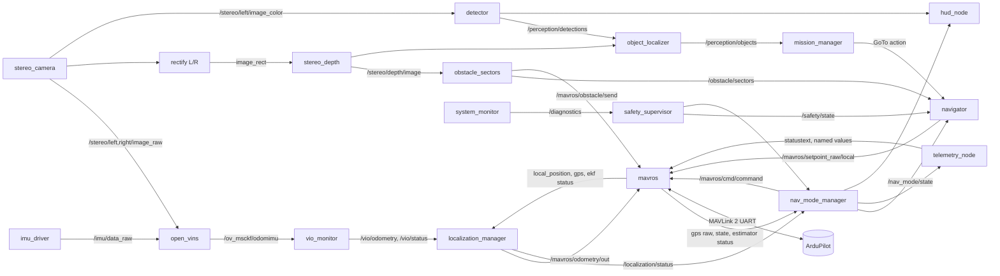

# ROS 2 Architecture

| Field | Value |
|---|---|
| Document ID | GDN-ROS-001 |
| Version | 1.0 |
| Date | 2026-10-05 |
| Status | Baseline |

Companion documents: [package-structure.md](package-structure.md), [node-reference.md](node-reference.md), [interfaces.md](interfaces.md).

## 1. Distribution and environment

| Item | Value |
|---|---|
| Distribution | ROS 2 **Jazzy Jalisco** (LTS; Tier-1 on Ubuntu 24.04 amd64 and arm64) |
| Install | `ros-jazzy-ros-base` on the Pi; `ros-jazzy-desktop` on the workstation |
| RMW | `rmw_fastrtps_cpp` (default) |
| Domain | `ROS_DOMAIN_ID=42` |
| Discovery | Flight: `ROS_AUTOMATIC_DISCOVERY_RANGE=LOCALHOST`. Bench: `SUBNET`, to allow RViz2 on the workstation over Wi-Fi |
| Clock | Hardware: system clock, `use_sim_time=false`. Simulation: `/clock` from Gazebo, `use_sim_time=true` on every node |
| Namespace | None for the single vehicle; all project topics are grouped by prefix (`/stereo`, `/imu`, `/vio`, `/localization`, `/nav_mode`, `/perception`, `/obstacle`, `/navigation`, `/mission`, `/safety`, `/system`) |

Decision rationale, including why not Lyrical Luth on Ubuntu 26.04: [ADR-001](../17-decisions/ADR-001-ros2-distribution.md).

## 2. Workspace architecture

Two overlaid workspaces keep slow-changing third-party code apart from project code.

```text
~/gdn/
├── deps_ws/                  # underlay: built once, rarely rebuilt
│   └── src/
│       ├── libcamera/        # Raspberry Pi fork (meson build, installed to /usr/local)
│       ├── open_vins/        # pinned commit
│       └── ncnn/             # pinned tag (CMake install)
├── ros2_ws/                  # overlay: project packages
│   └── src/
│       └── gdn/              # this repository's ros2 packages
├── fc_config/                # ArduPilot parameter files and Lua scripts
├── system/                   # systemd, udev, config.txt, install scripts
├── documentation/            # this documentation
└── data/                     # bags, logs (separate partition on the Pi)
```

Sourcing order: `/opt/ros/jazzy` → `deps_ws/install` → `ros2_ws/install`.

Binary dependencies from apt: `ros-jazzy-mavros`, `ros-jazzy-mavros-extras`, `ros-jazzy-image-proc`, `ros-jazzy-stereo-image-proc`, `ros-jazzy-vision-msgs`, `ros-jazzy-diagnostic-updater`, `ros-jazzy-diagnostic-aggregator`, `ros-jazzy-robot-state-publisher`, `ros-jazzy-rosbag2-storage-mcap`, `ros-jazzy-rtabmap-ros` (backup), `ros-jazzy-ros-gz` (workstation).

## 3. Graph overview



## 4. Topic, service and action architecture

Complete tables with message types, rates and QoS are in [interfaces.md](interfaces.md). Design rules:

| Rule | Detail |
|---|---|
| Standard messages first | `sensor_msgs`, `nav_msgs`, `geometry_msgs`, `vision_msgs`, `diagnostic_msgs`, `mavros_msgs`. Custom messages only for project-specific status. |
| Custom interfaces in one package | `gdn_interfaces` |
| Topics for streams, services for queries and short commands, actions for anything that takes time and can be cancelled | GoTo and ExecuteMission are actions |
| Every stamped message carries acquisition time, not publication time | Latency is measurable end to end |
| No node subscribes to MAVROS topics it does not need | Keeps the MAVROS plugin list short |
| Names are remappable | Simulation and hardware differ only by launch arguments |

## 5. Quality of Service profiles

| Profile | Reliability | Durability | History | Deadline / liveliness | Used for |
|---|---|---|---|---|---|
| `SENSOR` | Best effort | Volatile | Keep last 5 | — | Images, IMU, depth |
| `ESTIMATE` | Reliable | Volatile | Keep last 10 | Deadline 100 ms on `/vio/odometry` and `/localization/odometry` | Odometry, status at ≥ 10 Hz |
| `STATE` | Reliable | Transient local | Keep last 1 | — | Latched state: `/nav_mode/state`, `/safety/state`, `/mission/state` |
| `COMMAND` | Reliable | Volatile | Keep last 1 | Deadline 100 ms; lifespan 200 ms | Setpoints |
| `EVENT` | Reliable | Volatile | Keep last 50 | — | Transition events, operator messages |
| `HEARTBEAT` | Best effort | Volatile | Keep last 1 | Liveliness automatic, lease 1 s | Node heartbeats |
| `DIAG` | Reliable | Volatile | Keep last 10 | — | `/diagnostics` |

Notes:

- MAVROS publishes most sensor-type topics with sensor-data QoS (best effort). Subscribers must match, or no data flows. This is the most common ROS 2 integration mistake and is checked in the L3 tests.
- Setpoints have a **lifespan**: a stale setpoint is discarded by the middleware instead of being delivered late.
- Deadline-missed callbacks feed the diagnostics, giving rate monitoring without extra code.

## 6. TF tree

Defined in [coordinate-frames.md](../02-system-architecture/coordinate-frames.md). Summary: `map → odom → base_link → {stereo_link → {imu_link, left/right camera → optical}, range_link, flow_link, gps_link}`. One publisher per edge.

## 7. Lifecycle management

Class-A and class-B nodes are managed (lifecycle) nodes.

| State | Meaning in this project |
|---|---|
| Unconfigured | Process running, nothing opened |
| Inactive | Parameters validated, devices opened, calibration loaded, publishers created but silent |
| Active | Processing and publishing |
| Finalized | Devices closed |

A lifecycle manager node (`gdn_bringup`) drives transitions in the order given in [software-architecture.md](../04-software/software-architecture.md) §8 and exposes one service to bring the whole stack up or down. It restarts a node that reports `error` by cycling it through `cleanup → configure → activate`, and reports to the safety supervisor.

| Node | Lifecycle | Activation precondition |
|---|---|---|
| `stereo_camera` | Yes | Both sensors detected; calibration file present |
| `imu_driver` | Yes | Device responds with correct ID |
| `open_vins` | No (third-party) — wrapped by launch respawn and gated by `vio_monitor` | Images and IMU flowing |
| `vio_monitor` | Yes | — |
| `localization_manager` | Yes | MAVROS connected |
| `nav_mode_manager` | Yes | MAVROS connected |
| `stereo_depth`, `obstacle_sectors` | Yes | Calibration loaded |
| `navigator`, `mission_manager` | Yes | `nav_mode_manager` active |
| `detector`, `object_localizer` | Yes | Model file loaded |
| `safety_supervisor` | No — always running | — |
| `mavros` | No (third-party) | Serial device present |

## 8. Launch system

Python launch files in `gdn_bringup/launch/`:

| Launch file | Purpose |
|---|---|
| `gdn.launch.py` | Top level. Arguments: `profile:=sim|bench|flight`, `vio:=openvins|rtabmap|opencv`, `camera:=imx219|oakd|sim`, `ai:=true|false`, `record:=true|false`, `hud:=true|false` |
| `sensors.launch.py` | Camera container, IMU driver, static TF |
| `estimation.launch.py` | VIO (selected implementation), `vio_monitor`, `localization_manager` |
| `perception.launch.py` | Depth, obstacle sectors, detector, object localiser |
| `decision.launch.py` | `nav_mode_manager`, `navigator`, `mission_manager` |
| `fcu.launch.py` | MAVROS with the project plugin allow-list and `fcu_url` (serial on hardware, UDP in SITL) |
| `support.launch.py` | Safety supervisor, telemetry, HUD, system monitor, diagnostics aggregator |
| `record.launch.py` | rosbag2 with the profile's topic list |
| `sim.launch.py` (in `gdn_sim`) | Gazebo world, vehicle model, `ros_gz` bridges, ArduPilot SITL |

Hardware and simulation differ only in `sensors.launch.py` (drivers vs. bridges) and `fcu_url`.

On the Pi a systemd unit `gdn.service` runs `gdn.launch.py profile:=flight` at boot, after the serial and camera devices exist, with `Restart=on-failure`.

## 9. Parameters

- Each node declares all parameters with type, range and description (parameter descriptors). Undeclared parameters are rejected.
- Parameter files per profile in `gdn_bringup/config/<profile>/`.
- Thresholds of the state machine and supervisor are dynamically reconfigurable on the bench and **read-only when armed** (the node rejects changes while `armed` is true).
- Parameter tables per node: [node-reference.md](node-reference.md).

## 10. Diagnostics

| Element | Design |
|---|---|
| Per-node | `diagnostic_updater` with frequency status on main outputs and node-specific values |
| Aggregation | `diagnostic_aggregator` groups: Sensors, Estimation, Perception, FCU link, System |
| System | `system_monitor`: SoC temperature, throttle/under-voltage flags, per-core load, memory, disk free, fan state |
| Consumers | `safety_supervisor` (decisions), `telemetry_node` (summary to GCS), rosbag |
| Levels | OK / WARN / ERROR / STALE, with numeric thresholds as parameters |

Key diagnostic values:

| Source | Values |
|---|---|
| `stereo_camera` | Frame rate, dropped pairs, L/R skew (mean, max), exposure, gain |
| `imu_driver` | Sample rate, max gap, read errors, saturation count |
| `vio_monitor` | Tracked features, covariance trace, output rate, latency, reset count |
| `localization_manager` | Alignment residual, confidence, external-nav rate, time-sync offset |
| `mavros` | Link state, RX/TX drop counters |
| `detector` | Inference time, rate, queue drops |
| `system_monitor` | Temperature, throttled flag, CPU %, RAM, disk |

## 11. Logging

| Mechanism | Use |
|---|---|
| `rcutils` logging to `/rosout` and files | Human-readable events. INFO for transitions, WARN for degraded conditions, ERROR for faults. Throttled logging for anything periodic. |
| Structured events | `gdn_interfaces/msg/Event` on `/events` for every state transition and safety action (FR-062) |
| systemd journal | Process lifecycle, kernel messages |
| ArduPilot dataflash | FC-side truth |

Log directory `~/gdn/data/logs/<date>_<run>/` holds the ROS logs, the bag, a parameter dump and a metadata file.

## 12. rosbag2

| Item | Design |
|---|---|
| Format | MCAP, chunked, with zstd chunk compression for non-image topics |
| Trigger | Starts on arming (or on demand); stops 5 s after disarm |
| Storage | Separate partition; pre-flight check requires > 2 GB free |
| Cache | Raised (≥ 512 MB) to ride out slow writes |

Recording profiles:

| Profile | Topics | Approx. rate | Use |
|---|---|---|---|
| `minimal` | All state, status, odometry, events, diagnostics, MAVROS state; no images | < 0.2 MB/s | Every flight |
| `vio_dataset` | `minimal` + raw L/R images at 20 Hz + IMU | ≈ 12.5 MB/s | Calibration, VIO development (needs fast storage) |
| `perception` | `minimal` + left image compressed (JPEG) at 5 Hz + depth at 2 Hz + detections | ≈ 1 MB/s | AI evaluation |
| `full` | Everything | > 15 MB/s | Bench only |

Recorded `vio_dataset` bags are the regression test data for VIO: any estimator or parameter change is replayed against them (testing level L3/L4).

## 13. Timing and synchronisation

| Clock relation | Mechanism |
|---|---|
| Camera ↔ IMU | Same Pi monotonic clock; residual offset estimated online by OpenVINS |
| Left ↔ right image | libcamera software sync; identical header stamp per pair; skew published |
| Pi ↔ FC | MAVLink `TIMESYNC` / `SYSTEM_TIME` handled by MAVROS; `VISO_DELAY_MS` on the FC accounts for processing latency |
| Pi wall clock | No network in flight. The RTC (with battery) keeps time; optionally set from GNSS time via MAVROS `SYSTEM_TIME` at boot. Bag names use wall time; all processing uses monotonic-derived ROS time. |
| Simulation | `/clock` from Gazebo for all nodes; SITL locked to the simulator step |

## 14. Security posture

Research prototype on an isolated link: SROS 2 is not enabled. DDS is confined to localhost in flight; Wi-Fi is off. SSH uses key authentication. MAVLink signing on the FC ↔ GCS link is optional and left off initially to avoid configuration problems; recorded as a known limitation.
