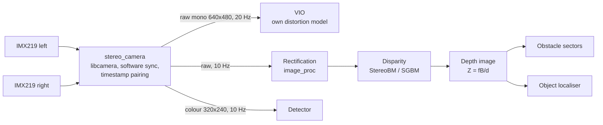
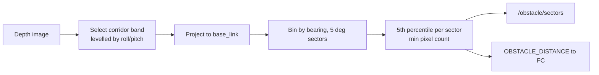

# Stereo Vision Pipeline (Classical Computer Vision)

| Field | Value |
|---|---|
| Document ID | GDN-CV-001 |
| Version | 1.0 |
| Date | 2026-10-05 |
| Status | Baseline |

This document covers the geometric, non-learned image processing: capture, synchronisation, rectification, disparity, depth and obstacle extraction. Neural-network perception is in [08-ai](../08-ai/ai-architecture.md).

## 1. Pipeline

Two consumers use the images differently:

| Consumer | Input | Why |
|---|---|---|
| VIO | **Raw** images + intrinsics/distortion | VIO models distortion itself and needs un-resampled pixels for accurate feature tracks |
| Depth | **Rectified** images | Block matching requires row-aligned epipolar lines |

## 2. Capture

| Aspect | Design |
|---|---|
| Sensor mode | 1640×1232 binned, full FOV |
| ISP output | Main stream 640×480 YUV (luma used); low-resolution colour stream 320×240 from the left camera |
| Frame rate | 20 Hz, fixed frame duration |
| Exposure | Fixed, short (≤ 4 ms outdoors). A slow outer loop (≤ 1 change per second, both cameras together) adjusts analogue gain to hold mean luma in a target band. Both cameras always share identical exposure and gain. |
| Lens shading / colour | Default tuning file; no effect on luma-only processing |
| Buffers | Zero-copy from libcamera to the ROS message where possible (dmabuf mapping), one copy otherwise |

### 2.1 Synchronisation procedure

1. Start both cameras with identical controls and fixed `FrameDurationLimits`.
2. Enable libcamera software sync: left = server, right = client.
3. Wait until the client reports lock.
4. For each completed left request, find the right request whose `SensorTimestamp` is nearest. Accept if |Δ| ≤ `max_skew_ms`.
5. Publish both with the left stamp (mid-exposure). Publish Δ in `StereoSyncStatus`.
6. Unmatched frames are dropped and counted.

Acceptance: NFR-002 (≤ 1 ms for ≥ 99 % of pairs). The measurement itself is the first deliverable of the camera phase, because the result determines whether the camera stays ([stereo-camera.md](../03-hardware/stereo-camera.md) §9).

### 2.2 Independent sync verification

Timestamps can agree while the exposures do not. Two physical checks:

| Test | Method | Reading |
|---|---|---|
| LED strobe | Point both cameras at an LED blinking at a known high rate (or a running millisecond counter display) | Both images of a pair must show the same LED state/counter value |
| Fast horizontal pan | Pan across a vertical edge at a known rate | Apparent disparity change of the edge versus the static value gives the effective skew: `Δt = Δd / (f·ω)` |

## 3. Rectification

- Inputs: intrinsics (K, D) for each camera and the stereo extrinsic (R, T) from calibration.
- Rectification rotations R1, R2 and projections P1, P2 computed once (`cv::stereoRectify`, zero disparity at infinity, alpha = 0 to crop to valid pixels) and stored in the `camera_info` YAML files.
- Run time: `image_proc` remaps with precomputed maps (bilinear).
- Check: features on the same scene point lie on the same row in both rectified images within ± 0.5 px. Verified with a checkerboard at three distances after every calibration.

## 4. Disparity

| Parameter | BM (default) | SGBM (option) |
|---|---|---|
| Algorithm | Local block matching, SAD | Semi-global matching, 3-way |
| Cost on Pi 5 at 640×480 | Low: expected to hold 10 Hz with margin `[ESTIMATE]` | Several times higher; may need half resolution to hold 10 Hz `[ESTIMATE]` |
| Quality | Noisy on low texture; holes | Denser, smoother, better on weak texture |
| `numDisparities` | 64 (min range 0.40 m) | 64 |
| Block size | 15 | 5–7 |
| Pre-filter | X-Sobel, cap 31 | — |
| Uniqueness ratio | 10 | 10 |
| Speckle window / range | 100 / 2 | 100 / 2 |
| Sub-pixel | 1/16 px (built in) | 1/16 px |

Decision: start with BM because obstacle detection needs a conservative "nearest thing in a sector" value, not a dense map. Benchmark both in the stereo phase; choose by measured rate and by the depth-error test.

Disparity is computed at 10 Hz, not 20 Hz: obstacle sensing at ≤ 2 m/s does not need more, and the saved CPU goes to VIO.

## 5. Depth

`Z = f·B / d` using f and B from the rectified projection matrices (not nominal values).

| Rule | Detail |
|---|---|
| Invalid disparity (≤ 0, filtered) | NaN |
| Z < `min_depth` or > `max_depth` | NaN |
| Output | 32-bit float metres, registered to the left rectified image |
| Uncertainty model | σ_Z = Z² / (f·B) · σ_d with σ_d = 0.3 px (to be fitted from the depth-error test); used by the object localiser |

Expected accuracy table: [stereo-camera.md](../03-hardware/stereo-camera.md) §4.

## 6. Obstacle extraction

Implemented by `obstacle_sectors` ([node-reference.md](../05-ros2/node-reference.md) §5).

| Design choice | Reason |
|---|---|
| Percentile instead of minimum | A single wrong pixel must not stop the vehicle; a real obstacle occupies many pixels |
| Minimum pixel count | Rejects speckle; sets the smallest detectable object (≈ 30 px ≈ a 10 cm object at 2 m) |
| Corridor band instead of full image | Ground and sky are not obstacles in level flight; the band covers the volume the vehicle will sweep |
| Unknown ≠ clear | A sector with too little valid depth is reported unknown; the navigator slows or holds |
| Range limited to 0.5–6 m | Outside this the measurement is not trustworthy |

Known blind spots, to be stated in the report: thin wires and branches, glass, uniform walls, anything outside the 73° × 50° FOV, anything approaching from the side or rear, and all obstacles in low light.

## 7. Latency budget (capture → obstacle message leaving the Pi)

| Stage | Budget |
|---|---|
| Exposure midpoint → frame available in user space | 30 ms |
| Rectification (2 images) | 10 ms |
| Disparity (BM) | 40 ms |
| Depth + sectors | 10 ms |
| MAVROS serialisation and UART | 10 ms |
| **Total** | **100 ms** (requirement NFR-010: ≤ 200 ms) |

All values `[ESTIMATE]`; measured with stamped messages in the stereo phase.

## 8. Classical CV vs. AI — division of labour

| Task | Method | Why |
|---|---|---|
| Distortion, rectification | Classical (calibrated geometry) | Exact, cheap |
| Feature tracking for VIO | Classical (FAST + KLT inside OpenVINS) | Real-time on CPU; learned features are too slow here |
| Depth | Classical stereo matching | Metric by construction; learned stereo is not real-time on this CPU |
| Obstacle distance | Classical (depth statistics) | Deterministic, explainable, testable |
| "What is it?" | **AI** (object detector) | Semantic classification is what neural networks are for |
| Object range | Classical depth sampled inside the AI box | Metric range without a learned depth model |

## 9. Verification

| Test | Level | Pass criterion |
|---|---|---|
| Frame rate and drops | L2 | NFR-001 |
| L/R skew (timestamps and LED/pan test) | L2 | NFR-002 |
| Rectification row alignment | L2 | ≤ 0.5 px |
| Depth error at 1, 2, 3, 5 m (flat textured target) | L2 | NFR-008 |
| Depth while yawing at 30 °/s | L2 | Error increase ≤ 2× static |
| Obstacle sector on a 0.3 m wide post at 2, 3, 4 m | L2/L7 | Detected in the correct sector, range within 10 % |
| Texture-less wall | L2 | Reported unknown, not clear |
| Latency | L3 | NFR-010 |
