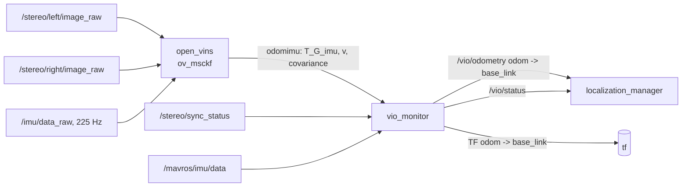

# VIO Design

| Field | Value |
|---|---|
| Document ID | GDN-VIO-002 |
| Version | 1.0 |
| Date | 2026-10-05 |
| Status | Baseline |
| Requirements | FR-020, FR-021, FR-026; NFR-003, NFR-004, NFR-005 |

> **DB-2.0 note.** Stereo VIO is now the odometry for the **low regime** (below about 12 m) only. Above that, `ground_vo` supplies odometry and `map_matcher` supplies absolute fixes ([visual-geolocalization.md](../09-navigation/visual-geolocalization.md)). `vio_monitor` selects the source by height. The stereo VIO nodes are deactivated in the cruise regime. Priority of this subsystem: Should.

## 1. Architecture



`vio_monitor` isolates the rest of the system from the estimator. Replacing OpenVINS by the backup or the simplified VO changes one remapping.

## 2. Estimator summary

| Item | Value |
|---|---|
| Algorithm | Multi-State Constraint Kalman Filter (MSCKF), optionally with a small number of SLAM features kept in the state |
| State | IMU pose, velocity, gyro bias, accel bias; a sliding window of cloned past IMU poses; calibration states (camera–IMU extrinsics, time offset; intrinsics optional); optional landmark states |
| Prediction | IMU integration at IMU rate |
| Update | Stereo feature tracks (KLT) from both cameras at camera rate |
| Output | Pose of the IMU frame in a gravity-aligned global frame; velocity; 6×6 pose covariance |
| Unobservable | Global position and yaw (4 DoF) — these drift |

## 3. Inputs

| Input | Requirement | Provided by |
|---|---|---|
| Stereo pair | Same timestamp; 640×480 mono; 20 Hz; short exposure | `stereo_camera` |
| IMU | ≥ 200 Hz; same clock; gyro + accel | `imu_driver` |
| Calibration | Intrinsics, stereo extrinsics, camera–IMU extrinsics, initial t_d, IMU noise | [calibration.md](../06-computer-vision/calibration.md) |

## 4. Initial configuration (starting point for tuning)

| Parameter group | Setting | Reason |
|---|---|---|
| Cameras | `max_cameras: 2`, `use_stereo: true` | Stereo gives metric scale immediately and helps initialisation |
| Tracking | KLT; `num_pts: 150–200`; FAST threshold ≈ 20; grid 5×5 (per image); `knn_ratio` default; histogram equalisation on | CPU budget; even feature spread |
| Image scale | `downsample_cameras: false` (input is already 640×480) | — |
| Window | `max_clones: 11` | Default; reduce to 8 if CPU-limited |
| SLAM features | `max_slam: 25–50`, `max_slam_in_update: 25` | A few persistent features reduce hover drift; more costs CPU |
| MSCKF features in update | `max_msckf_in_update: 40` | Bounds update cost |
| Online calibration | `calib_cam_timeoffset: true`; `calib_cam_extrinsics: true`; `calib_cam_intrinsics: false` initially | Time offset has no hardware guarantee; extrinsics refine small errors; intrinsics held fixed to avoid absorbing rolling-shutter error into intrinsics |
| Initialisation | Static initialisation (`init_window_time ≈ 2 s`, `init_imu_thresh` tuned so that picking the vehicle up triggers it); dynamic initialisation enabled as fallback if the pinned version supports it | Take-off from rest is the normal case |
| Zero-velocity update | `try_zupt: true` with conservative thresholds, disparity-based | Stops drift on the ground before take-off; must not trigger in hover (verify) |
| Noise | IMU noise from Allan variance × 5–10; pixel noise `up_msckf_sigma_px: 1.5–2.0` (above the default 1.0) | Inflated to absorb rolling-shutter and sync error |
| Outlier rejection | Chi-square multiplier default; RANSAC on tracks | — |
| Threads | `num_opencv_threads: 2`; `use_multi_threading_pubs/subs` as available | Leave cores for other nodes |
| Outputs | Publish odometry at camera rate; TF publishing off | `vio_monitor` owns TF |

Parameter names follow the OpenVINS estimator configuration; confirm against the pinned commit.

Raising the assumed pixel noise is the standard, honest way to use a rolling-shutter camera with an estimator that assumes global shutter: the filter trusts vision less and the IMU more. It costs accuracy but keeps the filter consistent.

## 5. Operating envelope for VIO

| Limit | Value | Enforced by |
|---|---|---|
| Linear speed | ≤ 2 m/s | Navigator speed limit |
| Yaw rate | ≤ 45 °/s | ArduPilot `ATC_RATE_Y_MAX` / navigator yaw-rate limit in GUIDED |
| Tilt | ≤ 20° | ArduPilot `ANGLE_MAX` for test configuration |
| Height | 1–10 m AGL (above ≈ 12 m the odometry source switches to ground VO) | Navigator altitude limits; `vio_monitor` |
| Scene | ≥ 50 tracked features | `vio_monitor` health |
| Light | Exposure ≤ 8 ms with gain ≤ limit | Camera driver reports; pre-flight check |
| Start | Stationary on textured ground for ≥ 5 s | Pre-flight procedure |

## 6. Health monitoring (`vio_monitor`)

| Signal | Source | DEGRADED when | LOST when |
|---|---|---|---|
| Output rate | Message arrival | < 15 Hz for 1 s | Gap > 0.5 s |
| Latency | now − stamp | > 100 ms | > 250 ms |
| Position covariance trace | Odometry covariance | > 0.25 m² | > 1.0 m² |
| Pose step | Consecutive outputs | — | > 0.5 m or > 20° in one step |
| Implied speed | Twist | > 3 m/s | > 5 m/s |
| Attitude agreement | Roll/pitch vs FC AHRS | > 3° | > 8° for 1 s |
| Yaw-rate agreement | VIO vs FC gyro | > 10 °/s difference | > 30 °/s for 1 s |
| Vertical-rate agreement | VIO v_z vs FC baro-derived climb rate | > 0.5 m/s | > 1.5 m/s for 1 s |
| Stereo sync | `sync_status` | `synchronized` false | Pairs dropped > 20 % |
| Feature count (if exposed by the estimator) | Track topic | < 50 | < 15 for 1 s |

The cross-checks against FC attitude, gyro and barometer are important: they are independent of the camera and catch a diverging filter that still reports a small covariance.

Reset handling: any LOST → `reset_counter` increments when VIO next initialises; `localization_manager` withholds the external-nav stream until re-aligned (state machine T16).

## 7. Timing

| Stage | Budget |
|---|---|
| Mid-exposure → image message published | 25–35 ms |
| Feature tracking (stereo, 200 points) | 10–15 ms |
| Filter update | 5–15 ms |
| `vio_monitor` + `localization_manager` | 2 ms |
| MAVROS + UART | 5–10 ms |
| **Total** | **≈ 50–80 ms** (NFR-004: ≤ 80 ms at the 95th percentile) |

`[ESTIMATE]`. The measured total sets `VISO_DELAY_MS` on the FC.

## 8. Backup: RTAB-Map stereo odometry

| Item | Design |
|---|---|
| Node | `rtabmap_odom/stereo_odometry` |
| Inputs | Rectified left/right images and `camera_info` at 10–20 Hz |
| IMU | Not used in the baseline backup (optionally FC attitude as a gravity guess) |
| Key settings | Frame-to-frame strategy; feature type GFTT/FAST; max features ≈ 400; image decimation if needed; "reset on lost" disabled (the monitor decides) |
| Output | `nav_msgs/Odometry` of the camera/base → remapped into `vio_monitor` |
| Covariance | RTAB-Map provides a covariance estimate; `vio_monitor` applies a floor |
| FC configuration | Same source set 2. Because the FC EKF now supplies all inertial smoothing, `VISO_DELAY_MS` and the external-nav noise parameters (`VISO_POS_M_NSE`, `VISO_VEL_M_NSE`) need retuning. |
| Envelope | Tighter: ≤ 1 m/s, ≤ 30 °/s |

## 9. Simplified: OpenCV stereo VO

Algorithm outline (conceptual, for the implementer):

```text
for each rectified stereo pair k:
    if tracked_points < N_min:
        detect corners in left_k (grid-bucketed)
    match each corner left_k -> right_k along the same row (KLT, 1-D), keep if disparity in range
    triangulate -> 3D points P_k in the left camera frame
    track corners left_k -> left_{k+1} (KLT, forward-backward check)
    solve PnP + RANSAC: 3D points P_k  <->  2D points in left_{k+1}  => T_{k+1,k}
    reject if inliers < N_inl or motion implausible
    accumulate pose; publish odometry
```

Purpose and limits: [vio-slam-evaluation.md](vio-slam-evaluation.md) §2.2.

## 10. Development sequence

| Step | Output |
|---|---|
| 1. Run OpenVINS on EuRoC on the workstation, then on the Pi 5 | Build verified; CPU baseline |
| 2. Record own static and handheld bags | `vio_dataset` regression set |
| 3. Calibrate (C1–C4) | Calibration set |
| 4. Run OpenVINS on own bags, off-line | First drift numbers; parameter tuning |
| 5. Run live, handheld | Latency, CPU, health signals |
| 6. Implement `vio_monitor`; verify frames with bench checks CF-1…CF-8 | Correct `odom → base_link` |
| 7. Run the simplified VO and RTAB-Map odometry on the same bags | Comparison table |
| 8. Vibration test on the vehicle | Gate G2 decision |

## 11. Open points

| # | Item |
|---|---|
| VIO-1 | Does the pinned OpenVINS version expose tracked-feature counts on a topic, or must `vio_monitor` infer health from covariance and cross-checks only? |
| VIO-2 | Does the pinned version offer any rolling-shutter readout modelling? If yes, enable and compare. |
| VIO-3 | Measured residual L/R skew with libcamera software sync |
| VIO-4 | Measured IMU timestamp jitter in polling vs interrupt mode |
| VIO-5 | Whether ZUPT falsely triggers in a steady hover |
