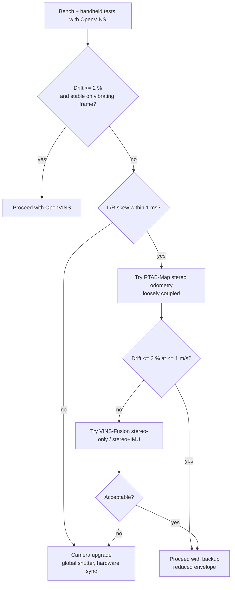

# VIO / SLAM Technology Evaluation

| Field | Value |
|---|---|
| Document ID | GDN-VIO-001 |
| Version | 1.0 |
| Date | 2026-10-05 |
| Decisions | [ADR-004](../17-decisions/ADR-004-vio-solution.md), [ADR-005](../17-decisions/ADR-005-slam-solution.md) |

> **DB-2.0 note.** This evaluation selects the **relative odometry for the low regime**. The primary GPS-denied position source is now satellite image matching ([ADR-015](../17-decisions/ADR-015-visual-geolocalization.md)); the gate referred to below as G2 is now G2b.

## 1. What is being selected

A software component that takes stereo images and inertial data on a Raspberry Pi 5 and outputs 6-DoF pose and velocity at ≥ 20 Hz, accurate enough for the flight controller's EKF to hold position at low speed.

Selection criteria, in priority order:

1. Runs in real time on four A76 cores **alongside** depth and a detector.
2. Tolerates this camera: rolling shutter, software-synchronised stereo, IMU without hardware trigger.
3. Works with ROS 2 Jazzy without a porting project.
4. Fails detectably (covariance, feature counts) so that the state machine can react.
5. Can be understood, configured and explained by a student team.

Loop closure and global maps are **not** criteria: flights are minutes long and tens of metres in extent, and the FC needs smooth odometry, not a globally consistent map ([ADR-005](../17-decisions/ADR-005-slam-solution.md)).

## 2. Candidates

### 2.1 Comparison table

| Technology | Type | Stereo | IMU | ROS 2 | Pi 5 | Compute | Complexity | Recommendation |
|---|---|---|---|---|---|---|---|---|
| **OpenVINS** | Filter-based VIO (MSCKF) | Yes (synchronised pair expected) | Yes, tightly coupled; online calibration of extrinsics, intrinsics and camera–IMU time offset | Yes — ROS 1 and ROS 2 in the main repository; Jazzy / Ubuntu 24.04 fixes contributed | Feasible; mostly single-threaded estimator plus tracking threads | Low–medium | Medium: many parameters, excellent documentation | **Primary** |
| **VINS-Fusion** | Optimisation-based VIO (sliding window, Ceres) | Yes | Optional (stereo-only, stereo+IMU, mono+IMU); online time-offset estimation; optional GNSS fusion | Unofficial community ports only (several Jazzy forks) | Feasible: a published comparison reports ≈ 36 ms per frame on a Pi 5 on EuRoC | Medium–high (non-linear optimisation) | Medium–high; port maintenance risk | Alternative if OpenVINS fails on this sensor |
| **ORB-SLAM3** | Feature-based SLAM with map, loop closure, multi-map | Yes | Yes (stereo-inertial) | No maintained official wrapper; community wrappers | Heavy: tracking, local mapping and loop closing threads; initialisation of the inertial mode is fragile | High | High; GPLv3; difficult to tune and to debug | **Not recommended** |
| **RTAB-Map** | Graph SLAM with a separate odometry front end | Yes (stereo odometry node) | Loosely: IMU only as gravity/orientation aid | Yes — binary packages for Jazzy | Odometry alone is feasible at reduced resolution; full mapping is heavy (≈ 7 Hz odometry reported on a Jetson Nano with mapping settings) | Medium (odometry) / High (SLAM) | Low to start (works from apt), many parameters later | **Backup** (odometry only); optional offline mapping |
| **OpenCV stereo VO** (custom) | Frame-to-frame stereo PnP | Yes | No | Native (own node) | Light | Low | Low to write, hard to make robust | **Simplified implementation** (learning, validation, bench fallback) |
| Basalt | Optimisation-based VIO | Yes | Yes | Community wrappers | Known to be efficient | Low–medium | Medium; smaller community | Not evaluated further; candidate for future work |
| Kimera-VIO | VIO + mesh | Yes | Yes | ROS 1 centric | Heavier | Medium–high | High | Rejected |
| SVO Pro | Semi-direct VO/VIO | Yes | Yes | ROS 1 | Efficient | Low | Medium | Rejected (ROS 1) |

### 2.2 Notes per candidate

**OpenVINS.** An MSCKF keeps a sliding window of past IMU poses and uses feature tracks to constrain them without keeping the features in the state. Cost grows with the window, not with the map, which is why it suits a small CPU. Its online estimation of the camera–IMU time offset directly addresses the lack of a hardware trigger. It publishes covariance, which the confidence metric needs. It expects simultaneous stereo images and global-shutter geometry; neither is guaranteed here, which is the main risk.

**VINS-Fusion.** Robust and widely flown. Optimisation gives somewhat better accuracy than a filter at higher CPU cost. The official code is ROS 1; using it means depending on a community port. It can run stereo-only (no IMU), which is a useful diagnostic mode when IMU timing is suspect.

**ORB-SLAM3.** The most capable system on paper and the wrong choice here: it is the heaviest, has no official ROS 2 support, and its stereo-inertial mode depends on precisely the properties this camera lacks. Choosing it would be choosing the most impressive name.

**RTAB-Map.** Its stereo odometry (frame-to-frame or frame-to-map, visual only) does not need tight IMU timing at all, because inertial fusion then happens in the FC's EKF3. That makes it the natural backup if the weak point turns out to be camera–IMU timing. Without an IMU in the loop it is more vulnerable to motion blur and fast rotation. Available as a Jazzy binary, so trying it costs little.

**OpenCV stereo VO.** Around three hundred lines: detect, stereo-match, track, PnP with RANSAC. It will drift faster and fail sooner than any of the above. Its value is educational, and as an independent check that calibration and frame conventions are right before a complex estimator hides the errors.

## 3. Sensor-related risk per candidate

| Property of our camera | OpenVINS | VINS-Fusion | RTAB-Map stereo odom | OpenCV VO |
|---|---|---|---|---|
| No hardware L/R sync (software sync, residual skew) | Sensitive (assumes simultaneous) | Sensitive | Sensitive | Sensitive |
| Rolling shutter | Unmodelled bias under rotation `[VERIFY whether the pinned version models readout time]` | Unmodelled in the stereo pipeline `[VERIFY]` | Unmodelled | Unmodelled |
| Camera–IMU time offset, no trigger | Estimated online | Estimated online | **Not applicable** (no IMU coupling) | Not applicable |
| IMU timestamp jitter (I²C polling) | Degrades | Degrades | **No effect** | No effect |
| Low texture / blur | Fails; IMU bridges short gaps | Fails; IMU bridges short gaps | Fails immediately | Fails immediately |

All stereo methods need L/R sync. The difference lies in IMU dependence: the tightly coupled methods gain robustness from the IMU when timing is good and lose accuracy when it is bad.

## 4. Selection

### Primary solution — OpenVINS (stereo + IMU)

Chosen because it is the lightest tightly coupled option with first-party ROS 2 support, online time-offset calibration and covariance output. Design: [vio-design.md](vio-design.md).

### Backup solution — RTAB-Map stereo odometry, loosely coupled

Visual-only odometry from the `rtabmap_odom` stereo odometry node feeds the same `vio_monitor`; the FC EKF3 provides the inertial fusion. Selected by launch argument `vio:=rtabmap`. Used if gate G2 shows that OpenVINS is limited by IMU timing rather than by image quality.

### Simplified implementation — OpenCV stereo visual odometry

The `stereo_vo` node. Built early (it needs only calibrated stereo) to validate the pipeline and coordinate frames. Not intended for flight.

### Decision flow at gate G2

## 5. SLAM

No SLAM runs in the flight loop.

| Reason | Detail |
|---|---|
| The FC needs smooth odometry | Loop-closure corrections are discontinuities; feeding them to an EKF as position measurements causes jumps |
| Mission scale | Minutes and tens of metres: drift at 1–2 % is acceptable without loop closure |
| CPU | Mapping and loop detection would take the budget reserved for depth and AI |
| Scope | Robust VIO plus a clean GNSS transition is already a full project |

RTAB-Map may be run **off-board on recorded bags** to produce a 3D map for the report and to estimate drift by loop closure. This is an analysis tool, not part of the vehicle.

## 6. Expected accuracy (literature-level, not our measurement)

| Condition | Typical drift reported for stereo VIO with good sensors | Expectation with this camera |
|---|---|---|
| Slow, textured, well lit | ≈ 0.5–1 % of distance | 1–3 % `[ESTIMATE]` |
| Moderate rotation | ≈ 1 % | Noticeably worse; rolling shutter |
| Hover | Centimetre-level stability | 5–20 cm wander `[ESTIMATE]` |
| Low texture, low light, fast motion | Failure | Failure |

These expectations become TARGET values in [performance-requirements.md](../14-performance/performance-requirements.md) and are replaced by measurements.

## 7. Evaluation method

| Step | Data | Metric |
|---|---|---|
| Public benchmark sanity check | EuRoC MAV sequences replayed on the Pi 5 | CPU load, real-time factor, ATE — confirms the build and settings before using our own sensor |
| Own handheld sequences | `vio_dataset` bags, closed loops of ≈ 30 m | End-point error as % of path length |
| Outdoor with GNSS reference | Shadow-mode VIO during GNSS flight | ATE after 4-DoF alignment (`evo`), drift per metre |
| Vibration | Vehicle on the ground or tethered, motors running | Stationary drift, IMU noise increase |
| Stress | Yaw-rate sweep, speed sweep, low-texture pass | The rate/speed at which tracking fails: defines the operating envelope |

The same bags are replayed through the primary, backup and simplified estimators. That comparison on low-cost unsynchronised hardware is one of the project's reportable results.
