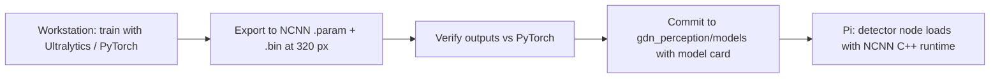

# AI Architecture

| Field | Value |
|---|---|
| Document ID | GDN-AI-001 |
| Version | 1.0 |
| Date | 2026-10-05 |
| Decision | [ADR-006](../17-decisions/ADR-006-ai-framework.md) |
| Requirements | FR-032 – FR-035; NFR-009 |

## 1. Where AI belongs in this system

| Function | Technique | AI? |
|---|---|---|
| Staying airborne, attitude, position control | ArduPilot control loops | No |
| Localisation | Geometric VIO (MSCKF) | No |
| Depth | Geometric stereo matching | No |
| Obstacle distance | Statistics on the depth image | No |
| GNSS health classification | Thresholds with hysteresis | No |
| **Recognising what an object is** | **Convolutional neural-network detector** | **Yes** |
| Object range and position | Detector box + geometric depth | Hybrid |
| Mission reactions to objects ("hold if a person is within 5 m") | Rules on detector output | Rule-based, AI-informed |

The "AI" in "AI-integrated" is semantic perception. It is deliberately kept out of everything that keeps the vehicle stable or localised (FR-035). Two reasons:

1. **Safety and verifiability.** A geometric pipeline has predictable failure modes; a neural network can be confidently wrong.
2. **Compute.** The Pi 5 can afford one small network at a few hertz. It cannot afford learned depth or learned odometry.

Claiming that a neural network navigates the drone would be inaccurate. The accurate statement is: *classical geometry localises and avoids; a neural network adds object-level understanding that mission logic can use.*

### DB-2.0 note

AI vision is unchanged: the detector, its model, its runtime and the depth fusion are as specified here. Two points follow from the new flight profile:

| Point | Detail |
|---|---|
| Where detection is useful | The forward stereo view detects people to about 10–12 m and ranges them to about 6–8 m. That serves the **low regime**. At the 50 m cruise height, ground objects are far outside these ranges; the detector keeps running but will report little. The demonstration therefore shows AI detection during the low-altitude part of the flight |
| Second, optional use of learning | A lightweight learned feature matcher (XFeat) is evaluated against SIFT for satellite matching ([visual-geolocalization.md](../09-navigation/visual-geolocalization.md) §5.1). If adopted it becomes part of localisation, guarded by the same geometric checks and gates as the classical matcher. The table in §1 then gains a row: "Image-to-map matching — learned features inside a geometric pipeline — Hybrid" |
| Open option (OD-13) | Running the detector on the **downward** camera at cruise height, with an aerial-viewpoint model, to detect vehicles or people from above. Not in the baseline |

### DB-3.0 note: a second model for the view from above

Grid search and follow ([search-track-follow.md](../09-navigation/search-track-follow.md)) run detection on the **downward** camera. OD-13 is therefore decided: yes, in the search profile.

| | Ground-view model (unchanged) | Aerial-view model (new) |
|---|---|---|
| Camera | Forward stereo, left image | Downward camera |
| Flight profile | Low (1–10 m) | Search (25–30 m) |
| Model | YOLO26n, NCNN | YOLO26n, NCNN, fine-tuned on aerial images |
| Input | 320 px, whole frame | 640 px tiles cut from a 1920×1080 frame (6 tiles with overlap) |
| Rate | 5 Hz | ≈ 1 full frame per second `[ESTIMATE]` |
| Object distance / position | Stereo depth | Projection of the pixel onto the ground → latitude, longitude |
| Classes | person, vehicle (side view) | person, vehicle (top view) |

Only one model runs at a time; `nav_mode_manager` selects it by profile, so the CPU budget holds.

Why a separate model: people and vehicles look entirely different from above, and they are small. A model trained on ground-level pictures performs poorly on them. Training uses public aerial data for pre-training and the team's own downward images for fine-tuning and for honest evaluation.

Expected performance is the weak point: a standing person from 25–30 m is about 13–16 pixels across at 1080p. Recall will be limited, and is reported as measured ([performance-requirements.md](../14-performance/performance-requirements.md) P-105). The detector marks candidates for a human to check; it does not certify an area as empty.

Tracking and following use the detector's output with a Kalman filter in ground coordinates. No learned tracker or person re-identification is used.

## 2. Role of the detector

| Use | Description | Priority |
|---|---|---|
| Object awareness | Report class, bearing and range of objects in view to the operator (HUD, telemetry) | Must |
| Safety distance to people | If a person is detected within a configured range ahead, the mission holds | Should |
| Target localisation | Estimate the map position of a designated object class (for example a marker or vehicle) and log it | Should |
| Mission trigger | `WAIT_OBJECT` step: continue when a class is seen | Could |
| Landing-pad detection | Detect a custom landing marker for a visual approach | Could (stretch) |

## 3. Runtime benchmark evidence

Published benchmark by Ultralytics on Raspberry Pi 5, YOLO26n, 640 px input, FP32 (Ultralytics 8.4.x):

| Format | Model size | mAP50-95 (COCO) | Inference per image |
|---|---|---|---|
| PyTorch | 5.3 MB | 0.476 | 299 ms |
| TorchScript | 9.8 MB | 0.473 | 353 ms |
| ONNX Runtime | 9.5 MB | 0.473 | 126 ms |
| OpenVINO | 9.6 MB | 0.473 | 105 ms |
| LiteRT (TFLite) | 9.8 MB | 0.473 | 123 ms |
| MNN | 9.4 MB | 0.475 | 92 ms |
| **NCNN** | 9.4 MB | 0.478 | **67 ms** |

Status of these numbers: **vendor-measured, on an otherwise idle Pi 5, using all cores**. They are not our measurements, and our Pi will be sharing its cores with VIO and stereo.

Consequences:

- NCNN is the runtime.
- At 640 px the detector alone would use ≈ 67 ms of all four cores per frame. At 15 Hz that is the entire CPU. Not acceptable.
- Inference cost scales roughly with pixel count. At 320 px (¼ of the pixels) the expectation is ≈ 20–25 ms on four idle cores, or ≈ 35–60 ms on two shared cores `[ESTIMATE]`. At 5 Hz this is 20–30 % of one core-pair: affordable.

## 4. Model selection

| Model | Parameters | COCO mAP50-95 at 640 | Pi 5 speed evidence | Notes | Verdict |
|---|---|---|---|---|---|
| **YOLO26n** | ≈ 2.4 M `[VERIFY]` | ≈ 0.40 (0.476 in the vendor's Pi benchmark subset) | 67 ms at 640, NCNN | Current Ultralytics nano model; NMS-free end-to-end head, designed for edge deployment and simpler export | **Selected** |
| YOLO11n | ≈ 2.6 M | ≈ 0.39 | Similar class | Previous generation; widely used; needs NMS | **Fallback** if YOLO26 export to NCNN shows operator problems |
| YOLOv8n | ≈ 3.2 M | ≈ 0.37 | Similar class | Older; very well documented | Second fallback |
| YOLO26s / YOLO11s | ≈ 9–10 M | Higher | ≈ 3× slower | Too slow alongside VIO | Rejected |
| MobileNet-SSD (v2/v3) | ≈ 4–6 M | ≈ 0.22 | Fast with TFLite | Clearly lower accuracy, especially on small objects | Rejected; comparison baseline only |
| NanoDet-Plus | ≈ 1.2 M | ≈ 0.27–0.30 | Very fast in NCNN | Apache-2.0 licence: the alternative if AGPL becomes a problem | Licence fallback |
| EfficientDet-Lite0 | ≈ 3 M | ≈ 0.26 | Moderate | TFLite-centric | Rejected |
| Any medium/large model, transformers, VLMs | — | — | Not real-time | — | Rejected |

Accuracy figures other than the benchmark table are approximate published values `[VERIFY]` and are for ranking only.

## 5. Selected configuration

| Item | Value |
|---|---|
| Model | YOLO26n |
| Weights | COCO-pretrained for first integration; fine-tuned for the project class set |
| Input | 320 × 320, letterboxed from the 320 × 240 colour stream |
| Precision | FP32 (INT8 quantisation as an optimisation-phase experiment) |
| Runtime | NCNN, C++ API, NEON, 2 threads |
| Rate | 5 Hz, newest-frame-only |
| Post-processing | None beyond score threshold for the end-to-end head; class allow-list |
| Classes (default) | person, car, truck, motorcycle, bicycle (from COCO) + a custom landing/target marker (after fine-tuning) |

### Performance table

| Metric | TARGET | ESTIMATE | MEASURED | VALIDATED |
|---|---|---|---|---|
| Inference time, 320 px, 2 threads, full stack running | ≤ 80 ms | 35–60 ms | — | — |
| Detection rate | ≥ 5 Hz | 5 Hz (rate-limited) | — | — |
| Capture → detection published | ≤ 150 ms | 90–130 ms | — | — |
| CPU share | ≤ 50 % of one core average | 30–50 % | — | — |
| RAM (process) | ≤ 300 MB | 100–200 MB | — | — |
| Accuracy on project test set (mAP50) | ≥ 0.6 for person at 3–10 m | Unknown | — | — |

### Limitations

| Limitation | Effect |
|---|---|
| 320 px input | Small or distant objects are missed. A person 1.7 m tall at 10 m spans ≈ 37 px at 320×240 (f ≈ 216 px): detectable. At 20 m ≈ 18 px: unreliable. Practical detection range for people ≈ 10–12 m `[ESTIMATE]`. |
| COCO training data | Ground-level viewpoints. From a drone at low altitude looking forward this is acceptable; from above it degrades. Fine-tuning data must match the camera's viewpoint. |
| 5 Hz | Not suitable for tracking fast objects |
| Fixed-focus, rolling-shutter, wide lens | Blur and skew during fast motion reduce recall |
| No night capability | Passive camera |
| False positives/negatives | Mission logic must tolerate both: require N consecutive detections before acting; never treat "no detection" as "no person" for safety |

## 6. Training and data

| Stage | Plan |
|---|---|
| Baseline | Use COCO-pretrained weights unchanged; evaluate on self-recorded footage |
| Data collection | Record the left colour stream during bench and flight tests (`perception` bag profile). Extract frames; target ≥ 500 labelled images per custom class and ≥ 300 images of project-viewpoint people/vehicles. Include negatives (empty scenes). |
| Public data | VisDrone can add aerial viewpoints if needed (check its licence terms for academic use) |
| Labelling | Any standard tool producing YOLO-format labels |
| Split | Train/validation/test by **recording session**, not by frame, to avoid leakage between near-identical frames |
| Training | Off-board (workstation GPU or a free cloud notebook), Ultralytics, transfer learning from the pretrained nano model at `imgsz=320`, standard augmentations plus motion blur |
| Evaluation | mAP50, per-class precision/recall on the held-out test sessions; confusion matrix; range-binned recall (0–5, 5–10, 10–15 m) |
| Export | PyTorch → NCNN at 320 px; verify numerical agreement between PyTorch and NCNN outputs on 50 test images before deployment |
| Model card | `MODEL_CARD.md` beside the model files: data, classes, metrics, known failure cases, licence |

No training happens on the drone. PyTorch is not installed on the Pi.

## 7. Deployment

## 8. Resource protection

| Mechanism | Detail |
|---|---|
| Thread cap | NCNN limited to 2 threads |
| Priority | Detector process at `nice +5`; VIO at default or higher |
| Frame policy | Subscription depth 1; if busy, frames are skipped |
| Load shedding | Supervisor levels: 2 → rate halved; 3 → detector deactivated |
| Independence | Detector failure or absence does not block READY |

## 9. Options for more AI performance (not in the baseline)

| Option | Gain | Cost / risk |
|---|---|---|
| INT8 quantisation in NCNN | Perhaps 1.5–2× faster | Accuracy loss; calibration data; operator support |
| Hailo-8L AI HAT on the PCIe port | Tens of FPS for nano/small YOLO; frees CPU | Purchase; driver and runtime on Ubuntu 24.04 must be proven; occupies the PCIe port (conflicts with NVMe) |
| OAK-D camera upgrade | Runs the network on the camera's own processor | Tied to the camera decision ([ADR-011](../17-decisions/ADR-011-stereo-camera-suitability.md)) |
| Vulkan on VideoCore VII via NCNN | Uncertain | Experimental |

## 10. Verification

| Test | Level | Criterion |
|---|---|---|
| NCNN output equals reference output on fixed images | L1 | Box IoU ≥ 0.95, score difference ≤ 0.02 |
| Inference-time benchmark, idle and with full stack | L2 | Table in §5 |
| Format benchmark (NCNN vs ONNX Runtime vs LiteRT) at 320 px on our Pi | L2 | Reported; confirms the runtime choice with our own data |
| Accuracy on held-out sessions | L2 | Table in §5 |
| VIO drift with and without the detector running | L7 | Drift increase ≤ 10 % |
| Load shedding | L3 | Detector stops at level 3; VIO rate unaffected |
