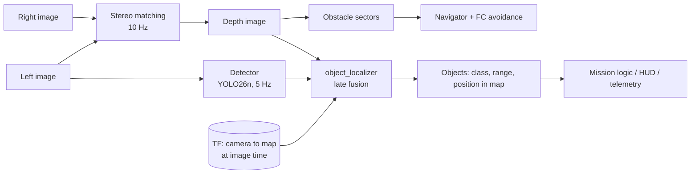
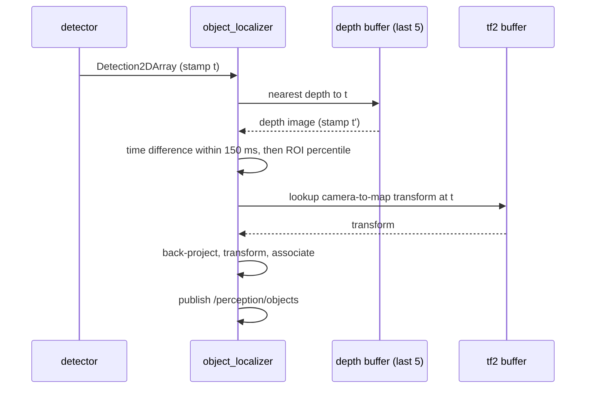

# AI + Stereo Depth Fusion

| Field | Value |
|---|---|
| Document ID | GDN-AI-002 |
| Version | 1.0 |
| Date | 2026-10-05 |
| Decision | [ADR-010](../17-decisions/ADR-010-ai-depth-fusion.md) |
| Implemented by | `object_localizer` (package `gdn_perception`) |

## 1. Architecture chosen

The brief sketches a **serial** chain: stereo → depth → AI detection → object + distance. The design uses a **parallel** arrangement with late fusion.

### Why parallel instead of serial

| Aspect | Serial (detect on depth, or depth then detect) | Parallel with late fusion (chosen) |
|---|---|---|
| Detector input | Would need a model trained on depth or RGB-D; pretrained weights are RGB | Plain image; pretrained models work as they are |
| Coupling | Detector waits for depth; depth failure stops detection | Independent: either can fail without stopping the other |
| Rates | Forced to a common rate | Depth 10 Hz, detection 5 Hz, each at its natural rate |
| Latency | Sum of both | Maximum of both |
| Obstacle safety | Would depend on the network if obstacles came from detections | Obstacle sectors come from depth alone; unknown objects still stop the vehicle |
| CPU | Same | Same |

Key point: **obstacle avoidance uses depth for everything, recognised or not. The detector only labels.** A network that fails to recognise a tree must not make the tree invisible to the navigator.

## 2. Fusion algorithm

For each detection (bounding box in the 320×240 colour image, stamp t):

1. **Associate depth.** Take the depth image nearest in time to t. Reject if |Δt| > 150 ms → `range_valid = false`.
2. **Map the box** from the detector image to the rectified left image (scale 2× plus the rectification mapping of the box corners; at this FOV and low distortion the correction is a few pixels).
3. **Shrink the box** to its central 50 % (each side) to avoid background pixels at the edges.
4. **Collect valid depths** inside the shrunk box. If fewer than `min_valid_pixels` (25) → `range_valid = false`.
5. **Robust range.** Take the 30th percentile of the valid depths. A low percentile selects the object in front, not the background visible around or through it. Record the inter-quartile range as a spread measure.
6. **Uncertainty.** σ_Z = Z² / (f·B) · σ_d, combined with the spread from step 5.
7. **Back-project** the box centre at range Z through the rectified intrinsics → point in `left_camera_optical_frame`.
8. **Transform to `map`** using TF at time t (not "latest"): the vehicle may have moved between capture and processing.
9. **Associate with tracks.** Nearest existing track of the same class within `track_gate_m`; update with an exponential filter (α ≈ 0.4); otherwise start a new track. Tracks expire after `track_timeout_s`.
10. **Publish** `TrackedObjectArray`.

## 3. Expected range accuracy

From the stereo error model ([stereo-camera.md](../03-hardware/stereo-camera.md) §4), with averaging over many pixels reducing random error but not bias:

| Object range | Expected range error | Comment |
|---|---|---|
| 1–3 m | 3–6 % | Good |
| 3–6 m | 6–12 % | Usable |
| 6–10 m | 15–25 % | Indicative only; flagged with large `range_std_m` |
| > 10 m | Not reported (`range_valid = false`) | Beyond `max_depth` |

`[ESTIMATE]`. Detection range (≈ 10–12 m for people) exceeds ranging range (≈ 6–8 m). Between the two, an object is reported with class and bearing but without a trusted range. This is stated honestly in the output rather than hidden.

## 4. Failure modes and handling

| Failure | Result | Handling |
|---|---|---|
| Box covers a texture-less object (plain wall, sky) | Few valid depth pixels | `range_valid = false` |
| Object thinner than the box (pole, person with arms out) | Background dominates the box | Central shrink + low percentile |
| Occlusion by a nearer object | Range of the occluder | Accepted; the nearer object is what matters for safety |
| Detector false positive | Phantom object | Mission logic requires N consecutive frames (default 3) before acting |
| Detector miss | No label | Obstacle sectors still see the physical object |
| Depth/detection time mismatch during fast yaw | Wrong region sampled | 150 ms gate; yaw-rate limit; TF lookup at image time |
| TF unavailable at t (localisation lost) | No map position | Publish camera-frame position only; `position_map` set to NaN |

## 5. Interfaces

| Direction | Topic | Type |
|---|---|---|
| In | `/perception/detections` | `vision_msgs/Detection2DArray` |
| In | `/stereo/depth/image`, `/stereo/depth/camera_info` | `sensor_msgs/Image`, `CameraInfo` |
| In | TF | `map ← left_camera_optical_frame` |
| Out | `/perception/objects` | `gdn_interfaces/TrackedObjectArray` |

## 6. How navigation uses the result

| Consumer | Use |
|---|---|
| `mission_manager` | `WAIT_OBJECT` step; "hold while a person is within R metres ahead" rule; logging of target positions |
| `navigator` | Optional additional speed cap when a person-class object with valid range < 5 m lies in the travel corridor. This supplements, and never replaces, the depth-based stop. |
| `hud_node` | Boxes with class and range on the pilot video |
| `telemetry_node` | Nearest object class and range as named values |

## 7. Alternatives considered

| Alternative | Why not |
|---|---|
| Serial: crop the image by depth, then detect | Saves little compute; couples failures |
| RGB-D detector (depth as a fourth channel) | Needs a custom dataset and training; no pretrained weights; stereo depth holes hurt it |
| Monocular learned depth for ranging | Not real-time on the Pi 5; scale is not metric without extra constraints |
| 3D object detection from the disparity point cloud | Heavy; unnecessary for a label-plus-range output |
| Instance segmentation masks instead of boxes for depth sampling | More accurate ROI, but segmentation models cost more CPU than the budget allows; candidate for the accelerator upgrade |

## 8. Verification

| Test | Level | Criterion |
|---|---|---|
| ROI statistics on synthetic depth + box | L1 | Exact expected percentile; invalid handling |
| Person/target at taped distances 2, 4, 6, 8 m | L2 | Range within the §3 bounds |
| Object position in `map` while the camera is moved by hand | L7 | Position stays within 0.5 m for a static object at ≤ 5 m |
| Simulation: actor models at known positions | L4 | Map-position error ≤ 0.5 m at ≤ 5 m |
| Thin object and occlusion cases | L2 | Reported behaviour matches §4 |
