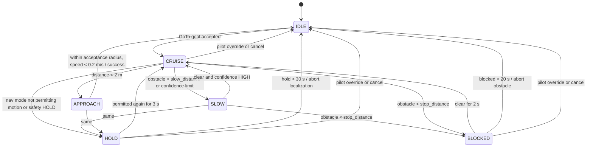
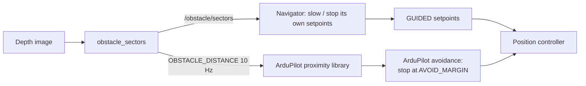

# Autonomous Navigation and Obstacle Handling

| Field | Value |
|---|---|
| Document ID | GDN-NAV-003 |
| Version | 1.0 |
| Date | 2026-10-05 |
| Decision | [ADR-012](../17-decisions/ADR-012-obstacle-avoidance.md) |
| Requirements | FR-040 – FR-046, FR-030, FR-031 |

## 1. Scope of "autonomous navigation" in this project

| In scope | Out of scope |
|---|---|
| Hold position on vision | Global path planning |
| Fly a short list of local waypoints at ≤ 1.5–2 m/s | Exploration, mapping-based planning |
| Stop for obstacles ahead; resume when clear; abort on timeout | Planning around obstacles (optional stretch: simple sidestep) |
| Take-off and land in GUIDED after the pilot arms (late phase) | Autonomous arming; flight beyond visual line of sight |
| React to detected objects through mission rules | Tracking or following moving targets |

The scope is deliberately small. The contribution is reliable GPS-denied localisation and the transition, not a planner.

### DB-2.0: two flight profiles

| Profile | Height | Localisation without GPS | Obstacle stop | Typical mission |
|---|---|---|---|---|
| Low | 1–10 m | Stereo VIO (drifts) | Active (stereo depth) | Hover, short legs, obstacle and AI demonstrations |
| Cruise | 40–60 m | Satellite map matching + ground VO (bounded error) | Not active: stereo range is 6 m and nothing is expected at that height on a cleared site. The site must be free of structures, wires and trees above 30 m | Circuit of a few hundred metres with GPS disabled |

The navigator, the GUIDED interface and the pilot-override rules below apply to both. Differences in the cruise profile: speed limit 3 m/s; goals outside map coverage are refused; vertical legs (climb to and descent from cruise height) are flown at ≤ 1.5 m/s; in `VISION_NAV` the mission may use absolute map coordinates (latitude/longitude waypoints), which the DB-1.0 odometry-only design could not honour.

## 2. Control interface

The companion commands the vehicle only through ArduPilot's **GUIDED** mode.

| Command | MAVLink | MAVROS interface | Use |
|---|---|---|---|
| Position target (local) | `SET_POSITION_TARGET_LOCAL_NED`, position mask | `/mavros/setpoint_raw/local` | Final approach to a waypoint; hold |
| Velocity target (local) with yaw | Same message, velocity mask | Same topic | Cruise between waypoints; allows speed limiting and smooth stops |
| Take-off | `MAV_CMD_NAV_TAKEOFF` | `/mavros/cmd/takeoff` | After pilot arms and selects GUIDED |
| Leave GUIDED | `MAV_CMD_DO_SET_MODE` | `/mavros/set_mode` | BRAKE, LOITER, ALT_HOLD, LAND, RTL only |

Not used: attitude targets, rate targets, actuator commands, RC override, arming.

Why velocity setpoints during cruise: the navigator can scale speed continuously with confidence and obstacle distance, and if setpoints stop arriving ArduPilot stops the vehicle after `GUID_TIMEOUT` (default 3 s; set to 1–2 s for this project). With position targets a silent companion would leave the vehicle flying to the last target.

## 3. Navigator behaviour



| State | Output |
|---|---|
| IDLE | **No setpoints published.** The FC holds by itself (GUIDED with no target → position hold after timeout) or is in a pilot mode. |
| CRUISE | Velocity vector toward the goal, magnitude = min(goal speed, cruise speed, nav-mode limit, confidence limit, obstacle limit), acceleration-limited; yaw toward the direction of travel so that the camera looks where the vehicle goes |
| APPROACH | Position setpoint at the goal |
| SLOW | As CRUISE with reduced speed |
| BLOCKED | Zero velocity |
| HOLD | Zero velocity |

**Yaw rule:** the camera faces forward, so the vehicle must fly nose-first. Before translating, the navigator first yaws toward the goal (rate ≤ 30 °/s), then moves. Sideways or backward flight toward unobserved space is not commanded.

## 4. Speed limiting

`v_cmd = min(v_goal, v_cruise, v_mode, v_conf, v_obst)`

| Limit | Definition |
|---|---|
| `v_mode` | From `/nav_mode/state.speed_limit`: GPS_NAV 2.0, GPS_DEGRADED 1.0, VISION_NAV 1.5, GPS_RECOVERY 0.5, all others 0 |
| `v_conf` | `v_mode × clamp((C − 0.4) / 0.3, 0, 1)`: full speed at C ≥ 0.7, zero at C ≤ 0.4 |
| `v_obst` | 0 if nearest obstacle in the corridor < `stop_distance`; linear from 0 to `v_cruise` between `stop_distance` and `slow_distance`; if the corridor is **unknown** (insufficient valid depth): 0.5 m/s cap, and 0 if unknown for > 2 s |

Corridor: sectors within ± 20° of the direction of travel (in `base_link`), which at the stop distance of 2 m spans ≈ ± 0.7 m laterally — wider than the vehicle.

Stopping-distance check for the defaults (v = 1.5 m/s, latency 0.3 s, deceleration 1.0 m/s² as limited by the navigator): 0.45 + 1.13 = 1.6 m < 2.0 m stop distance. At 2.0 m/s: 0.6 + 2.0 = 2.6 m, so `slow_distance` (4 m) must already have reduced speed; the linear ramp gives ≤ 1.0 m/s at 3 m, which stops within 0.8 m. Consistent.

## 5. Obstacle handling — two independent layers



| Layer | Where | Acts in | Behaviour |
|---|---|---|---|
| 1. Companion stop-and-hold | `navigator` | GUIDED, when the companion is commanding | Reduces and zeroes its own velocity command |
| 2. FC avoidance | ArduPilot (`PRX1_TYPE = 2`, `AVOID_ENABLE`, `AVOID_MARGIN`, `AVOID_BEHAVE = 1` stop) | Documented for LOITER and ALT_HOLD (pilot flying); applicability to GUIDED velocity commands in 4.7 `[VERIFY in SITL]` | Stops the vehicle short of the obstacle even if the pilot pushes the stick toward it |

Layer 2 exists so that obstacle protection is also available when the *pilot* is flying in LOITER, and so that a navigator bug cannot by itself fly the vehicle into a detected obstacle. ArduPilot documents this arrangement for forward-facing depth cameras; it notes that only a forward-facing camera orientation is supported and that the limited field of view requires careful testing.

No path planning around obstacles in the baseline. ArduPilot's BendyRuler (`OA_TYPE = 1`) is noted as a possible extension to be evaluated in simulation only.

### Stretch behaviour: sidestep

If BLOCKED for more than 5 s, yaw 45° left or right (toward the sector group with the greater clear distance), verify the new corridor is clear to 4 m, advance 2 m, then re-aim at the goal. Enabled only after the baseline has been validated in simulation and with a foam obstacle in flight.

## 6. Mission layer

Mission file (YAML) example — **conceptual format, not implementation**:

```yaml
name: demo_square
frame: takeoff_relative      # x forward, y left, z up from the take-off pose
steps:
  - {type: TAKEOFF, altitude: 2.0}
  - {type: GOTO, x: 5.0, y: 0.0, z: 2.0, max_speed: 1.0}
  - {type: HOLD, seconds: 5}
  - {type: GOTO, x: 5.0, y: 5.0, z: 2.0}
  - {type: GOTO, x: 0.0, y: 0.0, z: 2.0}
  - {type: LAND}
rules:
  - {if_object: person, within_m: 5.0, action: HOLD}
limits: {max_distance_from_takeoff: 15.0, max_altitude: 4.0, timeout_s: 300}
```

Validation at load: every waypoint inside the companion's own soft fence (which is inside the FC geofence), altitude within 1–8 m AGL, total path length within the limit.

Pre-conditions to start a mission: armed by the pilot; FC in GUIDED (selected by the pilot); autonomy-enable RC switch on; nav mode GPS_NAV or VISION_NAV; safety NOMINAL.

## 7. Behaviour by navigation mode

| Nav mode | New goals | Active goal | End-of-mission / abort action |
|---|---|---|---|
| GPS_NAV | Accepted | Continues | LOITER or RTL |
| GPS_DEGRADED | Accepted (slow) | Continues slowly | LOITER |
| VISION_NAV | Accepted | Continues | LOITER (holds on vision); **RTL is not used**: with drifted position, return may be inaccurate. Prefer flying the stored take-off waypoint in the vision frame, then LAND. |
| VISION_DEGRADED | Rejected | Paused (HOLD) | After 30 s: abort → LOITER; pilot decides |
| GPS_RECOVERY | Rejected | Paused | — |
| FLOW_FALLBACK | Rejected | Aborted | LOITER on flow; LAND after 20 s unless the pilot takes over |
| LOCALIZATION_LOST | Rejected | Aborted | ALT_HOLD → LAND |
| FAULT | Rejected | Aborted | FC watchdog |

## 8. Pilot interaction

| Pilot action | Effect |
|---|---|
| Switch out of GUIDED (any mode) | Navigator stops publishing within one cycle (50 ms); active goal aborted with `ABORTED_OVERRIDE`; mission aborted. Returning to GUIDED does **not** resume: a new mission start is required. |
| Autonomy-enable switch off | Same as above, staying in GUIDED: the FC holds position |
| Stick input in GUIDED | ArduPilot behaviour applies; the project treats any pilot stick movement during autonomous tests as a cue to switch modes |
| Emergency stop switch | Motors stop (FC) |

## 9. Limits enforced

| Limit | Value | Enforced by |
|---|---|---|
| Speed | Per §4; absolute cap 2.0 m/s | Navigator; also `WPNAV_SPEED`/`GUID_OPTIONS`-related FC limits set conservatively |
| Climb/descent | 0.5 m/s | Navigator |
| Yaw rate | 30 °/s | Navigator; FC `ATC_RATE_Y_MAX` |
| Tilt | 20° | FC `ANGLE_MAX` |
| Altitude | Low profile: 1–10 m AGL. Cruise profile (DB-2.0): up to 60 m AGL | Navigator; FC `FENCE_ALT_MAX` |
| Radius | Low profile: 30 m from take-off. Cruise profile: 150 m, and always inside map coverage by ≥ 60 m | Navigator soft fence; FC `FENCE_RADIUS` slightly larger |
| Speed, cruise profile | ≤ 3 m/s | Navigator |
| Goal step | ≤ 30 m from current position | Navigator |

## 10. Verification

| Test | Level |
|---|---|
| Speed limiter and stop logic with synthetic inputs | L1 |
| GoTo against a kinematic stub; stale-input holds | L3 |
| Waypoint square in Gazebo, GNSS mode then VIO mode | L4/L5 |
| Wall in the path: stop at ≥ 1.5 m; unknown-depth wall: hold | L4 |
| Kill navigator mid-leg: vehicle stops within `GUID_TIMEOUT` | L5 |
| Pilot override during every navigator state | L5, L7 |
| Flight: hover on vision; 3 m forward step; square; foam-board obstacle | L8 |
