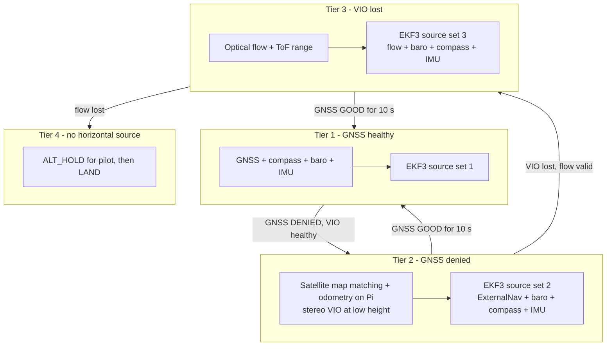

# GPS-Denied Navigation — Approach Selection

| Field | Value |
|---|---|
| Document ID | GDN-NAV-001 |
| Version | 1.0 |
| Date | 2026-10-05 |
| Decisions | [ADR-004](../17-decisions/ADR-004-vio-solution.md), [ADR-009](../17-decisions/ADR-009-gps-denied-transition.md) |

## 1. Question

Which localisation method should carry the vehicle when GNSS is unavailable, given the hardware in hand (Raspberry Pi 5, a passive stereo camera with an IMU, a Pixhawk-class flight controller)?

## 2. Methods compared

| Method | What it measures | Infrastructure | Drift | Typical accuracy | Compute | Hardware needed here | Main limitations |
|---|---|---|---|---|---|---|---|
| **GNSS** | Absolute position and velocity | Satellites | None | 1–3 m (standard), cm (RTK) | Negligible | Have (M10) | Unavailable indoors/under cover; jamming, spoofing, multipath |
| **Optical flow + range** | Ground-relative velocity | None | Position drifts (velocity integrated) | Good hover hold; metres of drift over minutes | In the sensor/FC | One small module | Needs textured ground, light, < 8 m AGL; no heading; no forward awareness |
| **Monocular visual odometry** | Relative pose up to scale | None | Yes; scale unobservable | — | Low–medium | One camera | Scale ambiguity makes it unusable alone for metric control |
| **Stereo visual odometry** | Metric relative pose | None | Yes (≈ 1–3 %) | Good at low speed in texture | Medium | Have | Fails on blur, low texture; no inertial bridging |
| **Visual-inertial odometry (VIO)** | Metric relative pose and velocity; gravity-aligned attitude | None | Yes in position and yaw (≈ 0.5–2 %) | Best of the camera-only family | Medium | Have (camera + IMU) | Needs calibration and timing quality; texture and light |
| **Visual SLAM** | Pose + map; loop closure removes drift on revisits | None | Bounded when loops close | Good in revisited areas | High | Have | Heavy; corrections are discontinuous; little benefit on short flights |
| **LiDAR localisation / SLAM** | Pose from range scans | None | Low | cm–dm; works in darkness | Medium–high | **Not available**; ≥ 150 g, costly | Mass, cost, power |
| **UWB** | Range to fixed anchors → absolute position | **Anchors must be installed and surveyed** | None | 10–30 cm | Low | Not available | Infrastructure; only inside the anchor volume |
| **Motion capture** | Absolute pose | Camera room | None | mm | Off-board | Not available | Lab only |
| **Dead reckoning (IMU only)** | Integrated acceleration | None | Grows quadratically; metres within seconds | — | Negligible | Have | Useful only for bridging ≈ 1–2 s |
| **Sensor fusion (EKF)** | Combines the above | — | That of the best aiding source | — | Low | Have (EKF3) | Not a source by itself: it needs at least one of the above |

## 3. Assessment against this project

| Method | Fits hardware | Fits "infrastructure-free" goal | Fits Pi 5 compute | Verdict |
|---|---|---|---|---|
| GNSS | Yes | Yes | Yes | **Tier 1** when healthy; reference for alignment and evaluation |
| Stereo VIO | Yes | Yes | Yes | **Tier 2: primary GPS-denied method** |
| Stereo VO (no IMU), EKF3 adds inertia | Yes | Yes | Yes | **Backup form of tier 2** |
| Optical flow + range | Needs one inexpensive module | Yes | Runs in the FC | **Tier 3: independent fallback** |
| Visual SLAM | Yes | Yes | Marginal | Not in flight; off-line analysis only |
| LiDAR | No | Yes | — | Future upgrade |
| UWB | No | **No** | Yes | Rejected; optional ground-truth aid |
| Monocular VO | Yes | Yes | Yes | Rejected (scale) |
| IMU dead reckoning | Yes | Yes | Yes | Only inside the EKF for sub-second bridging |

## 4. Selected approach

> **DB-2.0 revision.** The selected approach is now: **absolute position from matching downward-camera images against a satellite image stored on board, with visual odometry between fixes, fused on the companion and fed to the flight controller's EKF3 as external navigation.** It is flown at 40–60 m. Stereo visual-inertial odometry remains for the low regime (1–10 m). The analysis below is the DB-1.0 reasoning and still explains why odometry is needed and what its limits are; the new method and its own limits are in [visual-geolocalization.md](visual-geolocalization.md) and [ADR-015](../17-decisions/ADR-015-visual-geolocalization.md).
>
> In the comparison tables of §2–§3, satellite image matching is a further method: absolute, drift-free, infrastructure-free apart from the stored image, medium compute, needing height, daylight, distinct ground features and a licensed reference image. Verdict: **primary GPS-denied method (tier 2, cruise regime).**

DB-1.0 statement: **Stereo visual-inertial odometry on the companion, fused loosely into the flight controller's EKF3 as an external navigation source, with GNSS above it and optical flow below it as alternative EKF source sets.**

### Why it was selected

1. **It uses the sensors already owned.** Stereo provides metric scale directly; the IMU on the camera board provides gravity and bridges short visual dropouts.
2. **It is infrastructure-free**, which is the point of GPS-denied navigation.
3. **It fits the compute.** Filter-based VIO is among the cheapest metric localisation methods.
4. **The flight controller already knows how to consume it.** ArduPilot's EKF3 has a documented external-navigation source and a documented way to switch between GNSS and non-GNSS sources.
5. **It degrades gracefully** with the flow tier beneath it.

### Alternatives considered and why not

| Alternative | Reason |
|---|---|
| Optical flow as the *primary* GPS-denied method | Simple and robust for hover, but gives no forward perception, no heading, and nothing for the AI/stereo part of the project. Correct as a fallback, insufficient as the main method. |
| Full SLAM | Cost and discontinuities without benefit at this mission scale |
| Fusing everything in a companion-side EKF and bypassing EKF3 | Duplicates and weakens the FC's estimator; violates "the FC flies" |
| Tightly coupled GNSS-visual-inertial estimator on the companion (for example VINS-Fusion's global fusion) | Elegant, but moves authority for the navigation state to the Pi. EKF3 source switching achieves the transition with less risk. |

## 5. Limitations (to be stated wherever results are presented)

| Limitation | Consequence |
|---|---|
| Position and yaw drift without bound in tier 2 | Flights in GPS-denied mode are limited in duration and distance; return-to-launch accuracy degrades with path length |
| Depends on texture and light | No operation over uniform surfaces, in darkness, in fog/smoke, or facing the sun |
| Rolling shutter and software sync | Low speed and low yaw rate only |
| Dynamic scenes | Large moving objects filling the view corrupt the estimate |
| Forward-facing camera | High altitude over open ground gives few close features: accuracy falls as scene depth grows beyond stereo range (the estimator degrades towards monocular behaviour) |
| Vibration | Mechanical isolation quality directly limits performance |
| Initialisation | Must start stationary with a textured view |

## 6. Computational requirements

| Element | CPU (of 400 %) | Memory |
|---|---|---|
| Stereo capture | 30–40 % | 100 MB |
| OpenVINS | 80–120 % | 200–400 MB |
| Monitor + alignment | < 5 % | < 50 MB |
| MAVROS | 10–15 % | 100 MB |
| **Localisation subtotal** | **≈ 125–180 %** | **≈ 0.5 GB** |

`[ESTIMATE]`; measured in the VIO phase.

## 7. Expected accuracy

| Quantity | Target | Basis |
|---|---|---|
| VIO drift | ≤ 2 % of distance (goal 1 %) | Literature for stereo VIO, de-rated for this camera |
| Hover position hold on VIO | ≤ 0.5 m RMS over 60 s | Drift target + control error |
| Yaw drift | ≤ 1°/min with compass aiding outdoors; higher on vision yaw indoors | EKF source set 2 with `YAW = 1` |
| Altitude | Barometer-limited (≈ ± 0.5 m slow drift), rangefinder near the ground | EKF `POSZ = 1` in all sets |
| Source-switch step | ≤ 1.0 m | Continuous pre-alignment |
| After 60 m of GPS-denied flight | ≈ 1–2 m position error expected | 2 % |

## 8. Environmental limits

| Environment | Tier 2 (VIO) | Tier 3 (flow) |
|---|---|---|
| Open field, daylight, 3 m AGL | Good if the ground and horizon have texture within ≈ 10 m | Good over grass/soil |
| Between buildings / under trees | Good (close texture); GNSS is degraded exactly here | Good |
| Indoor hall, lit | Good if walls/floor are textured | Depends on floor texture |
| Corridor with plain walls | Poor | Depends on floor |
| Over water, snow, uniform concrete | Poor | Poor |
| Dusk / night | Fails | Fails |
| Rain, fog, dust | Degraded to failed | Degraded |
| Direct sun in view | Exposure problems; degraded | Unaffected (looks down); ToF range reduced in sunlight |

## 9. Testing GNSS denial without jamming

Radiating to block GNSS is illegal and dangerous. Denial is produced by:

| Method | Where |
|---|---|
| Simulator parameters (disable GNSS, add noise, glitch, drift) | SITL |
| ArduPilot RC auxiliary function "GPS Disable" (`RCx_OPTION = 65`) | Real flight: the FC ignores GNSS while the switch is on |
| Manual EKF source switch (`RCx_OPTION = 90`) | Real flight: forces the transition regardless of GNSS state |
| Flying from open sky to under a roof/canopy | Real, natural degradation (late test stage only) |
| Covering the antenna on the bench | Bench |
