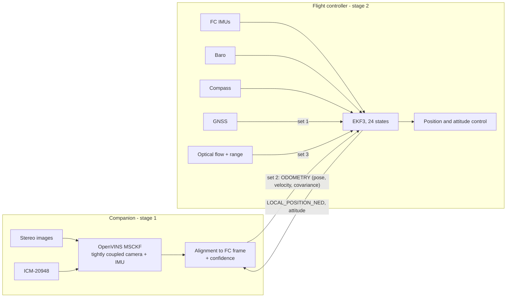
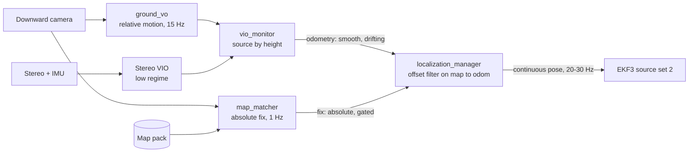

# State Estimation and Sensor Fusion

| Field | Value |
|---|---|
| Document ID | GDN-NAV-002 |
| Version | 1.0 |
| Date | 2026-10-05 |
| Status | Baseline |
| Requirements | FR-020 – FR-027; NFR-003 – NFR-006, NFR-012 |

## 1. Sensors and what each contributes

| Sensor | Measures | Rate | Strength | Weakness | Fused in |
|---|---|---|---|---|---|
| FC IMU (ICM-42688-P, BMI088) | Angular rate, specific force | kHz internally | High rate, always available | Bias; integrates to drift in seconds | EKF3 (prediction) |
| Barometer (MS5611) | Pressure altitude | ≈ 50 Hz | Absolute-ish height, no drift from motion | Weather drift, prop-wash and ground effect | EKF3 (`POSZ` in all sets) |
| Magnetometer (IST8310) | Heading | ≈ 100 Hz | Absolute yaw outdoors | Interference from currents, steel, indoors | EKF3 (`YAW` in all sets by default) |
| GNSS (M10) | Position, velocity | 5–10 Hz | Absolute, drift-free | Outages, multipath, interference | EKF3 source set 1 |
| Range sensor (ToF) | Height above ground | 100 Hz | Accurate near ground | ≤ 8 m; surface dependent | EKF3 (terrain, landing); scale for flow |
| Optical flow | Angular flow rate → ground velocity | 100 Hz | Independent of the companion | Texture, light, height limits | EKF3 source set 3 |
| Stereo camera | Bearings to features in two views → metric structure | 20 Hz | Metric scale; rich | Texture, light, blur, sync, rolling shutter | VIO |
| Camera-board IMU (ICM-20948) | Angular rate, specific force | 225 Hz | Rigid to camera; same clock | Consumer grade; I²C jitter | VIO |
| VIO output | Pose, velocity (relative) | 20–30 Hz | Smooth, metric, no infrastructure | Drifts in x, y, z, yaw | EKF3 source set 2 |

## 2. Fusion architecture: two-stage, loosely coupled

| Stage | Where | Type | Output |
|---|---|---|---|
| 1 | Pi | Tightly coupled visual-inertial filter | Relative pose and velocity with covariance |
| 2 | FC | Loosely coupled EKF: treats stage 1 as a position/velocity (and optionally yaw) sensor | **The** vehicle state used for control |

### Why not a single filter

| Option | Assessment |
|---|---|
| One filter on the Pi fusing everything, FC only executes | The Pi becomes flight-critical; a Pi hang loses the state estimate. Violates the first architectural principle. |
| One filter on the FC fusing raw images | Not possible on a microcontroller |
| A third filter on the Pi (`robot_localization`) merging VIO and FC state | Adds a tuning problem and a second source of truth without adding information |
| **Two stages (chosen)** | Each estimator does what it is good at; the FC state survives loss of the Pi; the interface is one standard MAVLink message |

The known cost of loose coupling: stage 2 treats VIO errors as white noise although they are correlated (drift). In practice this means the EKF follows VIO drift, which is the intended behaviour in GPS-denied mode.

## 3. State vectors

### 3.1 Stage 1 — VIO (OpenVINS)

| Block | States | Dim |
|---|---|---|
| IMU | Orientation (quaternion, 3-DoF error), position, velocity, gyro bias, accel bias | 15 (error state) |
| Clones | N past IMU poses (default N = 11) | 6 N |
| Calibration | Camera–IMU extrinsics per camera (6 each), time offset (1), intrinsics (optional) | ≈ 13 |
| SLAM features (optional) | 3 per feature, up to ≈ 25–50 | ≤ 150 |

Frame: gravity-aligned global `G` with arbitrary origin and yaw.

### 3.2 Stage 2 — ArduPilot EKF3

| States | Dim |
|---|---|
| Attitude quaternion | 4 |
| Velocity NED | 3 |
| Position NED | 3 |
| Gyro bias | 3 |
| Accelerometer bias | 3 |
| Earth magnetic field NED | 3 |
| Body magnetic field | 3 |
| Wind velocity NE | 2 |
| **Total** | **24** |

Frame: local NED with origin at the EKF origin.

### 3.3 Companion-side auxiliary state (`localization_manager`)

| State | Dim | Estimated by |
|---|---|---|
| Alignment `T_map_odom`: translation x, y, z and yaw ψ | 4 | Sliding-window average while GNSS is good |
| Clock offset Pi ↔ FC | 1 | MAVROS time sync |

This is not a navigation filter; it is a slowly varying calibration.

## 4. Measurements

### 4.1 Into VIO

| Measurement | Model | Noise source |
|---|---|---|
| Gyro, accel at 225 Hz | IMU kinematics with bias random walk | Allan variance × inflation |
| Feature observations (u, v) in left and right images | Pinhole + radial-tangential projection through the estimated extrinsics and time offset | Pixel σ ≈ 1.5–2.0 px (inflated for rolling shutter and sync) |
| Zero-velocity (when stationary) | v = 0 | Small |

### 4.2 Into EKF3

| Source set | Horizontal position | Horizontal velocity | Vertical position | Vertical velocity | Yaw |
|---|---|---|---|---|---|
| 1 (GNSS) | GNSS | GNSS | Baro | GNSS | Compass |
| 2 (vision) | ExternalNav | ExternalNav | Baro | ExternalNav | Compass (outdoor) / ExternalNav (indoor) |
| 3 (flow) | None | Optical flow | Baro | None | Compass |

External-nav measurement sent by the companion (MAVLink `ODOMETRY`):

| Field | Content |
|---|---|
| `time_usec` | Image mid-exposure time, converted to FC time base |
| `frame_id` / `child_frame_id` | `MAV_FRAME_LOCAL_FRD` / `MAV_FRAME_BODY_FRD` (set by MAVROS from `map` / `base_link`) `[VERIFY on bench: ArduPilot accepts these frame values]` |
| Position, quaternion | `T_map_base` converted to NED/FRD |
| Linear velocity | Body-frame velocity (FRD) |
| Angular velocity | From VIO (not used by the EKF) |
| `pose_covariance`, `velocity_covariance` | Upper-triangular 6×6; see §5 |
| `reset_counter` | Incremented at every VIO re-initialisation or alignment change |
| `quality` | 0–100 from localisation confidence (0 = unknown, low values = poor) |
| `estimator_type` | `MAV_ESTIMATOR_TYPE_VIO` |

Vertical position stays on the barometer in every set, following ArduPilot's own recommendation for vibration-sensitive vision sources. Vision still contributes vertical velocity.

## 5. Covariance handling

| Stage | Rule |
|---|---|
| VIO → `vio_monitor` | Use the estimator's 6×6 pose covariance. It is the covariance of a drifting estimate relative to its own origin and therefore grows with time. |
| `localization_manager` → FC | Position covariance sent to the FC = max(floor, VIO **incremental** uncertainty over the last second) + alignment uncertainty. The absolute, ever-growing VIO covariance is **not** sent: it would make the EKF progressively ignore vision, which is the only horizontal source it has in tier 2. |
| Floors | σ_pos ≥ 0.10 m, σ_vel ≥ 0.10 m/s, σ_yaw ≥ 2° |
| Scaling by confidence | Variances multiplied by 1 / max(C, 0.2)² so that low confidence loosens the EKF's trust |
| FC side | ArduPilot applies its own limits (`VISO_POS_M_NSE`, `VISO_VEL_M_NSE`, `VISO_YAW_M_NSE`) as minimum noise. Initial values: 0.2 m, 0.2 m/s, 0.2 rad; tuned from innovation logs. Whether 4.7 uses the message covariance, the parameters, or the larger of the two must be confirmed `[VERIFY]`. |

Consistency check during testing: EKF innovations for external nav (logged by ArduPilot) should be zero-mean with normalised magnitude mostly below 1. Persistent larger values mean the noise is set too low or the delay is wrong.

## 6. Coordinate frames

Defined in [coordinate-frames.md](../02-system-architecture/coordinate-frames.md). Summary of what the estimator chain uses:

| Quantity | Frame |
|---|---|
| VIO internal | `G` ≡ `odom` (gravity-aligned), body = `imu_link` |
| VIO published | `odom → base_link` |
| Aligned | `map → base_link` (ENU/FLU) |
| On the wire | Local NED / body FRD |
| EKF3 | Local NED, origin = EKF origin |

## 7. Update frequencies

| Process | Rate |
|---|---|
| VIO prediction | 225 Hz (IMU) |
| VIO update | 20 Hz (camera) |
| External-nav stream to FC | 20–30 Hz |
| EKF3 prediction | FC loop rate (400 Hz) |
| EKF3 GNSS update | 5–10 Hz |
| EKF3 flow update | Up to sensor rate |
| Alignment estimate | 20 Hz samples, 5 s window |
| Confidence | 10 Hz |
| GNSS health classification | 5 Hz |

Delay compensation: the EKF buffers its state history and fuses the delayed vision measurement at the correct past time using `VISO_DELAY_MS`. Target total delay ≤ 80 ms.

## 8. Localisation confidence

A scalar `C ∈ [0, 1]` computed at 10 Hz as the **minimum** of independent sub-scores (a chain is as strong as its weakest link; a weighted average would hide a single failed check).

| Sub-score | Input | 1.0 at | 0.0 at |
|---|---|---|---|
| `c_feat` | Tracked features (if available) | ≥ 80 | ≤ 15 |
| `c_cov` | √(trace of incremental position covariance) | ≤ 0.05 m | ≥ 0.5 m |
| `c_rate` | VIO output rate | ≥ 19 Hz | ≤ 10 Hz |
| `c_lat` | Latency | ≤ 60 ms | ≥ 200 ms |
| `c_sync` | Fraction of stereo pairs within skew limit (last 2 s) | ≥ 0.99 | ≤ 0.80 |
| `c_att` | Roll/pitch difference VIO vs FC | ≤ 1° | ≥ 8° |
| `c_yawrate` | Yaw-rate difference VIO vs FC gyro | ≤ 3 °/s | ≥ 30 °/s |
| `c_vz` | Vertical-velocity difference VIO vs FC | ≤ 0.2 m/s | ≥ 1.5 m/s |
| `c_innov` | When GNSS is GOOD: velocity difference GNSS vs aligned VIO | ≤ 0.3 m/s | ≥ 2.0 m/s |
| `c_env` | Exposure/gain at limit (dark scene) | Within range | At limit for > 2 s |

Each sub-score is linear between its two anchors and clamped. `C` is low-pass filtered downwards quickly (τ = 0.2 s) and upwards slowly (τ = 2 s): confidence is lost fast and regained slowly.

| Level | Condition |
|---|---|
| HIGH | C ≥ 0.7 |
| MEDIUM | 0.4 ≤ C < 0.7 |
| LOW | C < 0.4 |
| LOST | VIO stream absent or `VioStatus.state = LOST` |

The cross-checks `c_att`, `c_yawrate`, `c_vz` compare vision against the FC's independent inertial and barometric sensing. They remain valid in GPS-denied mode, when no absolute reference exists. In tier 2 the EKF *is* following VIO in horizontal position, so EKF horizontal position cannot be used as a check; attitude, gyro and baro still can.

All anchors are parameters and are tuned on recorded data: the confidence trace must drop **before** drift becomes visible in the reference.

## 9. Failure handling

| Failure | Detected by | Response |
|---|---|---|
| VIO stream stops | `vio_monitor` gap > 0.5 s | LOST → state machine T11 (flow) or T12 |
| VIO diverges with small covariance | Cross-checks (`c_att`, `c_yawrate`, `c_vz`) | Confidence falls → T9 then T11 |
| VIO jump | Step detector in `vio_monitor` | LOST; stream withheld; reset counter incremented |
| VIO re-initialises | State change in `VioStatus` | Stream withheld until re-aligned ≥ 10 s |
| Alignment invalid (never had GNSS + VIO together) | `aligned = false` | Transition to VIO tier not permitted; state machine uses flow tier instead. Indoor start uses the explicit origin procedure. |
| Time sync lost | `timesync_status` | Confidence capped at MEDIUM; stream continues with last offset for 5 s, then stops |
| Stereo sync lost | `c_sync` | Confidence falls |
| GNSS glitch while in tier 1 | `dv` check, EKF variance | DEGRADED: alignment frozen at pre-glitch value |
| EKF rejects external nav (innovation gate) | `EKF_STATUS_REPORT` flags/variances; status text | Reported; state machine treats rising EKF variance in tier 2 as VISION_DEGRADED |
| EKF failsafe | FC | `FS_EKF_ACTION`; the companion only observes |
| Compass interference in tier 2 | EKF yaw innovations; compare with VIO yaw rate | Option to set `EK3_SRC2_YAW = 6` (vision yaw) for the affected environment |

## 10. Initialisation cases

| Case | Procedure |
|---|---|
| Outdoor start with GNSS | FC sets EKF origin from GNSS. VIO initialises stationary. Alignment converges within a few seconds of motion after take-off (yaw alignment needs translation: a short forward leg in tier 1 is part of the test procedure). |
| Indoor start without GNSS | Operator selects source set 2 before arming. Companion sends `SET_GPS_GLOBAL_ORIGIN` (any fixed coordinates) so that the EKF has an origin. Alignment = identity translation; yaw from compass if trusted, else `YAW = 6`. |
| GNSS lost before alignment converged | Tier 2 not permitted; fall to tier 3. |

Yaw alignment observability: with the vehicle stationary, the yaw between `odom` and `map` cannot be observed from position data alone. `localization_manager` therefore uses the **attitude** difference (FC yaw from compass vs VIO yaw) for the yaw component, and position differences for translation. This makes alignment available before take-off, at the cost of inheriting compass error; position-based refinement during motion then corrects it.

## 10a. DB-2.0: fusing satellite map fixes

The two-stage architecture is kept. One measurement is added to the companion stage: an absolute horizontal position from the map matcher ([visual-geolocalization.md](visual-geolocalization.md)).

| Sensor | Measures | Rate | Strength | Weakness |
|---|---|---|---|---|
| Downward camera → map matcher | Absolute east/north | ≈ 1 Hz | Drift-free | Metres of noise; gaps; rare wrong matches |
| Downward camera → ground VO | Horizontal velocity | 15 Hz | Smooth; works at height | Drifts; needs height and flat ground |

### Offset filter

| Item | Definition |
|---|---|
| State | `o = (Δe, Δn)`: translation of `odom` relative to `map` |
| Covariance | `P` (2×2) |
| Prediction (each odometry step of length d) | `o` unchanged; `P += (k·d)²·I`, k = odometry drift fraction (0.03) |
| Measurement (accepted fix at image time t) | `z = p_fix − p_odom(t)`, `R` = fix covariance (floor 1 m²) |
| Gate | Mahalanobis distance of the innovation ≤ 3σ; else the fix is discarded and counted |
| Update | Standard Kalman update of `o`, `P` |
| Applied offset | Moves toward `o` at ≤ 0.5 m/s (slew limit) so the pose sent to the FC is continuous |
| Reported uncertainty | `pos_sigma = sqrt(max eigenvalue of P)` |

While GNSS is GOOD the same filter is driven by GNSS-derived offsets (this is the DB-1.0 alignment), so the hand-over from GNSS to map fixes is a change of measurement source into one filter, not a change of estimator.

### Covariance sent to the FC

As in §5, with the horizontal position variance now taken from `P` (floor 1 m² in the cruise regime). The EKF therefore trusts vision less when fixes have been absent, which is the correct behaviour.

### What the FC sees

Nothing new: MAVLink `ODOMETRY` at 20–30 Hz into source set 2. `VISO_POS_M_NSE` is raised for the cruise configuration (start 1.0 m) to reflect metre-level accuracy.

### Yaw and height

| Quantity | Source in the cruise regime |
|---|---|
| Yaw | FC compass. The matcher's residual rotation is a monitor, not an input |
| Height | FC barometer. The matcher's scale is a monitor and a slow bias check |

### Failure handling additions

| Failure | Detected by | Response |
|---|---|---|
| Wrong fix | Innovation gate; disagreement with previous fix + odometry | Discarded; if three consecutive gated-out fixes agree with each other, the filter is re-initialised on them with a large covariance (recovery from an earlier wrong fix or large odometry drift) |
| No fixes | `fix_age`, `pos_sigma` | State machine T20, T22 |
| Ground VO lost | `vio_monitor` | Fixes alone cannot carry the position at 1 Hz: T22 |
| Map offset (georeference) | Shadow-mode mean error against GNSS | Site registration; NO-GO if mean error > 5 m |

## 11. Verification

| Test | Level | Criterion |
|---|---|---|
| Alignment estimator on synthetic trajectories with known offset and noise | L1 | Recovers x, y, z within 0.1 m and yaw within 1° |
| Confidence function on recorded failure cases (covered lens, fast spin, dark) | L1/L3 | Level drops below MEDIUM before position error exceeds 1 m |
| External-nav fusion in SITL | L5 | EKF innovations small; position follows; `VISP` logged |
| Delay calibration | L6/L7 | Innovation correlation with motion removed after setting `VISO_DELAY_MS` |
| Source switch | L5, L8 | NFR-012 |
| Hover on vision | L8 | NFR-006 |
