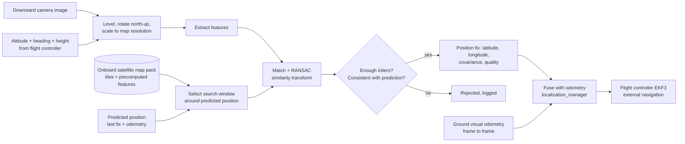

# Visual Geo-Localisation by Satellite Image Matching

| Field | Value |
|---|---|
| Document ID | GDN-NAV-004 |
| Version | 1.0 (introduced in design baseline DB-2.0) |
| Date | 2026-10-05 |
| Status | Baseline |
| Decisions | [ADR-015](../17-decisions/ADR-015-visual-geolocalization.md), [ADR-016](../17-decisions/ADR-016-reference-imagery-and-downward-camera.md) |
| Requirements | FR-090 – FR-099; NFR-070 – NFR-076 |
| Implemented by | package `gdn_geoloc` (nodes `ground_vo`, `map_matcher`), `localization_manager`, tool `map_prepare` |

## 1. Concept

When GPS is lost, the drone photographs the ground with a downward camera, finds where that photograph fits on a satellite image stored on board, and reads its position from the match. This gives an **absolute** position, the same kind of information GPS gives, without any radio signal.

Two things are needed, and both come from the same downward camera:

| Function | Node | Output | Rate | Character |
|---|---|---|---|---|
| **Where am I on the map?** | `map_matcher` | Absolute position fix | ≈ 1 Hz | Drift-free, noisy, sometimes unavailable |
| **How have I moved since the last frame?** | `ground_vo` | Relative motion (velocity) | 15 Hz | Smooth, always available over texture, drifts |

Neither is sufficient alone. Fixes arrive too slowly and can drop out; odometry drifts without bound. Combined, they behave like GPS plus inertial: smooth and bounded.

## 2. Why this replaces odometry-only navigation (DB-1.0)

| | DB-1.0: stereo VIO only | DB-2.0: map matching + odometry |
|---|---|---|
| Position error over time | Grows without bound (≈ 1–3 % of distance) | Bounded by the fix accuracy (target ≤ 5 m) |
| Needs before GPS is lost | Alignment to GPS while GPS is good | Nothing: fixes are already in map coordinates |
| Works after a cold start with no GPS | No absolute position | Yes, if the start area is on the map |
| Flight duration without GPS | Limited by drift | Limited by map coverage and battery |
| Needs | Calibrated stereo + IMU timing (the weak point of the owned camera) | A map of the area, a downward camera, height above ≈ 40 m, daylight, distinct ground features |
| Main risk | Camera unsuitable for VIO | Matching fails on featureless or changed terrain |

The dependency on the stereo camera's timing quality (the largest risk in DB-1.0) is reduced: stereo VIO is now used only at low altitude and is no longer the primary GPS-denied method.

## 3. Operating regimes

Satellite matching needs the camera to see a large enough piece of ground. That sets a minimum height.

Ground footprint width: `W = 2·h·tan(HFOV/2)`. Reference pixels across the footprint: `N = W / GSD`, where GSD is the map's ground sample distance (metres per pixel).

| Height h | W at 70° lens | W at 100° lens | N at 0.3 m/px (100°) | N at 0.5 m/px (100°) |
|---|---|---|---|---|
| 8 m | 11 m | 19 m | 64 | 38 |
| 30 m | 42 m | 72 m | 238 | 143 |
| 50 m | 70 m | 119 m | 397 | 238 |
| 60 m | 84 m | 143 m | 477 | 286 |

Design rule `[ASSUMPTION]`: at least ≈ 250 reference pixels across the footprint for reliable feature matching. With typical 0.3–0.5 m/px imagery and a 100° lens this means **h ≥ 40–50 m**. At 8 m (the DB-1.0 ceiling) there are only tens of reference pixels: matching is not possible.

| Regime | Height AGL | GPS-denied localisation | Stereo depth / obstacle stop | AI detection |
|---|---|---|---|---|
| **Low** | 1–10 m | Stereo VIO (odometry only, drifts); optical-flow fallback in the FC | Active | Active, best range |
| **Climb / descent** | 10–40 m | Ground VO odometry; map fixes when they succeed | Off (nothing within 6 m) | Active |
| **Cruise** | 40–60 m (nominal 50 m) | **Map matching + ground VO** | Off | Active, small objects only partly detectable |

The stereo camera, stereo depth and the detector are unchanged from DB-1.0. Their useful range (≈ 6 m for depth, ≈ 10–12 m for people) means they serve the low regime: take-off, landing and low passes.

A higher-resolution reference (for example an orthomosaic of the test site at 5–10 cm/px made from a prior mapping flight) lowers the usable height to about 15–20 m. The pipeline is the same; only the map pack changes.

### DB-3.0: matching height follows from the reference resolution

The 250-pixel rule gives a minimum matching height for any reference:

`h_min = 250 · GSD / (2·tan(HFOV/2))`

| Reference GSD | h_min (100° lens) |
|---|---|
| 0.50 m/px | 52 m |
| 0.30 m/px | 31 m |
| 0.25 m/px | 26 m |
| 0.10 m/px (own orthomosaic) | 10 m |

`match_min_height` is now computed from the map pack's `meta.yaml` instead of being a fixed parameter. This matters because grid search and follow are flown at **25–30 m** so that people can be detected from above ([search-track-follow.md](search-track-follow.md) §3): they need a reference of about 0.25 m/px or better. A third flight profile, **search**, sits between the low and cruise regimes: stereo nodes off, geo-localisation on, detector on the downward camera.

## 4. Reference map ("map pack")

| Item | Specification |
|---|---|
| Source format | Georeferenced orthoimage (GeoTIFF), any provider, converted to a local UTM grid |
| Resolution | ≤ 0.5 m/px required; ≤ 0.3 m/px preferred |
| Coverage | Mission area plus a 200 m margin; typically 1 km × 1 km (≈ 2000–3300 px square: a few megabytes) |
| Preparation | Off-board tool `map_prepare` (`gdn_tools`): reproject, convert to grey, normalise contrast, cut into 512 px tiles with 64 px overlap, **precompute features for every tile at 2–3 scales**, write an index |
| Stored on the Pi | `map_pack/<map_id>/`: `meta.yaml` (CRS, origin, GSD, bounds, image date, source, licence), `tiles/`, `features/`, `preview.jpg` |
| Site registration | Before first use, the map's georeference is checked against GPS on site (fly or walk a GPS track over visible features); a constant east/north offset is stored in `meta.yaml` |
| Licence | Recorded per map pack. Imagery whose terms forbid offline storage must not be used ([ADR-016](../17-decisions/ADR-016-reference-imagery-and-downward-camera.md)) |

Precomputing map features off-board is what makes this affordable on a Raspberry Pi: at run time only the small drone image needs feature extraction.

## 5. Matching pipeline (`map_matcher`)

| Step | Operation | Detail |
|---|---|---|
| 1 | Trigger | Every 1.0 s (parameter), on the newest downward image, if height and attitude are inside limits |
| 2 | Undistort | Calibrated intrinsics |
| 3 | Orthorectify | Rotate the image to nadir using roll and pitch at the image time; rotate to north-up using heading; scale so that one pixel = map GSD, using height above ground |
| 4 | Normalise | Grey, contrast-limited histogram equalisation (CLAHE) |
| 5 | Extract features | Primary: SIFT, ≤ 500 keypoints |
| 6 | Select window | Map region centred on the predicted position, half-size = max(40 m, 3σ of predicted position), capped at 200 m. First fix after denial: larger window from the last known position |
| 7 | Match | Descriptors against the precomputed map features in the window; nearest-neighbour with ratio test |
| 8 | Geometric check | RANSAC for a similarity transform (translation, rotation, scale); rotation limited to ± 15°, scale to ± 20 % of the expected values |
| 9 | Gate | Accept if inliers ≥ 12 **and** inlier ratio ≥ 0.25 **and** the position is within the predicted uncertainty (Mahalanobis gate) **and** it agrees with the previous accepted fix plus odometry |
| 10 | Output | `GeoFix`: map position (and latitude/longitude), 2×2 covariance, inlier count and ratio, estimated rotation and scale, accepted/rejected with reason |

Thresholds are parameters, tuned on recorded data.

Because roll, pitch, heading and height are already known from the flight controller, the search is reduced from six unknowns to essentially two (east, north) plus small corrections. This is the main reason a classical matcher has a chance of working in real time on a CPU.

The estimated **scale** from step 8 is an independent check on height above ground; the estimated **rotation** is an independent check on heading. Both feed the confidence score.

### 5.1 Matching methods

| Role | Method | Why |
|---|---|---|
| **Primary** | SIFT features + ratio test + RANSAC similarity | No training; deterministic; map features precomputed; tens of milliseconds on the Pi `[ESTIMATE]`; patent expired, in OpenCV |
| **Learned alternative (to be compared)** | XFeat lightweight learned features | Published as real-time on a laptop CPU; more tolerant of seasonal and lighting change than hand-crafted features. Evaluated on the same recorded data; adopted if it gives clearly more accepted fixes within the CPU budget. This is also the project's second use of AI. |
| **Simplified** | Normalised cross-correlation of edge images over the search window | A few dozen lines; no features; works when the scene is similar to the map; used for learning and as a cross-check |

SIFT is expected to work over built-up and structured areas (roads, buildings, field boundaries) with reasonably recent imagery, and to fail over uniform vegetation, water, or where the scene has changed. That limit is stated, not hidden.

## 6. Ground visual odometry (`ground_vo`)

| Item | Design |
|---|---|
| Input | Downward images at 15 Hz; FC attitude and angular rate; height above ground |
| Method | Track corners between consecutive frames (FAST + KLT); remove the image motion caused by rotation using the FC gyro; fit a similarity/homography with RANSAC; convert pixel translation to metres with `Δ = h·Δpx / f` |
| Output | `nav_msgs/Odometry`: horizontal velocity and integrated position in `odom`; covariance from inlier statistics |
| Assumption | Ground is approximately planar under the footprint `[ASSUMPTION]` |
| Drift target | ≤ 3 % of distance travelled |
| Valid | h > 10 m (below this, stereo VIO takes over), textured ground, daylight |

This is the same idea as an optical-flow sensor, implemented with the downward camera so that it works at 50 m where the small flow sensor's rangefinder (8 m) does not.

The relative-odometry topic consumed by the rest of the system stays `/vio/odometry` (published by `vio_monitor`); its **source** is selected by height: `ground_vo` above `odom_switch_height` (default 12 m, with hysteresis), stereo VIO below.

## 7. Height above ground

| Source | Use |
|---|---|
| FC altitude relative to take-off (barometer in EKF3) | Primary, with the assumption of flat terrain inside the mission area |
| Scale estimated by the matcher | Cross-check; slow correction of a height bias |
| Rangefinder (MTF-01, ≤ 8 m) | Low regime only |
| Terrain model | Not used in the baseline; required for hilly sites (future) |

A 5 % height error changes the image scale by 5 %. The matcher tolerates ± 20 %; the position at the image centre is unaffected by scale error, which is why the fix is taken at the image centre.

## 8. Fusion

Fusion happens in `localization_manager`, in the place the DB-1.0 frame design already provides: the `map → odom` transform.

| DB-1.0 | DB-2.0 |
|---|---|
| `map → odom` estimated from GPS while GPS is good, then **frozen** | `map → odom` estimated from GPS while GPS is good; when GPS is denied it keeps being **updated from map fixes** |

Mechanism: a small Kalman filter on the offset between the odometry frame and the map frame (east, north, optionally yaw).

| Element | Model |
|---|---|
| State | Offset (Δe, Δn) of `odom` relative to `map` |
| Prediction | Offset constant; uncertainty grows with distance travelled (odometry drift, default 3 %) |
| Update | Accepted `GeoFix`: measured offset = fix position − odometry position at the image time |
| Output | Continuous pose = odometry + offset, at 20–30 Hz |
| Smoothing | The applied offset is slewed (≤ 0.5 m/s) so that the pose sent to the FC has no steps |
| Position uncertainty | Published (`pos_sigma_m`); grows between fixes, shrinks at each fix |

Yaw comes from the FC compass (`EK3_SRC2_YAW = 1`), as before. The matcher's rotation estimate is monitored and, if it disagrees with the compass by more than 10° for several fixes, raises a warning.

The pose goes to the flight controller exactly as in DB-1.0: MAVLink `ODOMETRY` → EKF3 source set 2. No change to the FC interface.

Alternative considered: sending fixes to ArduPilot as a MAVLink GPS (`GPS_INPUT`, GPS type 14). It is simple and documented, but it presents vision as if it were GPS, loses the smooth odometry between fixes, and blurs the logs. Kept as a fallback integration path ([ADR-015](../17-decisions/ADR-015-visual-geolocalization.md)).

## 9. Health and confidence

`map_matcher` publishes `GeoLocStatus`:

| State | Meaning |
|---|---|
| `INACTIVE` | Below matching height or outside limits |
| `SEARCHING` | Trying; no accepted fix yet (or re-acquiring) |
| `TRACKING` | Fixes being accepted regularly |
| `COASTING` | No accepted fix for > 5 s; position carried by odometry |
| `LOST` | No accepted fix for > 60 s or position uncertainty > 25 m |
| `OUT_OF_COVERAGE` | Predicted position within 60 m of the map edge or outside it |

Additions to the localisation confidence ([state-estimation.md](state-estimation.md) §8), active in the cruise regime:

| Sub-score | 1.0 at | 0.0 at |
|---|---|---|
| `c_fix_age` (time since last accepted fix) | ≤ 3 s | ≥ 60 s |
| `c_pos_sigma` (estimated position uncertainty) | ≤ 3 m | ≥ 25 m |
| `c_inliers` (median inliers of recent fixes) | ≥ 30 | ≤ 12 |
| `c_scale` (matcher scale vs expected) | within 5 % | off by 20 % |
| `c_reject` (fraction of recent matches rejected) | ≤ 20 % | ≥ 90 % |

A **wrong** fix that passes the gates is the most dangerous failure. Defences, in order: geometric check; gate against prediction; agreement with the previous fix; slew-limited application; and while GPS is still good, every fix is compared with GPS and the statistics are logged (shadow mode), which is how the gates are tuned before they are trusted.

## 10. Behaviour when fixes stop

| Situation | Response |
|---|---|
| Fix rejected or none for < 5 s | Normal; odometry carries the position |
| None for 5–60 s (`COASTING`) | Continue at reduced speed; hold if uncertainty > 10 m; optionally climb 10 m (wider footprint) within the altitude limit |
| None for > 60 s, or σ > 25 m (`LOST`) | Navigation tier falls: hold on odometry, alert the pilot; pilot takes over or the vehicle descends and lands |
| Approaching the map edge | Refuse goals outside coverage; turn back |
| Ground VO lost as well | No horizontal source at cruise height: ALT_HOLD for the pilot, then controlled descent (see safety architecture) |

At cruise height the optical-flow fallback sensor is out of range. This makes the cruise regime less protected than the low regime, and is the reason for the stricter site and crew rules in DB-2.0.

## 11. Expected accuracy

Error budget for one fix at h = 50 m, map GSD 0.4 m/px `[ESTIMATE]`:

| Source | Size | Type |
|---|---|---|
| Matching (≈ 1.5 map pixels) | 0.6 m | Random |
| Roll/pitch error 1° (h·tan 1°) | 0.9 m | Random |
| Camera boresight error 0.5° | 0.4 m | Systematic, calibratable |
| Time error 50 ms at 3 m/s | 0.15 m | Random |
| Map georeference error | 1–5 m before site registration; ≤ 1 m after | Systematic |
| Terrain relief not modelled | Site-dependent | Systematic |
| **Combined** | **≈ 1.5–2.5 m after registration** | |

| Metric | Target |
|---|---|
| Horizontal error of accepted fixes vs GPS | ≤ 5 m RMS (goal ≤ 3 m) |
| Fix availability over suitable terrain | ≥ 70 % of attempts accepted |
| Wrong fixes accepted (error > 15 m) | < 1 % |
| Position hold on map matching | ≤ 5 m RMS |
| Time to first fix after GPS denial | ≤ 10 s |

Published work on matching onboard images to orthophotos or satellite imagery reports errors from a few metres to a few tens of metres, depending on terrain, season and method. The targets above are for a small, well-mapped test site and must be confirmed by measurement.

## 12. Compute

| Task | Rate | CPU estimate (of 400 %) |
|---|---|---|
| Downward camera capture (USB, 640×480) | 15 Hz | 10–15 % |
| `ground_vo` | 15 Hz | 20–35 % |
| `map_matcher` (SIFT path) | 1 Hz | 10–25 % |
| Stereo VIO + stereo depth | — | **Deactivated above 12 m** (frees ≈ 150 %) |
| Detector | 5 Hz | 30–50 % |

Height-based activation keeps the total inside the budget: the stereo localisation and depth nodes run in the low regime, the geo-localisation nodes in the upper regimes. Lifecycle transitions are commanded by `nav_mode_manager`. All figures `[ESTIMATE]`.

## 13. Limits to state with every result

1. Needs a recent, licensed, sufficiently sharp reference image of the area.
2. Needs height: about 40 m or more with ordinary satellite imagery.
3. Needs distinct, stable ground features. Uniform fields, forest canopy, water, snow and heavy seasonal change defeat it.
4. Daylight only; shadows at low sun and haze reduce matches.
5. Assumes roughly flat terrain.
6. Fix accuracy is metres, not centimetres: suitable for navigation, not for precision landing.
7. A confidently wrong match is possible; the gates reduce but do not eliminate it.
8. Higher flight means higher consequences of failure; the pilot's ability to judge position by eye is poorer at 50 m.

## 14. Verification

| Test | Level | Method | Pass |
|---|---|---|---|
| Orthorectification maths | L1 | Synthetic camera poses over a synthetic plane | Reprojected corners within 1 px |
| Offset filter and slew limiter | L1 | Synthetic fixes and odometry with drift | Converges; no steps > limit |
| Gates | L1 | Synthetic outliers | All rejected |
| Matcher on public data | L3 | UAV-to-satellite datasets with ground truth (for example UAV-VisLoc) replayed through the node | Error and acceptance statistics recorded |
| Matcher on own data, **offline** | L3 | Images from a GPS-logged flight (any camera drone or the project vehicle flown manually) against the map pack | ≥ 70 % accepted; ≤ 5 m RMS vs GPS — **gate G2** |
| SIFT vs XFeat vs NCC | L3 | Same recordings | Comparison table; method decision |
| Simulation | L4/L5 | Gazebo ground plane textured with an orthoimage; matcher uses a different-date or perturbed reference | Mission completes with GPS disabled |
| Shadow mode in flight | L8-B | Fly on GPS at 50 m; matcher and fusion run but are not used | Fix error vs GPS; wrong-fix rate; CPU |
| Closed loop in flight | L8-D | Hover at 50 m; disable GPS by switch | Hold ≤ 5 m RMS; no wrong-fix excursion |
| Circuit | L8-G | 300 m circuit with GPS disabled | Returns within 5 m of the GPS-measured start |

## 15. Open points

| # | Item |
|---|---|
| GEO-1 | Reference imagery source and licence for the test site ([ADR-016](../17-decisions/ADR-016-reference-imagery-and-downward-camera.md)) |
| GEO-2 | Downward camera model, lens field of view and mounting |
| GEO-3 | SIFT timing on the Pi 5 with the full stack |
| GEO-4 | Whether XFeat can be exported to NCNN/ONNX and run within budget |
| GEO-5 | Minimum reference pixels across the footprint for reliable matching (the 250 px rule is an assumption) |
| GEO-6 | Flight at 50 m: site permission, altitude limit for the vehicle category, crew procedure |
| GEO-7 | Whether to mount the detector's camera view downward at cruise height (AI detection of ground objects from above) |
