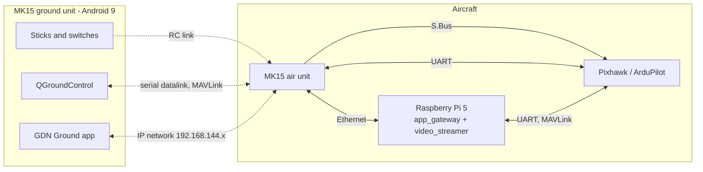
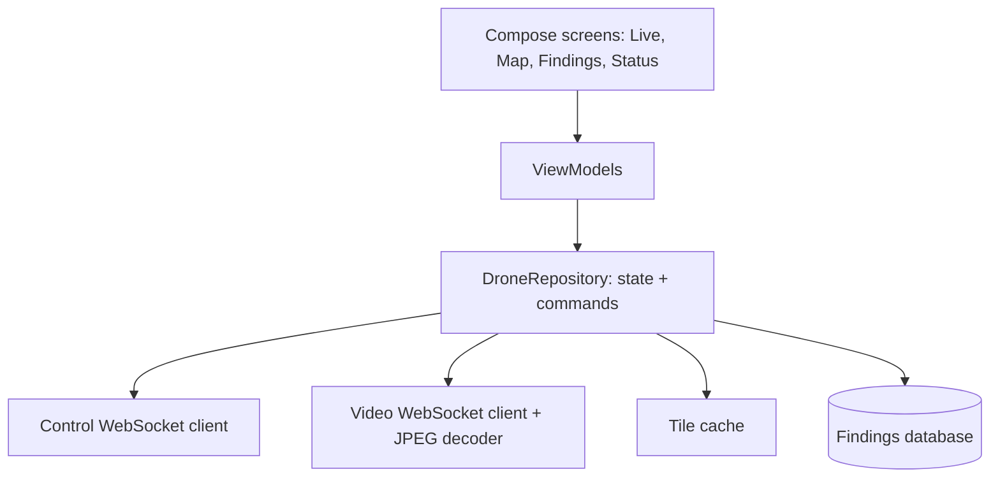

# Ground App for the SIYI MK15 (Android)

| Field | Value |
|---|---|
| Document ID | GDN-COM-003 |
| Version | 1.0 (introduced in design baseline DB-3.0) |
| Date | 2026-10-06 |
| Status | Baseline — design only; no app code exists |
| Decision | [ADR-017](../17-decisions/ADR-017-ground-app.md) |
| Requirements | FR-110 – FR-119; NFR-080 – NFR-084 |
| Companion side | package `gdn_app_gateway` (nodes `app_gateway`, `video_streamer`) |

## 1. Purpose

A native Android app, running on the MK15 ground unit, from which the operator:

- watches live video with detections,
- sees the drone on the satellite map,
- selects an object to track and follow,
- draws an area and starts a grid search,
- reviews what the drone has found, with coordinates.

It is the operator's mission interface. It is **not** a replacement for the RC sticks, the flight-mode switch, or QGroundControl.

## 2. How the MK15 is built, and where the app fits

The MK15 gives an Android app three separate paths to the aircraft. The design uses each for what it is good at.

| MK15 path | Carries | Used by | Why |
|---|---|---|---|
| RC link → S.Bus | Sticks, flight mode, safety switches | Pilot | Flight-critical; independent of everything else |
| Serial datalink (MAVLink; UART / USB COM / Bluetooth / UDP selectable in the SIYI TX app) | Standard telemetry, parameters | **QGroundControl** | Low bandwidth (57 600 baud); effectively one consumer; QGroundControl's forwarding to a second app is one-way |
| Ethernet / IP bridge (the path SIYI uses for cameras and video) | Video and data from IP devices on the aircraft | **The app** ↔ Raspberry Pi | High bandwidth; SIYI documents third-party IP devices on this network (addresses .11, .12 and .20 are reserved) |

Consequences:

- The app needs **no MAVLink** of its own. Everything it shows and commands goes to and from the Pi over IP. QGroundControl is untouched and keeps working.
- The Pi's Ethernet port connects to the air unit. The **HDMI input converter is no longer used** (video topology B in [siyi-mk15.md](../03-hardware/siyi-mk15.md)). This removes about 55 g and 3 W.
- The on-screen overlay is drawn by the app from data, so the `hud_node` on the Pi is retired.

`[VERIFY]` on the owned unit before development: that an Android app on the ground unit can open TCP/UDP sockets to a third-party device on the air unit's Ethernet; the usable bandwidth and latency of that path; that a custom APK can be installed.

## 3. Network

| Item | Value |
|---|---|
| Subnet | 192.168.144.0/24 (SIYI default) |
| Air unit / ground unit / Android | .11 / .12 / .20 (reserved by SIYI) |
| Raspberry Pi | 192.168.144.50, static `[VERIFY free]` |
| Control channel | WebSocket, TCP port 8765, JSON messages |
| Video channel | MJPEG frames over a second WebSocket (TCP 8766), 640×480, 10 fps, quality ≈ 60 |
| Map tiles | HTTP GET on port 8767 (read-only), cached by the app |
| Time | App clock is not trusted; all timestamps come from the Pi |

Bandwidth estimate: video ≈ 2–3 Mbit/s; control and status < 50 kbit/s; findings thumbnails are occasional bursts of ≈ 15 kB. The link's video capacity is ≈ 12 Mbit/s by the vendor's figures for its own encoder.

Why MJPEG: the Raspberry Pi 5 has no hardware video encoder. JPEG frames cost a few milliseconds of CPU each and tolerate packet loss without long freezes. Software H.264 at 720p is an optimisation to try later.

## 4. Authority and safety rules

| Rule | Implementation |
|---|---|
| The app cannot arm, disarm or change flight mode | No such message exists in the protocol |
| The app cannot override the pilot | RC goes to the flight controller directly. Any non-GUIDED mode ends app-commanded behaviour at once |
| App commands are **requests** | `app_gateway` passes them to `mission_manager`; the same gates apply as for any mission: pilot armed, GUIDED selected by the pilot, autonomy switch on, safety state NOMINAL, navigation mode permitting motion |
| Every request gets an answer | `ack` or `nack` with a reason the operator can read |
| Loss of the app link | Defined per behaviour (§8). Never causes an unsafe action |
| One operator | A second connection is refused |
| Access | A shared key entered once in the app; the radio link is the real boundary. No internet connection is used |

The app is advisory-class software (class C in the software architecture): if it crashes, flight is unaffected.

## 5. Screens

| Screen | Shows | Actions |
|---|---|---|
| **Live** | Video; detection boxes with class and range; navigation-mode banner (GPS / MAP / ODOMETRY / LOST); confidence; time since last map fix; battery; height | Tap an object to select it; **Track**, **Follow**, **Stop** (hold) |
| **Map** | Satellite map (tiles from the drone's own map pack, cached), drone position and heading, position-uncertainty circle, flown path, map coverage boundary, geofence, search area and progress, finding pins | Draw a rectangle or polygon; set search height and line spacing; **Start search**, **Pause**, **Resume**, **Abort**; tap a pin → details |
| **Findings** | List of finds: thumbnail, class, confidence, latitude/longitude, time, estimated position uncertainty | **Confirm**, **Reject**, **Go there** (fly over it and hold), export as file |
| **Status** | Pre-flight GO / NO-GO list with reasons; map pack name, date and licence; software versions; link quality | Run pre-flight check; set start position for a cold start without GPS |

Layout is landscape for the 5.5-inch screen, with large touch targets (≥ 12 mm) usable with thumbs while holding the controller. The **Stop** button is on every screen.

Text shown to the operator is plain: "No map fix for 25 s", not internal state names.

## 6. Protocol (control channel)

JSON objects with a `type` field. Requests carry an `id`; the reply echoes it.

### Drone → app

| Type | Rate | Content |
|---|---|---|
| `hello` | Once | Protocol version, software version, map pack id and bounds, camera list |
| `status` | 2 Hz | Flight mode, armed, navigation mode, position sub-mode, confidence, fix age, position (lat, lon, map x/y), heading, height, speed, position uncertainty, battery, safety level, autonomy enabled, active behaviour |
| `detections` | Up to 5 Hz | Frame id and stamp, camera (front / down), list of boxes: id, class, score, range if valid |
| `target` | 5 Hz while tracking | Track id, state (tracking / lost), box, ground position, speed |
| `search` | 1 Hz while searching | Progress %, current line, lines total, area covered, time remaining estimate |
| `finding` | Event | Id, class, score, lat/lon, uncertainty, time, thumbnail (JPEG, base64, ≤ 20 kB) |
| `event` | Event | Severity, plain-language message (same text as the `STATUSTEXT` sent to QGroundControl) |
| `ack` / `nack` | Per request | `id`, and for `nack` a reason code and message |
| `ping` | 1 Hz | Heartbeat |

### App → drone

| Type | Parameters | Effect |
|---|---|---|
| `select_target` | Frame id, normalised x, y (or detection id) | Start tracking the object under the tap |
| `clear_target` | — | Stop tracking |
| `follow_start` | Optional height | Follow the tracked target from above |
| `search_start` | Polygon (lat/lon list), height, spacing or overlap, speed, classes | Plan and fly a grid search |
| `search_pause` / `search_resume` / `search_abort` | — | — |
| `goto_finding` | Finding id | Fly over the finding and hold |
| `finding_review` | Finding id, confirmed / rejected | Stored with the log |
| `hold` | — | Stop moving and hold position (the **Stop** button) |
| `preflight_run` | — | Returns the GO / NO-GO list |
| `set_start_position` | Lat, lon, radius | Cold start without GPS |
| `pong` | — | Heartbeat reply |

Tap coordinates always refer to a frame id, because the picture on screen is a fraction of a second old. The Pi resolves the tap against the detections of that frame, not the newest one.

`nack` reasons include: not armed; pilot has not selected GUIDED; autonomy switch off; navigation mode does not permit motion; area outside map coverage; area outside geofence; area too large for the battery; height out of range; no target selected; safety hold active.

## 7. App architecture

| Aspect | Choice | Reason |
|---|---|---|
| Language | Kotlin | Standard for Android |
| Minimum Android | 9 (API 28), the MK15's version | Target device |
| UI | Jetpack Compose (or XML views if Compose proves heavy on 2 GB RAM `[VERIFY]`) | Fast to build; one team member can own it |
| Structure | Single activity; MVVM; one repository holding the connection and state | Simple and testable |
| Networking | OkHttp WebSocket; kotlinx.serialization for JSON | Mature; small |
| Video | Decode JPEG frames to a bitmap; draw boxes natively on top from `detections` | No codec dependencies; overlay stays sharp |
| Map | osmdroid (or MapLibre) with a custom offline tile source fed from the Pi and cached on the device | Works with no internet; uses the same imagery the drone matches against |
| Storage | Findings and events in a local database (Room); export as GeoJSON/CSV | Review after the flight |
| Distribution | Sideloaded APK | Research prototype |

Map imagery is stored on the ground unit as well as on the drone. The imagery licence must permit that ([ADR-016](../17-decisions/ADR-016-reference-imagery-and-downward-camera.md)).

## 8. Behaviour when the app link is lost

| Active behaviour | Link lost > 3 s | Link lost > 30 s | Link returns |
|---|---|---|---|
| None / hold | Nothing | Nothing | State re-sent |
| Tracking only | Tracking continues | Continues | Target state re-sent |
| **Follow** | Continue for 10 s, then hold position | Stay in hold | Operator must restart follow |
| **Grid search** | Continue (default) or hold, by setting | Finish the current line, then hold at the end of it | Findings made meanwhile are re-sent |
| Go to finding | Complete, then hold | Hold | — |

The pilot is unaffected in every case: RC and QGroundControl use different paths.

## 9. Companion side

| Node | Language | Responsibility |
|---|---|---|
| `app_gateway` | Python (asyncio) | WebSocket server; translates protocol messages to ROS 2 actions, services and topics; enforces single operator, key, rate limits and input validation; never talks to MAVROS directly |
| `video_streamer` | C++ | Subscribes to the selected camera image, downsizes, JPEG-encodes, sends with frame id; switches between front and down cameras on request or by flight profile |
| `tile_server` (part of `app_gateway`) | Python | Serves map pack preview tiles read-only |

Details: [node-reference.md](../05-ros2/node-reference.md), DB-3.0 additions.

Input validation happens on the Pi, not in the app: polygons are checked against map coverage, the geofence and a maximum area; heights against the profile limits; all numbers against ranges. A malformed message is dropped and counted.

## 10. Development and test without the drone

| Stage | Set-up |
|---|---|
| 1 | App against a **mock gateway** on a laptop that replays recorded status, detections and video |
| 2 | App against the real gateway running with SITL/Gazebo on the workstation, over Wi-Fi |
| 3 | App on the MK15 against the Pi on the bench through the real radio link |
| 4 | Flight |

Stage 1 lets the app be built in parallel with everything else.

## 11. Verification

| Test | Level | Pass |
|---|---|---|
| Protocol encode/decode; `nack` for every invalid request | L1 | All cases |
| Gateway gates: each request refused in each disallowed state | L3 | Table-driven |
| Tap-to-select resolves against the tapped frame | L3 | Correct object in 20 of 20 replayed cases |
| Link loss behaviours in §8 | L5 (SITL) | As specified |
| End to end on the MK15: video latency, command latency, range | L7 | Video ≤ 500 ms; command ack ≤ 300 ms |
| Usability: a new operator starts a search without help | L7 | ≤ 2 minutes |
| App crash during a mission | L5, L7 | Flight unaffected; reconnect restores state |

## 12. Open points

| # | Item |
|---|---|
| APP-1 | Confirm IP reachability from an Android app on the MK15 to a device on the air unit's Ethernet; measure bandwidth and latency |
| APP-2 | Confirm sideloading and screen behaviour (split screen with QGroundControl, staying awake) on the MK15 |
| APP-3 | Cable: air unit 8-pin connector to the Pi's RJ45 |
| APP-4 | Compose performance on the MK15 (2 GB RAM) |
| APP-5 | Whether video at 640×480, 10 fps is good enough to pick out targets; H.264 option |
| APP-6 | Whether a minimal MAVLink fallback for "Stop" is wanted, in case the IP path fails while the datalink survives. Default: no; the pilot's switch already does this |
