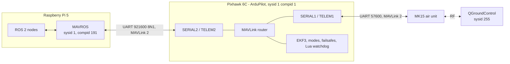
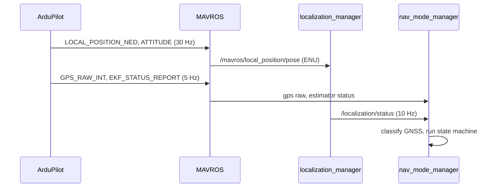
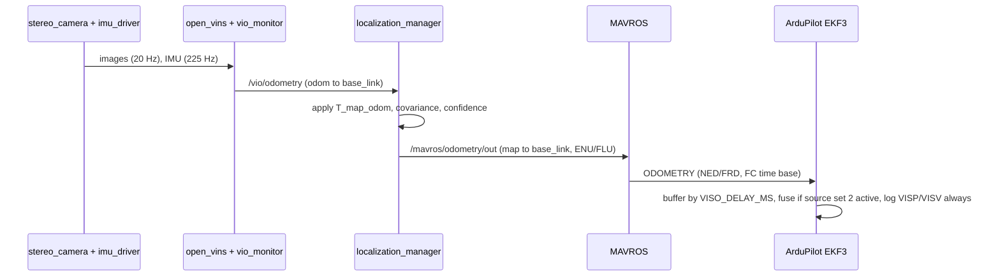
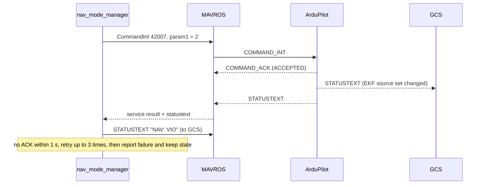
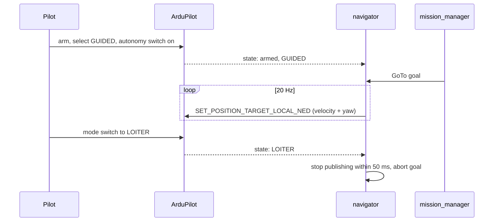

# MAVLink and Flight-Controller Integration

| Field | Value |
|---|---|
| Document ID | GDN-COM-001 |
| Version | 1.0 |
| Date | 2026-10-05 |
| Decisions | [ADR-008](../17-decisions/ADR-008-mavlink-architecture.md), [ADR-009](../17-decisions/ADR-009-gps-denied-transition.md) |
| Requirements | FR-023, FR-031, FR-046, FR-050 – FR-054, FR-070 – FR-073 |

## 1. Topology

| Link | Peers | Purpose |
|---|---|---|
| A | Pi ↔ FC | Everything the companion contributes or observes |
| B | FC ↔ GCS | Pilot/operator telemetry and commands; independent of the Pi |
| Routed | Pi → FC → GCS | Small status messages from the companion |

System/component IDs: the companion uses the vehicle's system ID with component ID `MAV_COMP_ID_ONBOARD_COMPUTER` (191), so that the GCS shows it as part of the same vehicle and the FC watchdog can identify its heartbeat. `[VERIFY]` that MAVROS's default IDs are changed accordingly and that the GCS heartbeat (used by `FS_GCS_ENABLE`) is not confused with the companion's.

## 2. Principle: what the companion may and may not do

| The companion **does** | The companion **never** does |
|---|---|
| Supply external-navigation measurements | Arm or disarm |
| Supply obstacle distances | Send attitude, rate or actuator commands |
| Request an EKF source set | Send RC overrides |
| Send position/velocity setpoints in GUIDED | Change mode *into* GUIDED or out of a pilot-selected mode |
| Request GUIDED-exit modes (BRAKE, LOITER, ALT_HOLD, LAND, RTL) | Write FC parameters in flight |
| Send status text and named values | Disable or reconfigure any failsafe |
| Read FC state | Act as the GCS for failsafe purposes |

FC-side safety functions stay entirely in the FC: RC failsafe, battery failsafe, EKF failsafe, geofence, arming checks, crash detection, motor emergency stop, and the companion watchdog.

## 3. Companion → flight controller (complete list)

| # | MAVLink message | Rate | Source node → MAVROS interface | Content | FC use |
|---|---|---|---|---|---|
| U1 | `HEARTBEAT` | 1 Hz | MAVROS | Type onboard controller | Link presence; Lua watchdog |
| U2 | `ODOMETRY` | 20–30 Hz | `localization_manager` → `/mavros/odometry/out` | Aligned pose, velocity, covariance, reset counter, quality | EKF3 ExternalNav (source set 2); logged in all states |
| U3 | `OBSTACLE_DISTANCE` | 10 Hz | `obstacle_sectors` → `/mavros/obstacle/send` | 72 sectors × 5°, cm; unknown outside camera FOV | Proximity → avoidance |
| U4 | `SET_POSITION_TARGET_LOCAL_NED` | 20 Hz, only when navigating | `navigator` → `/mavros/setpoint_raw/local` | Velocity + yaw, or position + yaw | GUIDED controller |
| U5 | `COMMAND_INT` `MAV_CMD_SET_EKF_SOURCE_SET` (42007) | Event | `nav_mode_manager` → `/mavros/cmd/command_int` | param1 = 1, 2 or 3 | Switch EKF source set |
| U6 | `COMMAND_LONG` `MAV_CMD_DO_SET_MODE` | Event | `navigator`, `nav_mode_manager`, `safety_supervisor` → `/mavros/set_mode` | BRAKE / LOITER / ALT_HOLD / LAND / RTL | Leave GUIDED |
| U7 | `COMMAND_LONG` `MAV_CMD_NAV_TAKEOFF` | Event (late phases) | `navigator` → `/mavros/cmd/takeoff` | Altitude | Take-off in GUIDED after pilot arms |
| U8 | `COMMAND_LONG` `MAV_CMD_SET_MESSAGE_INTERVAL` | At start-up | `nav_mode_manager` | Message ID, interval | Stream rates on SERIAL2 |
| U9 | `SET_GPS_GLOBAL_ORIGIN` | Once, indoor start only | `nav_mode_manager` | Latitude, longitude, altitude | EKF origin without GNSS |
| U10 | `TIMESYNC` / `SYSTEM_TIME` | ≈ 1–10 Hz | MAVROS `sys_time` | Clock exchange | Time offset |
| U11 | `STATUSTEXT` | ≤ 1 Hz | `telemetry_node` → `/mavros/statustext/send` | Mode changes, faults, GO/NO-GO | Routed to GCS; logged |
| U12 | `NAMED_VALUE_FLOAT` | 1 Hz × 6 values | `telemetry_node` → `/mavros/debug_value/send` | `loc_conf`, `nav_mode`, `vio_feat`, `skew_ms`, `cc_temp`, `obst_m` | Routed to GCS; logged |
| U13 | `PARAM_REQUEST_READ` | At start-up | `safety_supervisor` via MAVROS `param` | Read-only | Pre-flight verification of FC configuration |

Fallback for U2 if `ODOMETRY` is not accepted as expected on the bench: `VISION_POSITION_ESTIMATE` (pose + covariance + reset counter) plus `VISION_SPEED_ESTIMATE` (velocity), via the MAVROS `vision_pose` and `vision_speed` plugins.

Estimated uplink load: U2 ≈ 240 B × 30 = 7.2 kB/s; U3 ≈ 170 B × 10 = 1.7 kB/s; U4 ≈ 65 B × 20 = 1.3 kB/s; others < 0.5 kB/s. Total ≈ 11 kB/s of 92 kB/s available.

## 4. Flight controller → companion (complete list)

| # | MAVLink message | Requested rate | MAVROS topic | Used by | Purpose |
|---|---|---|---|---|---|
| D1 | `HEARTBEAT` | 1 Hz | `/mavros/state` | all decision nodes | Connected, armed, flight mode |
| D2 | `LOCAL_POSITION_NED` | 30 Hz | `/mavros/local_position/*` | `localization_manager`, `navigator` (indirectly) | EKF position and velocity |
| D3 | `ATTITUDE_QUATERNION` (or `ATTITUDE`) | 30 Hz | `/mavros/imu/data` | `localization_manager`, `vio_monitor`, `obstacle_sectors` | EKF attitude and body rates |
| D4 | `GPS_RAW_INT` | 5 Hz | `/mavros/gpsstatus/gps1/raw` | `nav_mode_manager` | Fix, satellites, HDOP, h_acc, velocity |
| D5 | `GLOBAL_POSITION_INT` | 5 Hz | `/mavros/global_position/*` | logging | Global position |
| D6 | `EKF_STATUS_REPORT` | 5 Hz | `/mavros/estimator_status` (+ variances `[VERIFY]`) | `nav_mode_manager` | EKF health and variances |
| D7 | `DISTANCE_SENSOR` | 10 Hz | `/mavros/rangefinder/rangefinder` | `navigator`, `nav_mode_manager` | Height above ground |
| D8 | `OPTICAL_FLOW` | 5 Hz | (raw or plugin) | `nav_mode_manager` | Flow quality for tier-3 availability |
| D9 | `RC_CHANNELS` | 5 Hz | `/mavros/rc/in` | `nav_mode_manager`, `safety_supervisor` | Autonomy switch; detection of pilot source selection |
| D10 | `SYS_STATUS`, `BATTERY_STATUS` | 1 Hz | `/mavros/battery` | `safety_supervisor`, HUD | Display and logging |
| D11 | `STATUSTEXT` | Event | `/mavros/statustext/recv` | `nav_mode_manager`, recorder | EKF source change confirmations, pre-arm failures, FC warnings |
| D12 | `COMMAND_ACK` | Event | Service responses | callers | Result of U5–U8 |
| D13 | `TIMESYNC`, `SYSTEM_TIME` | 1–10 Hz | `/mavros/timesync_status` | `localization_manager` | Clock offset |
| D14 | `EXTENDED_SYS_STATE` | 1 Hz | `/mavros/extended_state` | `navigator` | Landed state |
| D15 | `HOME_POSITION`, `GPS_GLOBAL_ORIGIN` | On change | `/mavros/home_position/home` | `nav_mode_manager` | Origin known |
| D16 | `PARAM_VALUE` | On request | param plugin | `safety_supervisor` | Configuration check |
| D17 | `VIBRATION` | 1 Hz | `/mavros/vibration/raw/vibration` (if plugin loaded) | recorder | Vibration levels for analysis |

Not requested on this link: raw IMU at high rate (the VIO uses the camera-board IMU), servo outputs, mission items, terrain data.

Estimated downlink load: ≈ 8–12 kB/s.

## 5. Flows

### 5.1 State flow (FC → Pi)

### 5.2 Navigation data flow (Pi → FC)

### 5.3 Command flow — source switch

### 5.4 Command flow — autonomous motion

### 5.5 Telemetry flow (to the operator)

| Information | Path | Seen as |
|---|---|---|
| Standard vehicle telemetry | FC → TELEM1 → MK15 → QGC | Normal QGC instruments |
| Navigation mode, faults | Pi → `STATUSTEXT` → FC router → TELEM1 → QGC | Message list / voice |
| Confidence, feature count, skew, temperature, obstacle range | Pi → `NAMED_VALUE_FLOAT` → FC router → QGC | MAVLink inspector / custom widget |
| EKF source change | FC → `STATUSTEXT` → QGC | Message list |
| Video with overlay | Pi HDMI → converter → MK15 | Video panel |

## 6. Failsafe communication

| Condition | Detection | Action | Owner |
|---|---|---|---|
| Companion heartbeat lost while in GUIDED | Lua script: no `HEARTBEAT` from component 191 for 2 s | Set mode BRAKE; after 3 s LOITER if EKF position is healthy, else ALT_HOLD; announce by `STATUSTEXT`; LAND after a configurable hold time if the pilot does not act | FC (Lua) |
| Setpoints stop while in GUIDED (navigator crash, but MAVROS alive) | ArduPilot `GUID_TIMEOUT` (set 1–2 s) | Vehicle stops and holds | FC (native) |
| External nav stops while source set 2 is active | EKF loses aiding → variances rise → EKF failsafe (`FS_EKF_THRESH`, `FS_EKF_ACTION`) | Land or AltHold per parameter. Before that, the companion (if alive) commands source set 3. If the companion is dead, the Lua watchdog also commands source set 3 when flow is healthy. | FC (native + Lua) |
| GCS link lost | `FS_GCS_ENABLE` on the GCS heartbeat (sysid 255) | Configured action (continue if RC is alive is acceptable for line-of-sight tests) | FC |
| RC lost | `FS_THR_ENABLE` | RTL (tier 1) / LAND (other tiers): see safety architecture for the tier-dependent choice | FC |
| FC link lost (seen from the Pi) | `/mavros/state.connected` false | All nodes hold; no blind setpoints; keep logging | Pi |
| Serial errors | MAVROS diagnostics (RX drops, CRC) | WARN; pre-flight NO-GO above threshold | Pi |

The Lua watchdog is the only custom logic on the FC. It is short, has no dependency on the companion beyond observing its heartbeat, and is tested in SITL (ArduPilot SITL runs Lua scripts).

## 7. Time synchronisation

| Item | Design |
|---|---|
| Mechanism | MAVROS `sys_time` plugin exchanges `TIMESYNC` with ArduPilot and maintains an offset between ROS time and FC boot time |
| Use | Outgoing `ODOMETRY.time_usec` is expressed in the FC time base |
| Latency compensation | `VISO_DELAY_MS` on the FC, set from measurement ([calibration.md](../06-computer-vision/calibration.md) C8) |
| Health | `timesync_status` jitter and offset rate monitored; unstable sync caps confidence |
| Open point | Whether ArduPilot 4.7 uses the message timestamp, the arrival time minus `VISO_DELAY_MS`, or both `[VERIFY]`. The design works in either case as long as the delay parameter is calibrated. |

## 8. ArduPilot parameter plan (design intent)

To be stored as `.param` files in `fc_config/params/`. Every value is to be validated in SITL first, then on the bench. Parameter names must be checked against the Copter 4.7 list.

### Serial

| Parameter | Value | Meaning |
|---|---|---|
| `SERIAL1_PROTOCOL` / `SERIAL1_BAUD` | 2 / 57 | MAVLink 2 to MK15 |
| `SERIAL2_PROTOCOL` / `SERIAL2_BAUD` | 2 / 921 | MAVLink 2 to the Pi |
| `SERIAL2_OPTIONS` | 0 initially | Set bit 10 (1024, "don't forward") only if companion traffic floods TELEM1; note this would also block U11/U12 from reaching the GCS, so the preferred control is stream-rate limits |
| `SERIALx_PROTOCOL` / `BAUD` / `OPTIONS` (MTF-01 port) | 1 / 115 / 1024 | MTF-01 |
| `SR1_*` | Low rates (1–4 Hz) | TELEM1 bandwidth |
| `BRD_SER2_RTSCTS` | 0 | No flow control (3-wire) |

### EKF and sources

| Parameter | Value |
|---|---|
| `AHRS_EKF_TYPE`, `EK3_ENABLE`, `EK2_ENABLE` | 3, 1, 0 |
| `EK3_SRC1_POSXY / VELXY / POSZ / VELZ / YAW` | 3 / 3 / 1 / 3 / 1 |
| `EK3_SRC2_POSXY / VELXY / POSZ / VELZ / YAW` | 6 / 6 / 1 / 6 / 1 (6 for indoor) |
| `EK3_SRC3_POSXY / VELXY / POSZ / VELZ / YAW` | 0 / 5 / 1 / 0 / 1 |
| `EK3_SRC_OPTIONS` | 0 |
| `VISO_TYPE` | 1 (MAVLink) |
| `VISO_POS_X/Y/Z` | 0 (lever arm applied on the companion) |
| `VISO_DELAY_MS` | Measured (start 80) |
| `VISO_POS_M_NSE / VEL_M_NSE / YAW_M_NSE` | 0.2 / 0.2 / 0.2 (start) |
| `FLOW_TYPE` | 5 |
| `RNGFND1_TYPE / MIN / MAX / ORIENT` | 10 / 0.01 / 8 / 25 (down) |
| `EK3_FLOW_USE`, `EK3_RNG_USE_HGT` | Per ArduPilot flow setup guide |

### RC options

| Parameter | Value | Function |
|---|---|---|
| `RC6_OPTION` | 90 | EKF source set (3-position) |
| `RC7_OPTION` | 31 | Motor emergency stop |
| `RC8_OPTION` | 65 | GPS disable (test) |
| `RC9_OPTION` | 300+ (scripting input) or none | Autonomy enable, read by the companion |

### Proximity / avoidance

| Parameter | Value |
|---|---|
| `PRX1_TYPE` | 2 (MAVLink) |
| `AVOID_ENABLE` | 7 |
| `AVOID_MARGIN` | 1.5–2.0 m |
| `AVOID_BEHAVE` | 1 (stop) |
| `AVOID_DIST_MAX`, `AVOID_ANG_MAX` | 1.5 m, 30° (start values from ArduPilot's depth-camera guide) |

### Failsafe and limits

See [safety-architecture.md](../12-safety/safety-architecture.md) §6.

### Logging

| Parameter | Value |
|---|---|
| `LOG_BITMASK` | Default + fast attitude + optical flow |
| `LOG_DISARMED` | 1 on the bench (to capture external-nav checks), 0 for flight |
| `SCR_ENABLE` | 1 |

## 9. Bench verification of the link (before any flight)

| # | Check | Pass |
|---|---|---|
| ML-1 | MAVROS connects at 921 600; no RX drops over 10 min | 0 CRC errors; heartbeat steady |
| ML-2 | Requested stream rates achieved | Within 10 % |
| ML-3 | `ODOMETRY` received by FC | `VISP`/`VISV` in the dataflash log at 20–30 Hz; values match hand motion (frame checks CF-1…CF-5) |
| ML-4 | Source switch command | ACK accepted; status text; EKF uses external nav (`XKFS` log) |
| ML-5 | Pilot source switch overrides | Companion detects and yields |
| ML-6 | `OBSTACLE_DISTANCE` | Proximity display in the GCS shows the obstacle at the right bearing and range |
| ML-7 | Kill MAVROS in GUIDED (props off) | Lua watchdog changes mode within 2–3 s |
| ML-8 | Kill navigator in GUIDED (props off / SITL) | Vehicle stops by `GUID_TIMEOUT` |
| ML-9 | Status text and named values on the MK15 | Visible in QGC |
| ML-10 | TELEM1 not saturated | Parameter download and telemetry remain responsive with the companion active |
| ML-11 | Time sync | Offset stable; jitter < 5 ms |
