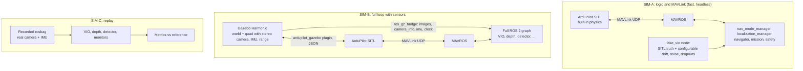
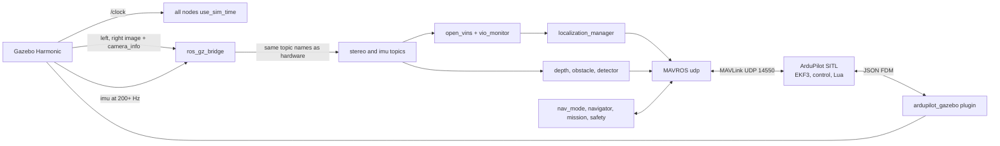

# Simulation Strategy

| Field | Value |
|---|---|
| Document ID | GDN-SIM-001 |
| Version | 1.0 |
| Date | 2026-10-05 |
| Decision | [ADR-013](../17-decisions/ADR-013-simulation.md) |

## 1. Why simulation first

| Reason | Detail |
|---|---|
| Safety | The GNSS → vision switch, failsafes and the watchdog are exercised hundreds of times with no risk |
| Hardware independence | The flight controller is not yet procured; software can progress now |
| Repeatability | The same scenario with the same fault injected at the same instant |
| Coverage | Faults that cannot be produced safely in flight (EKF divergence, companion crash at speed) |

Simulation does **not** validate: real camera timing and rolling shutter, vibration, real lighting, real CPU load and thermal behaviour, RF and EMI. Those belong to bench and flight testing.

## 2. Options evaluated

| Option | Runs real autopilot code | Camera/IMU simulation | ROS 2 Jazzy fit | Notes | Verdict |
|---|---|---|---|---|---|
| **ArduPilot SITL + Gazebo Harmonic (`ardupilot_gazebo`)** | Yes, including EKF3, source switching, Lua scripts, failsafes | Gazebo sensors (stereo camera, IMU, range) bridged by `ros_gz` | Harmonic is the Gazebo release paired with Jazzy; the ArduPilot plugin supports Harmonic | ArduPilot's ROS 2 launch packages (`ardupilot_gz`) target Humble + native DDS; they are **not needed** because this design uses MAVROS over UDP | **Selected** |
| PX4 SITL + Gazebo | Yes (PX4) | Same | First-class | Wrong autopilot for this design | Rejected (follows ADR-002) |
| ArduPilot SITL alone (built-in physics) | Yes | None | n/a | Fast; good for state-machine and MAVLink tests with a *synthetic* VIO source | **Selected as a second, lighter configuration** |
| Gazebo Classic | — | — | End of life | — | Rejected |
| AirSim / Colosseum | Yes (via MAVLink) | Photorealistic | Extra bridges; heavy GPU; original project archived | Better images for VIO realism, at high setup cost | Not in baseline; optional for VIO realism |
| NVIDIA Isaac Sim | Possible | Photorealistic | Needs an RTX GPU | Out of proportion | Rejected |
| Bag replay | No autopilot | **Real** sensor data | Native | Best fidelity for perception and VIO; open-loop only | **Selected as the third configuration** |

## 3. Three simulation configurations

| Config | Purpose | Speed | Runs on |
|---|---|---|---|
| SIM-A | State machine, source switching, alignment, navigator, failsafes, Lua watchdog; CI regression | Faster than real time, no GPU | Any PC; also CI |
| SIM-B | End-to-end: perception → VIO → alignment → FC → motion; obstacle stop; mission | Real time or slower | Workstation with a GPU recommended |
| SIM-C | VIO and perception quality on real data; regression after parameter changes | Faster than real time | Workstation or the Pi itself |

The `fake_vio` node in SIM-A is test tooling (package `gdn_sim`): it takes SITL ground-truth pose, expresses it in an arbitrary `odom` frame (random offset and yaw), adds configurable drift, noise, latency, dropouts and resets, and publishes the same topics as the real VIO. It allows every state-machine transition to be triggered deterministically.

## 4. Architecture of SIM-B

Hardware and simulation share everything from the topic boundary rightwards (FR-083). Only `sensors.launch.py` and `fcu_url` change.

### Vehicle model

| Element | Simulated as |
|---|---|
| Airframe | Iris-class quad model from `ardupilot_gazebo`, mass and inertia adjusted to ≈ 1.9 kg |
| Stereo camera | Two Gazebo camera sensors, 60 mm baseline, 73° HFOV, 640×480, 20 Hz, mono, with image noise |
| VIO IMU | Gazebo IMU sensor at the camera location with ICM-20948-like noise and bias random walk |
| Range sensor | Gazebo single-ray lidar, downward, 8 m → SITL rangefinder |
| Optical flow | SITL's simulated flow sensor (`SIM_FLOW_ENABLE`) |
| GNSS, compass, baro, FC IMU | SITL internal models |

Not modelled in baseline: rolling shutter, L/R skew, exposure effects, propeller vibration. A configurable inter-camera delay can be added by delaying the right image in the bridge to study sensitivity.

### Worlds

| World | Content | Tests |
|---|---|---|
| `textured_yard` | Open ground with textured surface, buildings/objects within 10 m | Nominal VIO, GNSS → VIO transition, waypoint square |
| `obstacle_course` | Yard plus walls, posts and a low-texture panel | Obstacle stop, unknown-depth handling |
| `indoor_hall` | Enclosed, textured walls, no GNSS (`SIM_GPS1_ENABLE = 0`) | Indoor start, vision-only |
| `low_texture` | Uniform ground and sky | VIO failure → flow fallback → localisation lost |
| `people` | Actors/static human models, vehicles | Detector + object ranging + mission rule |

### DB-2.0: simulating satellite map matching

| Element | Simulated as |
|---|---|
| Ground | A flat plane in Gazebo textured with a georeferenced orthoimage at true scale (1 km × 1 km), world origin = map origin |
| Downward camera | Gazebo camera sensor under the vehicle, 100° HFOV, 640×480, 15 Hz |
| Reference for the matcher | **Not the same image** as the ground texture where possible: a different-date image of the same area, or the texture with altered brightness/contrast, blur, noise and small local edits. Matching an image against itself proves nothing |
| SIM-A | `fake_vio` gains a fake map-fix source: ground truth + configurable noise (σ 2–5 m), dropouts, outliers, constant offset. Used to develop the offset filter, gates and transitions T19–T23 without rendering |
| SIM-C | Replay of public UAV-to-satellite datasets and of the project's own GNSS-tagged recordings. This is the configuration that decides gate G2 |

Worlds added: `sat_site` (orthoimage of the real test site), `sat_featureless` (fields/water, to exercise fix loss).

Scenarios added (details in [testing-strategy.md](../13-testing/testing-strategy.md) §9a): S-21 circuit on map matching; S-22 fix dropout; S-23 wrong-fix injection; S-24 coverage edge.

Fidelity gap: a textured plane has no relief, no shadows that move with the sun, and no seasonal change. Simulation shows that the pipeline and the logic work; only real imagery shows whether matching works.

## 5. Fault injection

| Fault | Method | Expected result |
|---|---|---|
| GNSS loss | `SIM_GPS1_ENABLE = 0` (or `SIM_GPS_DISABLE` on older versions) `[VERIFY name in 4.7]` | T7: switch to source set 2 |
| GNSS degradation | `SIM_GPS1_NUMSATS`, `SIM_GPS1_NOISE`, `SIM_GPS1_GLTCH_*`, `SIM_GPS1_DRFTALT` `[VERIFY names]` | DEGRADED classification; alignment freeze |
| GNSS spoof-like drift | Glitch/drift parameters ramped | `dv` check triggers |
| VIO dropout | Kill `open_vins`; or `fake_vio` dropout | T11 flow fallback |
| VIO drift / divergence | `fake_vio` drift ramp | Confidence falls via cross-checks |
| VIO reset | `fake_vio` reset; restart OpenVINS | Stream withheld until re-aligned |
| Companion crash | Kill MAVROS or the whole launch | Lua watchdog action |
| Navigator crash | Kill node | `GUID_TIMEOUT` stop |
| Flow failure | `SIM_FLOW_ENABLE = 0` | Localisation lost path |
| RC loss | `SIM_RC_FAIL = 1` | RC failsafe |
| Battery low | `SIM_BATT_VOLTAGE` | Battery failsafe |
| Wind | `SIM_WIND_SPD`, `SIM_WIND_DIR`, turbulence | Hold performance |
| Camera occlusion | Gazebo: move a panel in front of the cameras | VIO degraded; obstacle stop |
| Latency | Delay node on the odometry topic | Effect of `VISO_DELAY_MS` mismatch |

## 6. Development workstation

The current development machine runs Windows 11. ROS 2 Jazzy and Gazebo Harmonic are supported on Ubuntu 24.04.

| Option | Assessment |
|---|---|
| **Dual-boot Ubuntu 24.04** on the workstation | Best performance and compatibility. **Recommended** for SIM-B. |
| WSL 2 with Ubuntu 24.04 (WSLg for GUI) | Works for SIM-A, builds and tests. Gazebo rendering and sensor simulation depend on GPU pass-through and are often slow; acceptable for light use. |
| Virtual machine | Poor 3D performance; SIM-A only |
| A separate Linux PC or lab machine | Good if available |

Minimum for SIM-B: 4+ cores, 16 GB RAM, a discrete GPU. SIM-A and SIM-C run on modest hardware.

## 7. Simulation test matrix (summary)

| ID | Scenario | Config | Pass criterion |
|---|---|---|---|
| S-01 | Boot to READY, arm, take off, hover (GNSS) | A, B | State = GPS_NAV; stable |
| S-02 | Alignment convergence after a 5 m leg | A, B | Residual < 0.3 m, < 3° |
| S-03 | GNSS disabled in hover | A, B | VISION_NAV within 3 s; step < 1 m; hold < 0.5 m RMS |
| S-04 | GNSS disabled during a waypoint leg | A, B | Continues at VIO speed limit; reaches goal |
| S-05 | GNSS restored | A, B | GPS_RECOVERY → GPS_NAV when slow; step reported |
| S-06 | VIO killed in VISION_NAV | A, B | FLOW_FALLBACK within 1 s; holds |
| S-07 | VIO killed, flow disabled | A | LOCALIZATION_LOST; ALT_HOLD → LAND |
| S-08 | VIO drift ramp | A | Confidence drops; VISION_DEGRADED before 1 m error |
| S-09 | Companion killed in GUIDED | A, B | Watchdog: BRAKE → LOITER within 3 s |
| S-10 | Navigator killed mid-leg | A | Vehicle stops ≤ `GUID_TIMEOUT` |
| S-11 | Pilot mode change in each nav state | A | Setpoints stop ≤ 50 ms; no fight |
| S-12 | Pilot source switch | A | Companion yields |
| S-13 | Wall ahead | B | Stops ≥ 1.5 m from wall |
| S-14 | Low-texture wall ahead | B | Unknown → hold |
| S-15 | Mission square in VISION_NAV | B | Completes; closure error < 2 % of path |
| S-16 | Person in the path | B | Mission holds while within 5 m |
| S-17 | Indoor start, no GNSS | B | Origin set; hover on vision |
| S-18 | RC loss, battery low, fence breach in each tier | A | FC action as specified |
| S-19 | Wind 5 m/s in VISION_NAV | A, B | Hold < 0.75 m RMS |
| S-20 | 30-minute soak with random faults | A | No deadlock, no crash, all events logged |

S-01 to S-12 and S-18 are automated (launch tests driving SITL) and form the regression suite.

## 8. Fidelity gaps and how they are closed

| Gap | Closed by |
|---|---|
| Camera timing, rolling shutter, sync | SIM-C on real bags; bench tests |
| Vibration | Bench with motors running; first hover flights |
| CPU load and thermal on the Pi | Running SIM-C and the full stack on the Pi itself; bench soak |
| Real lighting and texture | Real-world bags from the test site |
| RF/EMI | Bench GNSS-noise test; range check |
| Aerodynamics of the real frame | Conservative tuning; manual flight tests first |

## 9. Tools

| Tool | Use |
|---|---|
| RViz2 | TF, images, odometry paths (VIO vs EKF vs truth), detections, obstacle sectors |
| MAVProxy / QGroundControl / Mission Planner | SITL console, parameters, manual mode changes during tests |
| `evo` | Trajectory error metrics |
| PlotJuggler | Time-series from bags |
| ArduPilot log tools (Mission Planner, MAVExplorer, UAV Log Viewer) | EKF innovations, `VISP`, `XKFS` |
