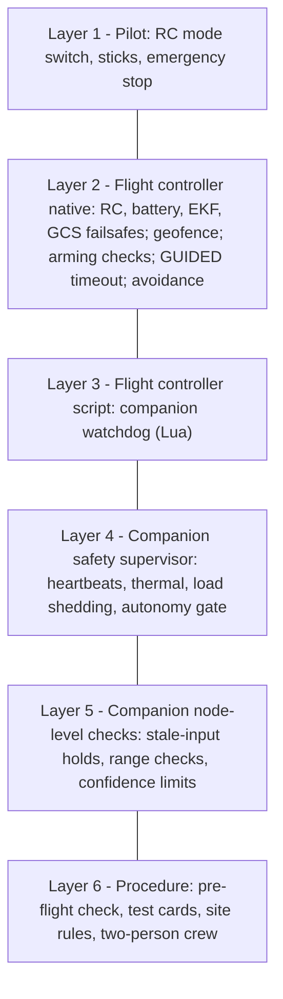

# Safety Architecture

| Field | Value |
|---|---|
| Document ID | GDN-SAF-001 |
| Version | 1.0 |
| Date | 2026-10-05 |
| Status | Baseline |
| Requirements | FR-070 – FR-079; NFR-020, NFR-021, NFR-030 – NFR-033 |
| Companion document | [fmea.md](fmea.md) |

## 1. Safety philosophy

1. **The pilot can always take over.** Nothing on the companion sits between the RC receiver and the flight controller.
2. **The flight controller owns safety.** Failsafes are ArduPilot functions configured by parameter. The companion adds supervision; it never replaces or disables an FC function.
3. **The companion is untrusted.** The design assumes it can crash, hang, overheat or produce wrong data at any moment, and that the vehicle must remain recoverable.
4. **Every autonomous behaviour has a fallback needing fewer sensors.**
5. **No step of testing is skipped.** Autonomy is earned level by level ([testing-strategy.md](../13-testing/testing-strategy.md)).
6. **Unknown means unsafe.** Missing or stale data is treated as the worst case.

## 2. Layers of protection

Higher layers override lower ones. Layer 1 and layer 2 work with the companion powered off.

## 3. Manual override

| Property | Implementation |
|---|---|
| Path | Pilot → MK15 → S.Bus → Pixhawk. Independent of the Pi. |
| Action | Flight-mode switch to any non-GUIDED mode (STABILIZE, ALT_HOLD, LOITER) |
| Companion reaction | Navigator stops publishing within one 50 ms cycle; goal and mission aborted; no automatic resume |
| Guarantee | The companion never sends `DO_SET_MODE` to GUIDED and never sends RC overrides, so it cannot contest the pilot's selection |
| Which mode to take over in | Tier 1: LOITER. Tier 2/3: LOITER holds on the active source. Position sources lost or doubtful: **ALT_HOLD** (needs no position estimate). Any doubt about altitude: STABILIZE. The pilot must be proficient in ALT_HOLD and STABILIZE before any GPS-denied test. |
| Emergency stop | RC switch (`RC7_OPTION = 31`); kills motors immediately. For imminent danger to people only. |
| Autonomy-enable switch | A separate RC channel read by the companion; off = companion sends no setpoints even in GUIDED |

## 4. Failure responses by subsystem

### 4.1 RC failure

| Detection | FC: S.Bus failsafe flag or loss of frames (`FS_THR_ENABLE`) |
|---|---|
| Response | GNSS-only flights: RTL. Any flight that includes a GPS-denied segment: **LAND**. RTL relies on a home-relative position; on vision that position may have drifted, and ArduPilot would still attempt RTL because a position estimate exists. The action is therefore fixed per test configuration by parameter file, not changed in flight. |
| Companion role | None; observes |
| Test | L7 props-off; L8 at low hover |

Rationale for the fixed choice: changing failsafe parameters in flight from the companion would violate principle 2. Test configurations are therefore prepared as separate parameter files: `failsafe_gnss.param` (RTL) and `failsafe_denied.param` (LAND).

### 4.2 Flight-controller failure

| Failure | Response |
|---|---|
| FC reboot or lock-up in flight | Not recoverable by design; motors stop or hold last output per ArduPilot/IO-processor behaviour. Mitigation is preventive: genuine hardware, clean power, no experimental firmware, bench soak. |
| IMU inconsistency | ArduPilot EKF lane switching / failsafe |
| Barometer or compass fault | EKF handling; pre-arm checks |
| The companion cannot help with FC failure and does not try. |

### 4.3 Companion computer failure

| Failure | Detected by | Response |
|---|---|---|
| Process crash (one node) | Supervisor heartbeat timeout (1 s); launch respawn | Class A: state machine leaves the VIO tier if needed; node restarted. Class B: hold. Class C: ignored. |
| Whole-stack hang or kernel panic | FC Lua watchdog: no companion heartbeat for 2 s | In GUIDED: BRAKE → LOITER (position healthy) or ALT_HOLD; if source set 2 was active, command source set 3 (flow) when flow is healthy, else rely on EKF failsafe |
| Power loss / brown-out | Same as hang | Same. FC supply is independent. |
| Wrong data without crash (bad VIO) | Cross-checks in `vio_monitor`/`localization_manager`; FC EKF innovation gates; EKF failsafe | Confidence drop → tier change; EKF rejects inconsistent external nav |
| Runaway setpoints | Navigator limits; FC limits (`ANGLE_MAX`, speed limits, fence); pilot | Bounded by FC limits and the fence |
| Thermal throttling | `system_monitor` | Load shedding (§5.3); NO-GO if present before take-off |
| Storage full | `system_monitor` | Recording stops; flight unaffected; NO-GO pre-flight if < 2 GB |

### 4.4 Camera failure

| Failure | Detected by | Response |
|---|---|---|
| One or both cameras stop | Driver timeout 200 ms; `vio_monitor` gap | VIO LOST → tier 3; obstacle data unknown → navigator hold |
| Sync lost | `sync_status` | Confidence falls; depth pairs dropped |
| Exposure saturation / darkness | Gain at limit; feature count | Confidence falls |
| Lens obstruction / dirt | Feature count; depth valid fraction | As above; pre-flight visual check |
| Ribbon disconnect in flight | As "stops" | As above |

### 4.5 VIO failure

| Failure | Response |
|---|---|
| Loss of tracking | State machine T9/T11 |
| Divergence with plausible covariance | Cross-checks against FC attitude, gyro and baro (state-estimation §8) |
| Re-initialisation | Stream withheld; re-align; reset counter |
| Slow drift | Not detectable without an external reference; bounded by limiting GPS-denied flight time and distance; reported honestly |

### 4.6 Localisation failure (all horizontal sources lost)

| Step | Action | Owner |
|---|---|---|
| 1 | Companion stops setpoints; sends `LOC LOST - TAKE CONTROL` | Companion |
| 2 | Companion requests ALT_HOLD (leaving GUIDED) | Companion → FC |
| 3 | Pilot takes over in ALT_HOLD or STABILIZE | Pilot |
| 4 | If no pilot mode change within 5 s: request LAND | Companion → FC |
| Independent | EKF failsafe (`FS_EKF_ACTION`) triggers on variance | FC |

In ALT_HOLD without position the vehicle drifts with wind. This is why early GPS-denied tests are done in calm conditions, in a netted or open area, with the pilot's thumbs on the sticks.

### 4.7 Battery failure

| Level | Threshold (4S start values) | FC action |
|---|---|---|
| Low | 14.0 V or 25 % remaining | Tier 1: RTL. GPS-denied tests: LAND. Companion: abort mission, announce. |
| Critical | 13.2 V or 15 % | LAND |
| Sudden cell failure | Voltage sag | Critical failsafe; pilot |
| Independent | Audible LiPo alarm on the balance lead | Crew |

### 4.8 Thermal failure

| Level | SoC temperature | Action |
|---|---|---|
| Normal | < 75 °C | — |
| Warm | 75–80 °C | Shed HUD, then halve detector rate; warn |
| Hot | 80–82 °C | Detector off; depth to 5 Hz; warn |
| Critical | ≥ 82 °C or throttle flag set | Announce; if in a companion-dependent tier, request hold and recommend landing; VIO kept running to the end |
| Pre-flight | Throttle flag since boot, or > 70 °C at check | NO-GO |

### 4.9 Communication failure

| Link | Response |
|---|---|
| Companion ↔ FC | §4.3 "hang" path from the FC side; companion side holds everything |
| FC ↔ GCS | GCS failsafe optional; flight continues on RC |
| RC | §4.1 |
| Video | None |

### 4.10 Sensor failure (FC sensors)

| Sensor | Response |
|---|---|
| GNSS | This is the designed case: state machine |
| Compass | EKF yaw fallback; in tier 2 option to use vision yaw; pre-arm check |
| Barometer | EKF failsafe; pilot |
| Range sensor | Flow tier unavailable; navigator altitude limits fall back to baro-relative; landing by pilot |
| Optical flow | Tier 3 unavailable → tier 4 directly |
| ICM-20948 | VIO fails → §4.5 |

## 5. Companion safety supervisor

### 5.1 Inputs and outputs

See [node-reference.md](../05-ros2/node-reference.md) §15.

### 5.2 Safety levels

| Level | Meaning | Setpoints | Entered when |
|---|---|---|---|
| NOMINAL | All class A/B nodes healthy | Allowed | — |
| DEGRADED | Class C fault, WARN diagnostics, load shedding ≥ 1 | Allowed, reduced speed | Any WARN |
| HOLD | Class B fault, stale critical input, thermal Hot | Zero-velocity only | — |
| ABORT | Repeated restarts, thermal Critical, FC link flapping | None; request GUIDED exit | — |
| FAULT | Class A node unrecoverable, or supervisor self-check failed | None | — |

The supervisor only *permits or forbids* setpoints. It never generates motion.

### 5.3 Load shedding order

| Shed level | Action | Approx. CPU recovered |
|---|---|---|
| 1 | HUD to 5 Hz | 10 % |
| 2 | Detector to 2.5 Hz; bag image decimation | 20 % |
| 3 | Detector off; HUD off | 40–60 % |
| 4 | Depth to 5 Hz, half resolution | 30 % |
| Never shed | Camera, IMU, VIO, monitor, localisation, nav-mode, MAVROS, supervisor | — |

Triggers: SoC temperature, total CPU > 85 % for 5 s, VIO latency above limit.

### 5.4 Pre-flight check (FR-077)

Run automatically at READY and on request. One GO/NO-GO result with reasons, shown on the GCS.

| # | Check | NO-GO if |
|---|---|---|
| 1 | FC link | Not connected, or RX errors above threshold |
| 2 | FC configuration | Key parameters differ from the expected set (EKF sources, `VISO_TYPE`, failsafes, `SCR_ENABLE`, RC options) |
| 3 | Lua watchdog running | Its periodic status text/heartbeat value absent |
| 4 | Time sync | Not converged |
| 5 | Cameras | Rate out of tolerance; skew above limit; exposure at limit |
| 6 | IMU | Rate/gaps out of tolerance; saturation |
| 7 | Calibration | Missing, or ID differs from the expected one |
| 8 | VIO | Not TRACKING while stationary; drift > 5 cm in 30 s |
| 9 | Alignment (outdoor) | Not valid (advisory before take-off; mandatory before a GNSS-denied test) |
| 10 | GNSS (if the test needs tier 1) | Not GOOD |
| 11 | Range sensor / flow | No valid reading |
| 12 | System | Temperature > 70 °C; throttled since boot; under-voltage flag; disk < 2 GB; memory > 80 % |
| 13 | Recorder | Cannot open the bag |
| 14 | Battery | Below take-off threshold |
| 15 | Nodes | Any class-A/B node not active |

The FC's own pre-arm checks remain enabled and independent (`ARMING_CHECK` = all).

## 6. FC failsafe and limit parameters (design intent)

| Parameter | GNSS test set | GPS-denied test set | Purpose |
|---|---|---|---|
| `FS_THR_ENABLE` | RTL | LAND | RC loss |
| `FS_GCS_ENABLE` | 0 (or RTL) | 0 | GCS loss (pilot in line of sight) |
| `FS_EKF_ACTION` | Land | Land (or AltHold for an experienced pilot) | EKF variance |
| `FS_EKF_THRESH` | 0.8 | 0.8 | — |
| `BATT_FS_LOW_ACT` / `BATT_FS_CRT_ACT` | RTL / Land | Land / Land | Battery |
| `BATT_LOW_VOLT` / `BATT_CRT_VOLT` | 14.0 / 13.2 | 14.0 / 13.2 | 4S |
| `FENCE_ENABLE`, `FENCE_TYPE` | 1, altitude + circle | Same | Geofence |
| `FENCE_ALT_MAX` / `FENCE_RADIUS` | 15 m / 40 m | Low profile: 12 m / 30 m. Cruise profile (DB-2.0): 70 m / 180 m | — |
| `FENCE_ACTION` | RTL or Land | Land (Brake if available) | — |
| `GUID_TIMEOUT` | 2 s | 1.5 s | Setpoint loss |
| `ANGLE_MAX` | 30° | 20° | Tilt limit |
| `LOIT_SPEED`, `WPNAV_SPEED` | 300 cm/s | 150–200 cm/s | Speed limit |
| `ATC_RATE_Y_MAX` | Default | 45 °/s | Yaw-rate limit for VIO |
| `ARMING_CHECK` | 1 (all) | 1 (all) | — |
| `DISARM_DELAY`, crash check | Default (enabled) | Default | — |
| `SCR_ENABLE` | 1 | 1 | Watchdog script |

Enumerated values and exact names are confirmed against Copter 4.7 at FC bring-up. A fence requires a position estimate; in tier 4 it cannot act, which is one more reason for the pilot-takeover procedure.

## 7. Lua companion watchdog (specification)

| Item | Specification |
|---|---|
| Runs | On the FC at 5 Hz |
| Observes | Time since last companion `HEARTBEAT` (or a dedicated `NAMED_VALUE_FLOAT` keep-alive if heartbeat access from Lua is limited `[VERIFY API in 4.7]`); current mode; active EKF source set; EKF health; flow quality |
| Rule 1 | Mode = GUIDED and companion silent > 2 s → set mode BRAKE; after 3 s → LOITER if EKF position OK, else ALT_HOLD; after `WD_LAND_S` (default 20 s) with no pilot mode change → LAND |
| Rule 2 | Source set 2 active and companion silent > 1 s → select source set 3 if flow healthy; else leave to EKF failsafe |
| Rule 3 | Emits a status text on every action and a 1 Hz "alive" value that the pre-flight check verifies |
| Does not | Arm, disarm, change parameters, or act when the pilot has selected a non-GUIDED mode (except rule 2, which only changes the estimator's source) |

## 8. Operational safety (procedure)

| Rule | Detail |
|---|---|
| Crew | Minimum two: safety pilot (hands on the RC, eyes on the vehicle) and operator/observer (GCS, calls out mode changes). A third person as spotter for outdoor tests. |
| Props | Off for every bench test that can arm (NFR-033) |
| Site | Open area clear of people, or a netted cage. Distance to bystanders ≥ 30 m outdoors. Institute permission obtained. |
| First GPS-denied flights | Tethered or in a net; calm air; ≤ 2 m altitude |
| Weather | Wind ≤ 5 m/s; no rain; daylight |
| Briefing | Before each flight: test card, abort criteria, who calls "take over" |
| Abort words | "Take over" (observer → pilot), "Kill" (emergency stop) |
| Battery | LiPo-safe charging and storage; fire bucket/sand available |
| After any anomaly | Stop. Save all four logs. Review before the next flight. |
| Regulation | Confirm the applicable Indian rules for the vehicle's weight class (registration, permitted zones, altitude limit, remote-pilot requirements) and institute policy before outdoor flight. This document is not legal advice. |
| GNSS interference | Never used. Denial is simulated (FR-007, NFR-062). |

## 8a. DB-2.0: safety in the cruise regime (40–60 m)

Satellite map matching needs height. Flying a prototype at 50 m changes the risk picture, and the following are added to everything above.

### What is different

| Aspect | Low regime (1–10 m) | Cruise regime (40–60 m) |
|---|---|---|
| Energy in a fall | Low | High: a 1.9 kg vehicle from 50 m is dangerous to anyone below |
| Pilot's view of position and attitude | Good | Poor: drift of several metres is hard to see; orientation is hard to judge |
| FC-native horizontal fallback | Optical flow | **None** (flow sensor out of range) |
| Time to ground in a controlled descent | Seconds | ≈ 30–40 s at 1.5 m/s, drifting with the wind if position is lost |
| Area that must be clear | ≈ 30 m radius | ≥ 200 m radius, plus the drift distance |
| Obstacle sensing | Stereo, forward | None in use |

### Additional rules

| Rule | Detail |
|---|---|
| Site | Open ground with no people, roads or buildings inside the fence radius plus 100 m; no structures, wires or trees above 30 m; permission obtained; altitude limit for the vehicle category and zone confirmed |
| Wind | ≤ 4 m/s at flight height for GPS-denied cruise tests |
| Crew | Pilot, GCS operator, and a dedicated spotter watching the vehicle and the airspace |
| Pilot proficiency | LOITER, ALT_HOLD and manual descent from 50 m practised on GPS before any GPS-denied cruise test |
| GPS remains physically available | Denial is simulated (RC switch). **Restoring GPS is the first recovery action**: the pilot or operator returns the GPS-disable switch to normal, and the FC returns to source set 1 |
| Order of testing | Shadow mode at height first (fixes computed, not used) until NFR-070 and NFR-072 are met on ≥ 3 flights; then closed loop in hover; then circuits |
| Fence | `FENCE_ALT_MAX` 70 m, `FENCE_RADIUS` 180 m, action LAND (BRAKE where available). The fence uses the EKF position, which in `VISION_NAV` is the vision position: a wrong fix can defeat it, hence the spotter and the GPS-restore rule |
| Loss of all vision at height | Sequence: companion requests ALT_HOLD and announces; operator restores GPS; if GPS cannot be restored the pilot flies down in ALT_HOLD; if the pilot does not act within 5 s the vehicle descends (LAND). Below 8 m the optical-flow tier becomes available |
| Battery reserve | Start the descent from cruise with ≥ 40 % remaining |
| Lighting | Daylight, sun more than ≈ 20° above the horizon (shadows) |

### Why simulated denial matters for safety

Because the GNSS receiver keeps working, the true position remains known to the FC log and can be restored to the estimator in under a second. Every cruise-regime experiment in this project is therefore recoverable to tier 1. A system flown under real GNSS denial would not have that net; this project does not claim readiness for that.

## 8b. DB-3.0: safety of the app, search and follow

### The app has no flight authority

| Property | How it is ensured |
|---|---|
| Cannot arm, disarm or select a flight mode | The protocol has no such message; `app_gateway` has no access to MAVROS |
| Cannot override the pilot | RC reaches the flight controller directly; any pilot mode change ends the active behaviour and it does not resume by itself |
| Cannot bypass checks | App requests become ordinary mission requests and pass the same gates (armed by pilot, GUIDED selected by pilot, autonomy switch on, safety NOMINAL, navigation mode permitting motion) |
| Cannot push the vehicle outside limits | Areas, heights and speeds are validated on the Pi against map coverage, geofence, battery and profile limits |
| App or link failure | Class C: flight unaffected; behaviour-specific rule (continue briefly, then hold) |
| Wrong tap | Selection only starts tracking. Follow needs a second, explicit command; **Stop** is on every screen |

### People

| Rule | Detail |
|---|---|
| No flight over uninvolved people | Applies to every test, including search |
| Search targets | Dummies, objects, and consenting team members standing at the edge of the area |
| Follow | Only from above at ≥ 20 m; only a consenting team member, walking in the open test area, briefed and wearing head protection; the vehicle is never directly overhead at less than 20 m |
| Height | Follow and search never reduce height automatically |
| Low-level following of people | Not flown. Simulation only |
| Recorded imagery | Contains people only with consent; stored per institute policy; faces not published |

### What must not be said about search results

A search that finds nothing has **not** shown that nobody is there. The app labels the result "area covered", never "area clear", and shows the measured detection rate alongside.

### Follow-specific limits

| Limit | Value |
|---|---|
| Height | 20–30 m, fixed for the duration |
| Speed | ≤ 3 m/s |
| Boundaries | Geofence and map coverage; the vehicle holds at the boundary and lets the target go |
| Target lost | Hold; end after 15 s |
| Localisation degraded | Hold |
| Duration | ≤ 3 min per test initially |

### Disaster use

The rescue scenario is the motivation, not the test condition. Real operations need authorisation, coordination with responders and equipment (thermal imaging, redundancy) outside this project. See [search-track-follow.md](../09-navigation/search-track-follow.md) §8.

## 9. Residual risks accepted for the prototype

| Risk | Why accepted |
|---|---|
| Single FC, single battery, single RC link | Standard for this class; mitigated by low altitude, short range, pilot supervision |
| Slow VIO drift is undetectable without a reference | Bounded by limiting GPS-denied duration/distance; documented |
| BEC over-voltage failure could destroy the Pi | Low probability; no flight-safety effect (FC unaffected) |
| Obstacles outside the forward FOV are not sensed | Nose-first flight rule; pilot supervision |
| The Lua watchdog is custom code on the FC | Small, reviewed, tested in SITL; failure of the script leaves native failsafes intact |
