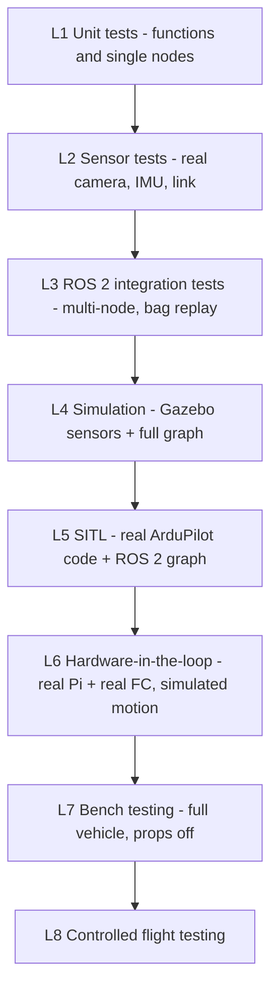

# Testing Strategy

| Field | Value |
|---|---|
| Document ID | GDN-TST-001 |
| Version | 1.0 |
| Date | 2026-10-05 |
| Status | Baseline |

## 1. Principle

Autonomy is earned from the bottom up. A level may start only when the level below has met its exit criteria for the function being tested. No autonomous flight takes place before SITL, hardware-in-loop and bench testing have passed (NFR-032).

## 2. Testing pyramid



| Level | Where | Hardware needed | Automated | Typical count |
|---|---|---|---|---|
| L1 | Workstation, CI | None | Yes | Hundreds |
| L2 | Bench | Pi, camera, IMU | Partly | Tens |
| L3 | Workstation / Pi | None (bags) | Yes | Tens |
| L4 | Workstation | None | Partly | ≈ 10 scenarios |
| L5 | Workstation | None | Mostly | ≈ 20 scenarios |
| L6 | Bench | Pi + FC | Partly | ≈ 10 |
| L7 | Bench | Full vehicle | Checklist | ≈ 25 checks |
| L8 | Field | Full vehicle | Test cards | ≈ 15 cards |

## 3. Level 1 — Unit tests

| Scope | Examples | Framework |
|---|---|---|
| Pure functions | Disparity → depth; sector binning; ROI percentile; confidence sub-scores; GNSS classifier; speed limiter; alignment solver; frame transfer imu → base | GoogleTest (C++), pytest (Python) |
| State machines | Every row of the transition table in [gps-denied-state-machine.md](../02-system-architecture/gps-denied-state-machine.md) §6, driven by synthetic input sequences, including dwell times and hysteresis | pytest, table-driven |
| Parsers | Mission file validation; parameter range checks | pytest |
| Drivers (logic only) | IMU register decoding and scaling; frame pairing by timestamp | GoogleTest with mocks |

**Exit criteria:** all tests pass; line coverage ≥ 80 % for `gdn_nav_mode`, `gdn_localization`, `gdn_navigation`, `gdn_safety`; linters clean.

## 4. Level 2 — Sensor tests

Performed with real hardware on the bench, vehicle not required.

| ID | Test | Method | Pass |
|---|---|---|---|
| T2-01 | Camera frame rate and drops | 10 min capture | NFR-001 |
| T2-02 | L/R skew (timestamps) | 10 min statistics | NFR-002 |
| T2-03 | L/R skew (physical) | LED/counter and pan tests | Consistent with T2-02 |
| T2-04 | Exposure control | Indoor/outdoor | Blur-free at stated speeds; both cameras identical settings |
| T2-05 | IMU rate, gaps, noise | 10 min static | ≥ 200 Hz; no gap > 20 ms; noise near Allan values |
| T2-06 | IMU–camera time offset stability | 3 Kalibr runs | t_d within ± 2 ms |
| T2-07 | Calibration quality | Kalibr reports | Thresholds in [calibration.md](../06-computer-vision/calibration.md) |
| T2-08 | Rectification | Checkerboard rows | ≤ 0.5 px |
| T2-09 | Depth accuracy | Targets at 1, 2, 3, 5 m | NFR-008 |
| T2-10 | Depth under rotation | 30 °/s pan | ≤ 2× static error |
| T2-11 | Obstacle sectors | Post at 2/3/4 m; plain wall | Correct sector; plain wall = unknown |
| T2-12 | Detector speed | Idle and loaded | [ai-architecture.md](../08-ai/ai-architecture.md) §5 |
| T2-13 | Detector accuracy | Held-out sessions | Same |
| T2-14 | Object ranging | Person/target at 2–8 m | [ai-stereo-fusion.md](../08-ai/ai-stereo-fusion.md) §3 |
| T2-15 | VIO handheld loops | 5 × 30 m | NFR-005; gate G2 |
| T2-16 | VIO stress | Yaw-rate and speed sweeps; lens cover; low texture | Envelope recorded; failures detected by monitor |
| T2-17 | Thermal | Full stack 20 min, still air | NFR-015 |
| T2-18 | Power | Meter on 5 V feed | Values recorded in power budget |

**Exit criteria:** T2-01…T2-11 and T2-15…T2-17 pass, or a recorded decision (for example gate G2) changes the plan.

## 5. Level 3 — ROS 2 integration tests

| ID | Test | Method | Pass |
|---|---|---|---|
| T3-01 | Full-graph launch | `launch_testing`: all managed nodes reach active within 60 s | Yes |
| T3-02 | TF tree | Tree equals the specification; one publisher per edge | Yes |
| T3-03 | QoS compatibility | Every subscription has a matched publisher with compatible QoS | No incompatibility events |
| T3-04 | Topic rates | Rates within 10 % of specification under bag replay | Yes |
| T3-05 | VIO regression | Replay the `vio_dataset` bags; compare drift to stored baseline | Within +10 % |
| T3-06 | Latency | Stamp-to-publish latency per stage | Budgets in the design documents |
| T3-07 | Node-kill matrix | Kill each class-A/B node in turn | Supervisor state and tier change as specified; restart succeeds |
| T3-08 | Stale-input holds | Stop each input of `navigator` | Hold within the timeout |
| T3-09 | Lifecycle | Ordered start-up/shut-down; error recovery | Yes |
| T3-10 | Recording | Each bag profile records all listed topics without drops | Yes |
| T3-11 | Load shedding | Inject high temperature / CPU values | Order and effect as specified |
| T3-12 | 30 min soak | Bag replay loop on the Pi | NFR-023 |

**Exit criteria:** all pass on the workstation; T3-04, T3-06, T3-11, T3-12 also pass on the Pi.

## 6. Level 4 — Simulation, and Level 5 — SITL

Scenario list S-01…S-20 in [simulation-strategy.md](../11-simulation/simulation-strategy.md) §7.

| Level | Focus | Configuration | Exit criteria |
|---|---|---|---|
| L4 | Perception and VIO closed loop with simulated sensors: depth, obstacle stop, detector + ranging, VIO feeding the FC | SIM-B | S-13…S-17 pass; VIO closure error < 2 % in `textured_yard` |
| L5 | Real ArduPilot behaviour: EKF source switching, failsafes, watchdog, GUIDED interface, the complete state machine | SIM-A (automated) and SIM-B | S-01…S-12 and S-18…S-20 pass in three consecutive runs with the release commit and the flight parameter file |

L4 and L5 share tooling; they are distinguished by what is under test. Any change to state-machine, localisation, navigator or FC parameters re-runs the automated L5 suite before the next flight.

## 7. Level 6 — Hardware-in-the-loop

Real Pi and real Pixhawk connected by the real UART cable. The vehicle does not move, so motion is simulated.

| Configuration | Description |
|---|---|
| HIL-1: link and time | Real FC on the bench (USB-powered or battery, props off), real Pi, MAVROS over UART. Tests ML-1…ML-11 from [mavlink-integration.md](../10-communication/mavlink-integration.md) §9. |
| HIL-2: Pi-in-the-loop | SITL runs on the workstation; the **real Pi** runs the full ROS 2 graph and connects to SITL over Ethernet/UDP; sensor data comes from SIM-B over the network or from bag replay. Measures real CPU load, latency and thermal behaviour of the flight software against a moving vehicle. |
| HIL-3: FC-in-the-loop (optional) | ArduPilot on the real Pixhawk in its hardware simulation mode (`SIM_ENABLE`-based "simulation on hardware") `[VERIFY availability on Pixhawk 6C in 4.7]`, with the real Pi attached by UART. Exercises the real serial link under simulated flight. |

**Exit criteria:** HIL-1 all pass; HIL-2 runs scenarios S-03, S-06, S-09, S-15 with the Pi meeting NFR-004, NFR-013, NFR-015.

## 8. Level 7 — Bench testing (full vehicle, propellers removed)

| ID | Check | Pass |
|---|---|---|
| T7-01 | Wiring inspection against [low-level-design.md](../03-hardware/low-level-design.md) | Signed off by two people |
| T7-02 | Power rails under load | Voltages and ripple within specification |
| T7-03 | FC setup: accelerometer, compass, RC, ESC calibration; motor order and direction | Correct |
| T7-04 | RC switch mapping; failsafe on transmitter off | Modes as labelled; failsafe triggers |
| T7-05 | Battery monitor calibration | Within 2 % of a multimeter |
| T7-06 | GNSS reception with the Pi off / idle / full stack + HDMI | Loss < 3 dB and < 3 satellites |
| T7-07 | MK15: telemetry, video, range check at low power or distance | Working at 2× planned test distance |
| T7-08 | Frame checks CF-1…CF-8 | All pass |
| T7-09 | External nav in FC log while carried by hand outdoors with GNSS | `VISP` tracks GNSS path shape; alignment residual in limits |
| T7-10 | Source switch on the bench (carried), via companion and via RC | EKF follows vision; position continuous within 1 m |
| T7-11 | GPS-disable switch | State machine goes DEGRADED → DENIED → VISION_NAV |
| T7-12 | Companion watchdog | Kill companion in GUIDED → mode change |
| T7-13 | `GUID_TIMEOUT` | Kill navigator → setpoints stop; FC reports stop |
| T7-14 | Obstacle to FC | Proximity display correct |
| T7-15 | Vibration with motors running (props off, then props on with the vehicle strapped down) | IMU noise, image jello, VIO stationary drift within gate G2 limits |
| T7-16 | Thermal and CPU with motors running | NFR-013, NFR-015 |
| T7-17 | Pre-flight check: inject each fault | Correct NO-GO reason |
| T7-18 | Full-system soak 30 min | No fault |
| T7-19 | Weight and balance | AUW recorded; centre of gravity centred |
| T7-20 | Flow sensor and range sensor readings while carried | Plausible; quality good over the test surface |

**Exit criteria:** all pass. T7-08, T7-10, T7-12 are hard gates for any flight with the companion active.

## 9. Level 8 — Controlled flight testing

### 9.1 Stages

| Stage | Content | Companion role | Pre-condition |
|---|---|---|---|
| A. Airframe | Manual hover, STABILIZE → ALT_HOLD → LOITER; tuning; vibration; endurance; failsafe checks at low height | Off, then on but passive (logging only) | L7 |
| B. Shadow mode | Manual and LOITER flights on GNSS with the full stack running; external nav streamed but **not used** (source set 1) | Observing | Stage A |
| C. Manual source switch | Hover in LOITER; pilot switches to source set 2 by RC; hold; switch back | Supplying external nav | Stage B data shows drift and alignment within limits; tether or net |
| D. Automatic transition | Hover in LOITER; GPS-disable switch; companion commands source set 2 | Deciding source | Stage C |
| E. Fallback | In source set 2: stop VIO (operator command) → flow tier; then flow blocked over a marked area (optional) | Deciding | Stage D |
| F. GUIDED on GNSS | 1 m step, 3 m step, square, at 0.3 → 1.0 m/s | Commanding | SITL S-15; stage B |
| G. GUIDED on vision | Same sequence in VISION_NAV | Commanding | Stages D and F |
| H. Obstacle | Foam-board obstacle on the path; stop and hold | Commanding | Stage G; L4 S-13 |
| I. AI | Detection and ranging of a target/person-shaped dummy; mission rule hold | Commanding | Stage G |
| J. Demonstration | GNSS take-off → waypoint → simulated denial → continue on vision → detect object → return → land | Full | All above |

### 9.2 Test card template

```text
Card ID / date / run ID:
Objective:
Requirements verified:
Configuration: software commit, FC parameter file, calibration ID, bag profile
Site and weather: wind, light, surface
Crew: pilot / operator / spotter
Pre-conditions: (previous cards passed)
Procedure: numbered steps with expected observations
Abort criteria: (specific, observable)
Pass criteria: (numeric)
Result: PASS / FAIL / INCONCLUSIVE
Data: bag, .bin, .tlog, video file names
Notes / anomalies:
```

### 9.3 Standing abort criteria (all flights)

- Any unexpected motion > 1 m.
- Navigation-mode banner red, or `LOC LOST`.
- Position hold visibly worse than 1 m in tier 2.
- Any `CC FAULT`, EKF failsafe, or battery warning.
- Person or animal entering the area.
- Pilot discomfort for any reason.

Action on abort: pilot takes over (LOITER on GNSS; ALT_HOLD if position is doubtful), lands, logs are saved, the card is marked.

### 9.4 Flight exit criteria for the project

| Requirement | Evidence |
|---|---|
| FR-005, NFR-011, NFR-012 | Stage D: three successful automatic transitions with logged step < 1 m |
| FR-040, NFR-006 | Stage C/D: three 60 s holds on vision, RMS < 0.5 m (against GNSS logged in shadow, or ground markers) |
| FR-041, NFR-005 | Stage G: square of ≥ 10 m path, closure error < 2 % (goal) / reported |
| FR-025, FR-079 | Stage E |
| FR-043 | Stage H |
| FR-032–034 | Stage I |
| FR-070 | Override exercised in every stage |

## 9a. DB-2.0 additions: satellite map matching

Map matching can be tested almost completely **before the vehicle exists**, because all it needs is downward images with GNSS tags and a reference image. This is used to place the main feasibility gate early.

### Added tests

| ID | Level | Test | Method | Pass |
|---|---|---|---|---|
| T1-G1 | L1 | Orthorectification | Synthetic poses over a synthetic textured plane | Corners within 1 px |
| T1-G2 | L1 | Geodetic conversions | Round trip WGS-84 ↔ UTM ↔ `map` | < 1 cm |
| T1-G3 | L1 | Gates and offset filter | Synthetic fixes with outliers and odometry drift | Outliers rejected; no step above the slew limit; converges |
| T2-G1 | L2 | Downward camera | Rate, exposure control, timestamp jitter, calibration | ≥ 15 Hz; reprojection ≤ 0.5 px |
| T2-G2 | L2 | Map pack | `map_prepare` on the site image; visual check of the preview; feature counts per tile | Pack loads; coverage and GSD as expected |
| T3-G1 | L3 | Matcher on public data | Replay a UAV-to-satellite dataset with ground truth through `map_matcher` | Error and acceptance statistics recorded |
| **T3-G2** | L3 | **Matcher on own site data, offline** | Downward images from a GNSS-logged flight over the test site (project vehicle flown manually, or any camera drone) matched against the map pack | ≥ 70 % of attempts accepted; ≤ 5 m RMS; < 1 % wrong — **gate G2** |
| T3-G3 | L3 | Method comparison | SIFT vs XFeat vs edge correlation on the same recordings; timing on the Pi | Table; method chosen |
| T3-G4 | L3 | Sensitivity | Acceptance and error vs height (30/40/50/60 m), reference resolution, time of day | Operating envelope recorded |
| T3-G5 | L3 | Ground VO | Recorded flight; integrated odometry vs GNSS | Drift ≤ 3 % |
| T3-G6 | L3 | Fusion replay | Recorded odometry + fixes with GNSS withheld | Fused error ≤ 5 m RMS; bounded over the whole flight |
| S-21 | L4/L5 | Simulation: map-textured world | Ground plane textured with an orthoimage; matcher uses a perturbed or different-date reference; GNSS disabled at cruise height | Circuit completed; error bounded |
| S-22 | L5 | Fix dropout | Blank the downward image for 30 s, then 90 s | T20 then recovery; T22 at 60 s |
| S-23 | L5 | Wrong-fix injection | Inject fixes 40 m off | Rejected by gates; no excursion |
| S-24 | L5 | Coverage edge | Goal outside the map | Refused; vehicle turns back at the margin |
| T7-G1 | L7 | Bench | Map pack check, downward image check, boresight (CF-9…CF-12), GPS reception with the USB camera streaming | All pass |

### Flight stages for the cruise regime

| Stage | Content | Pre-condition |
|---|---|---|
| A2 | Manual and LOITER flight at 50 m on GPS; pilot practises ALT_HOLD descent from height | Stage A; site approved for the height |
| B2 | **Shadow mode at 50 m**: matcher, ground VO and fusion run and are logged against GPS; not used for control | Gate G2; stage A2 |
| D2 | Closed loop in hover at 50 m: GPS disabled by RC switch; hold on map matching for 60 s; GPS restored | B2 results meet NFR-070 and NFR-072 on ≥ 3 flights |
| G2 | Circuit of ≈ 300 m at 50 m with GPS disabled | D2 passed three times |
| J2 | Demonstration: take-off and climb on GPS → GPS disabled → circuit on map matching → GPS restored → descent → low-regime AI/obstacle demonstration → land | All above |

Standing abort criteria at height add: `NO MAP FIX` for more than 20 s; position uncertainty above 10 m; spotter loses sight of orientation; wind above the limit. First recovery action is always **restore GPS**.

### Exit criteria added

| Requirement | Evidence |
|---|---|
| FR-092, NFR-070 – NFR-072 | Stage B2 on ≥ 3 flights |
| FR-095, NFR-074 | Stage D2: three 60 s holds ≤ 5 m RMS against GNSS |
| FR-100 | S-22 in simulation; one fix-dropout test in stage D2 (cover test by software blanking) |
| End-to-end | Stage G2: return within 5 m of the GNSS-measured start |

## 9b. DB-3.0 additions: ground app, search, track and follow

### Added tests

| ID | Level | Test | Method | Pass |
|---|---|---|---|---|
| T1-A1 | L1 | App protocol | Encode/decode of every message; every invalid request refused with a reason | All cases |
| T1-A2 | L1 | Search planner | Convex and concave polygons; spacing; areas outside coverage, fence or battery limit | ≥ 98 % planned coverage; all invalid areas refused |
| T1-A3 | L1 | Pixel-to-ground projection | Synthetic poses | ≤ 0.2 m at 30 m |
| T1-A4 | L1 | Tracker | Synthetic crossings, dropouts, re-appearance | Correct association; loss and end timing |
| T1-A5 | L1 | Follow controller | Kinematic target at 1–3 m/s with turns | Offset bounded; limits respected |
| T2-A1 | L2 | Downward camera at 1080p | Rate, decode cost, sharpness | ≥ 10 Hz; CPU recorded |
| T2-A2 | L2 | Aerial detector | Held-out downward images from 20/25/30 m with dummies, team members, vehicles | Recall and precision per class and height recorded (NFR-086, 087) |
| T2-A3 | L2 | Tiled inference rate | With map matching and odometry running | NFR-089 |
| T3-A1 | L3 | Gateway gating | Each request in each disallowed state | Refused, with the right reason |
| T3-A2 | L3 | Tap-to-select | Replayed video with taps on older frames | Correct object 20/20 |
| T3-A3 | L3 | Finding confirmation and merging | Replayed detections | No duplicate pins; no pin from a single frame |
| TA-1 | App | App against the mock gateway | Instrumented UI tests; 20-minute session on the MK15 | NFR-083 |
| TA-2 | App | Usability | A person who has not used it starts a search | NFR-084 |
| S-25 | L4/L5 | Grid search in simulation, GNSS on then off | Targets placed in the world | NFR-085; targets found or misses explained |
| S-26 | L5 | Follow in simulation | Actor at 1, 2, 3 m/s with turns; GNSS off | NFR-091 |
| S-27 | L5 | App link loss in each behaviour | Drop the gateway connection | Rules of ground-app §8 |
| S-28 | L5 | Boundary cases | Target leaves coverage; search area partly outside | Hold at the margin; area refused |
| S-29 | L5 | Pilot override during search and follow | Mode change | Behaviour ends within one cycle; no resume |
| T7-A1 | L7 | App on the MK15 through the real link | Video and command latency; range walk | NFR-080, 081, 082 |
| T7-A2 | L7 | Full pre-flight with the app | — | GO shown in the app |

### Flight stages added

| Stage | Content | Pre-condition |
|---|---|---|
| K | App in flight as a monitor only (video, map, status), on GNSS | Stage B; T7-A1 |
| L | Grid search on GNSS over the test area with dummy targets and vehicles at surveyed points | Stage K; S-25 |
| M | Grid search with GNSS disabled | Stages D2 and L |
| N | Tracking from above on GNSS: a consenting team member walks a marked route; the drone holds position | Stage L |
| O | Follow from above on GNSS, then with GNSS disabled | Stage N; S-26; safety rules of §8b |
| J3 | Demonstration: take-off on GNSS → GNSS disabled → grid search from the app → findings pinned → go to a finding → follow a walking team member → GNSS restored → land | All above |

Standing abort criteria add: anyone not briefed entering the area; the followed person signalling stop; the app showing a different target than the one intended.

### Exit criteria added

| Requirement | Evidence |
|---|---|
| FR-110–119 | T7-A1, T7-A2, stage K |
| FR-120–126, NFR-085–090 | Stages L and M: three searches each |
| FR-127–130, NFR-091–092 | Stages N and O |
| FR-131 | Signed site and participant briefing for each test day |

## 10. Data management

| Item | Rule |
|---|---|
| Run ID | `YYYYMMDD-NN`, shared by bag, dataflash log, tlog, video, test card |
| Storage | `data/runs/<run ID>/` with a `metadata.yaml`: commit, parameter file hash, calibration ID, hardware notes, weather |
| Analysis | Scripts in `gdn_tools` produce a standard report per run: nav-mode timeline, confidence, VIO vs reference error, EKF innovations, CPU/temperature, events |
| Retention | All flight runs kept; best VIO bags promoted to the regression set |

## 11. Requirements traceability

| Requirement group | Primary verification levels |
|---|---|
| FR-001–008 (GNSS, monitoring, transition) | L1, L5, L8-D |
| FR-010–016 (sensing) | L2 |
| FR-020–027 (localisation) | L1, L2, L3, L5, L7, L8-B/C |
| FR-030–035 (perception) | L1, L2, L4, L8-H/I |
| FR-040–046 (navigation) | L1, L3, L4, L5, L8-F/G |
| FR-050–054 (communication) | L6, L7 |
| FR-060–063 (logging) | L3, L7 |
| FR-070–079 (safety) | L5, L7, L8 |
| NFR performance | L2, L3, L6, L7, L8 |

## 12. Tooling

| Purpose | Tool |
|---|---|
| Unit tests | GoogleTest, pytest, `ament_lint` |
| Integration | `launch_testing`, rosbag2 replay |
| CI | Build + L1 + L3 (bag-free subset) + automated SIM-A scenarios on each merge (GitHub Actions or a lab machine) |
| Metrics | `evo`, PlotJuggler, ArduPilot log tools |
| Profiling | `top`/`htop`, `perf`, ROS 2 tracing if needed |
