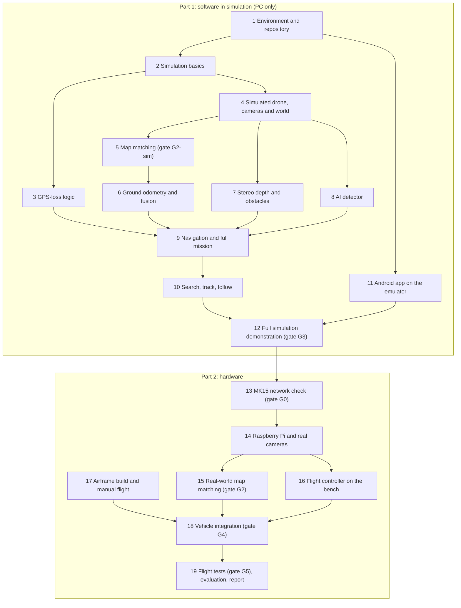

# Development Checklist

| Field | Value |
|---|---|
| Document ID | GDN-RDM-002 |
| Version | 2.0 (software-first plan) |
| Baseline | DB-3.0 |
| Date | 2026-10-06 |
| Status | Step 0 complete. Steps 1 to 19 not started. |

The build order for the whole project, one step at a time.

**The plan in one line:** build and prove all the software in simulation on a PC first (Part 1), then bring in the hardware and move the working software onto it (Part 2).

Tick a box when the work is merged and its "done when" condition is met. Phase codes (P02, P06G, …) and gate codes (G0, G2, …) refer to the [roadmap](roadmap.md); test codes refer to the [testing strategy](../13-testing/testing-strategy.md). Where this checklist orders work differently from the roadmap, this checklist is the current plan (see roadmap §1c).

## How to use this checklist

- Work top to bottom. Steps marked "parallel" can be done by different people at the same time.
- A **gate** is a stop point. Do not start the steps that depend on it until the gate is passed and the result is written down.
- "Done when" must be shown by a test, a log or a measurement, never by opinion.
- Record measured numbers in [performance-requirements](../14-performance/performance-requirements.md) and decisions in [project-status](../project-status.md).

## Overview

## What simulation proves and what it cannot

Building in simulation first is the right order, but it does not prove everything. Knowing the difference keeps the plan realistic.

| Simulation proves | Only hardware can prove |
|---|---|
| The GPS-loss logic and every mode switch | Real camera timing and image quality |
| Failsafes and the watchdog | Map matching accuracy on real ground against a real satellite image |
| Coordinate frames and the link to the flight controller | Speed, heat and power on the Raspberry Pi |
| Missions: route, search, track, follow | The MK15 radio link and its range |
| The app's screens, requests and link-loss behaviour | Vibration, wind and battery behaviour |
| That every part works together | Detection of real people from the air |

So Part 1 ends with software that is **complete and working in simulation**. Part 2 is expected to need tuning and some rework; that is normal and is planned for.

## Rules that keep the software ready for hardware

- [ ] Every node reads sensors through the topic contracts in [package-structure](../05-ros2/package-structure.md) §5, so a simulated camera and a real camera are interchangeable
- [ ] Settings live in parameter files with separate `sim`, `bench` and `flight` profiles; nothing is hard-coded for simulation
- [ ] The same flight-controller parameter files are used in simulation and on the real Pixhawk
- [ ] The app's network layer sits behind one interface, so the transport can change if gate G0 fails
- [ ] Simulated sensors are given realistic faults: noise, delay, dropped frames, blur, wrong fixes

## Things to do during Part 1 that are not software

These cost little time and prevent a long wait between Part 1 and Part 2.

- [ ] Design reviewed with the project guide (gate G1)
- [ ] Licence chosen for the repository
- [ ] Airframe, downward camera model and reference-image source decided ([project-status](../project-status.md))
- [ ] Radio and stereo camera choices confirmed before buying (OD-22): nothing is owned, so cost now counts fully
- [ ] Budget of about ₹1.3 to 2.1 lakh approved or the parts list reduced ([bill of materials](../15-bom/bill-of-materials.md))
- [ ] Parts ordered about six weeks before Part 1 ends: Raspberry Pi 5, cameras, radio, Pixhawk 6C set, MTF-01, BEC, airframe parts
- [ ] GPS-tagged aerial photos of the test site collected with a borrowed camera drone, if one can be found (needed in step 15)

---

# Part 1: Software in simulation

Needs a laptop only. The team owns no drone hardware at the start, and none is used in Part 1.

**Development laptop (checked 2026-10-06):** Intel Core i5-11300H, 24 GB memory, NVIDIA RTX 3050 with 4 GB, Windows 11 with WSL2. This is enough for the simulation and for training the small detector. The WSL distribution installed is Ubuntu 26.04; ROS 2 Jazzy needs Ubuntu 24.04, so a second WSL distribution is added in step 1.

## Step 0: Design baseline (P01) — done

- [x] Requirements written (FR and NFR)
- [x] Hardware, software and ROS 2 architecture designed
- [x] Decisions recorded (ADR-001 to ADR-018)
- [x] Safety analysis and FMEA written
- [x] Diagram set and slides prepared

## Step 1: Environment and repository (P02)

- [ ] Ubuntu 24.04 installed as its own WSL2 distribution on the Windows laptop, beside the existing Ubuntu 26.04
- [ ] Graphics card visible inside WSL2 so Gazebo and model training use the NVIDIA GPU
- [ ] ROS 2 Jazzy, Gazebo Harmonic and the ArduPilot build tools installed
- [ ] Android Studio installed with an emulator
- [ ] Workspace created with the layout in [package-structure](../05-ros2/package-structure.md)
- [ ] `gdn_interfaces` created with the messages, services and actions from [interfaces](../05-ros2/interfaces.md)
- [ ] Empty skeletons for the other packages
- [ ] Third-party sources pinned in `deps.repos`
- [ ] Automated checks on every pull request: build, lint, tests
- [ ] Set-up instructions added to the root README

**Done when:** the empty workspace builds and tests pass on a clean PC, and a new person can set up from the README in under half a day.

## Step 2: Simulation basics (P03)

- [ ] ArduPilot SITL (Copter 4.7) running on the PC
- [ ] MAVROS connected to SITL
- [ ] Parameter files for the three position sources: GPS, camera position, optical flow
- [ ] `fake_vio`: a stand-in that produces odometry and map fixes from simulation truth, with adjustable noise, dropouts and wrong fixes
- [ ] Take off in simulation; camera position visible in the flight controller log
- [ ] Switch position source by hand and confirm the drone stays put
- [ ] Coordinate frames checked by commanding motion in each direction

**Done when:** the simulated flight controller follows the stand-in position on source 2 with correct directions (test S-01).

## Step 3: GPS-loss logic (P05) — parallel with step 4

- [ ] GPS health classifier (good, degraded, denied)
- [ ] Navigation-mode state machine with every transition in [gps-denied-state-machine](../02-system-architecture/gps-denied-state-machine.md)
- [ ] Frame alignment, confidence score and position output in `localization_manager`
- [ ] Position-source switch command to the flight controller, with confirmation
- [ ] `safety_supervisor`, first version: heartbeats and load shedding
- [ ] Lua watchdog on the simulated flight controller for a silent companion
- [ ] Unit test for every state transition
- [ ] Automated scenarios with fault injection: GPS lost, vision lost, both lost, GPS returns, companion crash

**Done when:** the automated scenarios (S-02 to S-12, S-18) pass three times in a row.

## Step 4: Simulated drone, cameras and world (P10, first part) — parallel with step 3

- [ ] Gazebo connected to SITL with a quadcopter model
- [ ] Simulated downward camera, stereo camera, IMU and range sensor publishing on the real topic names
- [ ] World with a satellite image as the ground texture
- [ ] A **second, different** image of the same area kept as the on-board reference (other date, season or source), so that matching is not trivially easy
- [ ] Objects in the world: buildings, obstacles, people and vehicles, some of them moving
- [ ] Switches for camera noise, blur, delay and dropped frames
- [ ] Simulation runs at real-time speed on the development PC

**Done when:** a manual flight in Gazebo produces all camera and sensor topics at their target rates.

## Step 5: Map matching (P06G, gate G2-sim)

- [ ] `map_prepare` tool: turns a reference image into a map pack with tiles and features
- [ ] `map_matcher`: level and rotate the photo, extract features, match, verify, apply gates
- [ ] Matching run on a public drone-to-satellite dataset with known positions (for example UAV-VisLoc)
- [ ] Matching run inside the simulation against the second reference image
- [ ] SIFT compared with XFeat and with simple correlation on the same data
- [ ] Behaviour checked at 25, 40 and 60 m, and over ground with few features
- [ ] Accuracy and acceptance table written; method chosen

**Gate G2-sim passes when:** on the public dataset, at least 70 % of images give an accepted fix, error is 5 m RMS or less, and fewer than 1 % of accepted fixes are wrong.
**Note:** this shows the method works. Whether it works on *our* site is decided later at gate G2 (step 15).

## Step 6: Ground odometry and fusion (P07G)

- [ ] `ground_vo`: motion from the downward camera between map fixes
- [ ] Offset filter in `localization_manager` that combines odometry with map fixes
- [ ] Rejection of fixes that do not fit, and slow application of corrections
- [ ] Switching between the downward camera (above 12 m) and stereo odometry (below 12 m)
- [ ] `fake_vio` replaced by the real matcher and odometry in the simulation loop
- [ ] Simulated flight with GPS off; position compared with simulation truth

**Done when:** position error in simulation and in dataset replay is 5 m RMS or less with GPS withheld (tests T3-G5, T3-G6).

## Step 7: Stereo depth and obstacles (P06) — parallel with steps 5 and 8

- [ ] `stereo_depth`: depth image from the simulated stereo pair
- [ ] Depth checked against known distances in the simulated world
- [ ] `obstacle_sectors`: nearest distance per direction, sent to the flight controller
- [ ] Stereo odometry running near the ground in simulation

**Done when:** the simulated drone reports correct obstacle distances from 0.5 to 6 m.

## Step 8: AI detector (P09) — parallel with steps 5 and 7

- [ ] Pretrained YOLO26n running on forward images through NCNN on the PC
- [ ] `object_localizer`: distance to a detected object from stereo depth
- [ ] Aerial-view model trained on a public aerial dataset (for example VisDrone); model card written
- [ ] Tiled detection on 1080p downward images
- [ ] Recall and false-alarm figures measured on held-out aerial images
- [ ] Ground projection: pixel to coordinates, checked against simulation truth

**Done when:** both models detect simulated and dataset targets, and aerial detection figures are recorded.
**Deferred to Part 2:** speed on the Raspberry Pi, and fine-tuning on the team's own aerial photos.

## Step 9: Navigation and full mission (P10)

- [ ] `navigator`: go-to goals, speed limits from mode, confidence and obstacles, obstacle stop
- [ ] `mission_manager`: one behaviour at a time; rule for losing the app link
- [ ] `telemetry_node`: status text to QGroundControl
- [ ] Full mission in simulation: GPS flight, GPS denied, continue on map position, obstacle stop, detection, GPS returns, land

**Done when:** scenarios S-13 to S-24 pass.

## Step 10: Search, track and follow (P19, P20)

Build in this order. If time runs short, drop follow first, then tracking.

- [ ] `search_planner`: back-and-forth lines over a drawn area, with validity checks
- [ ] `finding_manager`: a find is raised after three detections of the same place
- [ ] Coverage recorded and reported as "area covered"
- [ ] Grid search in simulation with GPS off (S-25)
- [ ] `target_tracker`: position and speed of a selected object on the ground
- [ ] Follow from above at 20 m or higher, with fence and map-edge limits
- [ ] Follow in simulation at 2 m/s with GPS off (S-26 to S-29)

**Done when:** a search completes and a follow run holds in simulation with GPS off.

## Step 11: Android app on the emulator (P18) — parallel from step 1 onwards

- [ ] Mock gateway that plays back recorded status, video and findings
- [ ] App project created; network layer for control, video and map tiles behind one interface
- [ ] Status screen with the pre-flight GO or NO-GO list
- [ ] Live screen: video, detection boxes, navigation-mode banner, Stop button
- [ ] Map screen: offline map, drone position, uncertainty circle
- [ ] Findings screen with local storage and export
- [ ] Drawing a search area; Start, Pause, Resume, Abort
- [ ] Tap to select a target; Track and Follow buttons
- [ ] `app_gateway`, `video_streamer` and the tile server running on the PC beside the simulation
- [ ] App on the emulator connected to the simulation
- [ ] Link loss tested by cutting the connection in both directions
- [ ] Screen layout set to the MK15's size and resolution

**Done when:** the app on the emulator shows live video, map and status from the simulated drone and can start a search.

## Step 12: Full simulation demonstration (gate G3)

- [ ] One command starts the whole system in simulation
- [ ] Demonstration run from the app: take off, GPS denied, grid search, findings pinned, follow a moving target, GPS returns, land
- [ ] The run repeated three times without manual fixes
- [ ] Every simulation scenario (S-01 to S-29) passing in the automated checks
- [ ] Demonstration video recorded
- [ ] List written of everything that still has to be confirmed on hardware
- [ ] Documentation updated to match what was built

**Gate G3 passes when:** the demonstration runs three times in a row and all scenarios pass. This is the **Bronze** result, and the project is presentable from this point even if hardware is delayed.

---

# Part 2: Hardware

Starts when gate G3 is passed and the parts have arrived.

## Step 13: MK15 network check (gate G0)

Needs the MK15 and the Raspberry Pi. Do it on the day they arrive: the result decides how the app talks to the drone.

- [ ] Connect the Pi's Ethernet port to the MK15 air unit; give the Pi the address 192.168.144.50
- [ ] From the MK15 ground unit, reach the Pi (ping, then a test web page)
- [ ] Install the app on the MK15 and connect to the gateway on the Pi
- [ ] Measure delay and throughput over the link
- [ ] Confirm QGroundControl still works at the same time
- [ ] Confirm whether the air unit runs on a 4S battery

**Gate G0 passes when:** the app on the MK15 exchanges data with the Pi over the radio.
**If it fails:** switch the app's network layer to the fallback in [ADR-017](../17-decisions/ADR-017-ground-app.md).

## Step 14: Raspberry Pi and real cameras (P04, P06, gate G2b)

- [ ] Ubuntu Server 24.04 and ROS 2 Jazzy on the Pi; workspace builds on it
- [ ] Active cooler fitted; temperature and power measured under load
- [ ] `stereo_camera` driver: both sensors in one process, paired by timestamp, 20 Hz
- [ ] Left-right timing difference measured and reported
- [ ] `imu_driver` at 225 Hz; `down_camera` driver at 1080p
- [ ] Stereo and IMU calibration with a printed target
- [ ] The simulation-proven software run on the Pi with real cameras; load of every node measured
- [ ] Detector speed measured on the Pi
- [ ] Depth error measured at known distances
- [ ] Gate G2b recorded: how far the stereo camera can be trusted near the ground

**Done when:** the full software runs on the Pi with real cameras inside the load and temperature limits, or the shortfalls are recorded with a plan.

## Step 15: Real-world map matching (gate G2)

- [ ] Reference image of the test site obtained, with a licence that allows offline use
- [ ] Map pack built for the site
- [ ] Matching run on the team's own GPS-tagged aerial photos; fixes plotted against GPS
- [ ] Thresholds tuned on real data
- [ ] Aerial detector fine-tuned and measured on the team's own photos

**Gate G2 passes when:** at least 70 % of photos give an accepted fix, error is 5 m RMS or less, and fewer than 1 % of accepted fixes are wrong.
**If it fails, try in this order:** a better reference (own aerial mosaic), a higher flight, the learned matcher, a different site.

## Step 16: Flight controller on the bench (P08)

Propellers off throughout.

- [ ] ArduPilot 4.7 flashed; accelerometer, compass and radio calibrated
- [ ] Wiring completed as in [low-level-design](../03-hardware/low-level-design.md)
- [ ] Parameter files from simulation loaded
- [ ] MK15 channels and switches mapped: flight mode, position source, emergency stop, GPS disable, autonomy enable
- [ ] MAVROS link between Pi and flight controller at 921600 baud
- [ ] Optical flow sensor and GPS verified
- [ ] Carry test: walk the vehicle around; camera position path matches GPS path in the log
- [ ] Position-source switch tested by command and by switch
- [ ] Watchdog tested by stopping the companion software
- [ ] Delay of the camera position measured and set

**Done when:** all link checks (ML-1 to ML-11) and failsafe configuration checks (CF-1 to CF-8) pass.

## Step 17: Airframe build and manual flight (P11) — parallel with steps 14 to 16

- [ ] Frame, motors, ESCs and battery chosen with thrust at least twice the all-up weight
- [ ] Frame assembled; separate regulators for the Pi and the flight controller
- [ ] Mounts made for both cameras, the Pi, the GPS mast and the air unit
- [ ] Weight measured against the weight budget
- [ ] First manual flights; tuning; vibration checked
- [ ] Stable position hold on GPS
- [ ] RC, battery and fence failsafes demonstrated
- [ ] Pilot practice: at least five battery packs, including flight at 50 m and manual flight without position hold

**Done when:** vibration is within limits, hover time is at least 8 minutes, and the failsafes have been shown to work.

## Step 18: Vehicle integration and bench tests (P12, gate G4)

- [ ] Pi, cameras and all wiring mounted on the vehicle
- [ ] Software starts automatically at power-on
- [ ] Downward camera alignment measured and entered
- [ ] Final weight and power measured and compared with the budgets
- [ ] GPS reception checked with everything running
- [ ] Full bench test list run with propellers off (T7 series)
- [ ] Pre-flight check returns GO on the vehicle
- [ ] Bench test record signed by the team

**Gate G4 passes when:** every bench check passes. Without it, the vehicle does not fly with the companion active.

## Step 19: Flight tests, evaluation and report (P13 to P17, gate G5)

Each stage is flown only after the one before it is passed.

- [ ] **Observe only, low:** pilot flies on GPS, software records and compares
- [ ] **Observe only, at 50 m:** map matching measured against GPS in real flight
- [ ] **Manual switch in hover:** pilot switches to the camera position with the RC switch, first on a tether or under a net
- [ ] **Automatic switch in hover at 50 m:** GPS disabled by switch; drone holds on map position
- [ ] **Fallback:** camera position blocked near the ground; drone holds on optical flow
- [ ] **Gate G5:** three successful automatic switches with hold within target
- [ ] **Route on GPS**, then **route without GPS**
- [ ] **Obstacle stop** in front of a foam board
- [ ] **App in flight** as a monitor
- [ ] **Grid search on GPS**, then **with GPS disabled**
- [ ] **Tracking**, then **follow from above** of a walking person who has agreed to take part
- [ ] Each headline number measured at least three times; performance table updated to MEASURED or VALIDATED
- [ ] Two rehearsals, then the final demonstration, with the simulation run ready as backup
- [ ] Report, video and released repository

**Done when:** the demonstration is given and every claim in the report points to a recorded measurement.

---

## Gates at a glance

| Gate | Step | Question | Passed? |
|---|---|---|---|
| G1 | During Part 1 | Is the design accepted by the guide? | No |
| G2-sim | 5 | Does map matching work on public data and in simulation? | No |
| G3 | 12 | Does the complete system work in simulation? | No |
| G0 | 13 | Can the app on the MK15 reach the Raspberry Pi? | No |
| G2b | 14 | How far can the stereo camera be trusted near the ground? | No |
| G2 | 15 | Does map matching work on our own site? | No |
| G4 | 18 | Is the vehicle safe to fly with the companion active? | No |
| G5 | 19 | Is the switch away from GPS reliable in hover? | No |

## Delivery levels

| Level | Reached at | Content |
|---|---|---|
| Bronze | Step 12, plus step 15 for real-data evidence | Whole system working in simulation and driven from the app; map matching shown on recorded data |
| Silver | Step 19, through "grid search on GPS" | Plus hold without GPS in flight and the app used in flight |
| Gold | Step 19, complete | Plus grid search with GPS disabled and follow from above |

## Rough timing

| Weeks | Work |
|---|---|
| 1 to 2 | Step 1 |
| 3 to 8 | Steps 2, 3, 4; app started |
| 7 to 14 | Steps 5, 6, 7, 8 |
| 13 to 20 | Steps 9, 10; app completed |
| 21 to 22 | Step 12, gate G3. **End of Part 1** |
| 16 | Latest date to order parts |
| 22 to 30 | Steps 13 to 18 |
| 30 to 40 | Flight tests |
| 41 to 42 | Evaluation and report |

Planning estimates for a team of four working part-time. Part 1 depends only on the team's own time; Part 2 also depends on deliveries, weather and site access.
