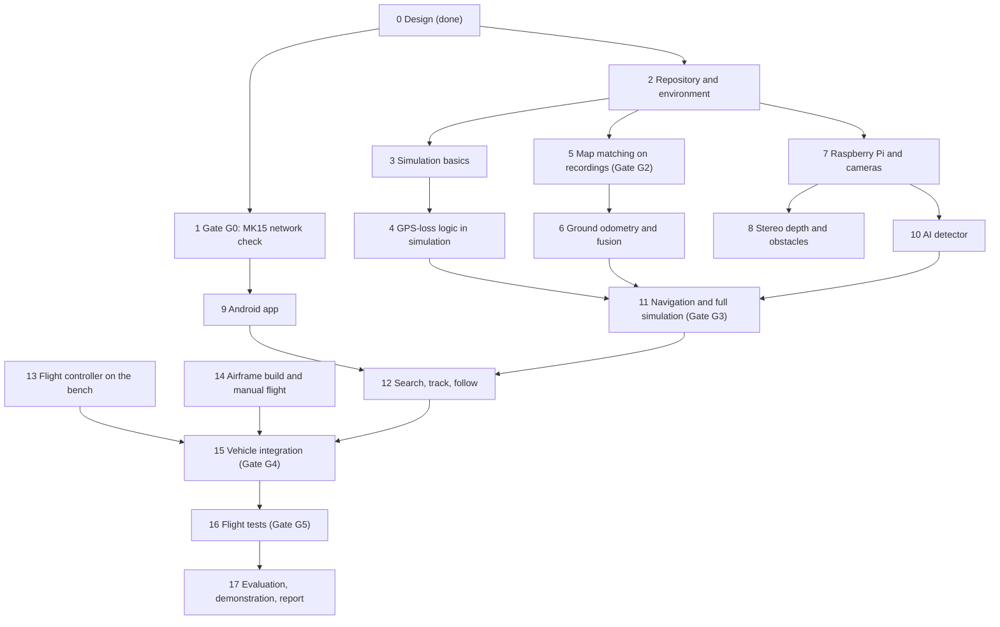

# Development Checklist

| Field | Value |
|---|---|
| Document ID | GDN-RDM-002 |
| Baseline | DB-3.0 |
| Date | 2026-10-06 |
| Status | Step 0 complete. Steps 1 to 17 not started. |

The build order for the whole project, one step at a time. Tick a box when the work is merged and its "done when" condition is met. The phase codes (P02, P06G, …) and gate codes (G0, G2, …) refer to the [roadmap](roadmap.md), which explains each phase in full; test codes refer to the [testing strategy](../13-testing/testing-strategy.md).

## How to use this checklist

- Work top to bottom. Steps on different tracks can run in parallel; the track is shown beside each step.
- A **gate** is a stop point. Do not start the steps that depend on it until the gate is passed and the result is written down.
- "Done when" must be shown by a test, a log or a measurement, never by opinion.
- Record measured numbers in [performance-requirements](../14-performance/performance-requirements.md) and decisions in [project-status](../project-status.md).

## Overview

| Track | Steps | Needs |
|---|---|---|
| A: simulation and logic | 2, 3, 4, 11, 12 | A PC only |
| B: vision and AI | 5, 6, 7, 8, 10 | Raspberry Pi, cameras, recordings |
| C: app | 1, 9 | MK15, Android Studio |
| D: vehicle | 13, 14, 15, 16 | Flight controller, airframe |

---

## Step 0: Design baseline (P01) — done

- [x] Requirements written (FR and NFR)
- [x] Hardware, software and ROS 2 architecture designed
- [x] Decisions recorded (ADR-001 to ADR-018)
- [x] Safety analysis and FMEA written
- [x] Diagram set and slides prepared

**Still open from this step**

- [ ] Design reviewed with the project guide (gate G1)
- [ ] Open decisions closed in [project-status](../project-status.md): airframe, downward camera model, source of the reference satellite image
- [ ] Licence chosen for the repository
- [ ] Parts ordered: Pixhawk 6C set, MTF-01, downward camera, BEC, airframe parts

## Step 1: Check the MK15 network path (gate G0) — track C

The app design assumes an Android app on the MK15 can reach the Raspberry Pi through the air unit's Ethernet port. This has not been verified, so it comes first.

- [ ] Connect the Pi's Ethernet port to the MK15 air unit; give the Pi the address 192.168.144.50
- [ ] From the MK15 ground unit, reach the Pi (ping, then a test web page)
- [ ] Install a simple test app on the MK15 and confirm it can open a connection to the Pi
- [ ] Measure delay and throughput over the link at short range
- [ ] Confirm QGroundControl still works at the same time
- [ ] Confirm whether the owned air unit runs on a 4S battery

**Done when:** a third-party app on the MK15 exchanges data with the Pi over the radio, and the result is recorded.
**If it fails:** switch to the fallback app architecture in [ADR-017](../17-decisions/ADR-017-ground-app.md) before step 9.

## Step 2: Repository and environment (P02) — track A

- [ ] Ubuntu 24.04 and ROS 2 Jazzy installed on the development PC
- [ ] Ubuntu Server 24.04 and ROS 2 Jazzy installed on the Raspberry Pi 5
- [ ] Workspace created with the layout in [package-structure](../05-ros2/package-structure.md)
- [ ] `gdn_interfaces` created with the messages, services and actions from [interfaces](../05-ros2/interfaces.md)
- [ ] Empty skeletons for the other packages
- [ ] Third-party sources pinned in `deps.repos`
- [ ] Automated checks on every pull request: build, lint, tests
- [ ] Set-up script for the Pi
- [ ] Set-up instructions added to the root README

**Done when:** the empty workspace builds and tests on both the PC and the Pi, and a new person can set up from the README in under half a day.

## Step 3: Simulation basics (P03) — track A

- [ ] ArduPilot SITL (Copter 4.7) running on the PC
- [ ] MAVROS connected to SITL
- [ ] Parameter files for the three position sources: GPS, camera position, optical flow
- [ ] `fake_vio`: a stand-in that produces odometry and map fixes from simulation truth, with adjustable noise, dropouts and wrong fixes
- [ ] Take off in simulation; camera position visible in the flight controller log
- [ ] Switch position source by hand and confirm the drone stays put
- [ ] Coordinate frames checked by commanding motion in each direction

**Done when:** the simulated flight controller follows the stand-in position on source 2 with correct directions (test S-01).

## Step 4: GPS-loss logic in simulation (P05) — track A

- [ ] GPS health classifier (good, degraded, denied)
- [ ] Navigation-mode state machine with every transition in [gps-denied-state-machine](../02-system-architecture/gps-denied-state-machine.md)
- [ ] Frame alignment, confidence score and position output in `localization_manager`
- [ ] Position-source switch command to the flight controller, with confirmation
- [ ] `safety_supervisor`, first version: heartbeats and load shedding
- [ ] Lua watchdog on the flight controller for a silent companion
- [ ] Unit test for every state transition
- [ ] Automated simulation scenarios with fault injection: GPS lost, vision lost, both lost, GPS returns, companion crash

**Done when:** the automated scenarios (S-02 to S-12, S-18) pass three times in a row.

## Step 5: Map matching on recordings (P06G, gate G2) — track B

This is the core technical risk of the project. It needs no project hardware beyond a camera in the air.

- [ ] Reference image of the test site obtained, with a licence that allows offline use
- [ ] GPS-tagged downward photos of the site collected at 25 to 60 m (any camera drone flown by hand)
- [ ] `map_prepare` tool: turns the reference image into a map pack with tiles and features
- [ ] `map_matcher`: level and rotate the photo, extract features, match, verify, apply gates
- [ ] Matching run on all recordings; fixes plotted against GPS
- [ ] SIFT compared with XFeat and with simple correlation on the same recordings
- [ ] Accuracy and acceptance table written; method chosen
- [ ] Matching time measured on the Raspberry Pi

**Gate G2 passes when:** at least 70 % of photos give an accepted fix, error is 5 m RMS or less, and fewer than 1 % of accepted fixes are wrong.
**If it fails, try in this order:** a better reference (own aerial mosaic), a higher flight, the learned matcher, a different site.

## Step 6: Ground odometry and fusion (P07G) — track B

- [ ] `ground_vo`: motion from the downward camera between map fixes
- [ ] Offset filter in `localization_manager` that combines odometry with map fixes
- [ ] Rejection of fixes that do not fit, and slow application of corrections
- [ ] Switching between the downward camera (above 12 m) and stereo odometry (below 12 m)
- [ ] Replay of the recordings with GPS withheld; result compared with GPS

**Done when:** replayed position error is 5 m RMS or less with GPS withheld (tests T3-G5, T3-G6).

## Step 7: Raspberry Pi and cameras (P04) — track B

- [ ] Active cooler fitted; temperature and power measured under load
- [ ] Raspberry Pi camera software built on Ubuntu
- [ ] `stereo_camera`: both sensors in one process, paired by timestamp, 20 Hz
- [ ] Left-right timing difference measured and reported
- [ ] `imu_driver` at 225 Hz
- [ ] `down_camera`: 1080p for the detector and 640×480 for matching
- [ ] `system_monitor`: load, temperature, throttling

**Done when:** all three streams run together at their target rates and the stereo timing difference is measured, whether or not it meets the target.

## Step 8: Stereo depth and obstacles (P06, gate G2b) — track B

- [ ] Stereo and IMU calibration with a printed target; reports saved
- [ ] `stereo_depth`: depth image; block matching compared with semi-global matching
- [ ] Depth error measured at known distances from 0.5 to 6 m
- [ ] `obstacle_sectors`: nearest distance per direction for the flight controller
- [ ] Stereo odometry tried by hand-carrying the rig; drift measured
- [ ] Gate G2b recorded: how far the stereo camera can be trusted near the ground

**Done when:** depth error is within target or the deviation is recorded. This gate limits the low-height features only; it does not block the project.

## Step 9: Android app (P18) — track C

Can start as soon as step 1 passes; early work needs only the mock gateway.

- [ ] Mock gateway that plays back recorded status, video and findings
- [ ] App project created; connection layer for control, video and map tiles
- [ ] Status screen with the pre-flight GO or NO-GO list
- [ ] Live screen: video, detection boxes, navigation-mode banner, Stop button
- [ ] Map screen: offline map, drone position, uncertainty circle
- [ ] Findings screen with local storage and export
- [ ] Drawing a search area; Start, Pause, Resume, Abort
- [ ] Tap to select a target; Track and Follow buttons
- [ ] `app_gateway` on the Pi with the four request checks
- [ ] `video_streamer` and the tile server on the Pi
- [ ] Behaviour on link loss tested in both directions
- [ ] App tested on the MK15 itself, in daylight

**Done when:** the app on the MK15 shows live video, map and status from the Pi over the real radio link.

## Step 10: AI detector (P09) — track B

- [ ] NCNN built on the Pi; pretrained YOLO26n running on the forward camera at 5 Hz
- [ ] Detector speed measured alongside the vision workload
- [ ] `object_localizer`: distance to a detected object from stereo depth
- [ ] Aerial images of people and vehicles collected from 25 to 30 m, with consent
- [ ] Aerial-view model trained and exported; model card written
- [ ] Tiled detection on 1080p downward images
- [ ] Recall and false-alarm figures measured on held-out recordings
- [ ] Ground projection: pixel to coordinates, checked against known positions

**Done when:** both models run at their target rates on the Pi and the aerial detection figures are recorded.

## Step 11: Navigation and full simulation (P10, gate G3) — track A

- [ ] Gazebo world with a satellite-image ground texture and a simulated drone with both cameras
- [ ] `navigator`: go-to goals, speed limits from mode, confidence and obstacles, obstacle stop
- [ ] `mission_manager`: one behaviour at a time; rule for losing the app link
- [ ] `telemetry_node`: status text to QGroundControl
- [ ] Real map matcher and detector running inside the simulation loop
- [ ] Full mission in simulation: GPS flight, GPS denied, continue on map position, obstacle stop, detection, land
- [ ] The same run with the real Raspberry Pi in the loop; load measured

**Gate G3 passes when:** scenarios S-13 to S-24 pass and the mission above runs end to end.

## Step 12: Search, track and follow (P19, P20) — track A

Build in this order. If time runs short, drop follow first, then tracking.

- [ ] `search_planner`: back-and-forth lines over a drawn area, with validity checks
- [ ] `finding_manager`: a find is raised after three detections of the same place
- [ ] Coverage recorded and shown as "area covered"
- [ ] Grid search in simulation with GPS off; findings appear in the app (S-25)
- [ ] `target_tracker`: position and speed of a selected object on the ground
- [ ] Follow from above at 20 m or higher, with fence and map-edge limits
- [ ] Follow in simulation at 2 m/s with GPS off (S-26 to S-29)
- [ ] Search and follow driven from the app against the simulation

**Done when:** a search completes and a follow run holds, both in simulation, with GPS off and driven from the app.

## Step 13: Flight controller on the bench (P08) — track D

Propellers off throughout.

- [ ] ArduPilot 4.7 flashed; accelerometer, compass and radio calibrated
- [ ] Wiring completed as in [low-level-design](../03-hardware/low-level-design.md)
- [ ] MK15 channels and switches mapped: flight mode, position source, emergency stop, GPS disable, autonomy enable
- [ ] MAVROS link between Pi and flight controller at 921600 baud
- [ ] Optical flow sensor and GPS verified
- [ ] Carry test: walk the vehicle around; camera position path matches GPS path in the log
- [ ] Position-source switch tested on the bench, by command and by switch
- [ ] Watchdog tested by stopping the companion software
- [ ] Delay of the camera position measured and set

**Done when:** all link checks (ML-1 to ML-11) and failsafe configuration checks (CF-1 to CF-8) pass.

## Step 14: Airframe build and manual flight (P11) — track D

- [ ] Frame, motors, ESCs and battery chosen with thrust at least twice the all-up weight
- [ ] Frame assembled; power wiring with separate regulators for the Pi and the flight controller
- [ ] Mounts made for both cameras, the Pi, the GPS mast and the air unit
- [ ] Weight measured against the weight budget
- [ ] First manual flights; tuning; vibration checked
- [ ] Stable position hold on GPS
- [ ] RC, battery and fence failsafes demonstrated
- [ ] Pilot practice: at least five battery packs, including flight at 50 m and manual flight without position hold

**Done when:** vibration is within limits, hover time is at least 8 minutes, and the failsafes have been shown to work.

## Step 15: Vehicle integration and bench tests (P12, gate G4) — track D

- [ ] Pi, cameras and all wiring mounted on the vehicle
- [ ] Software starts automatically at power-on
- [ ] Downward camera alignment measured and entered
- [ ] Final weight and power measured and compared with the budgets
- [ ] GPS reception checked with everything running
- [ ] Full bench test list run with propellers off (T7 series)
- [ ] Pre-flight check returns GO on the vehicle
- [ ] Bench test record signed by the team

**Gate G4 passes when:** every bench check passes. Without it, the vehicle does not fly with the companion active.

## Step 16: Flight tests (P13 to P15, gate G5) — track D

Each stage is flown only after the one before it is passed. Stage letters refer to the [testing strategy](../13-testing/testing-strategy.md).

- [ ] **Observe only, low:** pilot flies on GPS, software records and compares
- [ ] **Observe only, at 50 m:** map matching measured against GPS in real flight; thresholds tuned
- [ ] **Manual switch in hover:** pilot switches to the camera position with the RC switch, first on a tether or under a net
- [ ] **Automatic switch in hover at 50 m:** GPS disabled by switch; drone holds on map position
- [ ] **Fallback:** camera position blocked near the ground; drone holds on optical flow
- [ ] **Gate G5:** three successful automatic switches with hold within target
- [ ] **Route on GPS** in GUIDED mode
- [ ] **Route without GPS** on map position
- [ ] **Obstacle stop** in front of a foam board
- [ ] **App in flight** as a monitor
- [ ] **Grid search on GPS**, findings checked against known target positions
- [ ] **Grid search with GPS disabled**
- [ ] **Tracking**, then **follow from above** of a walking person who has agreed to take part

**Done when:** the flight exit criteria in the testing strategy are met for the delivery level the team is aiming at.

## Step 17: Evaluation, demonstration and report (P16, P17)

- [ ] Each headline number measured at least three times
- [ ] Performance table updated from TARGET and ESTIMATE to MEASURED or VALIDATED
- [ ] Comparison of matching methods and of stereo odometry options written up
- [ ] Documentation updated to match what was actually built
- [ ] Two rehearsals of the demonstration
- [ ] Final demonstration flight, with the simulation run ready as backup
- [ ] Report, video and released repository

**Done when:** the demonstration is given and every claim in the report points to a recorded measurement.

---

## Gates at a glance

| Gate | After step | Question | Passed? |
|---|---|---|---|
| G1 | 0 | Is the design accepted by the guide? | No |
| G0 | 1 | Can an app on the MK15 reach the Raspberry Pi? | No |
| G2 | 5 | Does map matching work on our site? | No |
| G2b | 8 | How far can the stereo camera be trusted near the ground? | No |
| G3 | 11 | Does the complete system work in simulation? | No |
| G4 | 15 | Is the vehicle safe to fly with the companion active? | No |
| G5 | 16 | Is the switch away from GPS reliable in hover? | No |

## Delivery levels

| Level | Reached at the end of | Content |
|---|---|---|
| Bronze | Steps 5, 6, 9, 10, 11, 12 | Map matching proven on recordings; whole system in simulation, driven from the app |
| Silver | Step 16, through "grid search on GPS" | Plus hold without GPS in flight and the app used in flight |
| Gold | Step 16, complete | Plus grid search with GPS disabled and follow from above |

## Rough timing

| Weeks | Main work |
|---|---|
| 1 to 3 | Steps 1, 2 |
| 4 to 12 | Steps 3, 4, 5, 7; app started |
| 12 to 20 | Steps 6, 8, 10, 11; step 13 when parts arrive |
| 14 to 24 | Steps 9, 14, 15 |
| 18 to 32 | Step 12 |
| 25 to 38 | Step 16 |
| 39 to 42 | Step 17 |

These are planning estimates for a team of four working part-time.
