# Development Roadmap

| Field | Value |
|---|---|
| Document ID | GDN-RDM-001 |
| Version | 1.0 |
| Date | 2026-10-05 |
| Status | Baseline |

## 1. Changes from the sequence suggested in the brief

| Change | Reason |
|---|---|
| **Simulation moved from Phase 14 to Phase 3** | Simulation-first: SITL needs no hardware, so the state machine, MAVLink integration and failsafes are developed while parts are being procured. |
| ROS 2 set-up before sensor drivers | Drivers are ROS 2 nodes |
| Camera and stereo combined with calibration; a **gate (G2)** added after VIO | The camera's suitability is the main technical risk; the roadmap forces an early, numeric decision |
| "State estimation" and "GPS-denied mode" developed first in simulation, then on hardware | Risk reduction |
| Airframe build is its own phase, in parallel with software | It does not block software |
| Explicit HIL/bench phase before any flight | Testing pyramid |

## 1a. DB-2.0 amendment: satellite map matching

The concept changed after DB-1.0: the primary GPS-denied position source is now satellite image matching ([ADR-015](../17-decisions/ADR-015-visual-geolocalization.md)). The phase structure below is kept; these changes apply on top of it.

### Gates

| Gate | DB-1.0 | DB-2.0 |
|---|---|---|
| **G2** | Stereo camera suitable for VIO? | **Does satellite map matching work on our site?** Offline test T3-G2 on GNSS-tagged downward images: ≥ 70 % accepted, ≤ 5 m RMS, < 1 % wrong. If no: better reference (own orthomosaic), higher flight, learned matcher (XFeat), or a different site, in that order |
| G2b | — | The former G2 (stereo VIO quality). Now decides only how capable the low regime is; it no longer blocks the project |
| G5 | Hand-over reliable in hover | Hand-over to **map matching** reliable in hover at 50 m (stage D2) |

### Phase changes

| Phase | Change |
|---|---|
| P02 | Also: obtain reference imagery for the test site; choose and order the downward camera |
| P03 | `fake_vio` extended with a fake map-fix source (ground truth + noise, dropouts, outliers) so that the fusion and state machine are developed in SITL first |
| P04 | Also bring up the downward USB camera |
| **P06G (new, parallel with P06)** | **Map pack and offline matching.** Objective: `map_prepare`, map pack for the site, `map_matcher` running on recorded images. Hardware: Pi, downward camera; a GNSS-logged set of downward images (manual flight of any camera drone is sufficient). Milestone: fixes plotted against GNSS. Test: T1-G1…G3, T2-G2, T3-G1, T3-G2, T3-G3. Output: accuracy/acceptance table, method decision. Completion: **gate G2**. Duration ≈ 4 weeks |
| **P07G (new)** | **Ground VO and fusion.** `ground_vo`, offset filter in `localization_manager`, regime switching. Test: T3-G5, T3-G6. Completion: fused replay error ≤ 5 m RMS with GNSS withheld. Duration ≈ 3 weeks |
| P07 | Stereo VIO work reduced in priority (Should); done after P07G if time allows |
| P05 | State machine extended with §8a of the state-machine document (T19–T23) |
| P10 | SIM-B world gets an orthoimage ground texture; scenarios S-21…S-24 |
| P11 | Pilot practice includes flight and descent at 50 m |
| P12 | Bench tests add T7-G1 |
| P13 | Shadow mode at 50 m (stage B2) is now the key data-collection phase |
| P14 | Stage D2: hold on map matching at 50 m |
| P15 | Stage G2: circuit on map matching; low-regime obstacle and AI demonstrations unchanged |

### Delivery levels

| Level | DB-2.0 content |
|---|---|
| Bronze | Map matching and fusion demonstrated offline on real GNSS-tagged imagery of the site, plus the complete system in simulation, plus AI/depth bench results |
| Silver | + shadow-mode flights at 50 m and GNSS → map-matching hold in hover |
| Gold | + circuit with GNSS disabled, and the low-regime obstacle/AI demonstration |

Bronze no longer needs the project vehicle to fly autonomously at all: the core claim (position from satellite matching within a stated error) can be evidenced from recorded data.

### Schedule effect

P06G and P07G add about 7 weeks of work, run in parallel with the sensor track; stereo VIO effort shrinks. The overall length stays near 34 weeks, with the critical path now running through gate G2 at about week 10–12.

## 1b. DB-3.0 amendment: Android app, grid search, track and follow

Three features were added by the project owner ([ADR-017](../17-decisions/ADR-017-ground-app.md), [ADR-018](../17-decisions/ADR-018-search-track-follow.md)). They add roughly 8–10 weeks of work and extend the plan from about 34 to about **42 weeks**.

### New phases

| Phase | Content | Depends on | Test | Completion | Duration |
|---|---|---|---|---|---|
| **P18 — Ground app** | Verify the MK15 IP path (APP-1) first. Mock gateway; Android app screens Live, Map, Findings, Status; `app_gateway`, `video_streamer` | P02; can start immediately against the mock | T1-A1, T3-A1, T3-A2, TA-1, TA-2, T7-A1 | App on the MK15 shows live video, map and status from the Pi through the real link | ≈ 12 weeks, one person, in parallel |
| **P19 — Grid search** | Aerial dataset and model; tiled inference; `search_planner`, `finding_manager`; search profile | P06G (map matching), P09 (detector), P18 (app, for the interface) | T1-A2, T1-A3, T2-A2, T2-A3, T3-A3, S-25 | Search completes in simulation with GNSS off and findings appear in the app | ≈ 6 weeks |
| **P20 — Track and follow** | `target_tracker`, follow controller, `FollowTarget` | P19 | T1-A4, T1-A5, S-26 – S-29 | Follow holds above a simulated target at 2 m/s with GNSS off | ≈ 4 weeks |
| Flight stages K–O, J3 | See [testing-strategy.md](../13-testing/testing-strategy.md) §9b | P14, P19, P20 | — | Flight exit criteria | Within the flight-test period, extended by ≈ 4 weeks |

### Build order and what to drop first

| Order | Feature | If time runs out |
|---|---|---|
| 1 | Map matching and hand-over (the DB-2.0 core) | Never dropped |
| 2 | App as a monitor: video, map, status | Keep |
| 3 | Grid search with findings | Keep |
| 4 | Tracking | Drop second |
| 5 | Follow from above | **Drop first** |

### Gates

| Gate | Addition |
|---|---|
| G0 (new, week ≈ 2) | The MK15's IP path works for a third-party device and an Android app (MK-9). If not: fall back to the MAVLink-plus-RTSP architecture in ADR-017 before app work starts |
| G2 | Extended: map-fix acceptance at 25–30 m with the chosen reference (P-115), and first aerial-detection recall figures (P-105), both from recordings |
| G3 | Simulation demonstration includes a grid search and a follow run driven from the app |

### Delivery levels

| Level | DB-3.0 content |
|---|---|
| Bronze | Map matching proven on recordings; complete system including search and follow in simulation; app running against simulation; aerial-detection figures from recordings |
| Silver | + hold without GPS in flight; app used in flight as a monitor; grid search flown on GPS |
| Gold | + grid search with GPS disabled; follow from above |

### Indicative schedule (weeks)

| Work | Weeks |
|---|---|
| Design and set-up | 1–3 |
| Map matching on recordings | 4–12 |
| Simulation and navigation logic | 4–20 |
| Cameras, odometry, AI | 4–16 |
| Android app | 4–24 |
| Vehicle build and integration | 14–24 |
| Search, track and follow | 18–32 |
| Flight testing | 25–38 |
| Evaluation and report | 39–42 |

Milestones: week 3 design accepted; week 12 map matching proven; week 22 simulation demonstration with the app; week 24 cleared to fly; week 30 hold without GPS; week 36 search mission flown; week 42 final demonstration.

A team of four is now fully loaded on parallel tracks. If the project must fit two semesters of about 34 weeks, plan for Silver with grid search and treat follow as a stretch goal.

## 1c. Software-first ordering (2026-10-06)

Decided by the project owner: all software is developed and proven in simulation before hardware work begins. No phase is added or removed and the design baseline stays DB-3.0; only the order changes. The step-by-step plan is [development-checklist.md](development-checklist.md), which is the current build order where it differs from the tables below.

| Topic | Earlier plan | Software-first plan |
|---|---|---|
| Structure | Three parallel tracks from week 3 | **Part 1** (software in simulation, PC only), then **Part 2** (hardware) |
| P10 simulated vehicle and world | After VIO and AI | Split: the Gazebo vehicle, cameras and satellite-textured world move to the start, because every vision node is developed against them |
| P04 camera drivers, calibration | Week 4 | Part 2. In Part 1 the simulated cameras publish on the same topic contracts |
| P06G map matching | On the team's own site recordings | First on public UAV-to-satellite datasets and in simulation (**gate G2-sim**); the team's own recordings decide **gate G2** in Part 2 |
| P09 detector | On the Pi | Developed on the PC with public aerial data; Pi speed and own-data fine-tuning in Part 2 |
| P18 app | On the MK15 from the start | On the Android emulator against the simulation; moved to the MK15 in Part 2 |
| Gate G0 (MK15 IP path) | Week 2 | First step of Part 2, run as soon as the MK15 and the Pi arrive (the team owns no hardware at the start); until then the app's network layer is kept behind one interface so the fallback in ADR-017 remains possible |
| Gate G3 | Mid-project | **End of Part 1**: the complete system, driven from the app, in simulation. This is the Bronze result |
| Procurement | Before week 4 | Ordered about six weeks before the end of Part 1 |

Consequences:

| Consequence | Handling |
|---|---|
| The main technical risk (map matching on the real site, gate G2) is answered later than before | Gate G2-sim on public data reduces the method risk early; collecting site photos during Part 1 is recommended so that G2 can be run as soon as Part 1 ends |
| A simulated world textured with the same image used as the reference makes matching trivially easy | The world texture and the on-board reference must be different images of the same area |
| Real cameras differ from simulated ones (no hardware sync, rolling shutter, noise) | Simulated sensors are given noise, delay, blur and dropped frames; tuning and some rework are planned in Part 2 |
| Pi performance is unknown until Part 2 | Node rates and resolutions stay configurable; load shedding is built in Part 1 |
| Overall length | Unchanged at about 42 weeks: Part 1 about weeks 1 to 22, Part 2 about weeks 22 to 42 |

## 2. Overview

```mermaid
flowchart LR
    P1[P01 Research and design baseline] --> P2[P02 Environment and repository]
    P2 --> P3[P03 Simulation: SIM-A]
    P2 --> P4[P04 Pi and sensor bring-up]
    P3 --> P5[P05 Nav-mode + localisation logic in SITL]
    P4 --> P6[P06 Stereo, calibration, depth]
    P6 --> P7[P07 VIO on the bench]
    P7 --> G2{{Gate G2: camera suitable?}}
    G2 --> P8[P08 FC bring-up and MAVLink HIL]
    P5 --> P8
    P6 --> P9[P09 AI perception]
    P8 --> P10[P10 Full simulation: SIM-B]
    P9 --> P10
    P11[P11 Airframe build and manual flight] --> P12
    P8 --> P12[P12 Vehicle integration and bench tests]
    P10 --> P12
    P12 --> P13[P13 Shadow-mode flights]
    P13 --> P14[P14 GPS-denied transition flights]
    P14 --> P15[P15 Autonomous navigation flights]
    P15 --> P16[P16 Optimisation and evaluation]
    P16 --> P17[P17 Final demonstration and report]
```

## 3. Gates

| Gate | After | Question | Evidence | If "no" |
|---|---|---|---|---|
| G1 | P01 | Is the design baseline accepted? | This documentation reviewed by the team and guide; open decisions OD-1…OD-4 closed | Revise the design |
| G2 | P07 | Is the stereo camera good enough for VIO? | Criteria in [stereo-camera.md](../03-hardware/stereo-camera.md) §9.1 | Backup estimator, then camera upgrade ([ADR-011](../17-decisions/ADR-011-stereo-camera-suitability.md)) |
| G3 | P10 | Does the complete system work in simulation? | SIM scenarios S-01…S-20 | Fix before integrating on the vehicle |
| G4 | P12 | Is the vehicle safe to fly with the companion active? | All L7 checks; FMEA §4 evidence | No flight |
| G5 | P14 | Is the GPS-denied transition reliable? | Three successful automatic transitions; hold within target | No autonomous motion on vision |

## 4. Phases

Durations are planning estimates for a team of 3–4 students working part-time; they assume no long procurement delays.

### P01 — Research and design baseline

| Item | Content |
|---|---|
| Objective | Establish requirements, architecture and decisions |
| Dependencies | None |
| Hardware | None |
| Software | None |
| Milestone | `documentation/` complete (this baseline) |
| Test | Documentation audit; review with guide |
| Expected output | Accepted design; BOM; open decisions closed |
| Completion criteria | Gate G1 |
| Duration | 2 weeks (largely done) |

### P02 — Environment and repository

| Item | Content |
|---|---|
| Objective | Reproducible development environment |
| Dependencies | G1 |
| Hardware | Workstation (Ubuntu 24.04); Raspberry Pi 5 with cooler and SD card |
| Software | Ubuntu 24.04, ROS 2 Jazzy, colcon; git repository; CI skeleton; package skeletons with `gdn_interfaces` |
| Milestone | Empty workspace builds on workstation and Pi; CI runs linters and an empty test |
| Test | `colcon build` and `colcon test` succeed on both machines |
| Expected output | Repository with structure from [package-structure.md](../05-ros2/package-structure.md); provisioning script for the Pi |
| Completion criteria | A new team member can set up from the README in under half a day |
| Duration | 1 week |

### P03 — Simulation (SIM-A)

| Item | Content |
|---|---|
| Objective | ArduPilot SITL connected to ROS 2 through MAVROS; synthetic VIO source |
| Dependencies | P02 |
| Hardware | Workstation |
| Software | ArduPilot SITL (Copter 4.7), MAVROS, `fake_vio`, parameter files for the three EKF source sets |
| Milestone | Take off in SITL; external nav from `fake_vio` visible in the FC log; manual source switch works |
| Test | S-01; manual S-03 using MAVProxy |
| Expected output | `gdn_sim` SIM-A launch; baseline `.param` files |
| Completion criteria | EKF follows `fake_vio` on source set 2 with correct frames (verified by commanded motions) |
| Duration | 2 weeks |

### P04 — Raspberry Pi and sensor bring-up

| Item | Content |
|---|---|
| Objective | Images from both cameras and IMU data in ROS 2 with trustworthy timestamps |
| Dependencies | P02 |
| Hardware | Pi 5, cooler, stereo camera, CSI cables |
| Software | Raspberry Pi libcamera fork; `stereo_camera` (first with two `camera_ros` instances, then the single-process node); `imu_driver`; `system_monitor` |
| Milestone | 20 Hz stereo pairs with published skew; 225 Hz IMU |
| Test | T2-01 – T2-05, T2-17, T2-18 |
| Expected output | Measured L/R skew distribution (first key number of the project); thermal and power baseline |
| Completion criteria | NFR-001 met; skew measured and reported (pass or fail) |
| Duration | 3 weeks |

### P05 — Navigation-mode and localisation logic (in SITL)

| Item | Content |
|---|---|
| Objective | GNSS health classifier, state machine, frame alignment, confidence, EKF source commands, Lua watchdog |
| Dependencies | P03 |
| Hardware | None |
| Software | `gdn_nav_mode`, `gdn_localization`, `gdn_safety` (first version), `companion_watchdog.lua` |
| Milestone | Automatic GNSS → vision → flow → lost transitions in SITL with fault injection |
| Test | L1 for all logic; S-02 – S-12, S-18 automated |
| Expected output | Regression suite in CI |
| Completion criteria | Automated scenarios pass three times consecutively |
| Duration | 4 weeks (parallel with P04, P06) |

### P06 — Stereo, calibration, depth

| Item | Content |
|---|---|
| Objective | Calibrated stereo rig; depth image; obstacle sectors |
| Dependencies | P04 |
| Hardware | Calibration target; measuring tape |
| Software | Kalibr (workstation), `gdn_stereo`, `gdn_obstacle`, `gdn_vo_simple` |
| Milestone | Metric depth; simplified stereo VO runs handheld |
| Test | T2-06 – T2-11 |
| Expected output | Calibration set with reports; depth-error table; BM vs SGBM benchmark |
| Completion criteria | NFR-007, NFR-008 met or deviation recorded |
| Duration | 3 weeks |

### P07 — VIO on the bench

| Item | Content |
|---|---|
| Objective | OpenVINS running live on the Pi with the project camera; health monitor; comparison with backup and simplified estimators |
| Dependencies | P06 |
| Hardware | As P06; a rigid handheld rig or the camera plate |
| Software | OpenVINS, `gdn_vio` (`vio_monitor`), RTAB-Map odometry configuration, `gdn_tools` evaluation scripts |
| Milestone | Handheld 30 m loops with drift measured |
| Test | T2-15, T2-16; T3-05 baseline created; EuRoC sanity run |
| Expected output | VIO comparison table (three estimators on the same bags); operating envelope |
| Completion criteria | **Gate G2 decision recorded** |
| Duration | 4 weeks |

### P08 — Flight-controller bring-up and MAVLink HIL

| Item | Content |
|---|---|
| Objective | Real FC configured; real UART link; external nav, source switching and watchdog verified on hardware |
| Dependencies | P05, P07; FC procured |
| Hardware | Pixhawk 6C, PM02, M10, MTF-01, MK15, BEC, bench supply |
| Software | ArduPilot 4.7 with project parameter files; MAVROS on the Pi |
| Milestone | Carry test: FC log shows vision path matching GNSS path; source switch on the bench |
| Test | ML-1 – ML-11; HIL-1; CF-1 – CF-8 |
| Expected output | Verified parameter files; `VISO_DELAY_MS` measured; MK15 checks MK-1…MK-8 closed |
| Completion criteria | All link checks pass |
| Duration | 3 weeks |

### P09 — AI perception

| Item | Content |
|---|---|
| Objective | Detector at ≥ 5 Hz on the Pi alongside VIO; object ranging |
| Dependencies | P06 (depth); can start with pretrained weights during P07 |
| Hardware | Pi + camera; workstation or cloud GPU for training |
| Software | NCNN, `gdn_perception`; Ultralytics off-board |
| Milestone | Objects with class, range and map position on the HUD |
| Test | T2-12 – T2-14; format benchmark |
| Expected output | Model card; benchmark table; dataset |
| Completion criteria | NFR-009 met with VIO drift increase ≤ 10 % |
| Duration | 4 weeks (parallel with P07, P08) |

### P10 — Full simulation (SIM-B) and navigation

| Item | Content |
|---|---|
| Objective | End-to-end closed loop in Gazebo; navigator and mission manager |
| Dependencies | P05, P07, P09 |
| Hardware | Workstation with GPU |
| Software | Gazebo Harmonic, `ardupilot_gazebo`, `ros_gz`, vehicle model, worlds; `gdn_navigation`, `gdn_mission`, `gdn_telemetry` |
| Milestone | Simulated demonstration mission: GNSS → denial → vision → obstacle stop → object detection → land |
| Test | S-13 – S-17, S-19, S-20; HIL-2 with the real Pi |
| Expected output | Simulation demo video; Pi load measured under closed-loop conditions |
| Completion criteria | **Gate G3** |
| Duration | 4 weeks |

### P11 — Airframe build and manual flight (parallel track)

| Item | Content |
|---|---|
| Objective | A well-tuned, low-vibration quad flown manually |
| Dependencies | Airframe decision (OD-1); parts procured |
| Hardware | Frame, propulsion, batteries, FC set, MK15 |
| Software | ArduPilot standard set-up and tuning |
| Milestone | Stable LOITER on GNSS; failsafes verified |
| Test | L8 stage A |
| Expected output | Tuned parameter file; vibration and endurance figures; pilot proficiency (≥ 5 packs incl. ALT_HOLD and STABILIZE) |
| Completion criteria | `VIBE` within limits; hover endurance ≥ 8 min; RC and battery failsafes demonstrated |
| Duration | 3 weeks (can start as soon as parts arrive) |

### P12 — Vehicle integration and bench tests

| Item | Content |
|---|---|
| Objective | Companion, camera and all wiring on the vehicle; full bench verification |
| Dependencies | P08, P10, P11 |
| Hardware | Complete vehicle, props off |
| Software | Release candidate of the full stack; systemd autostart |
| Milestone | Pre-flight check returns GO on the vehicle |
| Test | T7-01 – T7-20 |
| Expected output | Signed bench test record; measured weight and power budgets |
| Completion criteria | **Gate G4** |
| Duration | 2 weeks |

### P13 — Shadow-mode flights

| Item | Content |
|---|---|
| Objective | Fly on GNSS with the stack observing; measure VIO against GNSS in real flight |
| Dependencies | G4 |
| Hardware | Vehicle; open test site |
| Software | Flight profile; `vio_dataset` recording |
| Milestone | Flight bags with VIO, alignment and confidence traces |
| Test | L8 stage B |
| Expected output | In-flight drift figures; confidence validation; tuned thresholds |
| Completion criteria | VIO drift and alignment residual within targets on ≥ 3 flights, or a recorded decision |
| Duration | 2 weeks |

### P14 — GPS-denied transition flights

| Item | Content |
|---|---|
| Objective | Hold position on vision; manual then automatic source switching; fallback to flow |
| Dependencies | P13 |
| Hardware | Tether or net for the first flights |
| Software | Flight profile, `failsafe_denied.param` |
| Milestone | Automatic GNSS → vision transition in hover |
| Test | L8 stages C, D, E |
| Expected output | Transition step and hold-accuracy measurements |
| Completion criteria | **Gate G5** |
| Duration | 3 weeks |

### P15 — Autonomous navigation flights

| Item | Content |
|---|---|
| Objective | Waypoint flight in GUIDED on GNSS, then on vision; obstacle stop; AI-triggered rule |
| Dependencies | G5 |
| Hardware | Foam-board obstacle; target/dummy |
| Software | Navigator, mission manager |
| Milestone | Mission square on vision with obstacle stop |
| Test | L8 stages F, G, H, I |
| Expected output | Path-closure error; obstacle stop distances; detection/ranging results in flight |
| Completion criteria | Flight exit criteria in [testing-strategy.md](../13-testing/testing-strategy.md) §9.4 |
| Duration | 3 weeks |

### P16 — Optimisation and evaluation

| Item | Content |
|---|---|
| Objective | Close performance gaps; produce the evaluation data set for the report |
| Dependencies | P15 |
| Hardware | Vehicle |
| Software | Profiling; parameter tuning; optional experiments (INT8, SGBM, alternative estimator) |
| Milestone | Performance table with VALIDATED entries |
| Test | Repeat runs (≥ 3) for each headline metric |
| Expected output | Final comparison tables; RTAB-Map offline map of the test site (optional) |
| Completion criteria | Every headline metric MEASURED; those meeting target VALIDATED |
| Duration | 2 weeks |

### P17 — Final demonstration and report

| Item | Content |
|---|---|
| Objective | Demonstrate and document |
| Dependencies | P16 |
| Hardware | Vehicle; spare props and batteries |
| Software | Frozen release |
| Milestone | Demonstration flight (L8 stage J) and simulation demonstration as backup |
| Test | Rehearsal ×2 before the demonstration |
| Expected output | Report, video, released repository, updated documentation |
| Completion criteria | Demonstration completed or, if weather/site prevents it, the simulation demonstration plus recorded flight evidence presented |
| Duration | 2 weeks |

## 5. Indicative schedule

| Weeks | Track A (software/sim) | Track B (sensors/perception) | Track C (vehicle) |
|---|---|---|---|
| 1–2 | P01 | P01 | P01; airframe decision |
| 3 | P02 | P02 | Procurement |
| 4–5 | P03 | P04 | Procurement |
| 6–9 | P05 | P04 → P06 | P11 when parts arrive |
| 10–13 | P05 → P10 (navigator) | P07 → **G2**; P09 | P11 |
| 14–16 | P08 | P09 | P08 |
| 17–20 | P10 → **G3** | P10 | — |
| 21–22 | P12 → **G4** | P12 | P12 |
| 23–24 | P13 | P13 | P13 |
| 25–27 | P14 → **G5** | P14 | P14 |
| 28–30 | P15 | P15 | P15 |
| 31–32 | P16 | P16 | P16 |
| 33–34 | P17 | P17 | P17 |

About 34 weeks: two academic semesters. If only one semester is available, the realistic scope ends at gate G3 (complete simulation demonstration) plus P07/P09 bench results and shadow-mode flights; this reduced scope is still a coherent project.

## 6. Minimum viable outcomes

| Level | Delivered | Phases |
|---|---|---|
| Bronze | Full system in simulation; real-sensor VIO, depth and AI results on the bench | P01–P10 |
| Silver | + shadow-mode flight evaluation and GNSS → vision hover transition | + P11–P14 |
| Gold | + autonomous waypoint flight on vision with obstacle stop and AI rule | + P15–P17 |

Each level is a defensible result. Planning for Bronze first protects the project against hardware and weather delays.

## 7. Critical path and schedule risks

| Risk | Effect | Mitigation |
|---|---|---|
| FC procurement delay | Blocks P08 | SITL work continues; order early |
| Gate G2 fails | Camera upgrade lead time | Decide by week 13; architecture is camera-agnostic |
| libcamera / driver problems on Ubuntu | Delays P04 | Fallback OS option in ADR-001; start P04 early |
| Weather / site access | Delays P13–P15 | Simulation demonstration as the guaranteed deliverable |
| Crash damage | Weeks lost | Spares; tether/net; conservative staging |
| Team availability around examinations | Slips | Three parallel tracks; documented hand-over |
