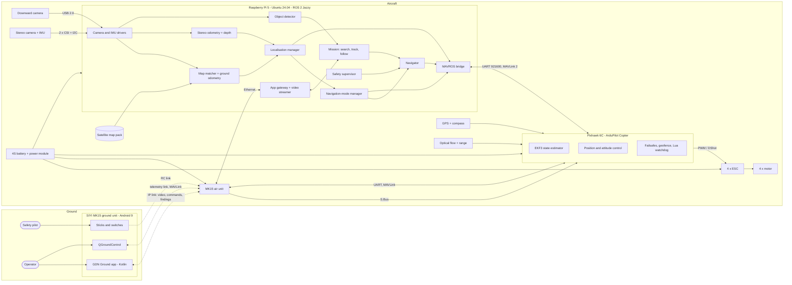
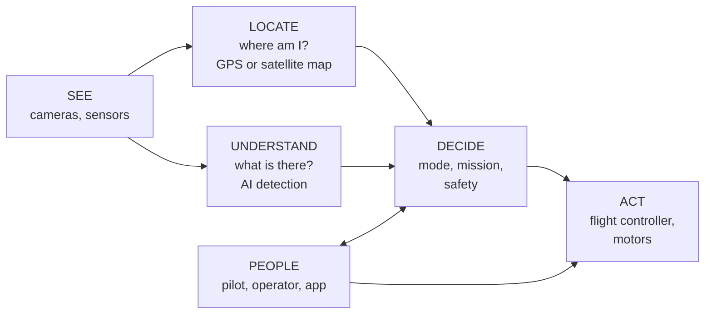
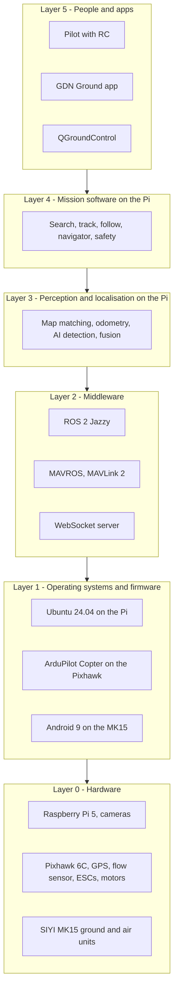
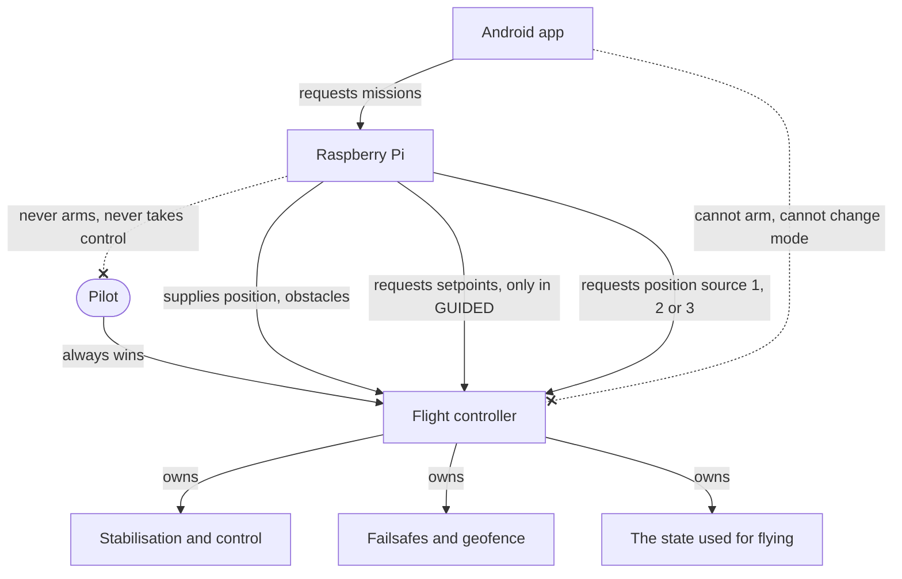
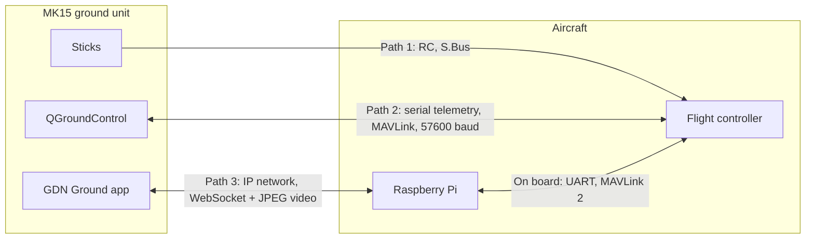
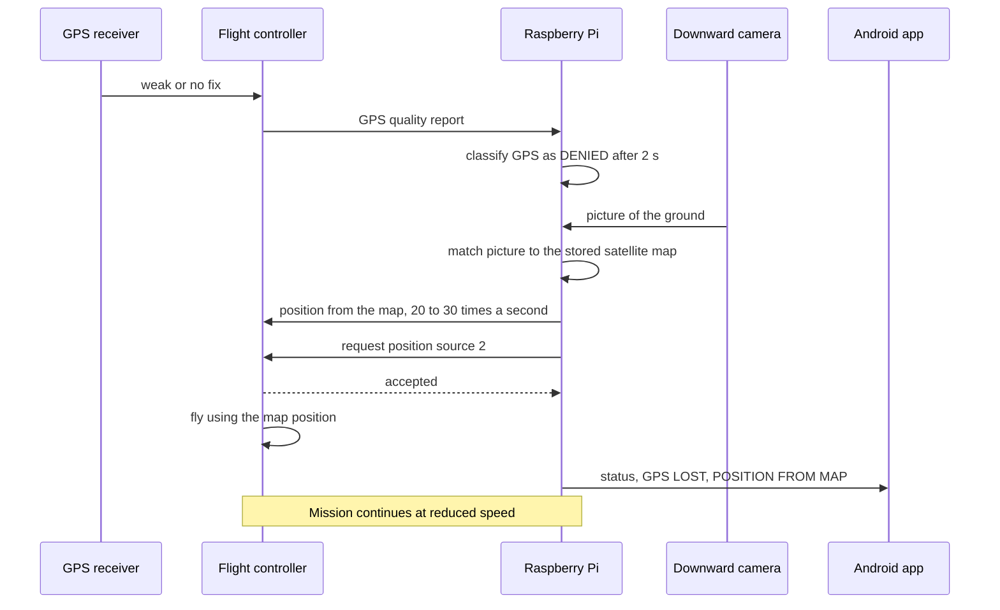
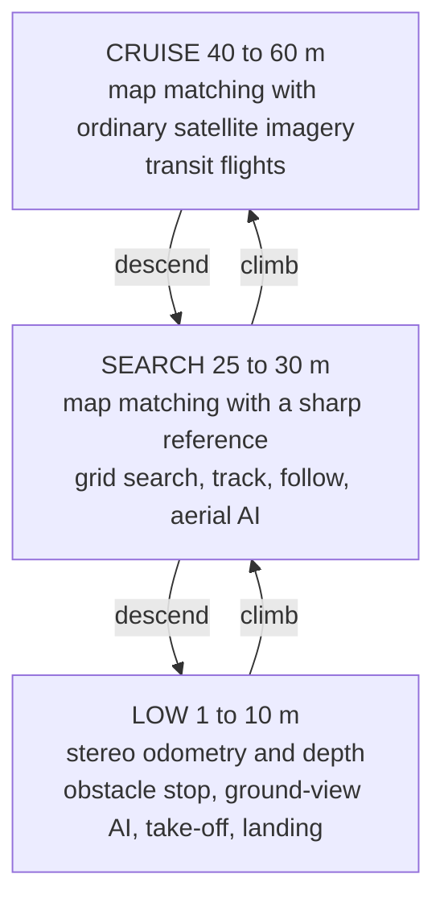

# 1. Full System Diagrams

| Field | Value |
|---|---|
| Document ID | GDN-DIA-001 |
| Baseline | DB-3.0 |
| Date | 2026-10-06 |

Everything in one view first, then the same system seen from four angles.

## D1.1 Full system: hardware, software, Raspberry Pi and Android app

How to read it: the left side is what people hold; the right side is what flies. Three separate radio paths join them. On the aircraft, the Pixhawk flies and the Raspberry Pi thinks.

## D1.2 The system in five blocks

## D1.3 Technology stack, bottom to top

## D1.4 Who is allowed to do what

## D1.5 The three radio paths

## D1.6 What happens when GPS is lost (end to end)

## D1.7 Flight profiles by height

