# 2. Hardware Diagrams

| Field | Value |
|---|---|
| Document ID | GDN-DIA-002 |
| Baseline | DB-3.0 |
| Date | 2026-10-06 |

First the whole hardware, then the full wiring, then one diagram per part. Pin-level tables are in [low-level-design.md](../03-hardware/low-level-design.md).

## D2.1 Hardware block diagram

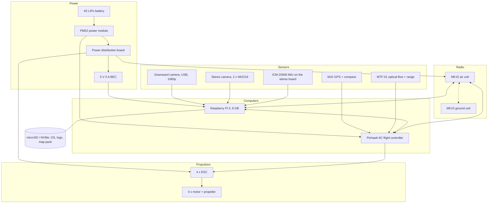

## D2.2 Full hardware connection diagram

Every cable, with its interface.

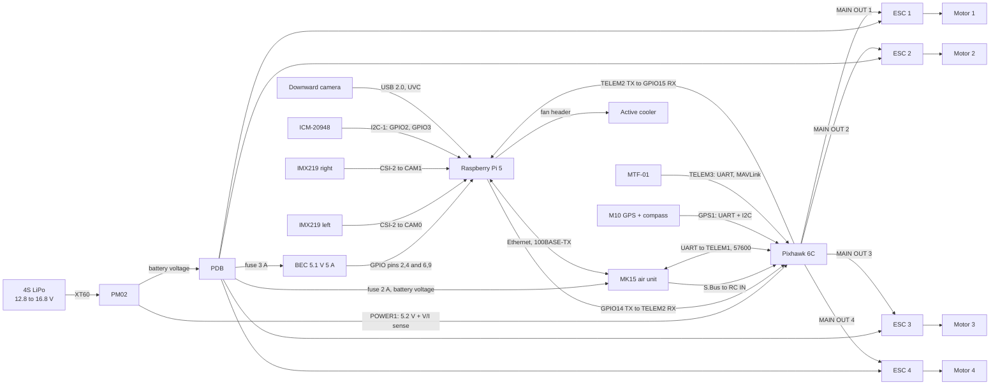

Rules shown by this diagram: the Pi and the flight controller have separate 5 V supplies and share only ground and signals; the 5 V pin of TELEM2 is not connected; nothing connects the Pi to the motors.

## D2.3 Power distribution

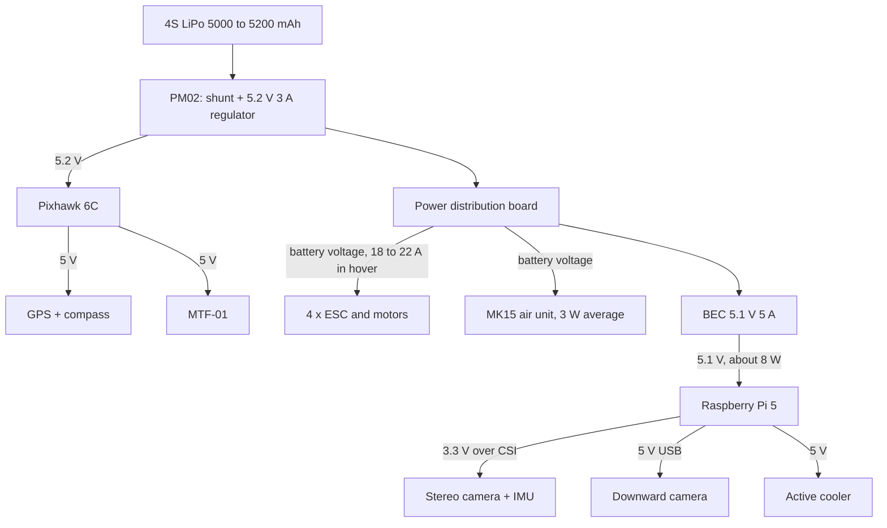

## D2.4 Raspberry Pi 5: what is plugged where

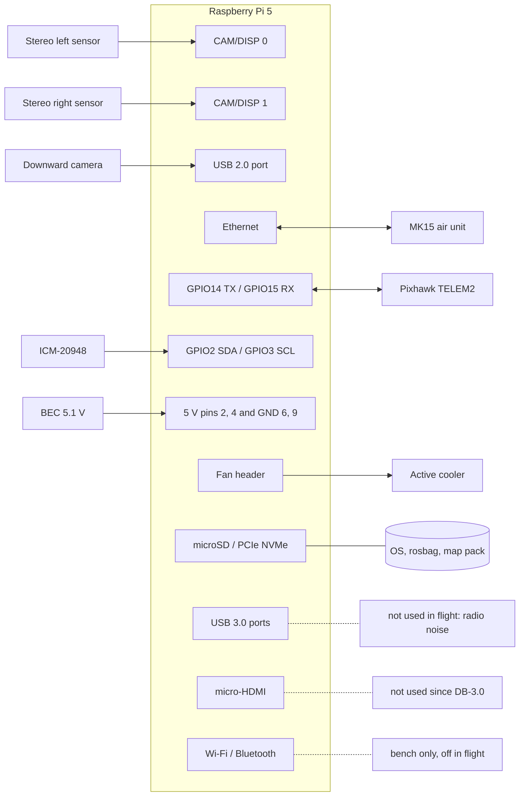

## D2.5 Pixhawk 6C: what is plugged where

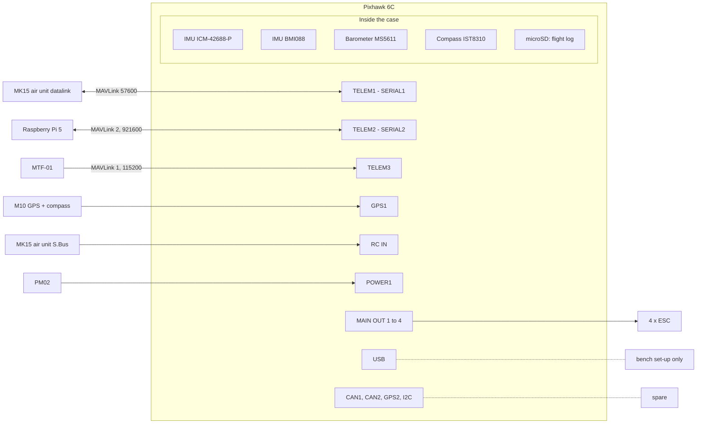

## D2.6 Downward camera

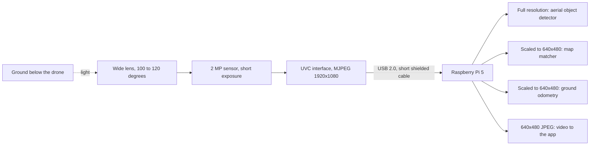

## D2.7 Stereo camera and its IMU

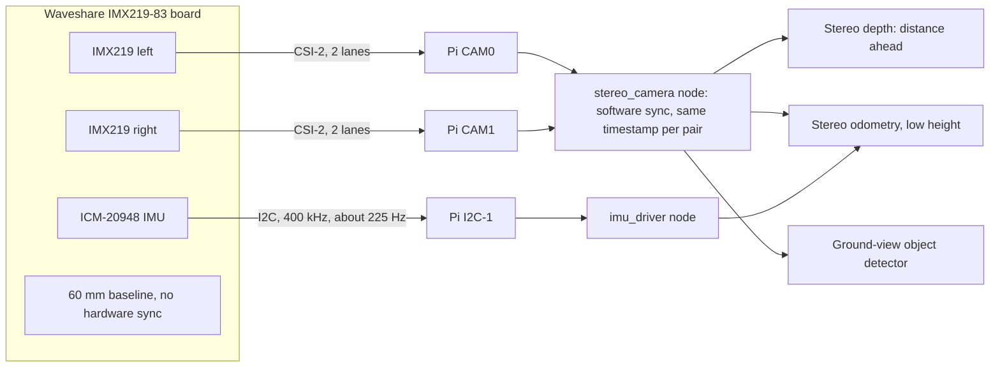

## D2.8 SIYI MK15: ground unit and air unit

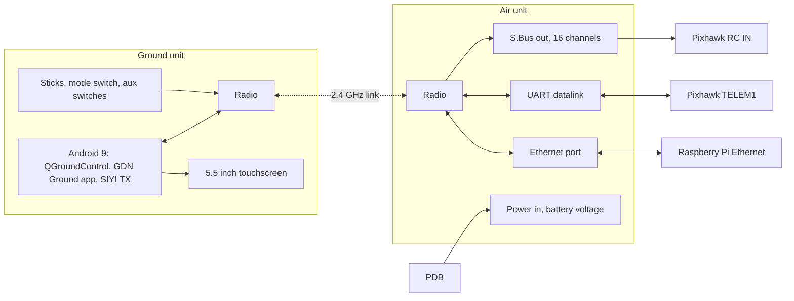

## D2.9 GPS, compass and flow sensor

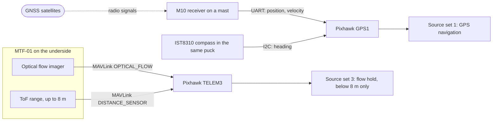

## D2.10 Propulsion

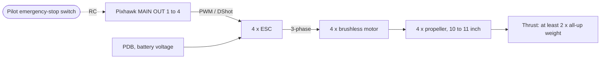

## D2.11 Where things sit on the airframe (top view)

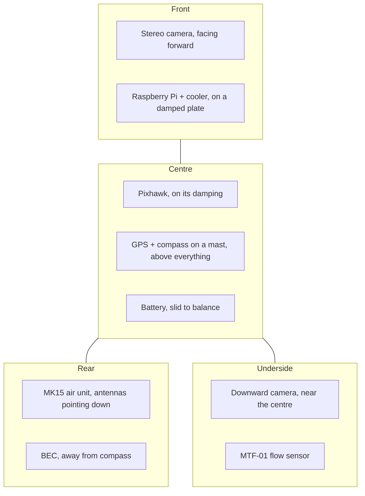

## D2.12 Signal types used

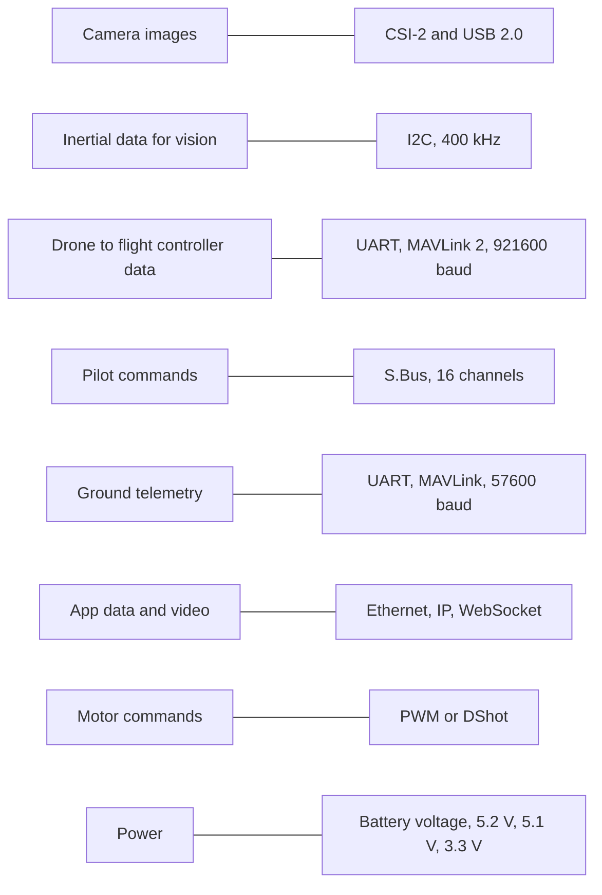
