# 3. Software Diagrams (Raspberry Pi and Flight Controller)

| Field | Value |
|---|---|
| Document ID | GDN-DIA-003 |
| Baseline | DB-3.0 |
| Date | 2026-10-06 |

One simple picture first, then the layers, then one diagram per software part. Node details are in [node-reference.md](../05-ros2/node-reference.md).

## D3.1 Software in one simple picture

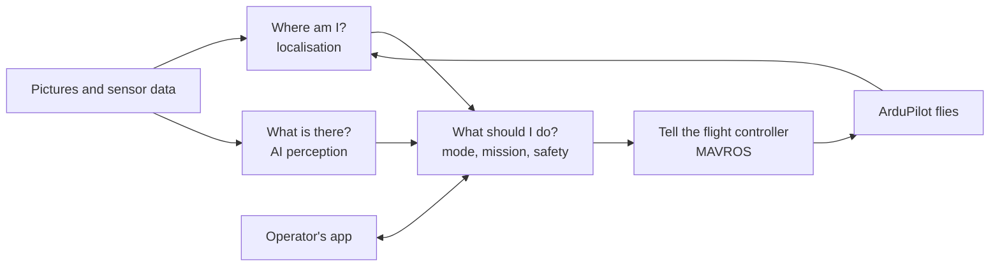

## D3.2 Software layers on the Raspberry Pi

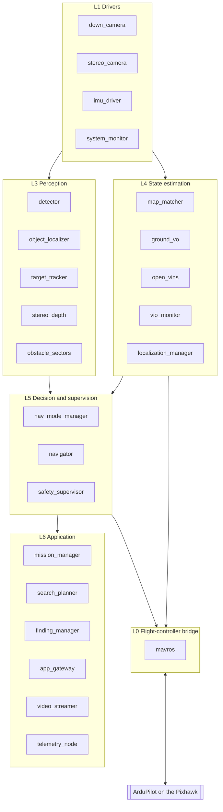

## D3.3 Complete node graph

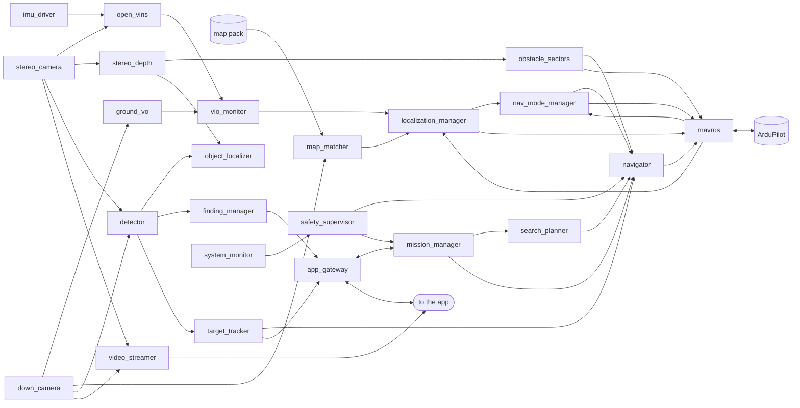

## D3.4 Part: sensing (drivers)

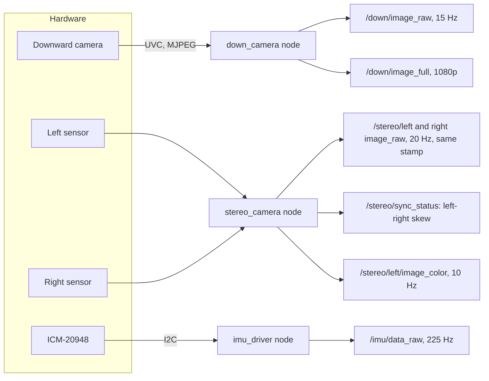

## D3.5 Part: satellite map matching

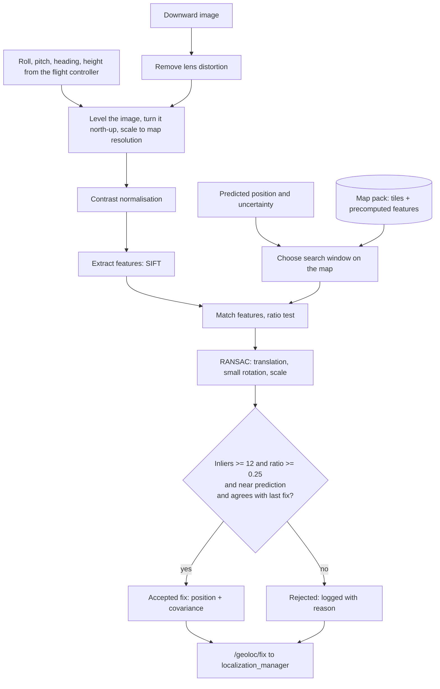

## D3.6 Part: ground visual odometry

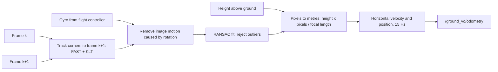

## D3.7 Part: localisation fusion

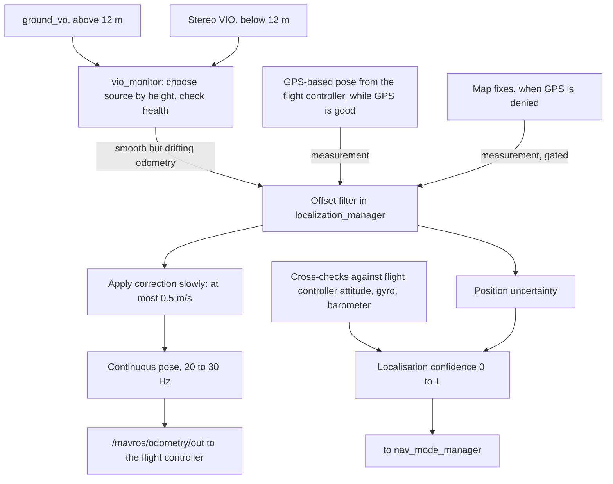

## D3.8 Part: navigation-mode manager

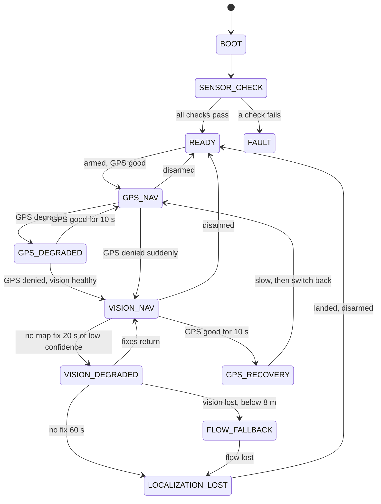

## D3.9 Part: AI perception

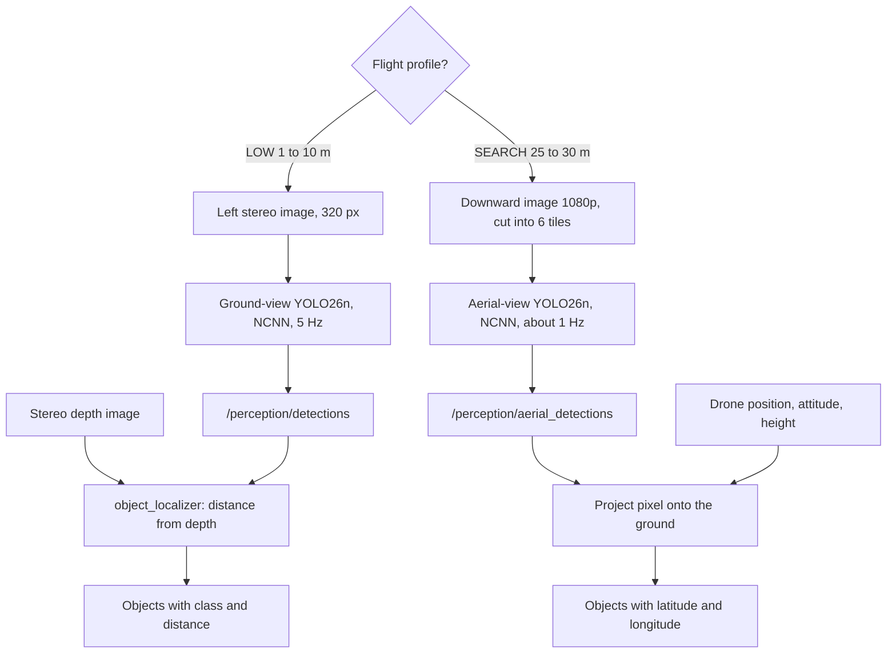

## D3.10 Part: grid search

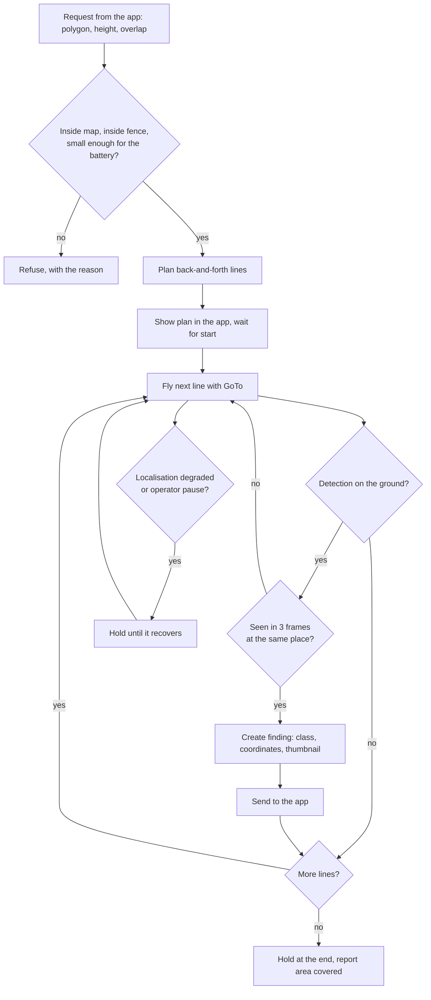

## D3.11 Part: track and follow

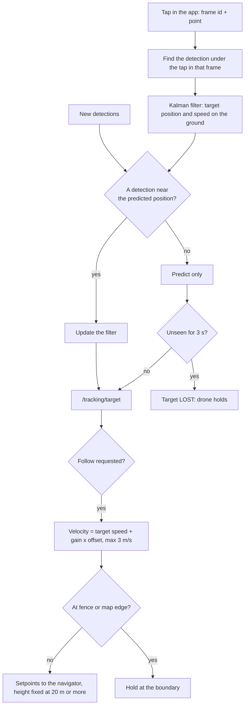

## D3.12 Part: navigation and mission

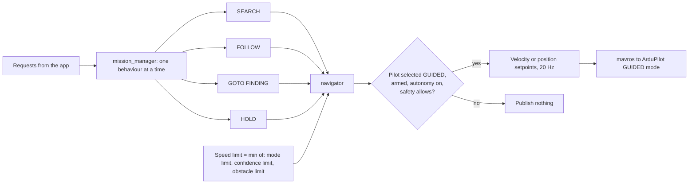

## D3.13 Part: safety

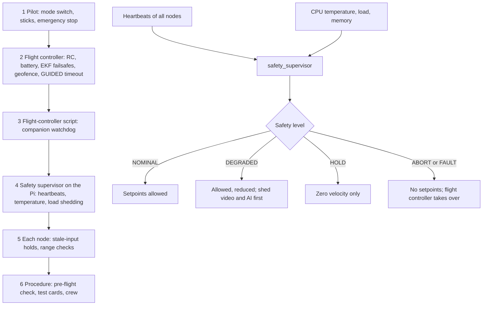

## D3.14 Part: app gateway

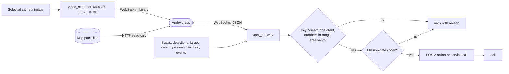

## D3.15 Part: flight-controller bridge

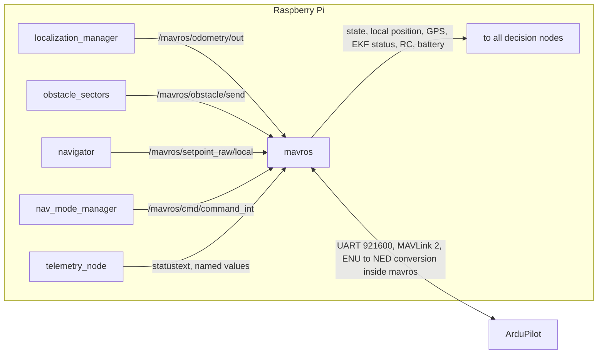

## D3.16 Which nodes run in which flight profile

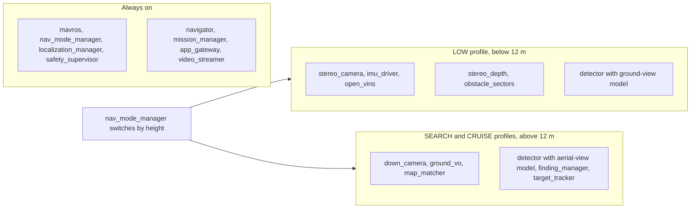

## D3.17 Processes on the Raspberry Pi

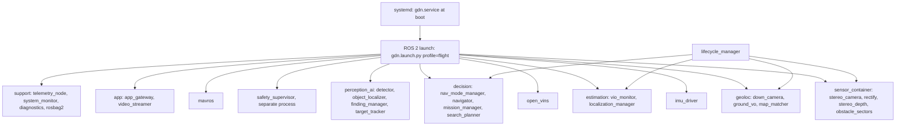

## D3.18 Software on the flight controller

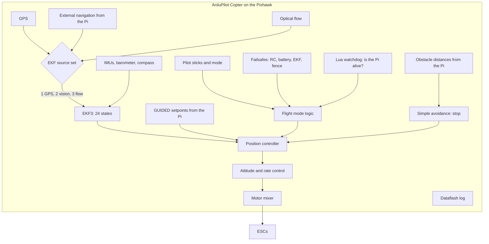
