# 4. Android App Diagrams

| Field | Value |
|---|---|
| Document ID | GDN-DIA-004 |
| Baseline | DB-3.0 |
| Date | 2026-10-06 |

The app is a native Kotlin app on the SIYI MK15 ground unit. Design text: [ground-app.md](../10-communication/ground-app.md). The app has not been built; these diagrams are the design.

## D4.1 The app in one simple picture

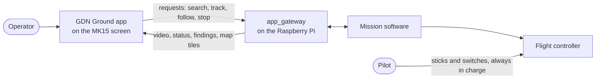

## D4.2 App architecture

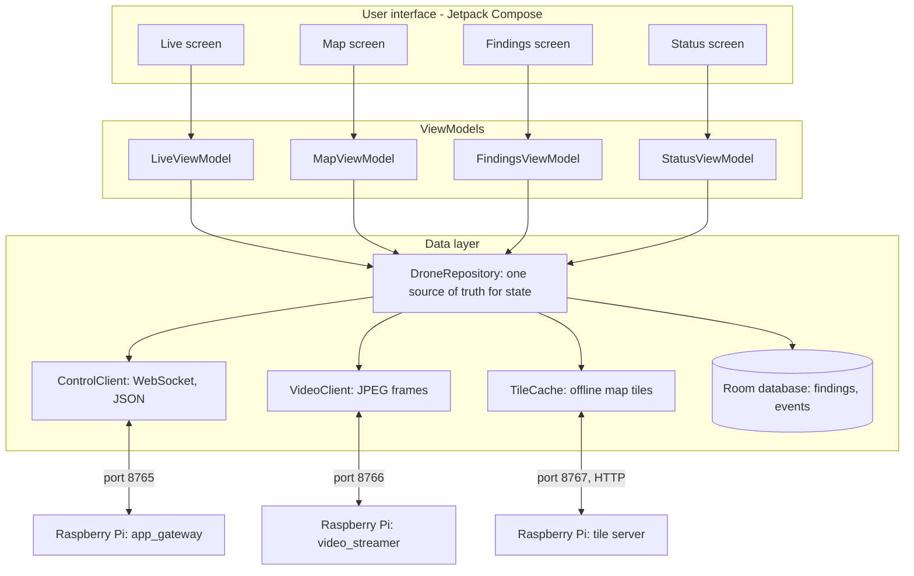

## D4.3 Screens and how the operator moves between them

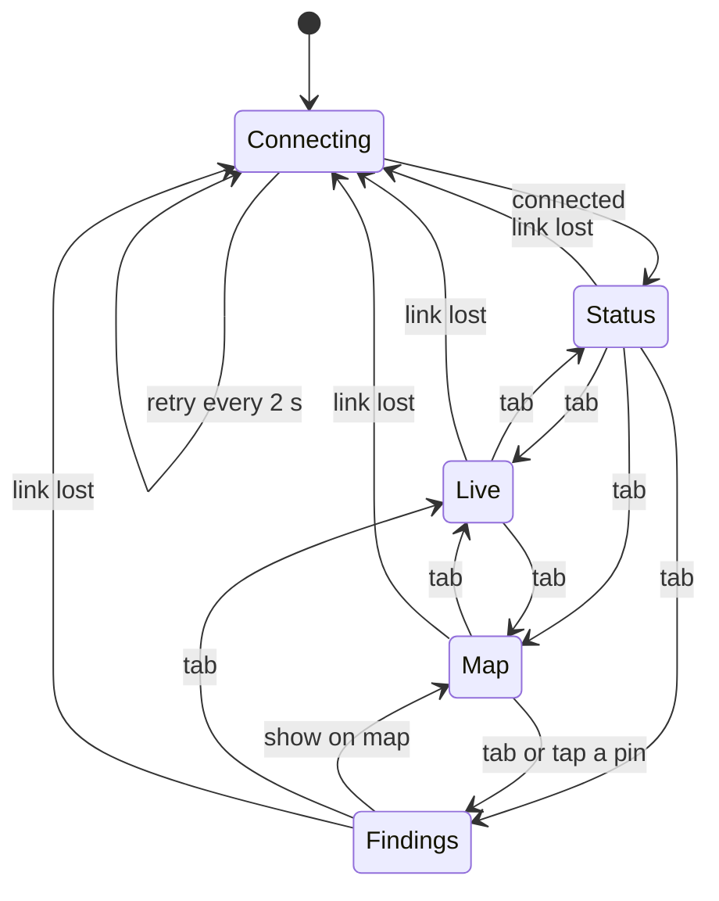

## D4.4 Live screen

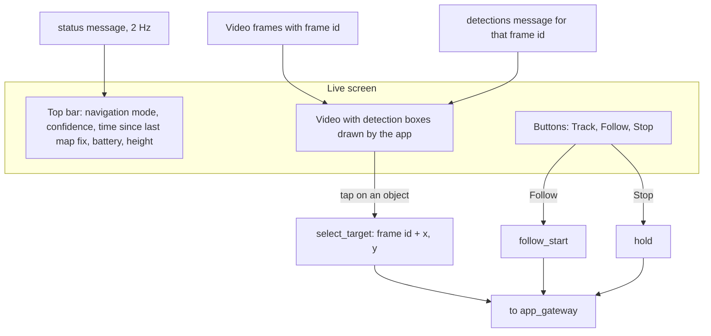

## D4.5 Map screen

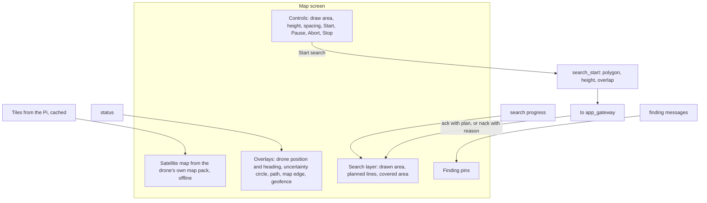

## D4.6 Findings screen

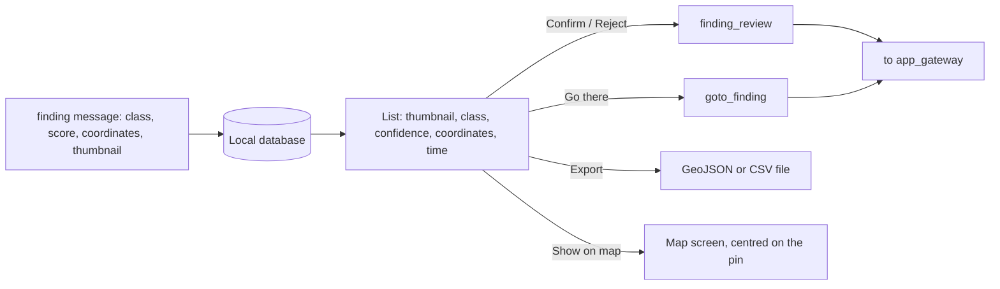

## D4.7 Status screen and pre-flight check

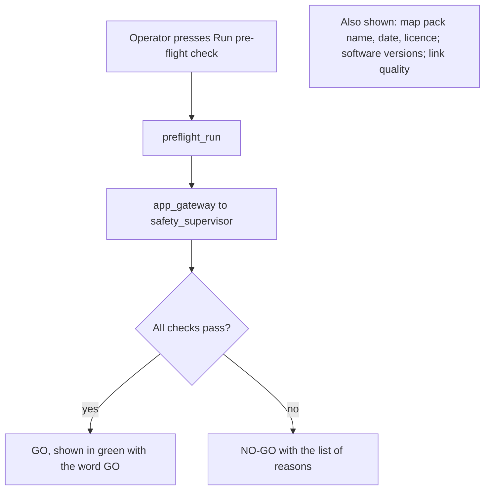

## D4.8 Connection state of the app

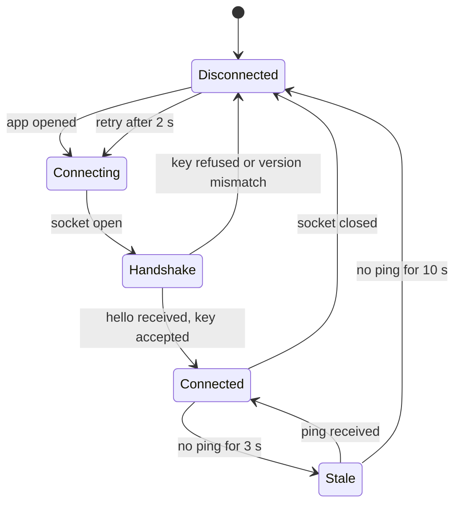

## D4.9 What happens to a request from the app

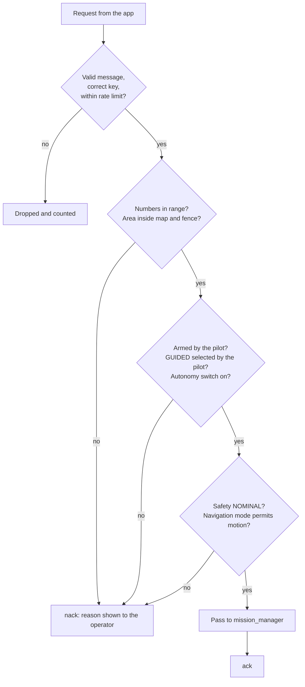

## D4.10 If the app link is lost

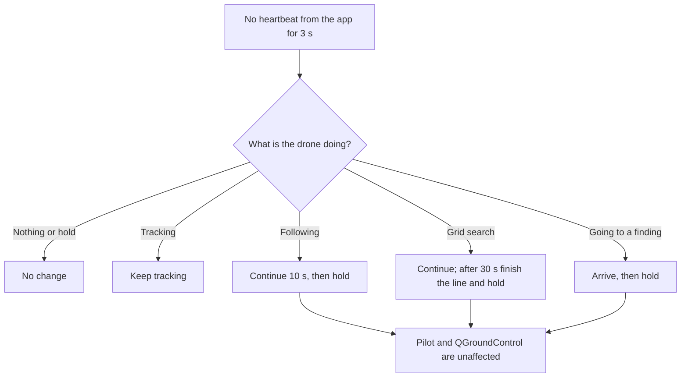

## D4.11 Tap to track: timing between app and drone

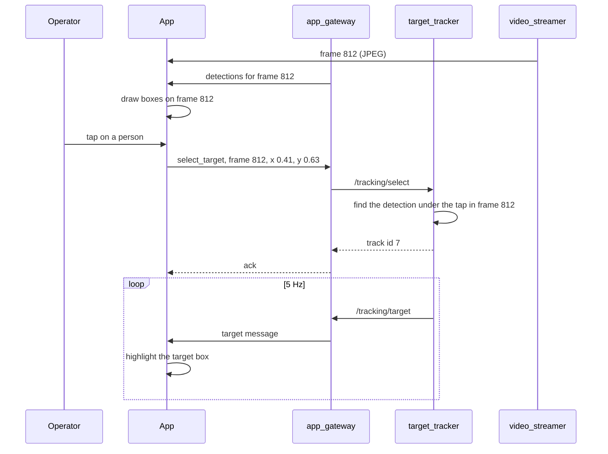

## D4.12 Development stages for the app

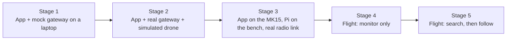
