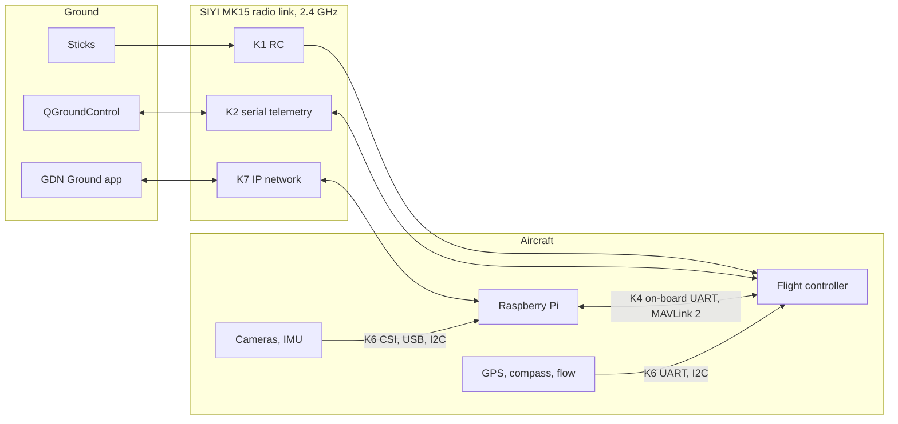
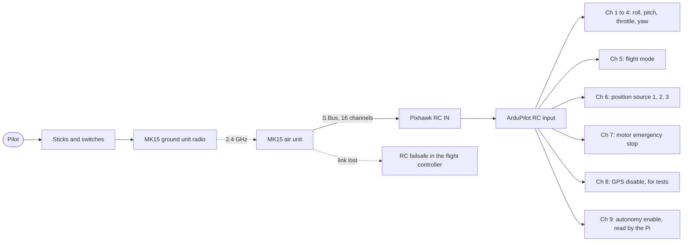
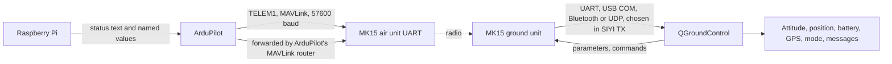
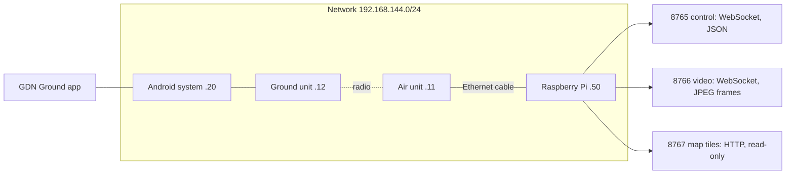
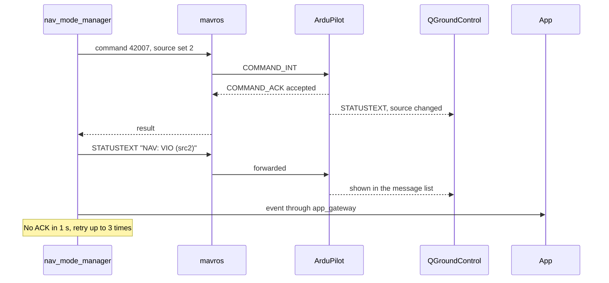
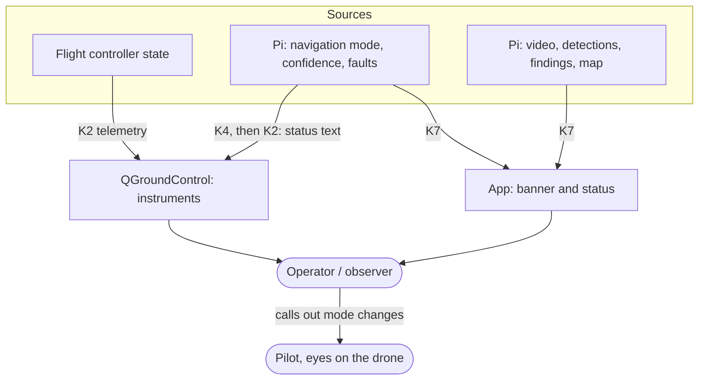
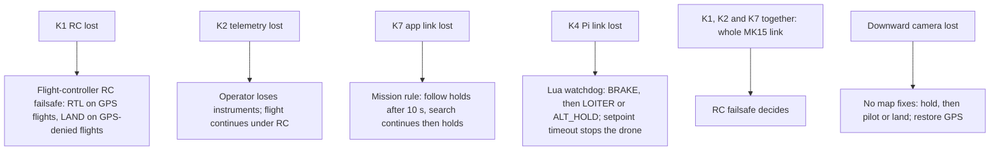
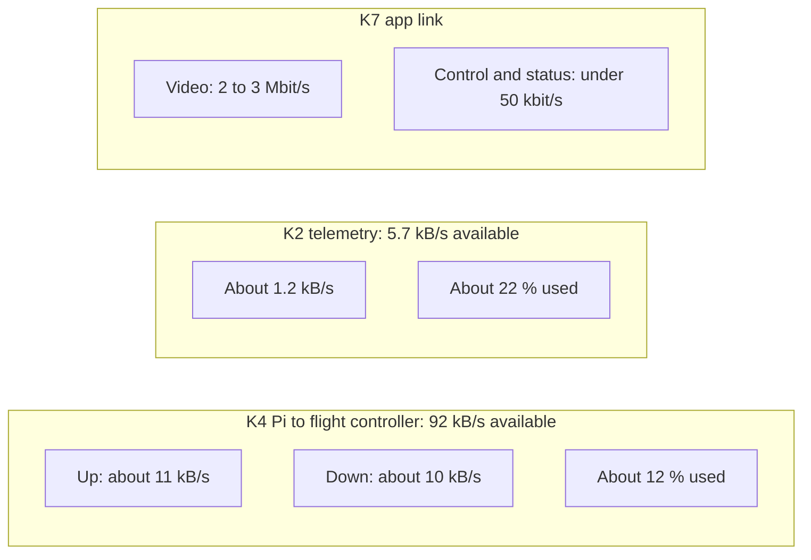
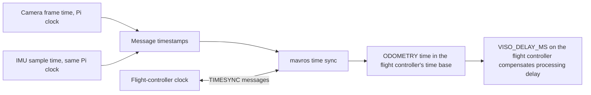

# 5. Radio and Telemetry Diagrams

| Field | Value |
|---|---|
| Document ID | GDN-DIA-005 |
| Baseline | DB-3.0 |
| Date | 2026-10-06 |

Design text: [mavlink-integration.md](../10-communication/mavlink-integration.md), [telemetry-and-links.md](../10-communication/telemetry-and-links.md), [siyi-mk15.md](../03-hardware/siyi-mk15.md).

## D5.1 All links in the system

| Link | Carries | Importance |
|---|---|---|
| K1 RC | Sticks, flight mode, safety switches | Flight-critical |
| K2 serial telemetry | Standard telemetry to QGroundControl | Important |
| K4 Pi to flight controller | Position, obstacles, setpoints; state back | Needed for autonomy, not for flight |
| K7 IP network | App: video, commands, findings | Advisory |
| K6 sensors | Images, inertial data, GPS | Per sensor |

## D5.2 RC path

The RC path never passes through the Raspberry Pi or the app.

## D5.3 Telemetry path to QGroundControl

## D5.4 IP path for the app

## D5.5 What the Raspberry Pi and the flight controller say to each other

```mermaid
flowchart LR
    subgraph PI["Raspberry Pi to flight controller"]
        direction TB
        U1["HEARTBEAT, 1 Hz"]
        U2["ODOMETRY: position from vision, 20 to 30 Hz"]
        U3["OBSTACLE_DISTANCE, 10 Hz"]
        U4["SET_POSITION_TARGET_LOCAL_NED: setpoints, 20 Hz"]
        U5["MAV_CMD_SET_EKF_SOURCE_SET: 1, 2 or 3"]
        U6["Mode request: BRAKE, LOITER, LAND only"]
        U7["STATUSTEXT, NAMED_VALUE_FLOAT"]
        U8["TIMESYNC"]
    end
    subgraph FC["Flight controller to Raspberry Pi"]
        direction TB
        D1["HEARTBEAT: armed, mode"]
        D2["LOCAL_POSITION_NED, ATTITUDE, 30 Hz"]
        D3["GPS_RAW_INT, 5 Hz"]
        D4["EKF_STATUS_REPORT, 5 Hz"]
        D5["DISTANCE_SENSOR, OPTICAL_FLOW"]
        D6["RC_CHANNELS"]
        D7["BATTERY_STATUS"]
        D8["COMMAND_ACK, STATUSTEXT"]
    end
    PI == "UART 921600 baud, MAVLink 2" ==> FC
    FC == "same cable, other direction" ==> PI
```

Never sent by the Pi: arm or disarm, attitude or motor commands, RC override, a request to enter GUIDED.

## D5.6 Switching the position source

## D5.7 How information reaches the people

## D5.8 What each link loss leads to

## D5.9 Message rates and link capacity

All figures are design estimates.

## D5.10 Time synchronisation

