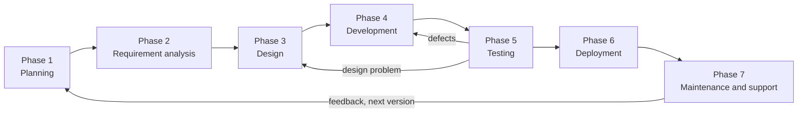
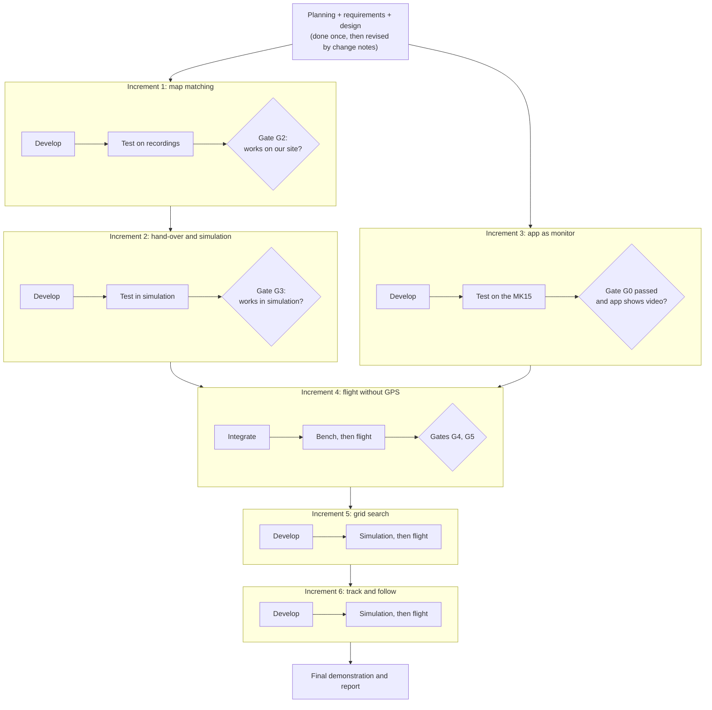
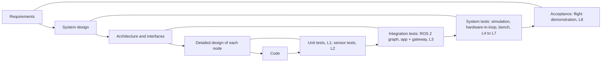
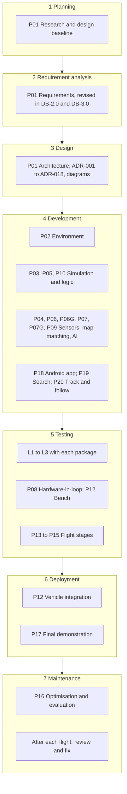
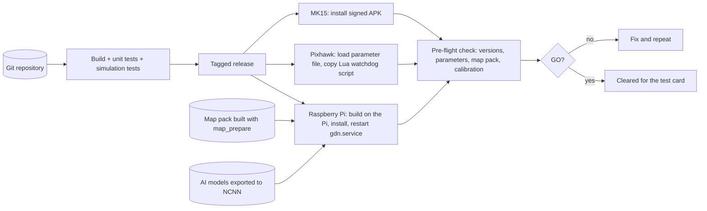
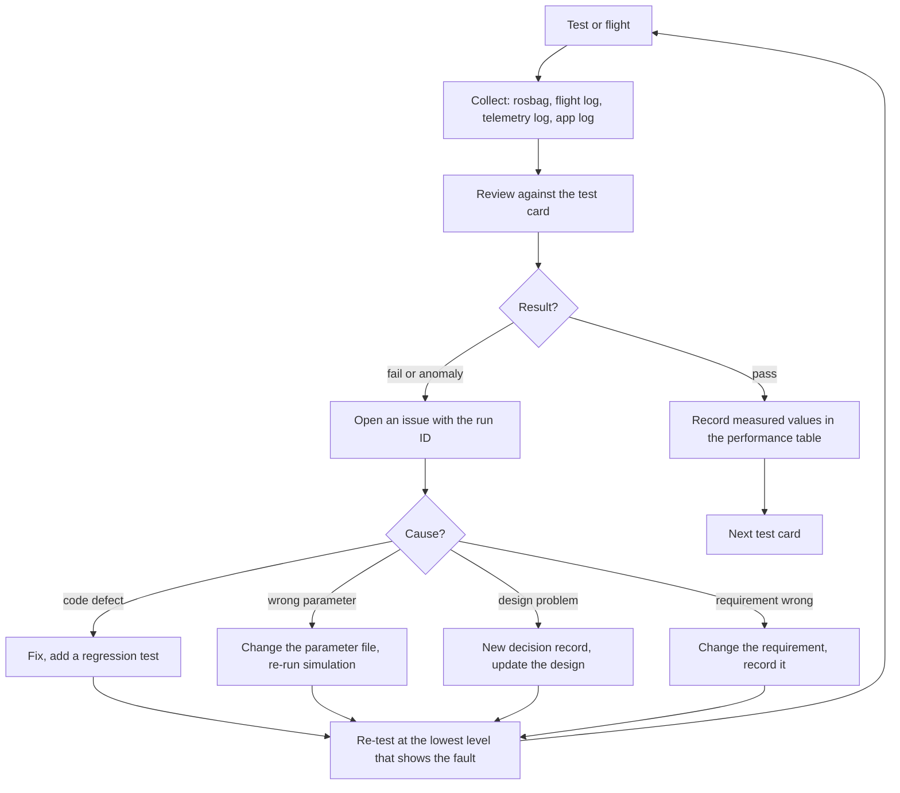
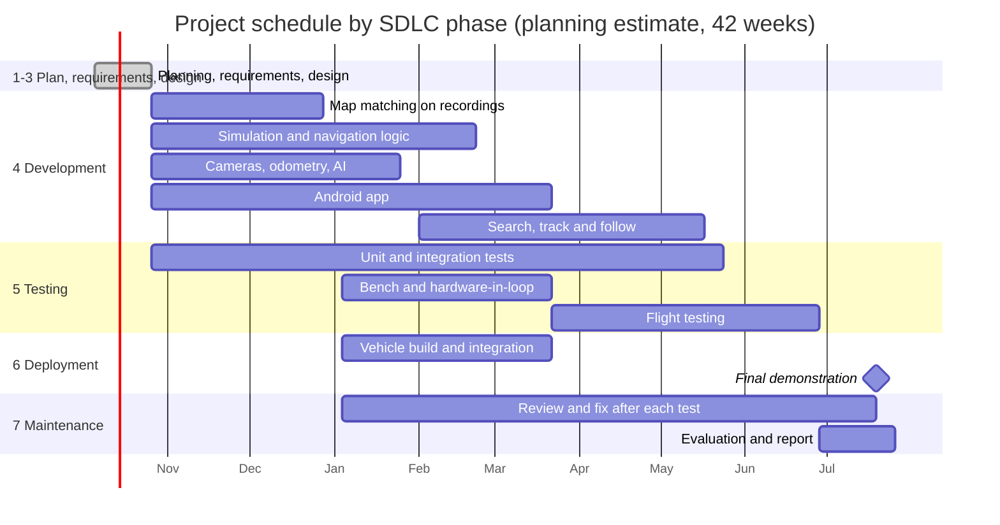
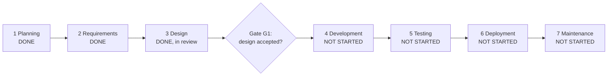

# 6. Software Development Life Cycle

| Field | Value |
|---|---|
| Document ID | GDN-DIA-006 |
| Baseline | DB-3.0 |
| Date | 2026-10-06 |

The project follows the seven-phase software development life cycle. This document shows the cycle, how each phase applies to this project, and where the project stands.

## D6.1 The seven phases

## D6.2 What each phase means in this project

| Phase | What we do | Main outputs | Where it is documented | Status |
|---|---|---|---|---|
| **1 Planning** | Set the goal, check feasibility, fix the scope, list risks, define the minimum result | Objective; scope; feasibility; risk list; delivery levels (Bronze / Silver / Gold) | [project-overview](../00-project-overview/project-overview.md), [roadmap](../16-development-roadmap/roadmap.md), [BOM](../15-bom/bill-of-materials.md) | Done |
| **2 Requirement analysis** | Write what the system must do and how well | Functional requirements FR-001 to FR-131; non-functional NFR-001 to NFR-092 | [system-requirements](../01-requirements/system-requirements.md) | Done (version 3.0) |
| **3 Design** | Architecture, interfaces, workflows, app screens | System, hardware, software, ROS 2, app and communication designs; 18 decision records; these diagrams | Sections 02 to 12 and 17; this folder | Done, pending review |
| **4 Development** | Build the ROS 2 packages, the Android app, configuration and tools | 22 ROS 2 packages; Android app; flight-controller parameters and script; map-pack tool | [package-structure](../05-ros2/package-structure.md) | **Not started** |
| **5 Testing** | Eight test levels, from unit tests to staged flights | Test reports; measured performance | [testing-strategy](../13-testing/testing-strategy.md), [performance](../14-performance/performance-requirements.md) | Not started |
| **6 Deployment** | Put the software on the Pi, the Pixhawk and the MK15; pre-flight check; demonstration | Pi image; parameter files; signed APK; demonstration | D6.6 below; [roadmap](../16-development-roadmap/roadmap.md) | Not started |
| **7 Maintenance and support** | Review every flight, fix, re-test, update documents | Flight logs; issue list; new versions; updated baseline | D6.7 below; [project-status](../project-status.md) | Not started |

## D6.3 Life-cycle model used: iterative, with gates

The project is not a single pass. The phases repeat in increments, and a gate must be passed before work that depends on it begins.

Follow (increment 6) is the first to be dropped if time runs out.

## D6.4 Design and test levels paired (V-model view)

## D6.5 Phases mapped to the roadmap

## D6.6 Deployment: how software reaches each device

## D6.7 Maintenance: what happens after every test

## D6.8 Schedule by life-cycle phase

Dates assume a start on 5 October 2026 and are planning estimates only.

## D6.9 Where the project is now

Development must not start until gate G1 is passed.
