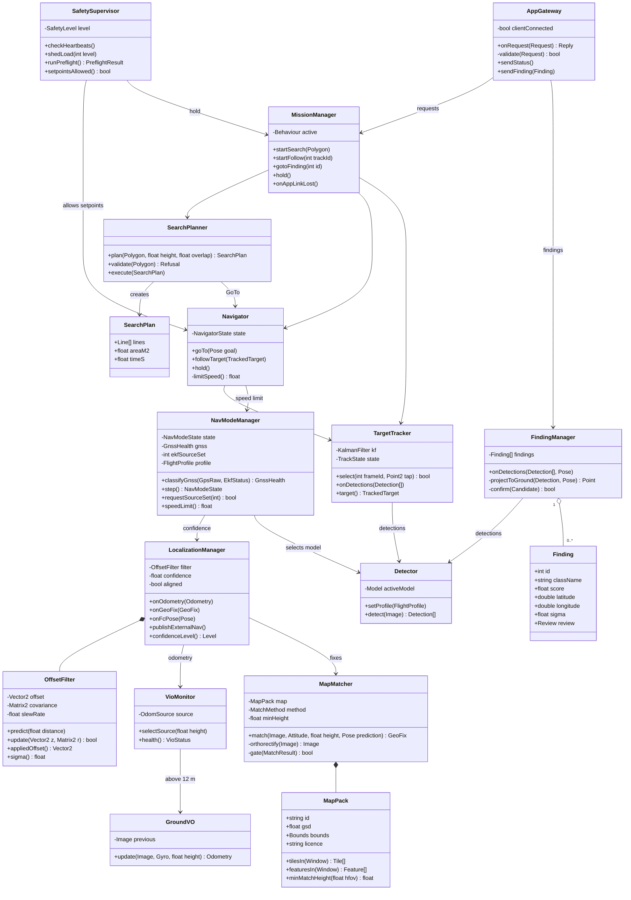
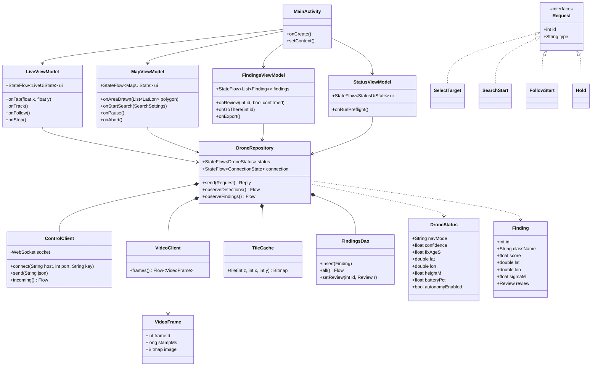
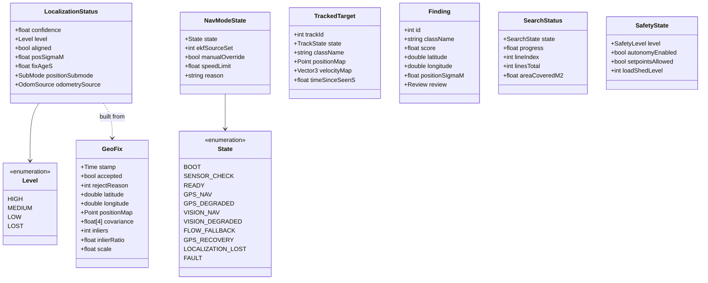
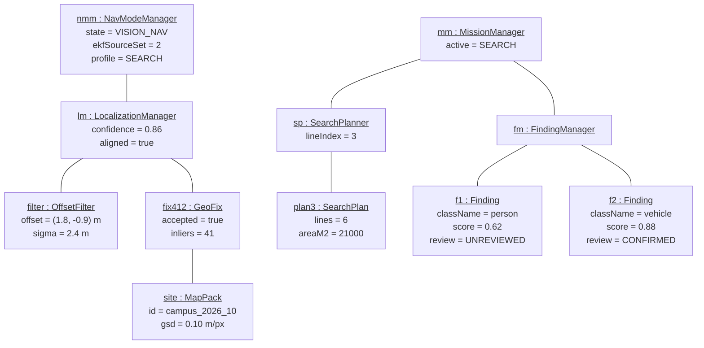
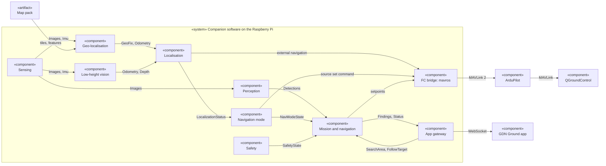
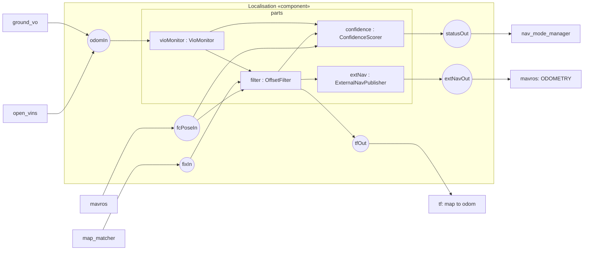
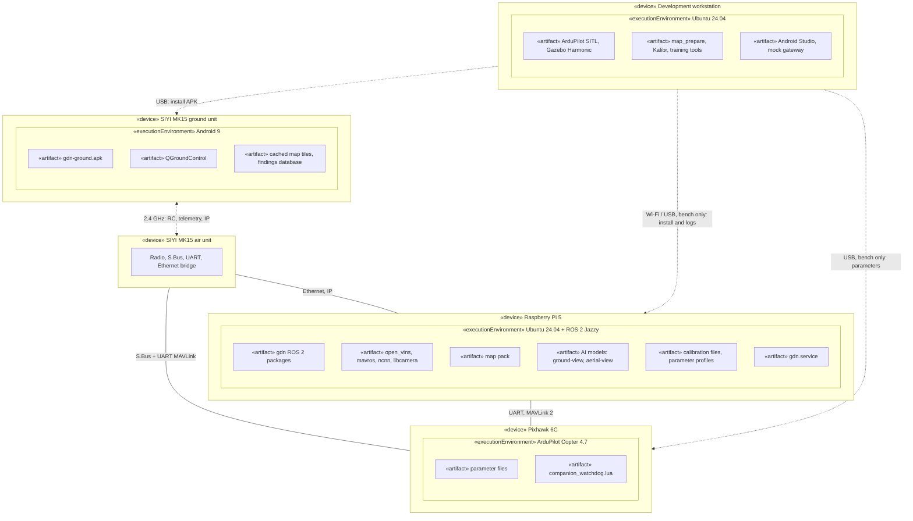
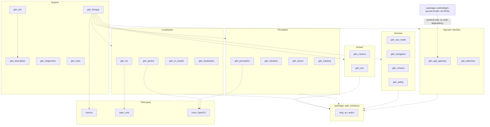
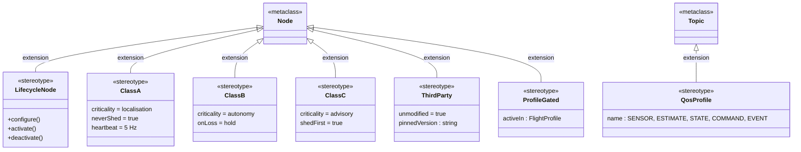

# 7. UML Structural Diagrams

| Field | Value |
|---|---|
| Document ID | GDN-DIA-007 |
| Baseline | DB-3.0 |
| Date | 2026-10-06 |

UML 2 defines seven structural diagram types. All seven are given here. Mermaid draws class diagrams natively; the other types are drawn with its flowchart notation using UML conventions (stereotypes in « », nodes, components, ports).

| # | UML diagram | In this document |
|---|---|---|
| 1 | Class | U1 drone software, U2 Android app, U3 messages |
| 2 | Object | U4 |
| 3 | Component | U5 |
| 4 | Composite structure | U6 |
| 5 | Deployment | U7 |
| 6 | Package | U8 |
| 7 | Profile | U9 |

## U1 Class diagram: drone software (main classes)

## U2 Class diagram: Android app

## U3 Class diagram: main data messages

## U4 Object diagram: a moment during a grid search with GPS denied

The values are an illustration of one possible instant, not measurements.

## U5 Component diagram

## U6 Composite structure diagram: inside the localisation component

## U7 Deployment diagram

## U8 Package diagram

Dashed arrows mean "depends on". Project packages depend on each other only through `gdn_interfaces`.

## U9 Profile diagram: stereotypes used in this design

How the stereotypes are applied:

| Node | Stereotypes |
|---|---|
| `map_matcher`, `ground_vo` | «LifecycleNode» «ClassA» «ProfileGated: SEARCH, CRUISE» |
| `open_vins` | «ThirdParty» «ClassA» «ProfileGated: LOW» |
| `localization_manager`, `nav_mode_manager` | «LifecycleNode» «ClassA» |
| `navigator`, `mission_manager`, `search_planner`, `target_tracker` | «LifecycleNode» «ClassB» |
| `detector`, `finding_manager`, `app_gateway`, `video_streamer` | «ClassC» |
| `mavros` | «ThirdParty» «ClassA» |
| `safety_supervisor` | «ClassA» (not lifecycle-managed: always running) |
