# 8. UML Behavioural Diagrams

| Field | Value |
|---|---|
| Document ID | GDN-DIA-008 |
| Baseline | DB-3.0 |
| Date | 2026-10-06 |

UML 2 defines seven behavioural diagram types. All seven are given here. Mermaid draws sequence and state diagrams natively; use case, activity, communication and interaction-overview diagrams are drawn with its flowchart notation using UML conventions. UML timing diagrams have no Mermaid equivalent, so U24 uses a time-axis bar chart to show the same information.

| # | UML diagram | In this document |
|---|---|---|
| 1 | Use case | U10, U11 |
| 2 | Activity | U12, U13, U14 |
| 3 | State machine | U15, U16, U17, U18 |
| 4 | Sequence | U19, U20, U21, U22, U22b |
| 5 | Communication | U23 |
| 6 | Interaction overview | U25 |
| 7 | Timing | U24 |

## U10 Use case diagram: whole system

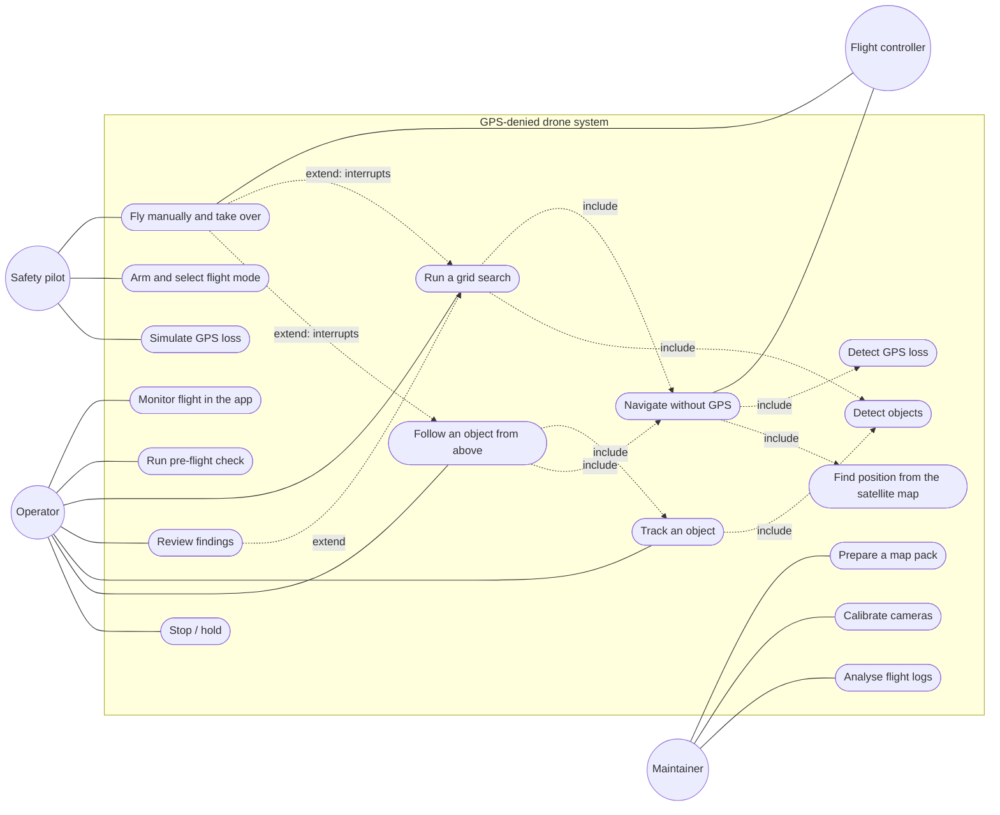

## U11 Use case diagram: the Android app

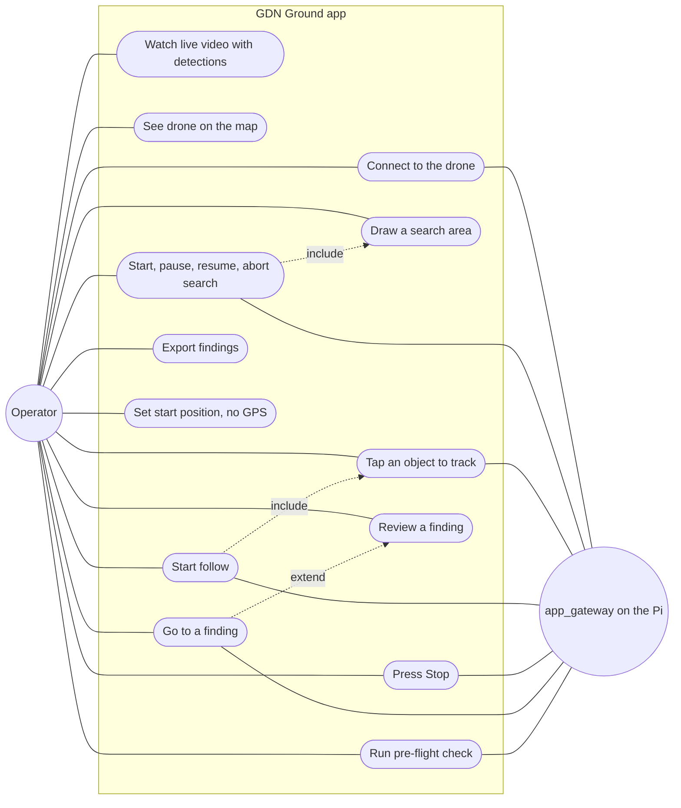

## U12 Activity diagram: a mission that loses GPS

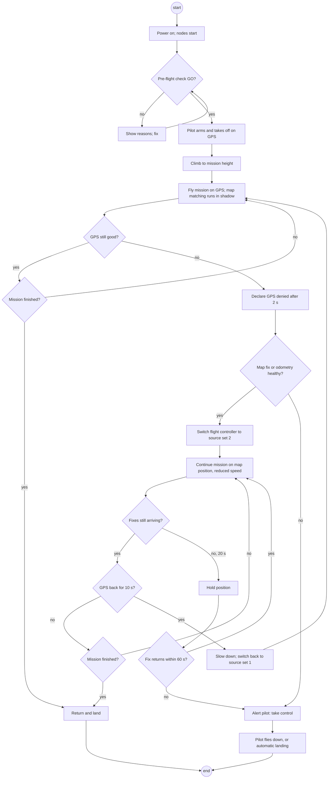

## U13 Activity diagram: grid search, with swimlanes

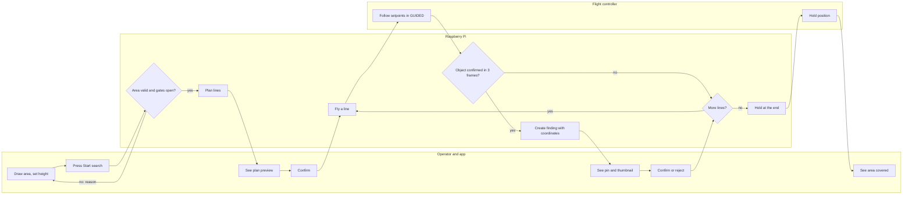

## U14 Activity diagram: one map-matching cycle

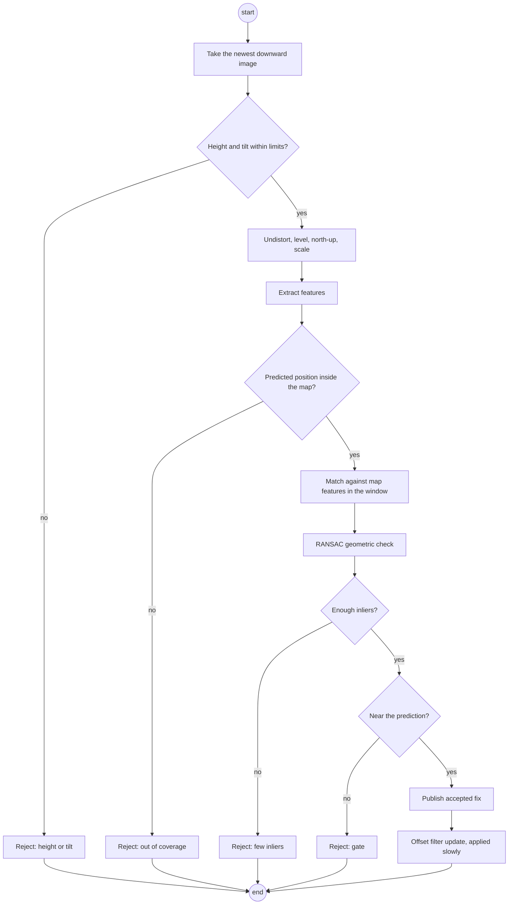

## U15 State machine diagram: navigation mode

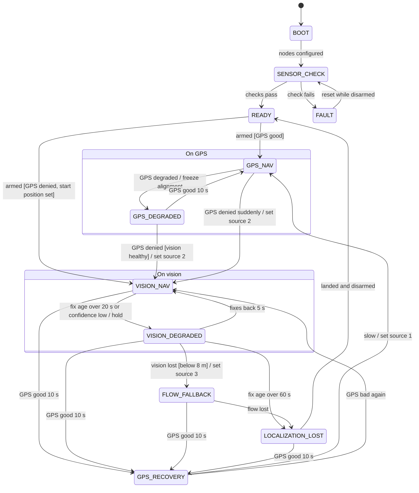

## U16 State machine diagram: search mission

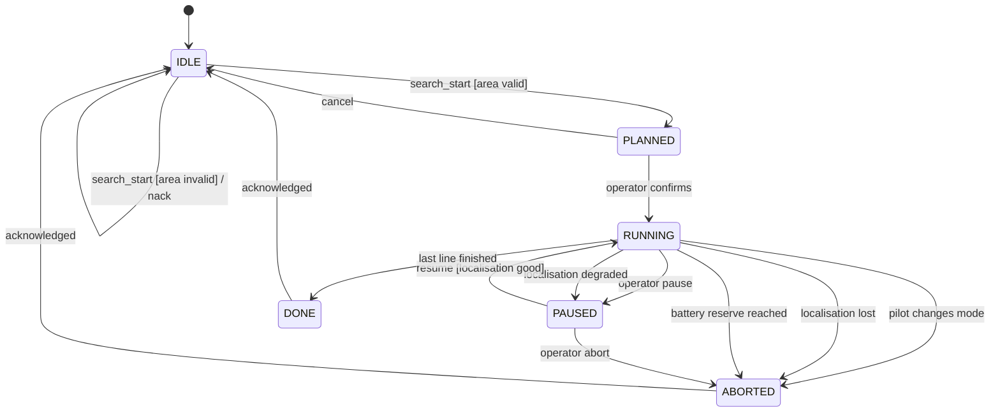

## U17 State machine diagram: tracked target

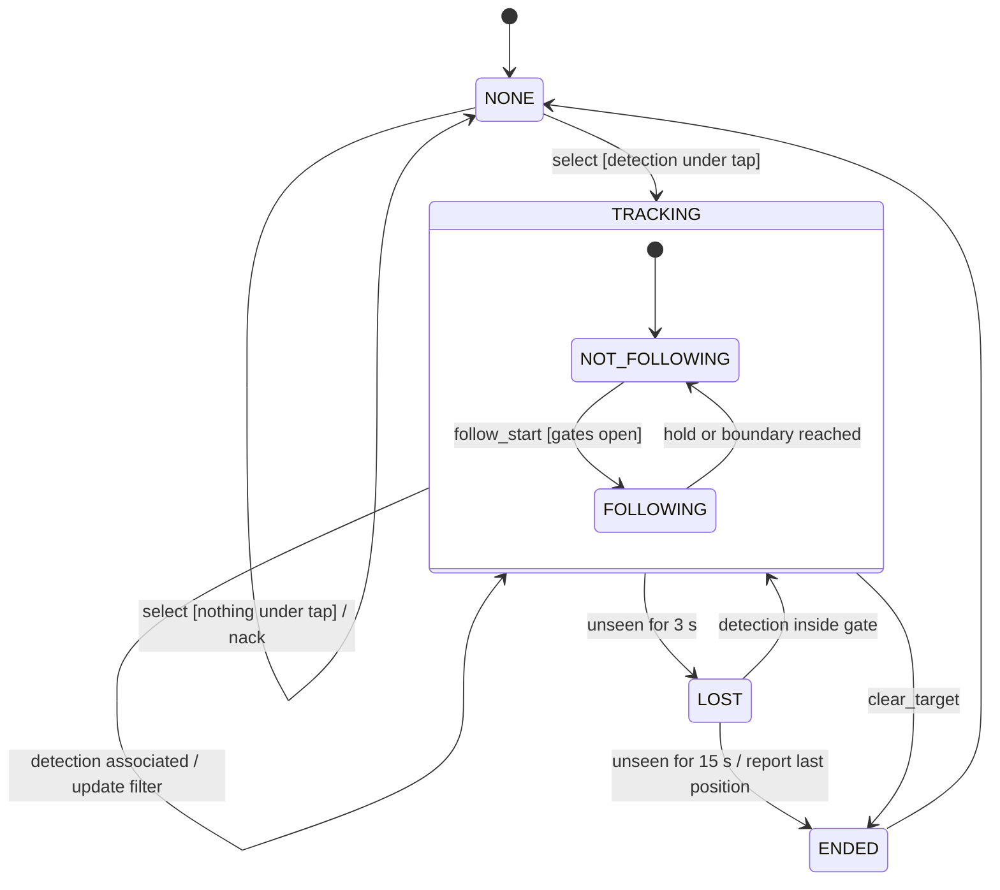

## U18 State machine diagram: a finding

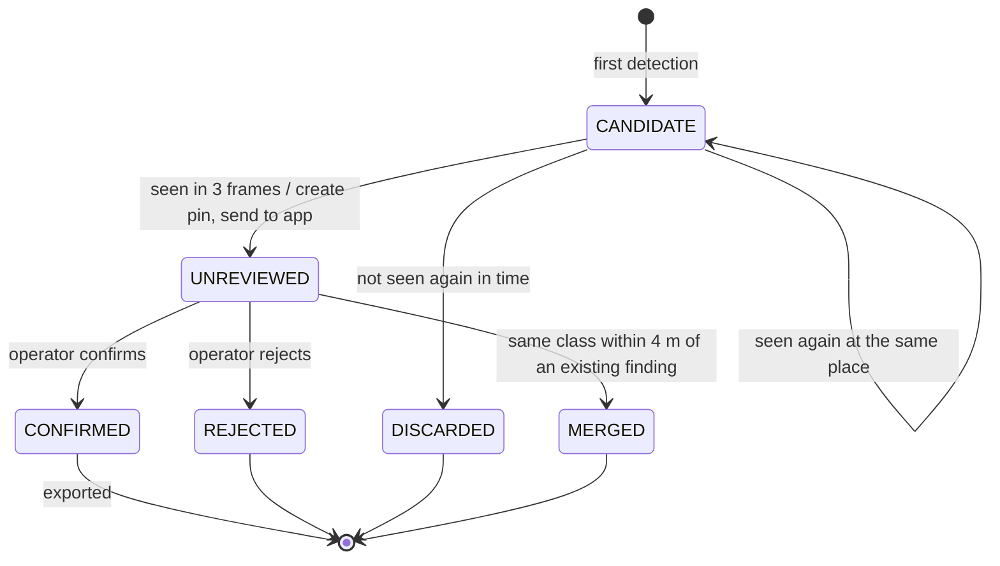

## U19 Sequence diagram: hand-over from GPS to the map

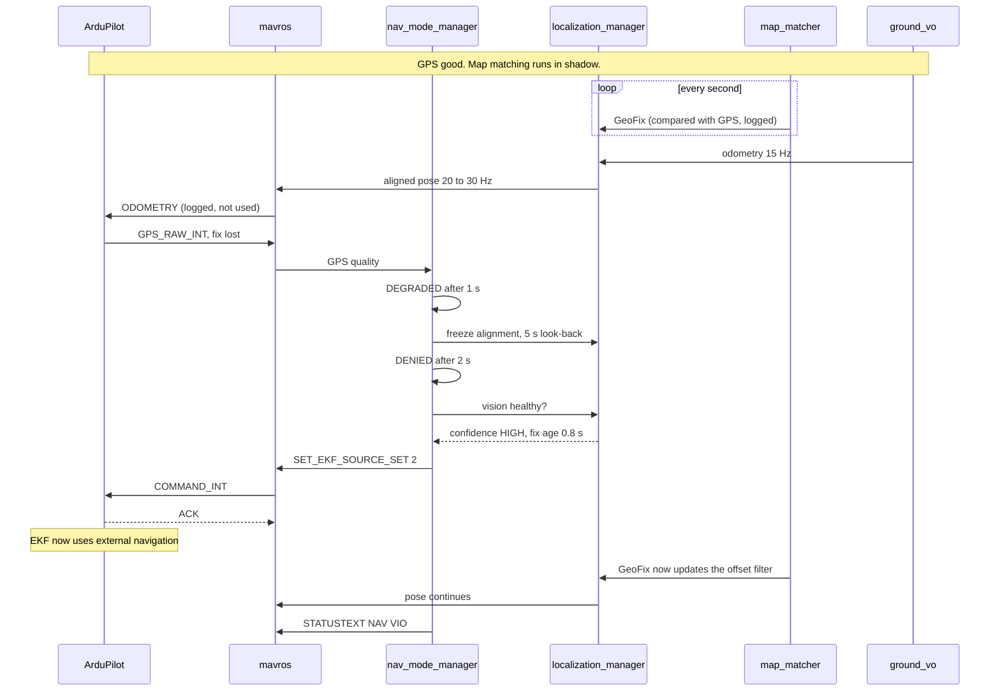

## U20 Sequence diagram: grid search from the app

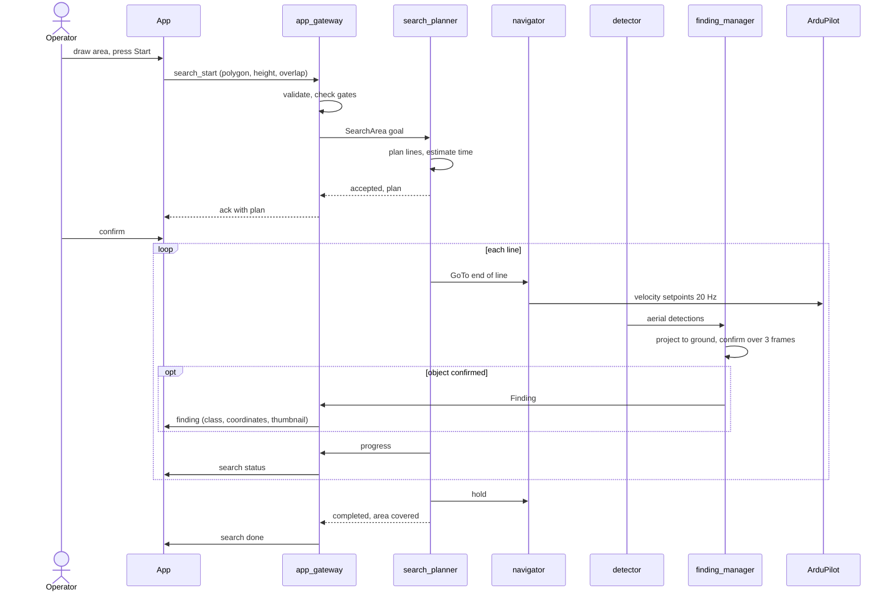

## U21 Sequence diagram: follow from above

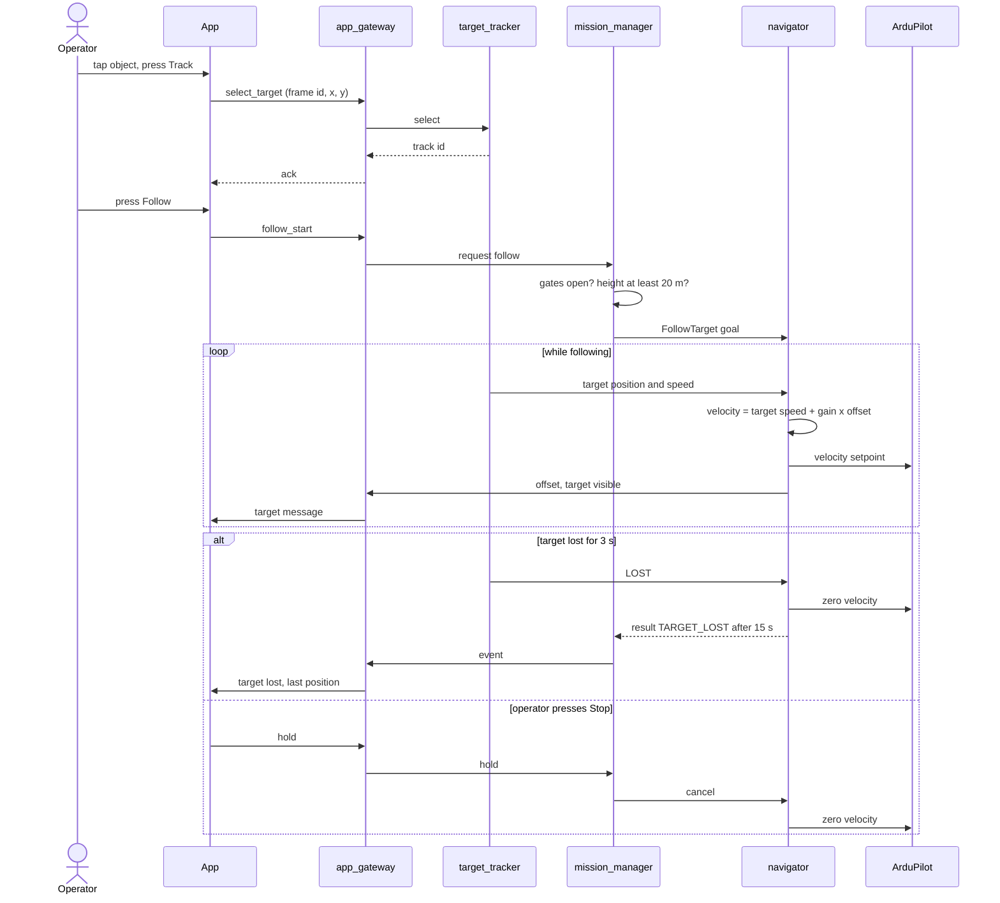

## U22 Sequence diagram: start-up to READY

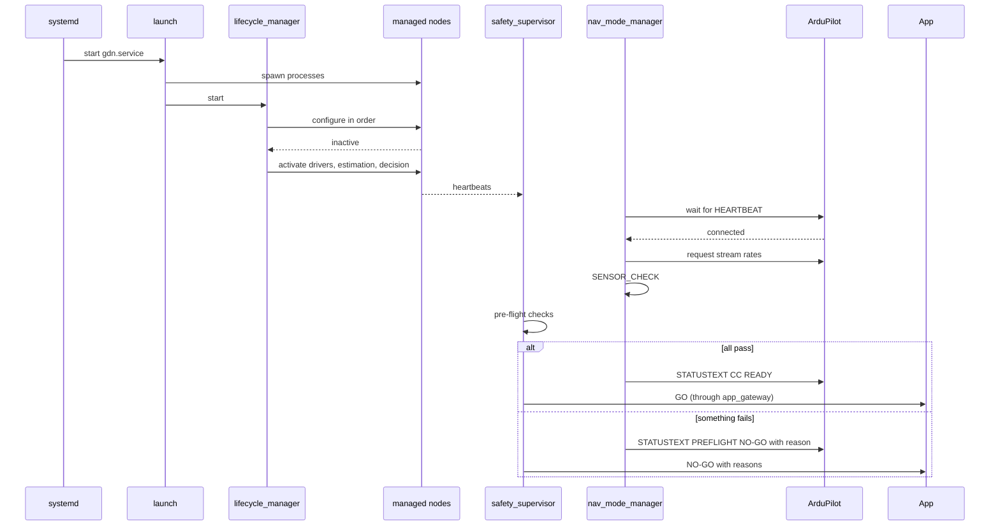

## U22b Sequence diagram: the Raspberry Pi fails in flight

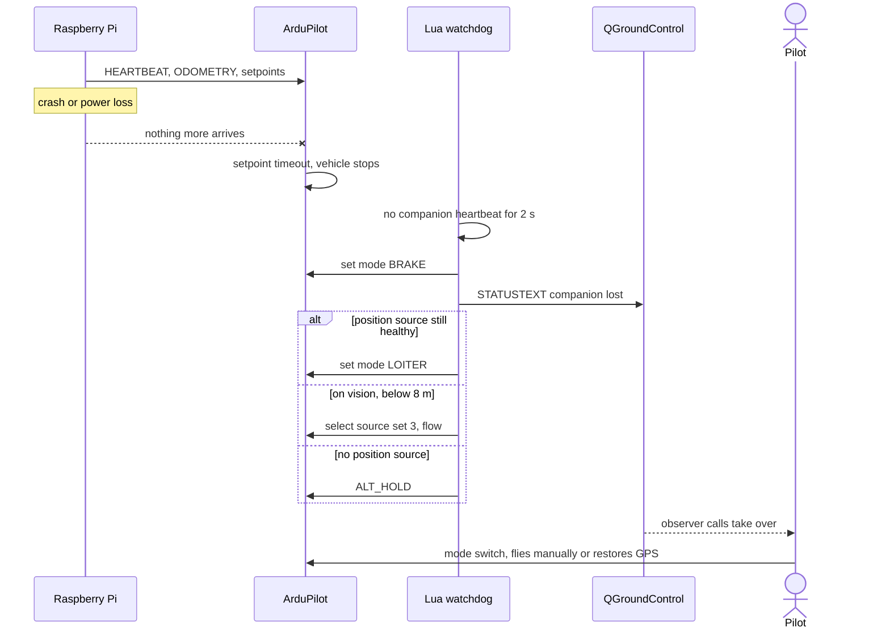

## U23 Communication diagram: one accepted map fix

Objects and the numbered messages between them.

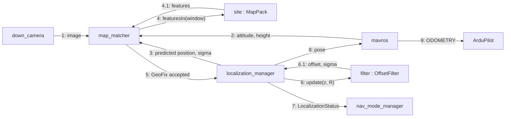

## U24 Timing diagram: one second of localisation

Time runs left to right in milliseconds. Each row is one participant.

```mermaid
gantt
    title One localisation cycle (design estimate, milliseconds)
    dateFormat x
    axisFormat %L
    section Downward camera
    Frame exposed and delivered          :c1, 0, 30ms
    Next frames at 15 Hz                 :c2, 66, 30ms
    section ground_vo
    Track, fit, scale                    :g1, 30, 25ms
    Odometry published                   :milestone, g2, 55, 0ms
    section map_matcher
    Orthorectify                         :m1, 30, 40ms
    Features                             :m2, 70, 60ms
    Match and RANSAC                     :m3, 130, 50ms
    Gates                                :m4, 180, 10ms
    Fix published                        :milestone, m5, 190, 0ms
    section localization_manager
    Filter update                        :l1, 190, 5ms
    Offset slewed in over the next steps :l2, 195, 400ms
    section mavros and UART
    Pose sent every 33 to 50 ms          :u1, 55, 10ms
    Pose with new fix sent               :u2, 195, 10ms
    section ArduPilot
    Fused after VISO_DELAY_MS            :a1, 205, 80ms
```

All durations are design estimates to be replaced by measurements.

## U25 Interaction overview diagram: a complete demonstration flight

Each box refers to a sequence or activity diagram above.

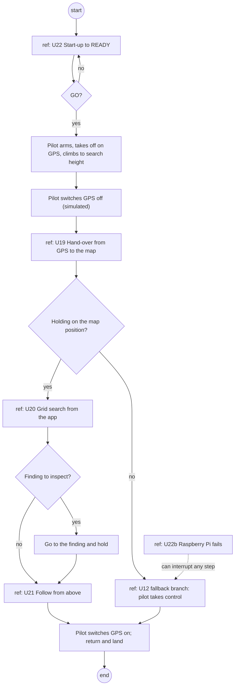
