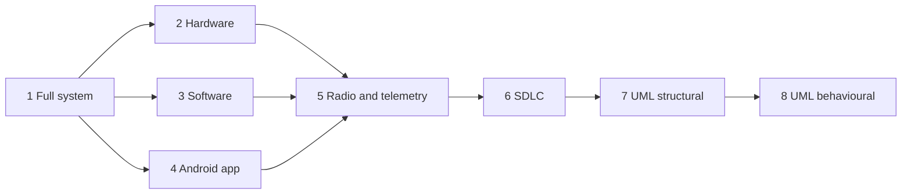

# System Architecture Diagrams

| Field | Value |
|---|---|
| Document ID | GDN-DIA-000 |
| Baseline | DB-3.0 |
| Date | 2026-10-06 |
| Status | Design. Nothing shown here has been built or measured. |

A complete diagram set for the project: the whole system first, then each block in turn, then the development life cycle and the UML diagrams.

## Contents

| # | File | What it shows | Diagrams |
|---|---|---|---|
| 1 | [01-full-system.md](01-full-system.md) | The whole system: hardware, software, Raspberry Pi, flight controller and Android app in one picture; then simple views of the same system | D1.1 – D1.7 |
| 2 | [02-hardware.md](02-hardware.md) | Hardware block diagram, full wiring, power, and one diagram per part (Raspberry Pi, Pixhawk, cameras, MK15, GPS, flow sensor, propulsion, layout) | D2.1 – D2.12 |
| 3 | [03-software.md](03-software.md) | Software in one simple picture, layers, the complete node graph, and one diagram per software part | D3.1 – D3.18 |
| 4 | [04-android-app.md](04-android-app.md) | The Android app: simple picture, architecture, screens, each screen's data flow, connection states, request handling | D4.1 – D4.12 |
| 5 | [05-radio-telemetry.md](05-radio-telemetry.md) | Radio links: RC, telemetry, IP; the messages between the Pi and the flight controller; link-loss behaviour | D5.1 – D5.10 |
| 6 | [06-sdlc.md](06-sdlc.md) | The seven-phase software development life cycle applied to this project | D6.1 – D6.9 |
| 7 | [07-uml-structural.md](07-uml-structural.md) | UML structural diagrams: class, object, component, composite structure, deployment, package, profile | U1 – U9 |
| 8 | [08-uml-behavioural.md](08-uml-behavioural.md) | UML behavioural diagrams: use case, activity, state machine, sequence, communication, timing, interaction overview | U10 – U25 |

## Interactive diagram

[interactive/system-explorer.html](interactive/system-explorer.html) is a click-to-expand version of the main diagrams. It opens on the full system; clicking a block outlined in orange opens that block's own diagram (Raspberry Pi software, map matching, localisation, navigation mode, AI detector, missions, grid search, Pixhawk, Android app, request checks, radio link, sensors, power). It holds 14 linked diagrams and is a viewing aid only; the Markdown files remain the reference.

## Suggested reading order

## All 14 UML diagram types

| Group | UML diagram | Where |
|---|---|---|
| Structural | Class | U1, U2, U3 |
| Structural | Object | U4 |
| Structural | Component | U5 |
| Structural | Composite structure | U6 |
| Structural | Deployment | U7 |
| Structural | Package | U8 |
| Structural | Profile | U9 |
| Behavioural | Use case | U10, U11 |
| Behavioural | Activity | U12, U13, U14 |
| Behavioural | State machine | U15, U16, U17, U18 (also D3.8, D4.3, D4.8) |
| Behavioural | Sequence | U19, U20, U21, U22, U22b (also D1.6, D4.11, D5.6) |
| Behavioural | Communication | U23 |
| Behavioural | Timing | U24 |
| Behavioural | Interaction overview | U25 |

## How to view the diagrams

The diagrams are written in Mermaid inside Markdown.

| Where | How |
|---|---|
| VS Code | Open a file and use Markdown preview (Ctrl+Shift+V). Install the "Markdown Preview Mermaid Support" extension if diagrams show as text |
| GitHub / GitLab | Rendered automatically when the repository is viewed |
| Images for a report or slides | Ready-made PNG and SVG files are in [rendered/](rendered/), named after the source file and the diagram's position in it |

## Notes on notation

- Solid arrows are data or control flow; dashed arrows are radio links, optional paths or dependencies, as labelled.
- UML types that Mermaid does not draw natively (use case, activity, component, composite structure, deployment, package, object, communication, interaction overview) are drawn as flowcharts following UML conventions.
- UML timing diagrams are not supported by Mermaid. U24 shows the same information as a time-axis chart.
- Values inside diagrams (rates, limits, example numbers) are design targets or illustrations from the DB-3.0 baseline.

## Relation to the rest of the documentation

These diagrams illustrate the design; they do not replace it. Where a diagram and a design document disagree, the design document is authoritative:

| Topic | Authoritative document |
|---|---|
| Requirements | [system-requirements.md](../01-requirements/system-requirements.md) |
| Pins and wiring | [low-level-design.md](../03-hardware/low-level-design.md) |
| Nodes, topics, messages | [node-reference.md](../05-ros2/node-reference.md), [interfaces.md](../05-ros2/interfaces.md) |
| Navigation-mode states | [gps-denied-state-machine.md](../02-system-architecture/gps-denied-state-machine.md) |
| Map matching | [visual-geolocalization.md](../09-navigation/visual-geolocalization.md) |
| Search, track, follow | [search-track-follow.md](../09-navigation/search-track-follow.md) |
| App | [ground-app.md](../10-communication/ground-app.md) |
| MAVLink | [mavlink-integration.md](../10-communication/mavlink-integration.md) |
| Schedule | [roadmap.md](../16-development-roadmap/roadmap.md) |
