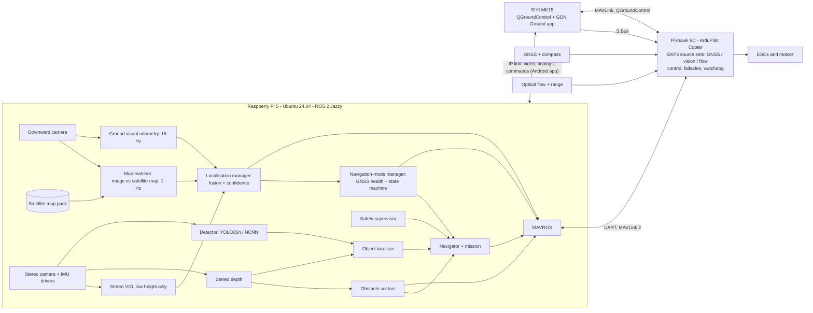

# AI-Integrated GPS-Denied Autonomous Drone — Engineering Documentation

| Field | Value |
|---|---|
| Baseline | Design baseline **DB-3.0** (DB-2.0: GPS-denied position from satellite image matching. DB-3.0: Android app on the MK15, grid search, track and follow) |
| Date | 2026-10-06 |
| Status | Design complete, pending review (gate G1). **No code has been written.** |
| Next phase | Hardware procurement and environment set-up; coding starts only after G1 |

This is the entry point. A developer joining the project should read this page, then the documents under "Read first".

---

## 1. Project objective

Build a research prototype multirotor that flies on GNSS when GNSS is healthy, detects when GNSS is degrading, and then finds its own position by **photographing the ground and matching the photograph against a satellite image stored on board**. Visual odometry carries the position between matches. Near the ground, a forward stereo camera senses obstacles, and a neural network reports what objects are in view and how far away they are. A safety pilot and the flight controller remain in charge of flight safety at all times.

**What changed in DB-2.0:** the first baseline used stereo visual-inertial odometry alone when GPS was lost, which drifts without bound. Satellite matching gives an absolute position, so the error is bounded. It needs a downward camera, a stored reference image, and flight at about 40–60 m. Start with [visual-geolocalization.md](09-navigation/visual-geolocalization.md) and [ADR-015](17-decisions/ADR-015-visual-geolocalization.md).

**What changed in DB-3.0:** the operator works from a native **Android app on the MK15**. From it they watch video and the map, draw an area for a **grid search** that pins detected objects with coordinates, and select an object to **track and follow from above**, all usable with GPS denied. The app talks to the Raspberry Pi over the MK15's IP link; QGroundControl keeps the telemetry link; the HDMI converter is removed. The motivating use is search and rescue; the project demonstrates the capability on a mapped, undamaged site with dummy targets and does not claim readiness for real operations. Start with [ground-app.md](10-communication/ground-app.md) and [search-track-follow.md](09-navigation/search-track-follow.md).

It is a low-cost, open, ROS 2-based reference design with a measured account of its limits. It is not a product and makes no claim to match commercial autonomous drones. See [project-overview.md](00-project-overview/project-overview.md) and [academic-contribution.md](00-project-overview/academic-contribution.md).

## 2. Read first

| Order | Document | Why |
|---|---|---|
| 1 | [Project overview](00-project-overview/project-overview.md) | Scope, decisions summary, risks |
| 2 | [System requirements](01-requirements/system-requirements.md) | What must be built |
| 3 | [System architecture](02-system-architecture/system-architecture.md) | How the pieces fit |
| 3a | [Visual geo-localisation](09-navigation/visual-geolocalization.md) | **The core of DB-2.0: position from satellite image matching** |
| 3b | [Ground app](10-communication/ground-app.md) and [search, track and follow](09-navigation/search-track-follow.md) | **DB-3.0: what the operator does with the system** |
| 4 | [GPS-denied state machine](02-system-architecture/gps-denied-state-machine.md) | The central behaviour |
| 5 | [Coordinate frames](02-system-architecture/coordinate-frames.md) | Read before writing any code that touches a pose |
| 6 | [Stereo camera analysis](03-hardware/stereo-camera.md) and [ADR-011](17-decisions/ADR-011-stereo-camera-suitability.md) | The main technical risk |
| 7 | [Node reference](05-ros2/node-reference.md) and [interfaces](05-ros2/interfaces.md) | The implementation specification |
| 8 | [Safety architecture](12-safety/safety-architecture.md) | Rules that are not negotiable |
| 9 | [Roadmap](16-development-roadmap/roadmap.md) | What to do next |
| 9a | [Development checklist](16-development-roadmap/development-checklist.md) | Step-by-step build order with tick boxes |

## 3. Architecture overview



**Principles**

1. The flight controller flies; the companion advises. The vehicle is flyable with the Pi unplugged.
2. Two-stage estimation: vision position on the Pi, fused loosely into ArduPilot's EKF3.
3. Tiered degradation: GNSS → vision (satellite matching + odometry at 40–60 m; stereo VIO near the ground) → optical flow (below 8 m only) → altitude-hold/land.
3a. Absolute fixes bound the drift: a satellite match about once a second corrects the odometry.
4. AI is advisory: it labels objects; it never keeps the vehicle airborne or localised.
5. The same ROS 2 graph runs in simulation and on hardware.

## 4. Hardware overview

| Role | Component | Status | Detail |
|---|---|---|---|
| Companion computer | Raspberry Pi 5, 8 GB, active cooler | Owned | [raspberry-pi-5.md](03-hardware/raspberry-pi-5.md) |
| **Downward camera** (DB-2.0) | USB 2.0, ≈ 1 MP, 90–120° lens | **To buy; model open** | [downward-camera.md](03-hardware/downward-camera.md) |
| **Reference imagery** (DB-2.0) | Georeferenced image of the test site, ≤ 0.5 m/px, licensed for offline use | **To obtain** | [ADR-016](17-decisions/ADR-016-reference-imagery-and-downward-camera.md) |
| Stereo camera + VIO IMU | Waveshare IMX219-83 (2 × IMX219, 60 mm baseline, ICM-20948) | Owned; low-regime odometry conditional on gate G2b | [stereo-camera.md](03-hardware/stereo-camera.md) |
| RC, telemetry, video | SIYI MK15 HDMI combo | Owned | [siyi-mk15.md](03-hardware/siyi-mk15.md) |
| Flight controller | **Holybro Pixhawk 6C** + PM02 + M10 GPS | To buy | [flight-controller.md](03-hardware/flight-controller.md) |
| Optical flow + range | MicoAir MTF-01 | To buy | [sensors.md](03-hardware/sensors.md) |
| Airframe | 450–500 mm quad, 4S, < 2 kg all-up | **Not yet selected** | [weight-budget.md](03-hardware/weight-budget.md) |

Key hardware findings:

- **Satellite matching needs height.** At 8 m the camera sees too little ground to match 0.3–0.5 m/px imagery; about 40–60 m is needed. That is a much higher flight than DB-1.0 planned, with stricter site and safety rules, and the optical-flow fallback does not reach that height.
- **Google Maps imagery may not be stored offline** under its terms. The design accepts any georeferenced image and records its licence; an own orthomosaic of the site is the clean alternative.
- **Both Pi camera ports are used by the stereo pair**, so the downward camera is a USB camera.
- **The stereo camera has no hardware synchronisation (vendor-stated) and uses rolling-shutter sensors.** It suits depth and AI; it is marginal for VIO. Since DB-2.0 this affects only the low regime.
- The Pi 5 has no neural accelerator and no hardware video encoder: only nano-class models at a few hertz, and video goes through the MK15's HDMI converter.
- The MK15 air unit weighs about 100–116 g and older lots may not accept a 4S battery: check the unit before wiring.
- **A person seen from above is small.** At 50 m they cover about 5–8 pixels and cannot be detected; search and follow are flown at 25–30 m, which needs a sharper reference image (about 0.25 m/px or the team's own aerial map) and a 1080p downward camera.
- **The MK15 has three separate paths**: RC, a slow serial telemetry link, and an IP bridge. The app uses the IP bridge to the Pi and leaves telemetry to QGroundControl.
- Estimated avionics after DB-3.0: ≈ 533 g and ≈ 17.6 W average, back inside their limits because the HDMI converter is removed. (DB-2.0 figures: ≈ 578 g and ≈ 21 W average, both slightly **over** their limits since the downward camera was added ([power-budget.md](03-hardware/power-budget.md), [weight-budget.md](03-hardware/weight-budget.md)).)

Diagrams and pin-level design: [high-level-architecture.md](03-hardware/high-level-architecture.md), [low-level-design.md](03-hardware/low-level-design.md), [power-architecture.md](03-hardware/power-architecture.md).

## 5. Software overview

| Layer | Choice |
|---|---|
| OS | Ubuntu Server 24.04 LTS (arm64) |
| Middleware | ROS 2 Jazzy Jalisco |
| Autopilot | ArduPilot Copter 4.7.x |
| FC bridge | MAVROS over UART, 921 600 baud, MAVLink 2 |
| Camera | Raspberry Pi libcamera fork; custom single-process stereo driver with software sync |
| **GPS-denied position (cruise)** | **Satellite image matching: SIFT + RANSAC against precomputed map features (primary); XFeat learned matcher (compared); edge correlation (simplified). Ground visual odometry between fixes** |
| **Ground app** (DB-3.0) | Native Android (Kotlin) on the MK15; WebSocket + JPEG video to an `app_gateway` node on the Pi |
| **Search, track, follow** (DB-3.0) | Lawnmower coverage planner; aerial-view YOLO26n on the downward camera; findings by ground projection; Kalman-filter tracker; follow from above |
| Low-regime odometry | OpenVINS (primary); RTAB-Map stereo odometry (backup); OpenCV stereo VO (simplified) |
| SLAM | None in flight; RTAB-Map off-line on recorded data (optional) |
| Depth | OpenCV block matching (SGBM optional), 10 Hz |
| AI | YOLO26n, NCNN, 320 px, 5 Hz; trained and exported off-board |
| Simulation | ArduPilot SITL + Gazebo Harmonic + `ros_gz`; plus headless SITL and bag replay |

Details: [software-architecture.md](04-software/software-architecture.md), [technology-selection.md](04-software/technology-selection.md).

## 6. ROS 2 architecture

- **Distribution:** Jazzy on Ubuntu 24.04 ([ADR-001](17-decisions/ADR-001-ros2-distribution.md)).
- **Workspace:** underlay for pinned third-party source (libcamera, OpenVINS, NCNN), overlay for 22 project packages prefixed `gdn_` (`gdn_geoloc` added in DB-2.0; `gdn_app_gateway`, `gdn_tracking` in DB-3.0). The Android app is a separate Gradle project.
- **Nodes:** 29 (five added and `hud_node` removed in DB-3.0), in three criticality classes; flight-critical ones are lifecycle-managed. Stereo nodes and geo-localisation nodes are activated by height.
- **TF:** `map → odom → base_link → sensors`; one publisher per edge; ENU/FLU everywhere in ROS, converted to NED/FRD only inside MAVROS.
- **QoS:** seven named profiles (sensor, estimate, state, command with lifespan, event, heartbeat, diagnostics).
- **Bring-up:** one launch file with profiles `sim`, `bench`, `flight`; systemd autostart on the Pi.

| Document | Content |
|---|---|
| [ros2-architecture.md](05-ros2/ros2-architecture.md) | Distribution, workspace, graph, QoS, lifecycle, launch, diagnostics, logging, rosbag |
| [package-structure.md](05-ros2/package-structure.md) | Packages, repository layout, dependency graph, contracts |
| [node-reference.md](05-ros2/node-reference.md) | Every node: responsibility, I/O, rates, parameters, failure behaviour |
| [interfaces.md](05-ros2/interfaces.md) | Every topic, service, action and custom message |

## 7. Major subsystems

| Subsystem | Summary | Document |
|---|---|---|
| **Visual geo-localisation** (DB-2.0) | Downward image matched to an onboard satellite map for absolute position; ground visual odometry; fusion; gates | [visual-geolocalization.md](09-navigation/visual-geolocalization.md), [downward-camera.md](03-hardware/downward-camera.md) |
| **Ground app** (DB-3.0) | Android app on the MK15: live video, map, search area, target selection, findings | [ground-app.md](10-communication/ground-app.md) |
| **Search, track, follow** (DB-3.0) | Grid search with pinned findings; tracking; follow from above; limits for rescue use | [search-track-follow.md](09-navigation/search-track-follow.md) |
| Stereo vision | Synchronised capture, rectification, depth to ≈ 6 m, obstacle sectors | [stereo-vision-pipeline.md](06-computer-vision/stereo-vision-pipeline.md), [calibration.md](06-computer-vision/calibration.md) |
| Low-regime VIO | Stereo-inertial MSCKF with health monitoring | [vio-slam-evaluation.md](07-vio-slam/vio-slam-evaluation.md), [vio-design.md](07-vio-slam/vio-design.md) |
| AI perception | Nano detector; late fusion with depth for range and map position | [ai-architecture.md](08-ai/ai-architecture.md), [ai-stereo-fusion.md](08-ai/ai-stereo-fusion.md) |
| GPS-denied navigation | Method comparison and selection | [gps-denied-navigation.md](09-navigation/gps-denied-navigation.md) |
| State estimation | Two-stage fusion, alignment, covariance, confidence | [state-estimation.md](09-navigation/state-estimation.md) |
| Autonomous navigation | GUIDED setpoints, speed limiting, stop-and-hold, missions | [autonomous-navigation.md](09-navigation/autonomous-navigation.md) |
| FC integration | Exact messages in both directions, parameters, failsafe communication | [mavlink-integration.md](10-communication/mavlink-integration.md), [telemetry-and-links.md](10-communication/telemetry-and-links.md) |
| Simulation | Three configurations, fault injection, 20 scenarios | [simulation-strategy.md](11-simulation/simulation-strategy.md) |
| Safety | Six protection layers, supervisor, watchdog, FMEA (47 items) | [safety-architecture.md](12-safety/safety-architecture.md), [fmea.md](12-safety/fmea.md) |
| Testing | Eight-level pyramid from unit tests to staged flight | [testing-strategy.md](13-testing/testing-strategy.md) |
| Performance | Targets with TARGET / ESTIMATE / MEASURED / VALIDATED tracking | [performance-requirements.md](14-performance/performance-requirements.md) |

## 8. Documentation navigation

```text
documentation/
├── README.md                          this file
├── project-status.md                  completed / pending / blocked / open decisions
├── references.md                      all sources
├── 00-project-overview/               overview, repository inspection, existing-systems comparison, contribution
├── 01-requirements/                   FR-xxx and NFR-xxx
├── 02-system-architecture/            system architecture, state machine, coordinate frames
├── 03-hardware/                       architecture, low-level design, each component, power and weight budgets
├── 04-software/                       layered architecture, technology selection
├── 05-ros2/                           ROS 2 architecture, packages, nodes, interfaces
├── 06-computer-vision/                stereo pipeline, calibration
├── 07-vio-slam/                       evaluation, VIO design
├── 08-ai/                             AI architecture, AI + depth fusion
├── 09-navigation/                     GPS-denied approach, state estimation, autonomous navigation
├── 10-communication/                  MAVLink integration, telemetry and links
├── 11-simulation/                     simulation strategy
├── 12-safety/                         safety architecture, FMEA
├── 13-testing/                        testing strategy
├── 14-performance/                    performance requirements and tracking
├── 15-bom/                            bill of materials
├── 16-development-roadmap/            phases, gates, schedule
├── 17-decisions/                      ADR-001 … ADR-014
├── 18-research/                       research notes (background, not decisions)
└── 19-system-architecture-diagrams/   full diagram set: system, hardware, software, app, radio, SDLC, all UML types;
                                       ready-made PNG and SVG images in rendered/
```

| Looking for | Go to |
|---|---|
| **A diagram of anything** (whole system, wiring, software parts, app, radio links, life cycle, UML) | [19-system-architecture-diagrams](19-system-architecture-diagrams/README.md) |
| A requirement ID | [system-requirements.md](01-requirements/system-requirements.md) |
| Which pin connects to what | [low-level-design.md](03-hardware/low-level-design.md) |
| A topic name, type or QoS | [interfaces.md](05-ros2/interfaces.md) |
| What a node must do when it fails | [node-reference.md](05-ros2/node-reference.md) |
| An ArduPilot parameter | [mavlink-integration.md](10-communication/mavlink-integration.md) §8, [safety-architecture.md](12-safety/safety-architecture.md) §6 |
| Why a technology was or was not chosen | [technology-selection.md](04-software/technology-selection.md), [17-decisions](17-decisions/README.md) |
| What to buy | [bill-of-materials.md](15-bom/bill-of-materials.md) |
| What is unknown or unverified | [project-status.md](project-status.md), [references.md](references.md) §7 |

## 9. Development phases

| Phase | Content | Gate |
|---|---|---|
| P01 | Research and design baseline | **G1** design accepted |
| P02 | Environment and repository | |
| P03 | Simulation: SITL + MAVROS + synthetic VIO | |
| P04 | Pi and sensor bring-up | |
| P05 | Navigation-mode and localisation logic in SITL | |
| P06 | Stereo, calibration, depth | |
| **P06G** (DB-2.0) | Map pack and offline satellite matching on recorded GNSS-tagged images | **G2** does map matching work on our site? |
| **P07G** (DB-2.0) | Ground visual odometry and fusion | |
| P07 | Stereo VIO on the bench (low regime) | G2b stereo camera suitable? |
| P08 | Flight-controller bring-up and MAVLink hardware-in-the-loop | |
| P09 | AI perception | |
| P10 | Full simulation with sensors; navigator and missions | **G3** works in simulation |
| P11 | Airframe build and manual flight (parallel) | |
| P12 | Vehicle integration and bench tests | **G4** safe to fly |
| P13 | Shadow-mode flights | |
| P14 | GPS-denied transition flights | **G5** transition reliable |
| P15 | Autonomous navigation flights | |
| P16 | Optimisation and evaluation | |
| P17 | Final demonstration and report | |
| **P18** (DB-3.0) | Android ground app and `app_gateway` (in parallel from the start) | G0 MK15 IP path works |
| **P19** (DB-3.0) | Grid search: aerial model, planner, findings | |
| **P20** (DB-3.0) | Track and follow from above (first to drop if time runs out) | |

Simulation comes early by design; no autonomous flight happens before simulation, hardware-in-the-loop and bench levels have passed. Full detail: [roadmap.md](16-development-roadmap/roadmap.md).

## 10. Current project status

| Area | Status |
|---|---|
| Design documentation | Complete (DB-1.0) |
| Code | None — by instruction |
| Hardware owned | Raspberry Pi 5, stereo camera, MK15 |
| Hardware to procure | Flight-controller set, flow sensor, cooler, BEC, airframe and propulsion |
| Measurements | None; every performance figure is a TARGET or an ESTIMATE |

Live tracking: [project-status.md](project-status.md).

## 11. Decisions

| ADR | Decision |
|---|---|
| [001](17-decisions/ADR-001-ros2-distribution.md) | Ubuntu 24.04 + ROS 2 Jazzy |
| [002](17-decisions/ADR-002-autopilot-firmware.md) | ArduPilot Copter 4.7.x |
| [003](17-decisions/ADR-003-flight-controller.md) | Holybro Pixhawk 6C |
| [004](17-decisions/ADR-004-vio-solution.md) | OpenVINS primary; RTAB-Map stereo odometry backup; OpenCV stereo VO simplified |
| [005](17-decisions/ADR-005-slam-solution.md) | No SLAM in the flight loop |
| [006](17-decisions/ADR-006-ai-framework.md) | YOLO26n on NCNN, 320 px, 5 Hz |
| [007](17-decisions/ADR-007-camera-interface.md) | Dual CSI-2, libcamera, single-process stereo driver with software sync |
| [008](17-decisions/ADR-008-mavlink-architecture.md) | MAVROS over UART; `ODOMETRY` for external navigation |
| [009](17-decisions/ADR-009-gps-denied-transition.md) | EKF3 source sets, companion-commanded with pilot override, continuous frame alignment |
| [010](17-decisions/ADR-010-ai-depth-fusion.md) | Parallel detection and depth with late fusion |
| [011](17-decisions/ADR-011-stereo-camera-suitability.md) | Keep the Waveshare camera behind gate G2; upgrade path defined |
| [012](17-decisions/ADR-012-obstacle-avoidance.md) | Stop-and-hold plus FC avoidance; no Nav2 |
| [013](17-decisions/ADR-013-simulation.md) | ArduPilot SITL + Gazebo Harmonic; three configurations |
| [014](17-decisions/ADR-014-vio-imu-source.md) | Camera-board ICM-20948 as the VIO IMU |
| [**015**](17-decisions/ADR-015-visual-geolocalization.md) | **Satellite image matching + ground visual odometry as the primary GPS-denied position source** |
| [**016**](17-decisions/ADR-016-reference-imagery-and-downward-camera.md) | **Source-agnostic, licence-recorded reference imagery; USB downward camera** |
| [**017**](17-decisions/ADR-017-ground-app.md) | **Native Android app on the MK15, talking to the Pi over the IP link; QGroundControl unchanged; HDMI converter removed** |
| [**018**](17-decisions/ADR-018-search-track-follow.md) | **Grid search, tracking and follow-from-above using the downward camera and an aerial-view model, at 25–30 m** |

## 12. Open issues

| # | Issue | Type | Tracked in |
|---|---|---|---|
| 00a | MK15 IP path to a third-party device and app not yet verified on the owned unit | Hardware check, **gate G0** | [ground-app.md](10-communication/ground-app.md) §12 |
| 00b | Detecting a person from above with a small camera: recall unknown and likely limited | Technical risk | [search-track-follow.md](09-navigation/search-track-follow.md) §4 |
| 00c | Scope: app + search + follow add about 8–10 weeks | Schedule risk | [roadmap.md](16-development-roadmap/roadmap.md) §1b |
| 00d | Rescue use: map matching depends on the ground looking like the stored image; a disaster changes it | Stated limitation | [search-track-follow.md](09-navigation/search-track-follow.md) §8 |
| 0a | Satellite matching unproven on the test site's terrain | Technical risk, **gate G2** | [visual-geolocalization.md](09-navigation/visual-geolocalization.md) |
| 0b | Reference imagery source and licence | Decision (OD-11) | [ADR-016](17-decisions/ADR-016-reference-imagery-and-downward-camera.md) |
| 0c | Downward camera model | Decision (OD-12) | [downward-camera.md](03-hardware/downward-camera.md) |
| 0d | Test site and permission for 40–60 m flight | Decision (OD-14) | [safety-architecture.md](12-safety/safety-architecture.md) §8a |
| 1 | Airframe and propulsion not selected | Decision (OD-1) | [project-status.md](project-status.md) |
| 2 | Stereo camera may be unsuitable for VIO (low regime only) | Technical risk, gate G2b | [ADR-011](17-decisions/ADR-011-stereo-camera-suitability.md) |
| 3 | Residual left/right skew with software sync is unknown | Measurement (R-1) | [18-research](18-research/README.md) |
| 4 | AI class set and demonstration scenario not defined | Decision (OD-2) | project-status |
| 5 | Indoor flight in scope or not | Decision (OD-3) | project-status |
| 6 | One- or two-semester scope | Decision (OD-4) | project-status |
| 7 | MK15 air-unit 4S support and converter details on the owned unit | Hardware check (HP-5) | [siyi-mk15.md](03-hardware/siyi-mk15.md) |
| 8 | Several ArduPilot 4.7 / MAVROS details need bench confirmation | Verification | [references.md](references.md) §7 |
| 9 | Avionics mass and power are at their limits | Budget risk | weight and power budgets |
| 10 | Ubuntu 24.04 workstation needed (current machine is Windows 11) | Environment (SP-1) | [simulation-strategy.md](11-simulation/simulation-strategy.md) §6 |

## 13. Assumptions and marking conventions

| Tag | Meaning |
|---|---|
| `[VENDOR]` | From manufacturer or reseller documentation |
| `[ESTIMATE]` | Engineering estimate; to be replaced by measurement |
| `[ASSUMPTION]` | Assumed for design; to be confirmed |
| `[MEASURE]` | To be measured on the hardware |
| `[VERIFY]` | Believed correct; not confirmed against a primary source in this pass |
| TARGET / ESTIMATE / MEASURED / VALIDATED | Status of every performance number ([definition](14-performance/performance-requirements.md)) |

## 14. References

All sources, grouped by reliability: [references.md](references.md). Research notes: [18-research](18-research/README.md).

## 15. Document control

| Version | Date | Description |
|---|---|---|
| DB-1.0 | 2026-10-05 | Initial design baseline: all sections created |
| DB-3.0 | 2026-10-06 | Added by the project owner: native Android app on the MK15; grid search; track and follow. New documents: ground-app.md, search-track-follow.md, ADR-017, ADR-018 |
| DB-2.0 | 2026-10-05 | Concept change: GPS-denied position from satellite image matching with a downward camera; AI vision unchanged. Full list of amended documents in [project-status.md](project-status.md) |

Changes to accepted decisions are made by adding a superseding ADR. Changes to requirements update the version of the requirements document and are noted in [project-status.md](project-status.md).
